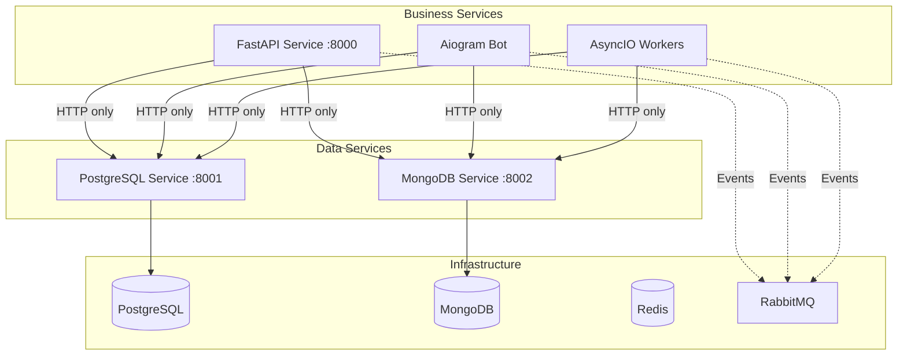

# Boilerplate Microservices

> **=� Production-Ready Microservices Template** - A comprehensive Python 3.12+ microservices architecture using the Improved Hybrid Approach with centralized data services.

[](https://www.python.org/downloads/)
[](https://docs.docker.com/compose/)
[](https://fastapi.tiangolo.com/)
[](https://docs.aiogram.dev/)
[](https://www.postgresql.org/)
[](https://www.mongodb.com/)

## <� What This Is

A **complete microservices boilerplate** that provides:

- **<� Improved Hybrid Architecture** - Centralized data services with HTTP-only business logic
- **= Event-Driven Communication** - RabbitMQ for inter-service messaging
- **=� Complete Observability** - Prometheus, Grafana, Jaeger, ELK stack
- **>� 100% Test Coverage** - Real database testing with testcontainers
- **<� Working Use Cases** - Complete task management system example
- **> AI-Ready Documentation** - Optimized for Claude Code IDE integration

## � Quick Start

### Prerequisites
- **Docker & Docker Compose** (v2.29.0+)
- **Python 3.12+** (for local development)
- **UV** (Python package manager)

### <�
B Start in 30 seconds

```bash
# 1. Clone and setup
git clone <repository-url>
cd boilerplate_microservices
cp .env.example .env

# 2. Start entire stack
docker-compose up -d

# 3. Verify services
curl http://localhost:8000/health  # Business API
curl http://localhost:8001/health  # PostgreSQL Data Service
curl http://localhost:8002/health  # MongoDB Data Service
```

### <� Try the Demo Use Case

```bash
# Start task management system
cd use_cases/task_management
docker-compose up -d

# Access the APIs
open http://localhost:8000/docs    # Task Management API
open http://localhost:3000         # Grafana Dashboard
```

## <� Architecture Overview

### Improved Hybrid Approach



### = Key Principles

- **Data Access**: HTTP-only communication to centralized data services
- **Service Separation**: Each service type runs in separate containers
- **Event-Driven**: RabbitMQ for asynchronous inter-service communication
- **Observability**: Complete monitoring and tracing stack
- **Type Safety**: Full type annotations with mypy validation

## =� Documentation

| Document | Purpose | When to Use |
|----------|---------|-------------|
| **[CLAUDE.md](CLAUDE.md)** | Main development guide | Start here - architecture, commands, setup |
| **[docs/reference/tech_stack.md](docs/reference/tech_stack.md)** | Technology specifications | Check versions, configurations |
| **[docs/reference/service-examples.md](docs/reference/service-examples.md)** | Working code examples | Implement new services |
| **[docs/reference/troubleshooting.md](docs/reference/troubleshooting.md)** | Problem solving | Fix issues, debug problems |
| **[docs/guides/USE_CASE_IMPLEMENTATION_GUIDE.md](docs/guides/USE_CASE_IMPLEMENTATION_GUIDE.md)** | Create use cases | Build production features |

## <� Example Use Cases

### Task Management System (Complete Implementation)
Location: `use_cases/task_management/`

**Features:**
- =� REST API for task CRUD operations
- > Telegram bot with natural language processing
- � Smart reminders and notifications
- =� Analytics and productivity insights
- =� File attachments and processing

**Try it:**
```bash
cd use_cases/task_management
docker-compose up -d
open http://localhost:8000/docs
```

## =� Service Types

### 1. FastAPI Services (HTTP APIs)
```python
# Fully async with dependency injection
@app.post("/tasks", response_model=TaskResponse)
async def create_task(
    task_data: TaskCreate,
    user: User = Depends(get_current_user),
    task_service: TaskService = Depends(get_task_service)
):
    return await task_service.create_task(task_data, user.id)
```

### 2. Aiogram Bot Services
```python
# Event-driven bot handlers
@router.message(Command("task"))
async def create_task_command(
    message: Message,
    task_service: TaskService = Depends(get_task_service)
):
    # Natural language task creation
    await task_service.create_from_text(message.text)
```

### 3. AsyncIO Workers
```python
# Background processing workers
async def process_reminders():
    async with aio_pika.connect(settings.RABBITMQ_URL) as connection:
        # Process due reminders
        await handle_reminder_queue()
```

## =� Monitoring & Observability

### Built-in Dashboards
- **Grafana**: http://localhost:3000 (admin/admin123)
- **Jaeger**: http://localhost:16686 (distributed tracing)
- **Kibana**: http://localhost:5601 (log analysis)
- **Prometheus**: http://localhost:9090 (metrics)
- **RabbitMQ**: http://localhost:15672 (message queues)

### Health Checks
```bash
# Check all services
curl http://localhost:8000/health
curl http://localhost:8001/health
curl http://localhost:8002/health

# Database connectivity
docker-compose exec postgres pg_isready
docker-compose exec mongodb mongosh --eval "db.adminCommand('ping')"
docker-compose exec redis redis-cli ping
```

## >� Testing

### Run Tests
```bash
# Install dependencies
uv sync --dev

# Run all tests with coverage
uv run pytest --cov=app --cov-report=html

# Run specific test types
uv run pytest tests/unit/              # Unit tests
uv run pytest tests/integration/       # Integration tests with real DBs
```

### Test Coverage
- **Target**: 100% coverage for critical paths
- **Integration**: Real databases via testcontainers
- **Mocking**: External HTTP services only

## =� Production Deployment

### Environment Setup
```bash
# Copy production template
cp .env.example .env.prod

# Deploy with production configuration
docker-compose -f docker-compose.yml -f docker-compose.prod.yml up -d

# Scale services
docker-compose up --scale api_service=3 --scale worker_service=2 -d
```

### Security Features
-  JWT authentication and authorization
-  HTTPS/TLS configuration
-  Rate limiting and request validation
-  Secret management via environment variables
-  Security scanning with Bandit

## > Contributing

### Development Workflow
```bash
# 1. Setup development environment
cp .env.example .env
uv sync --dev

# 2. Start infrastructure
docker-compose up postgres mongodb redis rabbitmq -d

# 3. Run quality checks
uv run ruff check . && uv run mypy . && uv run pytest

# 4. Test your changes
uv run pytest --cov=app --cov-report=term-missing
```

### Code Quality Standards
- **Linting**: Ruff (PEP8 compliance)
- **Type Checking**: mypy with strict settings
- **Security**: Bandit static analysis
- **Testing**: pytest with 100% critical path coverage

## =� Technology Stack

This project uses a carefully selected technology stack optimized for microservices architecture with the Improved Hybrid Approach.

**Key Technologies:**
- **Python 3.12+** - Unified runtime across all services
- **FastAPI + Aiogram + AsyncIO** - Service type separation
- **PostgreSQL + MongoDB** - Dual database strategy
- **Redis + RabbitMQ** - Caching and messaging
- **Docker Compose** - Service orchestration
- **Complete Observability Stack** - Prometheus, Grafana, Jaeger, ELK

> **📋 COMPLETE TECHNOLOGY SPECIFICATIONS**: For detailed versions, configurations, compatibility matrix, and implementation guidelines, see [docs/reference/tech_stack.md](docs/reference/tech_stack.md).

## = Links

- **📚 Complete Documentation**: [CLAUDE.md](CLAUDE.md)
- **🏗️ Architecture Guide**: [docs/guides/ARCHITECTURE_GUIDE.md](docs/guides/ARCHITECTURE_GUIDE.md)
- **📋 Development Commands**: [docs/guides/DEVELOPMENT_COMMANDS.md](docs/guides/DEVELOPMENT_COMMANDS.md)
- **🔧 Technology Specifications**: [docs/reference/tech_stack.md](docs/reference/tech_stack.md)
- **💻 Working Examples**: [docs/reference/service-examples.md](docs/reference/service-examples.md)
- **🐛 Troubleshooting**: [docs/reference/troubleshooting.md](docs/reference/troubleshooting.md)
## =� License

This project is open source and available under the [MIT License](LICENSE).

---

**=� Ready to build production-ready microservices?** Start with [CLAUDE.md](CLAUDE.md) for complete development guidance!