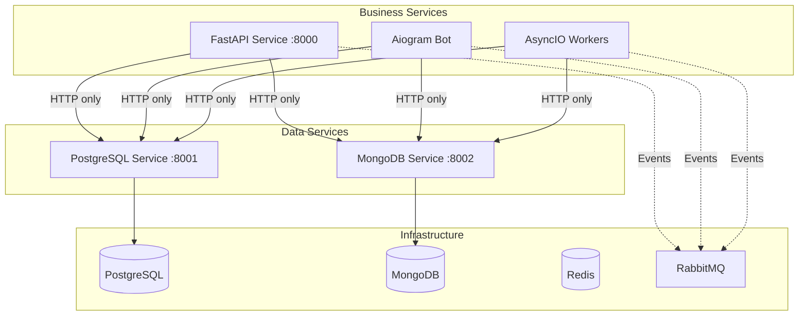

# Documentation for Microservices

> **📚 Comprehensive Documentation Project** - Architecture patterns, guidelines, and best practices for Python 3.12+ microservices using the Improved Hybrid Approach.

## 📖 What This Is

A **comprehensive documentation project** designed as an **AI knowledge base** for rapid microservices development through human-AI collaboration.

**This is NOT a runnable application** - it's a curated AI-readable knowledge base that enables AI agents to quickly understand and implement production-ready microservices architecture.

### The AI-Assisted Development Workflow

1. **Human provides business idea** - Describes the application requirements and features
2. **AI reads this documentation project** - Understands architecture patterns, constraints, and implementation guidelines
3. **AI rapidly builds workable application** - Creates production-ready microservices following proven patterns

### What's Included

- **🏗 AI-Readable Architecture Patterns** - Improved Hybrid Approach with clear constraints and rules
- **📡 Complete Integration Guidelines** - Event-driven communication patterns with RabbitMQ
- **📊 Production-Ready Observability** - Full monitoring stack configuration and implementation
- **🧪 Comprehensive Testing Patterns** - Real database testing with testcontainers for AI implementation
- **💻 Working Reference Implementations** - Complete, runnable service examples for AI learning
- **🤖 AI-Optimized Documentation Structure** - Hierarchical, rule-based documentation designed for AI comprehension
- **📋 Implementation Checklists** - Step-by-step guides that AI agents can follow systematically

### Target Audience

**Primary Target:**
- **🤖 AI Agents for AI Coding** - Claude Code, GitHub Copilot, and other AI development assistants
- **🧠 AI-Assisted Development Workflows** - Human-AI collaboration for rapid application development

**Secondary Target:**
- **👥 Development Teams** using AI coding assistants
- **🏗️ Software Architects** designing AI-friendly documentation
- **🚀 Entrepreneurs & Product Managers** who want to rapidly prototype with AI

### What's NOT Included

- Business logic or domain-specific functionality
- Ready-to-deploy applications
- Framework-specific tutorials (covered in official docs)

## 🏗 Architecture Overview

### Improved Hybrid Approach

### Key Principles

- **Data Access**: HTTP-only communication to centralized data services
- **Service Separation**: Each service type runs in separate containers
- **Event-Driven**: RabbitMQ for asynchronous inter-service communication
- **Observability**: Complete monitoring and tracing stack
- **Type Safety**: Full type annotations with mypy validation

## 📚 Documentation

| Document | Purpose | When to Use |
|----------|---------|-------------|
| **[CLAUDE.md](CLAUDE.md)** | Main development guide | Start here - architecture, commands, setup |
| **[docs/reference/tech_stack.md](docs/reference/tech_stack.md)** | Technology specifications | Check versions, configurations |
| **[docs/examples/index.md](docs/examples/index.md)** | Working code examples | Implement new services |
| **[docs/reference/troubleshooting.md](docs/reference/troubleshooting.md)** | Problem solving | Fix issues, debug problems |
| **[docs/guides/USE_CASE_IMPLEMENTATION_GUIDE.md](docs/guides/USE_CASE_IMPLEMENTATION_GUIDE.md)** | Create use cases | Build production features |

### Documentation Structure

This project uses three complementary documentation approaches:

| Documentation Type | Purpose | Target Users | Location |
|-------------------|---------|--------------|----------|
| **📚 Educational Examples** | Learn implementation patterns | Human developers, teams | [docs/examples/](docs/examples/) |
| **🤖 AI Automation Framework** | Automated application generation | AI systems, AI developers | [ai_agents/](ai_agents/) |
| **💻 Working Demonstrations** | See complete working solutions | Business stakeholders, QA teams | [use_cases/](use_cases/) |

**📋 [See complete comparison guide →](CLAUDE.md#documentation-types-guide)**

## 📋 Technology Stack

This project uses a carefully selected technology stack optimized for microservices architecture with the Improved Hybrid Approach.

**Key Technologies:**
- **Python 3.12+** - Unified runtime across all services
- **FastAPI + Aiogram + AsyncIO** - Service type separation
- **PostgreSQL + MongoDB** - Dual database strategy
- **Redis + RabbitMQ** - Caching and messaging
- **Docker Compose** - Service orchestration
- **Complete Observability Stack** - Prometheus, Grafana, Jaeger, ELK

### Benefits for Teams

- **Reduced Architecture Decisions** - Pre-validated patterns and technology choices
- **Faster Development** - Working examples and implementation templates
- **Production Readiness** - Complete observability, testing, and deployment patterns
- **Team Alignment** - Consistent patterns and coding standards
- **Risk Mitigation** - Battle-tested architectural constraints and best practices

> **📋 COMPLETE TECHNOLOGY SPECIFICATIONS**: For detailed versions, configurations, compatibility matrix, and implementation guidelines, see [docs/reference/tech_stack.md](docs/reference/tech_stack.md).

## 🔗 Links

- **📚 Complete Documentation**: [CLAUDE.md](CLAUDE.md)
- **🏗️ Architecture Guide**: [docs/guides/ARCHITECTURE_GUIDE.md](docs/guides/ARCHITECTURE_GUIDE.md)
- **📋 Development Commands**: [docs/guides/DEVELOPMENT_COMMANDS.md](docs/guides/DEVELOPMENT_COMMANDS.md)
- **🔧 Technology Specifications**: [docs/reference/tech_stack.md](docs/reference/tech_stack.md)
- **💻 Working Examples**: [docs/examples/index.md](docs/examples/index.md)
- **🐛 Troubleshooting**: [docs/reference/troubleshooting.md](docs/reference/troubleshooting.md)

## 📄 License

This project is open source and available under the [MIT License](LICENSE).

---

**📚 Ready to explore microservices documentation?** Start with [CLAUDE.md](CLAUDE.md) for complete guidance!