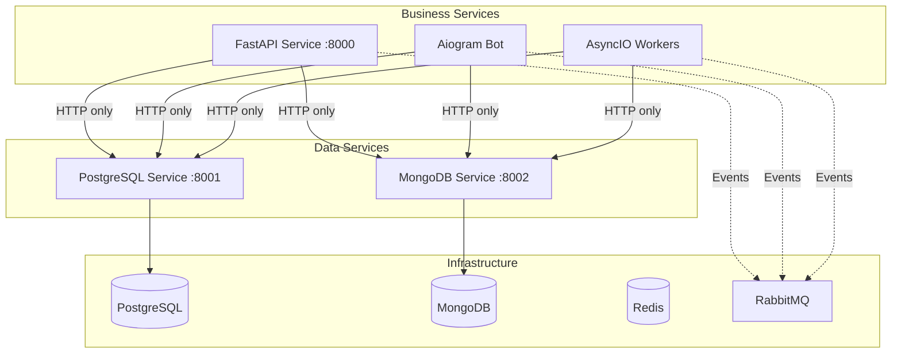

# Documentation for Microservices

> **📚 Comprehensive Documentation Project** - Architecture patterns, guidelines, and best practices for Python 3.12+ microservices using the Improved Hybrid Approach.

## 📖 What This Is

A **comprehensive documentation project** that provides:

- **🏗 Improved Hybrid Architecture Documentation** - Patterns for centralized data services with HTTP-only business logic
- **📡 Event-Driven Communication Guidelines** - RabbitMQ integration patterns
- **📊 Complete Observability Patterns** - Prometheus, Grafana, Jaeger, ELK stack configuration
- **🧪 Testing Standards Documentation** - Real database testing with testcontainers patterns
- **🤖 AI-Ready Documentation** - Optimized for Claude Code IDE integration

## 🏗 Architecture Overview

### Improved Hybrid Approach

### Key Principles

- **Data Access**: HTTP-only communication to centralized data services
- **Service Separation**: Each service type runs in separate containers
- **Event-Driven**: RabbitMQ for asynchronous inter-service communication
- **Observability**: Complete monitoring and tracing stack
- **Type Safety**: Full type annotations with mypy validation

## 📚 Documentation

| Document | Purpose | When to Use |
|----------|---------|-------------|
| **[CLAUDE.md](CLAUDE.md)** | Main development guide | Start here - architecture, commands, setup |
| **[docs/reference/tech_stack.md](docs/reference/tech_stack.md)** | Technology specifications | Check versions, configurations |
| **[docs/reference/service-examples.md](docs/reference/service-examples.md)** | Working code examples | Implement new services |
| **[docs/reference/troubleshooting.md](docs/reference/troubleshooting.md)** | Problem solving | Fix issues, debug problems |
| **[docs/guides/USE_CASE_IMPLEMENTATION_GUIDE.md](docs/guides/USE_CASE_IMPLEMENTATION_GUIDE.md)** | Create use cases | Build production features |

## 📋 Technology Stack

This project uses a carefully selected technology stack optimized for microservices architecture with the Improved Hybrid Approach.

**Key Technologies:**
- **Python 3.12+** - Unified runtime across all services
- **FastAPI + Aiogram + AsyncIO** - Service type separation
- **PostgreSQL + MongoDB** - Dual database strategy
- **Redis + RabbitMQ** - Caching and messaging
- **Docker Compose** - Service orchestration
- **Complete Observability Stack** - Prometheus, Grafana, Jaeger, ELK

> **📋 COMPLETE TECHNOLOGY SPECIFICATIONS**: For detailed versions, configurations, compatibility matrix, and implementation guidelines, see [docs/reference/tech_stack.md](docs/reference/tech_stack.md).

## 🔗 Links

- **📚 Complete Documentation**: [CLAUDE.md](CLAUDE.md)
- **🏗️ Architecture Guide**: [docs/guides/ARCHITECTURE_GUIDE.md](docs/guides/ARCHITECTURE_GUIDE.md)
- **📋 Development Commands**: [docs/guides/DEVELOPMENT_COMMANDS.md](docs/guides/DEVELOPMENT_COMMANDS.md)
- **🔧 Technology Specifications**: [docs/reference/tech_stack.md](docs/reference/tech_stack.md)
- **💻 Working Examples**: [docs/reference/service-examples.md](docs/reference/service-examples.md)
- **🐛 Troubleshooting**: [docs/reference/troubleshooting.md](docs/reference/troubleshooting.md)

## 📄 License

This project is open source and available under the [MIT License](LICENSE).

---

**📚 Ready to explore microservices documentation?** Start with [CLAUDE.md](CLAUDE.md) for complete guidance!