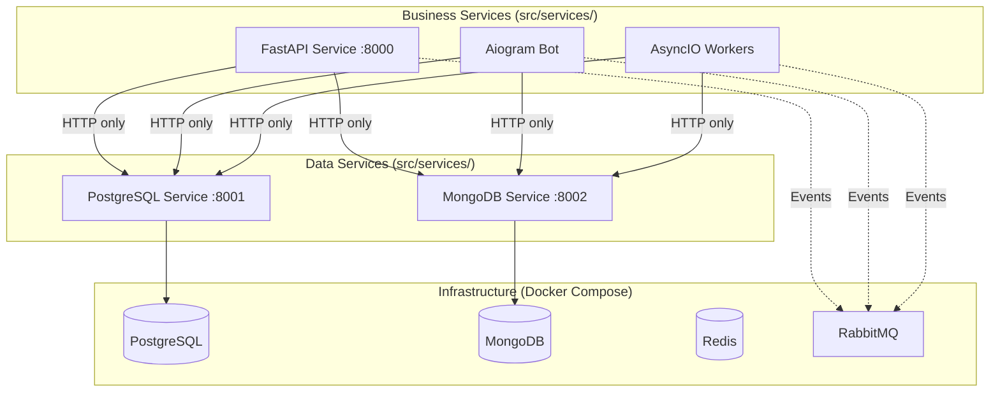

# Microservices Framework

> **🏗️ Framework-as-Submodule** - Centralised microservices architecture framework designed to be used as a Git submodule in your projects. Provides proven patterns, AI agents, and complete documentation for rapid development.

## 🎯 What This Solves and Who It's For

### **The Problem**
Creating microservices architecture is a complex task requiring:
- Deep understanding of architectural patterns
- Proper infrastructure setup (databases, monitoring, queues)
- Following numerous rules and standards
- Months of development time "from scratch"

### **The Solution: Framework-as-Submodule**
This is not just documentation, but a **living framework** that:

1. **Connects as Git submodule** to your project - framework separate, your code separate
2. **Provides ready architecture** - proven "Improved Hybrid Approach" with PostgreSQL, MongoDB, RabbitMQ, full monitoring
3. **Updates centrally** - `git submodule update` and all projects get improvements
4. **AI reads rules automatically** from `.framework/docs/` - generates applications from business requirements
5. **Ready patterns** - for FastAPI, Aiogram, AsyncIO workers

### **Target Users:**
- **Python developers** - want to quickly create microservices applications
- **Development teams** - need standardized architectural solutions
- **AI systems** - for automatic application generation
- **Business analysts** - validate idea feasibility within the architecture

### **Result:**
Instead of months of architecture development - get production-ready applications in minutes/hours using standardized, updatable framework with AI automation.

## 🚀 Quick Start

```bash
# 1. Create your project
mkdir my_awesome_app && cd my_awesome_app && git init

# 2. Add framework as submodule
git submodule add <framework-repo-url> .framework
git submodule init && git submodule update

# 3. Generate with AI (AI reads .framework/docs/ automatically)
# Ask AI: "Create [your app] using .framework/ patterns"

# 4. Deploy ready application
docker-compose up -d
```

### **Key Benefits:**
- **Separation** - Framework separate, your code separate
- **Updates** - `git submodule update --remote` gets new features
- **Standardization** - All projects use same rules
- **AI compatibility** - AI automatically finds patterns in `.framework/`

This transforms microservices application creation into a standardized, repeatable process.

## 🏗️ Project Structure with Framework Submodule

When you add this framework as a submodule, your project structure becomes:

```
my_awesome_app/                    # Your project repository
├── .framework/                    # Git submodule (this repository)
│   ├── docs/                     # Architecture rules and patterns
│   ├── ai_agents/                # AI generators and validators
│   ├── examples/                 # Reference implementations
│   ├── use_cases/                # Working applications
│   └── CLAUDE.md                 # AI instructions
├── README.md                      # Your project documentation
├── docker-compose.yml             # Your project infrastructure
├── .env.example                   # Your project configuration
└── src/                          # Your application code
    ├── services/                 # Microservices
    │   ├── api_service/          # FastAPI REST API service
    │   │   ├── Dockerfile        # Service-specific container
    │   │   ├── main.py           # Service implementation
    │   │   └── requirements.txt  # Service dependencies
    │   ├── bot_service/          # Aiogram Telegram bot service
    │   │   ├── Dockerfile
    │   │   ├── main.py
    │   │   └── requirements.txt
    │   ├── worker_service/       # AsyncIO background workers
    │   │   ├── Dockerfile
    │   │   ├── main.py
    │   │   └── requirements.txt
    │   ├── db_postgres_service/  # PostgreSQL data access service
    │   │   ├── Dockerfile
    │   │   └── main.py
    │   └── db_mongo_service/     # MongoDB data access service
    │       ├── Dockerfile
    │       └── main.py
    ├── shared/                   # Shared components
    │   ├── dtos.py              # Data transfer objects
    │   ├── events.py            # Event schemas
    │   └── utils.py             # Common utilities
    ├── config/                   # Configuration management
    │   ├── settings.py          # Centralized settings
    │   └── logging.py           # Logging configuration
    └── tests/                   # Test suites
        ├── unit/                # Unit tests per service
        ├── integration/         # Integration tests
        └── conftest.py          # Test configuration
```

## 💻 AI Generation Examples

**Example AI Prompts:**
```
Create a task management application using the .framework/ patterns:
- FastAPI service for REST API
- Telegram bot service for notifications
- AsyncIO workers for background tasks
- Follow the Improved Hybrid Approach from .framework/docs/
```

```
Build an e-commerce platform with .framework/ architecture:
- Product catalog and search (FastAPI)
- Order processing workers (AsyncIO)
- Customer notifications (Aiogram bot)
- Use PostgreSQL and MongoDB data services
```

## 🤖 AI Agent Framework

This project includes a comprehensive AI framework for generating applications:

### Business Validation
- **Feasibility Checker** - Validates business ideas against architectural constraints
- **Domain Classifier** - Identifies business patterns and optimal service allocation
- **Constraint Validator** - Ensures compliance with Improved Hybrid Approach

### Code Generation
- **Service Templates** - Production-ready templates for FastAPI, Aiogram, AsyncIO workers
- **Variable Substitution** - Business-specific customization of proven patterns
- **Quality Validation** - Automated code quality and architecture compliance checks

### Deployment Automation
- **Docker Compose Generator** - Complete infrastructure and service orchestration
- **Environment Configuration** - Secure configuration templates and examples
- **Health Monitoring** - Production-ready observability and health checks

## 🏗 Architecture Overview

### Improved Hybrid Approach



### Key Architectural Principles

- **🔗 HTTP-Only Data Access** - Business services communicate with data services via HTTP APIs only
- **🏗️ Service Type Separation** - FastAPI, Aiogram, and AsyncIO services run in separate containers
- **📡 Event-Driven Communication** - RabbitMQ for asynchronous inter-service messaging
- **📊 Complete Observability** - Prometheus, Grafana, Jaeger, and ELK stack integration
- **🧪 Production-Ready Testing** - Real database testing with testcontainers
- **🔒 Security First** - OAuth2/JWT authentication, HTTPS, rate limiting

## 📚 Documentation and AI Knowledge Base

This repository contains comprehensive documentation designed for both AI agents and human developers:

### For AI Agents
| Component | Purpose | Location |
|-----------|---------|----------|
| **🤖 AI Framework** | Automated application generation | [ai_agents/](ai_agents/) |
| **📋 Implementation Rules** | Service-specific patterns and constraints | [docs/](docs/) |
| **💻 Working Examples** | Complete reference implementations | [examples/](examples/) |

### For Human Developers
| Document | Purpose | When to Use |
|----------|---------|-------------|
| **[CLAUDE.md](CLAUDE.md)** | Complete development guide | Start here - setup, architecture, commands |
| **[docs/reference/tech_stack.md](docs/reference/tech_stack.md)** | Technology specifications | Check versions, configurations |
| **[examples/index.md](examples/index.md)** | Working code examples | Understand implementation patterns |
| **[docs/reference/troubleshooting.md](docs/reference/troubleshooting.md)** | Problem solving | Debug issues, find solutions |

## 📋 Technology Stack

**Carefully selected technologies optimized for the Improved Hybrid Approach:**

### Core Technologies
- **Python 3.12+** - Unified runtime with advanced type system
- **FastAPI + Aiogram + AsyncIO** - Service type separation and specialization
- **PostgreSQL + MongoDB** - Dual database strategy for different data needs
- **Redis + RabbitMQ** - High-performance caching and messaging
- **Docker Compose** - Simple but powerful service orchestration

### Observability Stack
- **Prometheus** - Metrics collection and alerting
- **Grafana** - Visualization and dashboards
- **Jaeger** - Distributed tracing
- **ELK Stack** - Centralized logging and search

### Development Tools
- **UV** - Fast Python package management
- **Ruff** - Lightning-fast Python linting
- **MyPy** - Static type checking
- **Testcontainers** - Real database testing

## ✨ Benefits for Development Teams

### For AI-Assisted Development
- **🎯 Zero Architecture Decisions** - Pre-validated patterns and technology choices
- **⚡ Rapid Prototyping** - From business idea to running application in minutes
- **🔄 Consistent Quality** - AI generates production-ready code following best practices
- **📈 Scalable Patterns** - Applications can grow from prototype to production

### For Traditional Development
- **📚 Comprehensive Patterns** - Working examples and implementation guidelines
- **🛡️ Risk Mitigation** - Battle-tested architectural constraints and best practices
- **🔧 Developer Experience** - Complete tooling and automation setup
- **👥 Team Alignment** - Consistent coding standards and patterns

## 🎯 Example Applications AI Can Generate

✅ **E-commerce Platform** - Product catalog, orders, payments, user management, analytics
✅ **Project Management Tool** - Tasks, projects, time tracking, team collaboration, reporting
✅ **Content Management System** - Articles, media, user permissions, publishing workflows
✅ **Social Platform** - User profiles, posts, messaging, engagement analytics
✅ **IoT Data Platform** - Device management, real-time data ingestion, analytics dashboards
✅ **Financial Application** - Account management, transactions, reporting, compliance

## 🔧 Framework Management

### Submodule Operations
```bash
# Update framework to latest version
git submodule update --remote .framework
git add .framework && git commit -m "Update framework"

# Clone project with framework
git clone --recursive <your-project-repo>

# If you forgot --recursive
git submodule init && git submodule update
```

### For AI Agents
1. **Automatically scan `.framework/`** for patterns, rules, and examples
2. **Generate user code in `src/`** - never modify `.framework/` content
3. **Follow `.framework/docs/` guidelines** for architecture compliance
4. **Use `.framework/ai_agents/`** for validation and generation tools

### Quick Links (within .framework/)
- **🏗️ Architecture Guide**: `.framework/docs/guides/ARCHITECTURE_GUIDE.md`
- **📋 Development Commands**: `.framework/docs/guides/DEVELOPMENT_COMMANDS.md`
- **🔧 Technology Stack**: `.framework/docs/reference/tech_stack.md`
- **💻 Examples**: `.framework/examples/`

## 📄 License

This project is open source and available under the [MIT License](LICENSE).

---

**🚀 Ready to use this framework?** Add it as a submodule to your project: `git submodule add <repo-url> .framework`