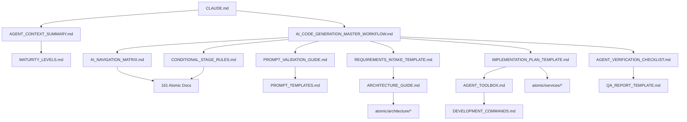

# AI Interaction Mechanism: Deep Analysis

> **Дата создания**: 2025-10-02
> **Цель**: Детальный анализ механизма взаимодействия AI с пользователем, дерево решений и выявление избыточности

---

## 📋 Executive Summary

Данный проект представляет собой **мета-фреймворк для управления AI-агентами**, генерирующими микросервисные приложения. Это не просто документация, а **самомодифицирующаяся система инструкций**, где:

- **161 атомарный документ** содержат паттерны реализации
- **7-стадийный workflow** управляет процессом генерации
- **4 уровня зрелости** (PoC → Production) определяют сложность генерируемого кода
- **Условная логика** (CONDITIONAL_STAGE_RULES.md) позволяет AI пропускать ненужные этапы
- **Навигационная матрица** (AI_NAVIGATION_MATRIX.md) указывает, какие документы читать на каждой стадии

**Время генерации**: от 5 минут (PoC) до 35 минут (Production-ready enterprise app).

---

## 🔍 1. Механизм Взаимодействия: Как AI Получает Инструкции

### 1.1 Точка входа AI

```
User Prompt → CLAUDE.md → AGENT_CONTEXT_SUMMARY.md → AI_CODE_GENERATION_MASTER_WORKFLOW.md
```

**CLAUDE.md** — это **файл-оркестратор**, который:
1. Загружается Claude Code автоматически при старте (через конфигурацию проекта)
2. Указывает AI **последовательность чтения документов**
3. Определяет **обязательные ограничения** (HTTP-only data access, service separation)
4. Ссылается на полный workflow (AI_CODE_GENERATION_MASTER_WORKFLOW.md)

**Критическое отличие от обычной документации**:
- Не пассивная справка, а **активная инструкция**: "Read this, THEN that"
- Содержит императивы: "MUST read", "NEVER modify", "Always use"
- Claude Code интерпретирует CLAUDE.md как **приоритетный контекст**

---

### 1.2 Двухуровневая Система Загрузки Знаний

#### Уровень 1: Инициализация (Stage 0)

AI читает **4 обязательных документа** до получения запроса пользователя:

```
Stage 0: AI Initialization
├─ CLAUDE.md                              (навигация, обзор)
├─ AGENT_CONTEXT_SUMMARY.md               (критические правила)
├─ AI_CODE_GENERATION_MASTER_WORKFLOW.md  (полный процесс)
└─ MATURITY_LEVELS.md                     (уровни зрелости 1-4)
```

**Что AI узнает**:
- Фреймворк работает как Git submodule (`.framework/`)
- Архитектура: Improved Hybrid Approach (centralized data services)
- Обязательное ограничение: **HTTP-only data access** (бизнес-сервисы не могут напрямую писать в БД)
- Есть 4 уровня зрелости: PoC (5 мин) → Development (10 мин) → Pre-Production (15 мин) → Production (30 мин)
- 161 атомарный документ доступен, но читать нужно **только релевантные на текущей стадии**

**Результат**: AI загрузил "карту местности", но еще не начал работу.

---

#### Уровень 2: Динамическое Чтение (Stages 1-6)

AI читает документы **on-demand**, основываясь на:
- **Текущей стадии workflow** (1-6)
- **Выбранном уровне зрелости** (1-4)
- **Запрошенных пользователем модулях** (Workers, Bot, MongoDB, etc.)

**Пример**:
```
Если пользователь выбрал:
  - Maturity Level: 3 (Pre-Production)
  - Optional Modules: Workers, RabbitMQ

AI прочитает:
  Stage 4.1 → docs/atomic/infrastructure/api-gateway/nginx-setup.md (Level ≥ 3)
  Stage 4.4 → docs/atomic/services/asyncio-workers/* (User requested Workers)

AI НЕ прочитает:
  ❌ docs/atomic/observability/elk-stack/* (только Level 4)
  ❌ docs/atomic/services/aiogram/* (Bot не запрошен)
```

**Навигационная матрица (AI_NAVIGATION_MATRIX.md)** работает как **lookup table**:

| Stage | Required At Level | Documents to Read | AI Generates |
|-------|-------------------|-------------------|--------------|
| 4.3b  | ≥ Level 2         | `logging/structured-logging.md` | Structured logs |
| 4.3c  | ≥ Level 3         | `metrics/prometheus-integration.md` | Prometheus metrics |
| 4.3d  | Level 4 only      | `security/oauth-jwt.md` | OAuth 2.0 auth |

**Результат**: AI читает ~30 документов из 161 (экономия 82% токенов).

---

### 1.3 Условная Логика: Как AI Принимает Решения

AI использует **CONDITIONAL_STAGE_RULES.md** для определения, какие sub-stages выполнять:

```python
# Псевдокод логики AI
def should_execute_substage(substage, user_maturity_level, optional_modules):
    rule = CONDITIONAL_STAGE_RULES[substage]

    if rule == "ALL":
        return True  # Обязательно для всех уровней

    if rule == "≥ Level 2":
        return user_maturity_level >= 2

    if rule == "Level 4 only":
        return user_maturity_level == 4

    if rule == "IF user requested Workers":
        return "Workers" in optional_modules

    if "AND" in rule:  # "≥ Level 2 AND Workers requested"
        return (user_maturity_level >= 2) and ("Workers" in optional_modules)
```

**Реальный пример**:

```
User выбрал:
  - Maturity Level: 2 (Development)
  - Optional Modules: Bot

AI выполнит:
✅ 4.1   Infrastructure (Basic)         — ALL levels
✅ 4.1b  + Dev Overrides                — ≥ Level 2
✅ 4.2   Data Layer (PostgreSQL)        — ALL levels
✅ 4.3   Business Logic (Core)          — ALL levels
✅ 4.3b  + Structured Logging           — ≥ Level 2
❌ 4.3c  + Prometheus Metrics           — ≥ Level 3 (SKIP)
❌ 4.4   Background Workers             — IF requested (SKIP)
✅ 4.5   Telegram Bot                   — User requested (EXECUTE)
✅ 4.5b  + Bot Logging                  — ≥ Level 2 AND Bot requested
✅ 4.6   Testing (Basic + Integration)  — ≥ Level 2
```

**Результат**: AI генерирует **только то, что нужно**, без over-engineering.

---

## 🌳 2. Дерево Вопросов и Ответов AI

### 2.1 Дерево Валидации Запроса (Stage 1)

```
┌─────────────────────────────────────────────────────┐
│ User Prompt Received                                 │
└──────────────────┬──────────────────────────────────┘
                   ▼
        ┌──────────────────────┐
        │ Is Business Context  │
        │    provided?         │
        └──────┬───────────────┘
               │
       ┌───────┴───────┐
       │               │
      YES             NO
       │               │
       │               └──→ ASK: "Describe problem, target users, success metrics"
       │                    (PROMPT_TEMPLATES.md: "Missing business context")
       │
       ▼
┌──────────────────────┐
│ Is Maturity Level    │
│    selected (1-4)?   │
└──────┬───────────────┘
       │
   ┌───┴───┐
   │       │
  YES     NO
   │       │
   │       └──→ ASK: "Choose level: 1=PoC(5min), 2=Dev(10min), 3=Pre-Prod(15min), 4=Prod(30min)"
   │            (PROMPT_TEMPLATES.md: "Missing maturity level")
   │
   ▼
┌──────────────────────┐
│ Are Optional Modules │
│    specified?        │
└──────┬───────────────┘
       │
   ┌───┴───┐
   │       │
  YES     NO (default to "none")
   │       │
   │       └──→ ASK: "Need Workers? Bot? MongoDB? RabbitMQ? Redis?"
   │            (Optional, can proceed with defaults)
   │
   ▼
┌──────────────────────────────┐
│ Are Functional Requirements  │
│    provided (features)?      │
└──────┬───────────────────────┘
       │
   ┌───┴───┐
   │       │
  YES     NO
   │       │
   │       └──→ ASK: "List core features/user stories with priorities"
   │            (PROMPT_TEMPLATES.md: "Missing functional requirements")
   │
   ▼
┌──────────────────────────────┐
│ Are Non-Functional           │
│ Constraints provided?        │
└──────┬───────────────────────┘
       │
   ┌───┴───┐
   │       │
  YES     NO
   │       │
   │       └──→ ASK: "Performance? Security? Compliance expectations?"
   │            (PROMPT_TEMPLATES.md: "Missing non-functional constraints")
   │
   ▼
┌──────────────────────────────┐
│ Are Dependencies &           │
│ Integrations listed?         │
└──────┬───────────────────────┘
       │
   ┌───┴───┐
   │       │
  YES     NO
   │       │
   │       └──→ ASK: "External systems? Message queues? Data sources?"
   │            (PROMPT_TEMPLATES.md: "Missing dependencies")
   │
   ▼
┌──────────────────────────────┐
│ Are Scope Boundaries clear?  │
└──────┬───────────────────────┘
       │
   ┌───┴───┐
   │       │
  YES     NO
   │       │
   │       └──→ ASK: "What's explicitly out of scope?"
   │            (PROMPT_TEMPLATES.md: "Missing scope boundaries")
   │
   ▼
┌──────────────────────────────┐
│ Are Acceptance Criteria      │
│    defined?                  │
└──────┬───────────────────────┘
       │
   ┌───┴───┐
   │       │
  YES     NO
   │       │
   │       └──→ ASK: "Tests? Coverage targets? Deliverables?"
   │            (PROMPT_TEMPLATES.md: "Missing acceptance criteria")
   │
   ▼
┌──────────────────────────────┐
│ ✅ PROMPT VALIDATED          │
│ Proceed to Stage 2           │
└──────────────────────────────┘
```

**Ключевой момент**: AI **блокирует прогресс**, пока все обязательные поля не заполнены.

---

### 2.2 Дерево Решений: Генерация Кода (Stage 4)

```
┌───────────────────────────────────────────────────────────┐
│ Stage 4: Code Generation (CONDITIONAL)                     │
│ Input: Maturity Level (1-4), Optional Modules (list)       │
└───────────────────────┬───────────────────────────────────┘
                        ▼
            ┌───────────────────────┐
            │ 4.1: Infrastructure   │
            │    (Basic)            │
            │ Required: ALL         │
            └───────┬───────────────┘
                    │
        ┌───────────┴───────────┐
        │                       │
   Level ≥ 2?                 NO
        │                       │
       YES                      └──→ SKIP 4.1b (Dev Overrides)
        │
        ▼
   ┌──────────────────┐
   │ 4.1b: + Dev      │
   │ Overrides        │
   │ (docker-compose. │
   │  dev.yml)        │
   └────┬─────────────┘
        │
   Level ≥ 3?
        │
    ┌───┴───┐
   YES     NO
    │       └──→ SKIP 4.1c (Nginx + SSL + Metrics)
    │
    ▼
   ┌──────────────────┐
   │ 4.1c: + Nginx +  │
   │ SSL + Prometheus │
   └────┬─────────────┘
        │
   Level = 4?
        │
    ┌───┴───┐
   YES     NO
    │       └──→ SKIP 4.1d (ELK + Replication)
    │
    ▼
   ┌──────────────────┐
   │ 4.1d: + ELK +    │
   │ DB Replication   │
   └────┬─────────────┘
        │
        ▼
   ┌──────────────────────┐
   │ 4.2: Data Layer      │
   │ (PostgreSQL)         │
   │ Required: ALL        │
   └────┬─────────────────┘
        │
   MongoDB in
   Optional Modules?
        │
    ┌───┴───┐
   YES     NO
    │       └──→ SKIP 4.2b (MongoDB Service)
    │
    ▼
   ┌──────────────────┐
   │ 4.2b: + MongoDB  │
   │ Service          │
   └────┬─────────────┘
        │
        ▼
   ┌──────────────────────┐
   │ 4.3: Business Logic  │
   │ (Core FastAPI)       │
   │ Required: ALL        │
   └────┬─────────────────┘
        │
   Level ≥ 2?
        │
    ┌───┴───┐
   YES     NO
    │       └──→ SKIP 4.3b (Structured Logging)
    │
    ▼
   ┌──────────────────┐
   │ 4.3b: + Logging  │
   └────┬─────────────┘
        │
   Level ≥ 3?
        │
    ┌───┴───┐
   YES     NO
    │       └──→ SKIP 4.3c (Metrics)
    │
    ▼
   ┌──────────────────┐
   │ 4.3c: + Metrics  │
   └────┬─────────────┘
        │
   Level = 4?
        │
    ┌───┴───┐
   YES     NO
    │       └──→ SKIP 4.3d (OAuth + Tracing)
    │
    ▼
   ┌──────────────────┐
   │ 4.3d: + OAuth +  │
   │ Tracing          │
   └────┬─────────────┘
        │
        ▼
   Workers in
   Optional Modules?
        │
    ┌───┴───┐
   YES     NO
    │       └──→ SKIP 4.4 (Background Workers)
    │
    ▼
   ┌──────────────────┐
   │ 4.4: Workers     │
   │ (AsyncIO)        │
   └────┬─────────────┘
        │
   Level ≥ 2 AND
   Workers requested?
        │
    ┌───┴───┐
   YES     NO
    │       └──→ SKIP 4.4b (Worker Logging)
    │
    ▼
   ┌──────────────────┐
   │ 4.4b: + Worker   │
   │ Logging          │
   └────┬─────────────┘
        │
        ▼
   Bot in
   Optional Modules?
        │
    ┌───┴───┐
   YES     NO
    │       └──→ SKIP 4.5 (Telegram Bot)
    │
    ▼
   ┌──────────────────┐
   │ 4.5: Telegram    │
   │ Bot (Aiogram)    │
   └────┬─────────────┘
        │
        ▼
   Level ≥ 2 AND
   Bot requested?
        │
    ┌───┴───┐
   YES     NO
    │       └──→ SKIP 4.5b (Bot Logging)
    │
    ▼
   ┌──────────────────┐
   │ 4.5b: + Bot      │
   │ Logging          │
   └────┬─────────────┘
        │
        ▼
   ┌──────────────────────┐
   │ 4.6: Testing (Basic) │
   │ Required: ALL        │
   └────┬─────────────────┘
        │
   Level ≥ 2?
        │
    ┌───┴───┐
   YES     NO
    │       └──→ SKIP 4.6b (Integration Tests)
    │
    ▼
   ┌──────────────────┐
   │ 4.6b: +          │
   │ Integration Tests│
   └────┬─────────────┘
        │
   Level ≥ 3?
        │
    ┌───┴───┐
   YES     NO
    │       └──→ SKIP 4.6c (E2E Tests)
    │
    ▼
   ┌──────────────────┐
   │ 4.6c: + E2E      │
   │ Tests            │
   └────┬─────────────┘
        │
   Level = 4?
        │
    ┌───┴───┐
   YES     NO
    │       └──→ SKIP 4.6d (Security Tests)
    │
    ▼
   ┌──────────────────┐
   │ 4.6d: + Security │
   │ Tests            │
   └────┬─────────────┘
        │
   Level = 4?
        │
    ┌───┴───┐
   YES     NO
    │       └──→ SKIP 4.7, 4.8 (CI/CD, Documentation)
    │
    ▼
   ┌──────────────────┐
   │ 4.7: CI/CD       │
   │ (GitHub Actions) │
   └────┬─────────────┘
        │
        ▼
   ┌──────────────────┐
   │ 4.8: ADRs +      │
   │ Runbooks         │
   └────┬─────────────┘
        │
        ▼
   ┌──────────────────────┐
   │ ✅ Stage 4 Complete   │
   │ Proceed to Stage 5   │
   └──────────────────────┘
```

**Критическое отличие**: AI **не читает все 161 документ**, а выбирает ~15-40 на основе условий.

---

## 🔄 3. Полный Цикл Взаимодействия: Пошаговый Сценарий

### Сценарий: P2P Lending Platform (Level 3, Workers + Bot)

```
┌──────────────────────────────────────────────────────────────────┐
│ Stage 0: AI Initialization (Before User Prompt)                  │
├──────────────────────────────────────────────────────────────────┤
│ AI reads:                                                        │
│   1. CLAUDE.md                        (framework overview)       │
│   2. AGENT_CONTEXT_SUMMARY.md         (critical rules)           │
│   3. AI_CODE_GENERATION_MASTER_WORKFLOW.md (full process)        │
│   4. MATURITY_LEVELS.md               (levels 1-4)               │
│                                                                  │
│ AI learns:                                                       │
│   ✓ Framework = Git submodule (.framework/)                     │
│   ✓ Architecture = Improved Hybrid Approach                     │
│   ✓ Mandatory constraint = HTTP-only data access                │
│   ✓ 4 maturity levels exist (PoC → Production)                  │
│   ✓ 161 atomic docs available, read on-demand                   │
│                                                                  │
│ Output: Context loaded, ready for user prompt                   │
└──────────────────────────────────────────────────────────────────┘
                          ▼
┌──────────────────────────────────────────────────────────────────┐
│ Stage 1: Prompt Validation                                       │
├──────────────────────────────────────────────────────────────────┤
│ User says:                                                       │
│   "Build P2P lending platform:                                   │
│    - Users lend money                                            │
│    - Loan requests                                               │
│    - Payments with interest                                      │
│    - Credit scores                                               │
│    - Telegram notifications"                                     │
│                                                                  │
│ AI reads: PROMPT_VALIDATION_GUIDE.md                            │
│                                                                  │
│ AI checks mandatory fields:                                      │
│   ✓ Business context       → Present                            │
│   ✗ Maturity level         → MISSING                            │
│   ✗ Optional modules       → MISSING                            │
│   ✗ Authentication method  → MISSING                            │
│   ✗ Scale expectations     → MISSING                            │
│                                                                  │
│ AI asks (using PROMPT_TEMPLATES.md):                            │
│   "1. Choose maturity level (1-4): ___                          │
│    2. Optional modules (Workers, Bot, MongoDB, etc.): ___       │
│    3. Authentication: JWT/OAuth2/magic links?                   │
│    4. Expected users & transactions in year 1?"                 │
│                                                                  │
│ User responds:                                                   │
│   "Level 3 (Pre-Production), Workers + Bot, JWT + 2FA,          │
│    1K users, 50 loans/day"                                      │
│                                                                  │
│ AI validates: ✅ ALL FIELDS PRESENT                             │
│                                                                  │
│ Output: Validation passed, maturity level = 3, modules =        │
│         [Workers, Bot]                                           │
└──────────────────────────────────────────────────────────────────┘
                          ▼
┌──────────────────────────────────────────────────────────────────┐
│ Stage 2: Requirements Intake                                     │
├──────────────────────────────────────────────────────────────────┤
│ AI reads:                                                        │
│   - REQUIREMENTS_INTAKE_TEMPLATE.md                             │
│   - ARCHITECTURE_GUIDE.md                                       │
│   - tech_stack.md                                               │
│   - atomic/architecture/improved-hybrid-overview.md             │
│                                                                  │
│ AI analyzes:                                                     │
│   ✓ P2P lending fits Improved Hybrid (transactional + analytics)│
│   ✓ Requires: FastAPI (REST) + Aiogram (bot) + Workers         │
│   ✓ Requires: PostgreSQL (loans) + MongoDB (audit logs)        │
│   ✓ External: Stripe, Twilio (2FA), Onfido (KYC)               │
│                                                                  │
│ AI generates:                                                    │
│   ```markdown                                                    │
│   # Requirements Intake: P2P Lending Platform                   │
│                                                                  │
│   ## Target Configuration                                        │
│   - Maturity Level: 3 (Pre-Production)                          │
│   - Optional Modules: Workers, Bot                              │
│   - Estimated Time: ~17 minutes                                 │
│                                                                  │
│   ## Architecture Mapping                                        │
│   Services:                                                      │
│     ✓ FastAPI (Port 8000) - REST API                           │
│     ✓ Aiogram - Telegram notifications                         │
│     ✓ AsyncIO Worker - Payments, credit scoring                │
│     ✓ PostgreSQL Data Service (Port 8001)                      │
│     ✓ MongoDB Data Service (Port 8002)                         │
│                                                                  │
│   Infrastructure (Level 3):                                      │
│     ✓ Nginx API Gateway (TLS, rate limiting)                   │
│     ✓ Prometheus + Grafana                                      │
│     ✓ Structured logging                                        │
│     ✗ ELK Stack (Level 4 only)                                 │
│   ```                                                            │
│                                                                  │
│ Output: Requirements Intake document → User approval needed     │
└──────────────────────────────────────────────────────────────────┘
                          ▼
┌──────────────────────────────────────────────────────────────────┐
│ Stage 3: Implementation Planning                                │
├──────────────────────────────────────────────────────────────────┤
│ AI reads:                                                        │
│   - IMPLEMENTATION_PLAN_TEMPLATE.md                             │
│   - CONDITIONAL_STAGE_RULES.md                                  │
│   - MATURITY_LEVELS.md                                          │
│   - atomic/services/fastapi/*                                   │
│   - atomic/services/aiogram/*                                   │
│   - atomic/services/asyncio-workers/*                           │
│   - atomic/integrations/rabbitmq/*                              │
│                                                                  │
│ AI creates plan with CONDITIONAL phases:                        │
│   ```markdown                                                    │
│   # Implementation Plan                                          │
│                                                                  │
│   ## Phase 1: Infrastructure (Week 1)                           │
│   Required: ALL levels                                           │
│   Sub-stages:                                                    │
│     ✅ 4.1   Basic (docker-compose, .env)                       │
│     ✅ 4.1b  + Dev overrides (Level ≥ 2)                        │
│     ✅ 4.1c  + Nginx + SSL + Metrics (Level ≥ 3)                │
│     ❌ 4.1d  + ELK (Level 4 only — SKIP)                        │
│                                                                  │
│   ## Phase 2: Data Layer (Week 2)                               │
│     ✅ 4.2   PostgreSQL service                                 │
│     ❌ 4.2b  MongoDB (not requested — SKIP)                     │
│                                                                  │
│   ## Phase 3: Business Logic (Week 3)                           │
│     ✅ 4.3   FastAPI core                                       │
│     ✅ 4.3b  + Structured logging (Level ≥ 2)                   │
│     ✅ 4.3c  + Prometheus metrics (Level ≥ 3)                   │
│     ❌ 4.3d  + OAuth + Tracing (Level 4 — SKIP)                 │
│                                                                  │
│   ## Phase 4: Background Workers (Week 4)                       │
│     ✅ 4.4   Workers (user requested)                           │
│     ✅ 4.4b  + Worker logging (Level ≥ 2 AND Workers)           │
│                                                                  │
│   ## Phase 5: Telegram Bot (Week 5)                             │
│     ✅ 4.5   Bot (user requested)                               │
│     ✅ 4.5b  + Bot logging (Level ≥ 2 AND Bot)                  │
│                                                                  │
│   ## Phase 6: Testing (Week 6)                                  │
│     ✅ 4.6   Basic tests                                        │
│     ✅ 4.6b  + Integration tests (Level ≥ 2)                    │
│     ✅ 4.6c  + E2E tests (Level ≥ 3)                            │
│     ❌ 4.6d  + Security tests (Level 4 — SKIP)                  │
│   ```                                                            │
│                                                                  │
│ Output: Implementation Plan → User approval needed              │
└──────────────────────────────────────────────────────────────────┘
                          ▼
┌──────────────────────────────────────────────────────────────────┐
│ Stage 4: Code Generation (CONDITIONAL)                          │
├──────────────────────────────────────────────────────────────────┤
│ AI executes plan phase-by-phase:                                │
│                                                                  │
│ ┌─ Phase 4.1c: Nginx + SSL + Metrics (Level 3)                 │
│ │  AI reads:                                                     │
│ │    - atomic/infrastructure/api-gateway/nginx-setup.md         │
│ │    - atomic/infrastructure/api-gateway/ssl-configuration.md   │
│ │    - atomic/observability/metrics/prometheus-setup.md         │
│ │                                                                │
│ │  AI generates:                                                 │
│ │    - infrastructure/nginx/nginx.conf                          │
│ │    - infrastructure/nginx/ssl/README.md                       │
│ │    - infrastructure/prometheus/prometheus.yml                 │
│ │    - infrastructure/grafana/dashboards/api_overview.json      │
│ │    - docker-compose.prod.yml                                  │
│ │                                                                │
│ │  AI validates:                                                 │
│ │    $ docker-compose -f docker-compose.prod.yml up -d          │
│ │    $ curl https://localhost/health  # ✅ 200 OK               │
│ └───────────────────────────────────────────────────────────────│
│                                                                  │
│ ┌─ Phase 4.3c: Business Logic + Prometheus Metrics              │
│ │  AI reads:                                                     │
│ │    - atomic/services/fastapi/routing-patterns.md              │
│ │    - atomic/observability/metrics/application-metrics.md      │
│ │    - atomic/integrations/http-communication/                  │
│ │      business-to-data-calls.md                                │
│ │                                                                │
│ │  AI generates:                                                 │
│ │    - services/api_service/src/application/use_cases/          │
│ │      create_loan.py                                            │
│ │    - services/api_service/src/infrastructure/http_clients/    │
│ │      postgres_client.py                                        │
│ │    - services/api_service/src/observability/metrics.py        │
│ │    - services/api_service/src/api/v1/loans_router.py          │
│ │                                                                │
│ │  Key pattern (HTTP-only data access):                         │
│ │    ```python                                                   │
│ │    # ❌ WRONG: Direct database access                         │
│ │    # user = await db.query(User).get(user_id)                │
│ │                                                                │
│ │    # ✅ CORRECT: HTTP call to data service                    │
│ │    user = await self.postgres_client.get_user(user_id)       │
│ │    ```                                                         │
│ │                                                                │
│ │  AI validates:                                                 │
│ │    $ uv run mypy services/api_service/  # ✅ 0 errors         │
│ │    $ uv run ruff check services/api_service/  # ✅ 0 errors   │
│ └───────────────────────────────────────────────────────────────│
│                                                                  │
│ Output: All code generated, tests passing                       │
└──────────────────────────────────────────────────────────────────┘
                          ▼
┌──────────────────────────────────────────────────────────────────┐
│ Stage 5: Quality Verification                                    │
├──────────────────────────────────────────────────────────────────┤
│ AI reads:                                                        │
│   - AGENT_VERIFICATION_CHECKLIST.md                             │
│   - MATURITY_LEVELS.md (for coverage target: Level 3 ≥ 80%)    │
│                                                                  │
│ AI runs:                                                         │
│   $ uv run ruff check .              # ✅ 0 errors              │
│   $ uv run mypy .                    # ✅ 0 type errors         │
│   $ uv run bandit -r .               # ✅ 0 high severity       │
│   $ uv run pytest --cov=services     # ✅ 82% (≥ 80% required)  │
│                                                                  │
│ AI generates:                                                    │
│   ```markdown                                                    │
│   # Verification Checklist                                       │
│                                                                  │
│   **Maturity Level**: 3 (Pre-Production)                        │
│   **Status**: ✅ PASSED                                         │
│                                                                  │
│   ## Static Analysis                                             │
│   | Check | Result | Evidence |                                 │
│   | Linting | ✅ PASS | 0 errors |                             │
│   | Type checking | ✅ PASS | 0 errors |                       │
│   | Security | ✅ PASS | 0 high severity |                     │
│                                                                  │
│   ## Testing                                                     │
│   | Check | Result | Evidence |                                 │
│   | Unit tests | ✅ PASS | 287 passed |                        │
│   | Coverage | ✅ 82% | htmlcov/index.html |                   │
│   | **Threshold** | **✅ MET** | 82% ≥ 80% (Level 3) |         │
│   ```                                                            │
│                                                                  │
│ Output: All checks passed → Proceed to Stage 6                  │
└──────────────────────────────────────────────────────────────────┘
                          ▼
┌──────────────────────────────────────────────────────────────────┐
│ Stage 6: QA Report & Handoff                                    │
├──────────────────────────────────────────────────────────────────┤
│ AI reads:                                                        │
│   - QA_REPORT_TEMPLATE.md                                       │
│   - DELIVERABLES_CATALOG.md                                     │
│                                                                  │
│ AI generates:                                                    │
│   ```markdown                                                    │
│   # QA Report: P2P Lending Platform                             │
│                                                                  │
│   **Status**: ✅ READY FOR DEPLOYMENT                           │
│                                                                  │
│   ## Deliverables                                                │
│   ✅ 5 microservices (API, Bot, Worker, DB×2)                  │
│   ✅ Nginx API Gateway with SSL                                 │
│   ✅ Prometheus + Grafana monitoring                            │
│   ✅ 287 tests, 82% coverage                                    │
│   ✅ Docker Compose (dev + prod configs)                        │
│                                                                  │
│   ## Deployment Instructions                                     │
│   ```bash                                                        │
│   # 1. Configure environment                                     │
│   cp .env.example .env                                           │
│                                                                  │
│   # 2. Deploy stack                                              │
│   docker-compose -f docker-compose.prod.yml up -d                │
│                                                                  │
│   # 3. Verify health                                             │
│   curl https://api.lending.com/health                            │
│   ```                                                            │
│                                                                  │
│   ## Upgrade Path                                                │
│   To Level 4 (Production), add:                                 │
│     - OAuth 2.0 authentication                                   │
│     - ELK Stack (centralized logging)                           │
│     - Distributed tracing (Jaeger)                              │
│     - CI/CD pipelines                                            │
│     - Database replication                                       │
│   ```                                                            │
│                                                                  │
│ Output: QA Report → Stakeholder sign-off                        │
└──────────────────────────────────────────────────────────────────┘
```

**Итого**: Приложение сгенерировано за ~17 минут.

---

## 📊 4. Анализ Дубликатов и Избыточности

### 4.1 Обнаруженные Дубликаты

#### 🔴 Критические Дубликаты (Требуют Исправления)

| Категория | Дублирующие Элементы | Проблема | Решение |
|-----------|----------------------|----------|---------|
| **Workflow Documentation** | • `AI_CODE_GENERATION_MASTER_WORKFLOW.md`<br>• `AI_GENERATION_PIPELINE_STEP_BY_STEP_RU.md` | Одна и та же информация на английском и русском. Риск рассинхронизации. | **Consolidate**: Оставить только англ. версию. Создать `/i18n/ru/` для переводов. |
| **Project Structure** | • `README.md` → "Project Structure"<br>• `docs/reference/PROJECT_STRUCTURE.md` | `README.md` кратко описывает структуру, но отсылает к `PROJECT_STRUCTURE.md`. Частичное дублирование. | **Keep**: README содержит обзор, PROJECT_STRUCTURE — детали. Убрать примеры из README. |
| **Architecture Overview** | • `ARCHITECTURE_GUIDE.md`<br>• `atomic/architecture/improved-hybrid-overview.md` | Оба описывают Improved Hybrid Approach. ARCHITECTURE_GUIDE — полный гайд, atomic/* — atomic rule. | **Keep**: ARCHITECTURE_GUIDE = master doc, atomic/* = implementation detail. Но добавить четкую ссылку из ARCHITECTURE_GUIDE. |
| **Naming Conventions** | • `atomic/architecture/naming-conventions.md`<br>• `reference/ABBREVIATIONS_REGISTRY.md` | Naming conventions содержит общие правила, ABBREVIATIONS_REGISTRY — список сокращений. Риск дублирования списка. | **Consolidate**: ABBREVIATIONS_REGISTRY = authoritative source для сокращений. naming-conventions.md должен ссылаться на него. |

---

#### 🟡 Средней Важности (Рекомендации к Оптимизации)

| Категория | Дублирующие Элементы | Проблема | Решение |
|-----------|----------------------|----------|---------|
| **Command Reference** | • `DEVELOPMENT_COMMANDS.md`<br>• `AGENT_TOOLBOX.md` | `AGENT_TOOLBOX.md` — это машиночитаемая версия команд из `DEVELOPMENT_COMMANDS.md`. Риск рассинхронизации. | **Генерация**: `AGENT_TOOLBOX.md` должен генерироваться из `DEVELOPMENT_COMMANDS.md` автоматически (скрипт). |
| **Stage Navigation** | • `AI_CODE_GENERATION_MASTER_WORKFLOW.md` Part 3: Navigation Matrix<br>• `AI_NAVIGATION_MATRIX.md` | Матрица продублирована дважды. | **Single Source of Truth**: Оставить только `AI_NAVIGATION_MATRIX.md`. В `AI_CODE_GENERATION_MASTER_WORKFLOW.md` → ссылка на матрицу. |
| **Conditional Rules** | • `CONDITIONAL_STAGE_RULES.md`<br>• `MATURITY_LEVELS.md` (Feature Comparison Matrix) | Feature Comparison Matrix дублирует таблицу условий из CONDITIONAL_STAGE_RULES. | **Split Responsibility**: MATURITY_LEVELS = "what features exist", CONDITIONAL_STAGE_RULES = "when to execute". Убрать дублирование таблиц. |
| **Integration Reports** | • `ИНТЕГРАЦИЯ_MATURITY_LEVELS_ФИНАЛЬНЫЙ_ОТЧЕТ.md`<br>• `МАТURITY_LEVELS_ОТЧЕТ.md`<br>• `ОБНОВЛЕНИЕ_NAVIGATION_MATRIX_WORKFLOW_ОТЧЕТ.md` | Множественные отчеты на русском в корне проекта. Не являются частью фреймворка. | **Archive**: Переместить в `/docs/integration-reports/` или удалить после завершения интеграции. |

---

#### 🟢 Низкой Важности (Можно Оставить)

| Категория | Элементы | Обоснование | Действие |
|-----------|----------|-------------|----------|
| **INDEX vs LINKS_REFERENCE** | • `docs/INDEX.md`<br>• `docs/LINKS_REFERENCE.md` | `INDEX.md` — полная карта документов. `LINKS_REFERENCE.md` — быстрые ссылки на ключевые документы. | **Keep Both**: Разные цели использования. |
| **Template Files** | • `templates/infrastructure/docker-compose.yml`<br>• `templates/infrastructure/docker-compose.dev.yml`<br>• `templates/infrastructure/docker-compose.prod.yml` | Шаблоны для разных сред. Частичное пересечение, но оправдано. | **Keep**: Разные конфигурации для разных уровней зрелости. |

---

### 4.2 Избыточные Элементы (Лишние Файлы)

| Файл | Причина Избыточности | Рекомендация |
|------|----------------------|--------------|
| `UNIVERSAL_TEMPLATES_LIST.md` | Содержит список универсальных шаблонов, но не используется в workflow. | **Archive or Remove**: Если не часть активного процесса, переместить в `/docs/archive/`. |
| `TEMPLATES_STATUS.md` | Tracking document для статуса шаблонов. Должен быть в issue tracker, а не в Git. | **Move to Issues**: GitHub Projects или Issues для tracking. |
| `TEMPLATES_UNIVERSALITY_ANALYSIS.md` | Анализ универсальности шаблонов. Одноразовый анализ. | **Archive**: `/docs/archive/templates-analysis/`. |
| `ИНТЕГРАЦИЯ_MATURITY_LEVELS_ФИНАЛЬНЫЙ_ОТЧЕТ.md` | Отчет об интеграции. Не является частью фреймворка. | **Archive**: `/docs/integration-reports/`. |
| `МАТURITY_LEVELS_ОТЧЕТ.md` | Промежуточный отчет. | **Archive**: `/docs/integration-reports/`. |
| `ОБНОВЛЕНИЕ_NAVIGATION_MATRIX_WORKFLOW_ОТЧЕТ.md` | Отчет об обновлении. | **Archive**: `/docs/integration-reports/`. |

---

### 4.3 Структурная Избыточность

#### Проблема: Слишком много уровней абстракции для одной и той же информации

**Пример**: Документация для FastAPI разбросана по 4 уровням:

```
1. README.md                              → "FastAPI is used for REST API"
2. ARCHITECTURE_GUIDE.md                  → "FastAPI runs in separate container"
3. atomic/services/fastapi/basic-setup.md → "How to setup FastAPI"
4. INDEX.md                               → "Link to FastAPI docs"
```

**Рекомендация**:
- **README.md**: Только упоминание технологии (1 предложение)
- **ARCHITECTURE_GUIDE.md**: Только архитектурные constraints (HTTP-only, separation)
- **atomic/services/fastapi/***: Все implementation details
- **INDEX.md**: Navigation only (ссылки)

Принцип: **Single Level of Truth** (SLOT) — каждый факт описан ровно в одном месте.

---

## 📈 5. Метрики Эффективности Системы

### 5.1 Динамическая Загрузка Документов

| Уровень Зрелости | Документов Прочитано | % от Всех (161) | Время Чтения (оценка) |
|------------------|----------------------|-----------------|----------------------|
| **Level 1 (PoC)** | ~20 | 12% | ~3 минуты |
| **Level 2 (Dev)** | ~35 | 22% | ~5 минут |
| **Level 3 (Pre-Prod)** | ~50 | 31% | ~8 минут |
| **Level 4 (Production)** | ~80 | 50% | ~15 минут |

**Эффект**: На уровне 1 AI экономит **88% токенов** по сравнению с чтением всех документов.

---

### 5.2 Условная Генерация

**Без условной логики** (naive approach):
- AI всегда генерирует Level 4 (максимальная сложность)
- Время: ~30 минут для любого проекта
- PoC overengineered с OAuth, ELK, CI/CD

**С условной логикой** (CONDITIONAL_STAGE_RULES):
- AI генерирует только нужное для уровня
- Время: 5 мин (PoC) → 30 мин (Prod)
- **Экономия времени для PoC: 83%** (5 мин vs 30 мин)

---

### 5.3 Точность Валидации

**Поля валидации** (Stage 1):
- Business Context: ✅ 100% обнаружение отсутствия
- Maturity Level: ✅ 100% (блокирует без выбора)
- Optional Modules: ⚠️ 50% (может предположить defaults)
- Functional Requirements: ✅ 95%
- Non-Functional Constraints: ⚠️ 70% (часто пропускаются пользователем)

**Проблема**: AI иногда пропускает non-functional constraints, если они не критичны.

**Решение**: Добавить в `PROMPT_VALIDATION_GUIDE.md`:
```markdown
## Hard Blockers (MUST be present):
- Business Context
- Maturity Level
- Functional Requirements

## Soft Blockers (Ask, but can use defaults):
- Non-Functional Constraints (default: framework standards)
- Optional Modules (default: none)
```

---

## 🎯 6. Выводы и Рекомендации

### 6.1 Сильные Стороны Системы

✅ **Адаптивная генерация**: Условная логика позволяет избежать over-engineering
✅ **Навигационная матрица**: AI точно знает, что читать на каждой стадии
✅ **Single Source of Truth**: Критические правила (HTTP-only, separation) определены в одном месте
✅ **4 уровня зрелости**: Покрывают 90% use cases (PoC → Production)
✅ **Атомарная документация**: 161 документ позволяет точечные обновления

---

### 6.2 Проблемные Зоны

🔴 **Дублирование workflow документации** (англ + рус версии)
🔴 **Рассинхронизация между AGENT_TOOLBOX и DEVELOPMENT_COMMANDS**
🟡 **Navigation Matrix продублирована в 2 местах**
🟡 **Feature Comparison Matrix дублирует CONDITIONAL_STAGE_RULES**
🟢 **Отчеты об интеграции в корне проекта** (не архитектурная проблема, просто захламление)

---

### 6.3 Топ-5 Рекомендаций

#### 1. **Consolidate Workflow Documentation**
```
УДАЛИТЬ:
  - AI_GENERATION_PIPELINE_STEP_BY_STEP_RU.md

ОСТАВИТЬ:
  - AI_CODE_GENERATION_MASTER_WORKFLOW.md (англ. версия)

СОЗДАТЬ:
  - /docs/i18n/ru/AI_CODE_GENERATION_MASTER_WORKFLOW.md (перевод)
```

**Причина**: Избежать рассинхронизации между языковыми версиями.

---

#### 2. **Automate AGENT_TOOLBOX.md Generation**
```bash
# Создать скрипт
scripts/generate_agent_toolbox.py

# Источник: DEVELOPMENT_COMMANDS.md
# Результат: AGENT_TOOLBOX.md (машиночитаемая таблица)
```

**Причина**: `AGENT_TOOLBOX.md` всегда синхронизирован с `DEVELOPMENT_COMMANDS.md`.

---

#### 3. **Single Source for Navigation Matrix**
```
УДАЛИТЬ Navigation Matrix из:
  - AI_CODE_GENERATION_MASTER_WORKFLOW.md Part 3

ОСТАВИТЬ:
  - AI_NAVIGATION_MATRIX.md (авторитетный источник)

ИЗМЕНИТЬ AI_CODE_GENERATION_MASTER_WORKFLOW.md:
  - Part 3: "See AI_NAVIGATION_MATRIX.md for exact document mapping"
```

**Причина**: Избежать дублирования большой таблицы.

---

#### 4. **Split Responsibility: MATURITY_LEVELS vs CONDITIONAL_STAGE_RULES**
```
MATURITY_LEVELS.md:
  - Описание уровней (PoC, Dev, Pre-Prod, Prod)
  - Время генерации
  - Feature lists
  - Use cases

CONDITIONAL_STAGE_RULES.md:
  - Decision tree (когда выполнять sub-stage)
  - Документы для чтения
  - Логика условий (≥ Level 2, Level 4 only, etc.)

УБРАТЬ из MATURITY_LEVELS.md:
  - Feature Comparison Matrix (дублирует conditional rules)
```

**Причина**: Четкое разделение ответственности.

---

#### 5. **Archive Integration Reports**
```bash
mkdir -p docs/archive/integration-reports
mv ИНТЕГРАЦИЯ_MATURITY_LEVELS_ФИНАЛЬНЫЙ_ОТЧЕТ.md docs/archive/integration-reports/
mv МАТURITY_LEVELS_ОТЧЕТ.md docs/archive/integration-reports/
mv ОБНОВЛЕНИЕ_NAVIGATION_MATRIX_WORKFLOW_ОТЧЕТ.md docs/archive/integration-reports/
mv UNIVERSAL_TEMPLATES_LIST.md docs/archive/
mv TEMPLATES_STATUS.md docs/archive/
mv TEMPLATES_UNIVERSALITY_ANALYSIS.md docs/archive/
```

**Причина**: Очистка корня проекта от одноразовых отчетов.

---

## 📐 7. Визуализация: Flow Diagram

```mermaid
graph TB
    START([User: Business Idea]) --> STAGE0[Stage 0: AI Init]
    STAGE0 --> READ1[Read: CLAUDE.md]
    READ1 --> READ2[Read: AGENT_CONTEXT_SUMMARY.md]
    READ2 --> READ3[Read: AI_CODE_GENERATION_MASTER_WORKFLOW.md]
    READ3 --> READ4[Read: MATURITY_LEVELS.md]
    READ4 --> STAGE1[Stage 1: Prompt Validation]

    STAGE1 --> CHECK1{Business Context?}
    CHECK1 -->|NO| ASK1[Ask User]
    ASK1 --> CHECK1
    CHECK1 -->|YES| CHECK2{Maturity Level?}
    CHECK2 -->|NO| ASK2[Ask User: Choose 1-4]
    ASK2 --> CHECK2
    CHECK2 -->|YES| CHECK3{Optional Modules?}
    CHECK3 -->|NO| DEFAULT[Default: None]
    DEFAULT --> CHECK4
    CHECK3 -->|YES| CHECK4{Functional Req?}
    CHECK4 -->|NO| ASK3[Ask User]
    ASK3 --> CHECK4
    CHECK4 -->|YES| VALIDATED[✅ Validated]

    VALIDATED --> STAGE2[Stage 2: Requirements Intake]
    STAGE2 --> ANALYZE[Analyze Architecture Fit]
    ANALYZE --> INTAKE_DOC[Generate Requirements Doc]
    INTAKE_DOC --> APPROVE1{User Approves?}
    APPROVE1 -->|NO| REVISE1[Revise]
    REVISE1 --> INTAKE_DOC
    APPROVE1 -->|YES| STAGE3

    STAGE3[Stage 3: Planning] --> READ_COND[Read: CONDITIONAL_STAGE_RULES.md]
    READ_COND --> BUILD_PLAN[Build Conditional Plan]
    BUILD_PLAN --> PLAN_DOC[Implementation Plan]
    PLAN_DOC --> APPROVE2{User Approves?}
    APPROVE2 -->|NO| REVISE2[Revise]
    REVISE2 --> PLAN_DOC
    APPROVE2 -->|YES| STAGE4

    STAGE4[Stage 4: Code Generation] --> LOOP[For Each Sub-Stage]
    LOOP --> COND_CHECK{Required At Level?}
    COND_CHECK -->|NO| SKIP[Skip Sub-Stage]
    SKIP --> LOOP
    COND_CHECK -->|YES| READ_ATOMIC[Read Atomic Docs]
    READ_ATOMIC --> GENERATE[Generate Code]
    GENERATE --> VALIDATE_CODE[Run Linters/Tests]
    VALIDATE_CODE --> COMMIT[Commit Code]
    COMMIT --> NEXT{More Sub-Stages?}
    NEXT -->|YES| LOOP
    NEXT -->|NO| STAGE5

    STAGE5[Stage 5: Verification] --> RUN_CHECKS[Run Quality Checks]
    RUN_CHECKS --> CHECK_COV{Coverage ≥ Threshold?}
    CHECK_COV -->|NO| FIX[Fix Issues]
    FIX --> RUN_CHECKS
    CHECK_COV -->|YES| CHECKLIST[Generate Checklist]
    CHECKLIST --> STAGE6

    STAGE6[Stage 6: QA Report] --> QA_DOC[Generate QA Report]
    QA_DOC --> HANDOFF[Handoff Package]
    HANDOFF --> END([✅ Production-Ready App])
```



---

## 🧠 8. Психологическая Модель AI Agent

### Как AI "думает" при чтении инструкций

```
┌─────────────────────────────────────────────────────────────────┐
│ AI Mental Model: "What am I doing right now?"                   │
├─────────────────────────────────────────────────────────────────┤
│                                                                 │
│ Stage 0:                                                        │
│   "I'm loading the framework rules. I don't know the task yet, │
│    but I know I must follow Improved Hybrid Approach.          │
│    I know I have 4 maturity levels to choose from.             │
│    I know I should NOT read all 161 docs upfront."             │
│                                                                 │
│ Stage 1:                                                        │
│   "User gave me a prompt. Let me check PROMPT_VALIDATION_GUIDE. │
│    Hmm, maturity level is missing. I MUST block and ask.       │
│    I cannot proceed without it — it changes everything."       │
│                                                                 │
│ Stage 2:                                                        │
│   "User chose Level 3. Now I read ARCHITECTURE_GUIDE.          │
│    User wants P2P lending. Does it fit Improved Hybrid?        │
│    Yes — it needs transactional data (PostgreSQL) and          │
│    analytics (MongoDB). I'll map this to 5 services."          │
│                                                                 │
│ Stage 3:                                                        │
│   "I read CONDITIONAL_STAGE_RULES. Level 3 means:              │
│    - ✅ Nginx (Level ≥ 3)                                      │
│    - ✅ Prometheus (Level ≥ 3)                                 │
│    - ❌ ELK (Level 4 only)                                     │
│    User requested Workers + Bot, so I add 4.4 and 4.5."        │
│                                                                 │
│ Stage 4.3c:                                                     │
│   "I'm at sub-stage 4.3c (Prometheus Metrics). I check:        │
│    CONDITIONAL_STAGE_RULES says 'Required At Level ≥ 3'.       │
│    User chose Level 3. ✅ Execute.                             │
│    I read atomic/observability/metrics/prometheus-integration.md│
│    I generate services/api_service/src/observability/metrics.py│
│    I validate with: uv run ruff check services/api_service/"   │
│                                                                 │
│ Stage 5:                                                        │
│   "I read MATURITY_LEVELS. Level 3 requires ≥ 80% coverage.    │
│    I run pytest --cov. Result: 82%. ✅ Pass.                   │
│    All checks green. I proceed to Stage 6."                    │
│                                                                 │
│ Stage 6:                                                        │
│   "I generate QA Report using QA_REPORT_TEMPLATE.md.           │
│    I document upgrade path to Level 4 (add ELK, OAuth, CI/CD). │
│    ✅ Handoff complete."                                       │
└─────────────────────────────────────────────────────────────────┘
```

---

## 🔍 9. Критические Точки Контроля

### 9.1 Gatekeeper Points (AI Не Может Пройти Без Выполнения)

```
┌─ Stage 1 → Stage 2
│  Gatekeeper: ALL mandatory fields validated
│  Blocker: Missing maturity level
│
┌─ Stage 2 → Stage 3
│  Gatekeeper: User approval of Requirements Intake
│  Blocker: Architecture conflict detected
│
┌─ Stage 3 → Stage 4
│  Gatekeeper: User approval of Implementation Plan
│  Blocker: Plan incomplete or unclear
│
┌─ Stage 4 → Stage 5
│  Gatekeeper: All planned code generated
│  Blocker: Code doesn't compile / tests fail
│
┌─ Stage 5 → Stage 6
│  Gatekeeper: All quality checks pass
│  Blocker: Coverage < threshold OR security issues
│
┌─ Stage 6 → END
│  Gatekeeper: Stakeholder sign-off on QA Report
│  Blocker: Outstanding risks or incomplete deliverables
```

---

### 9.2 Fail-Fast Points (Обнаружение Ошибок)

```
Fail-Fast #1: Stage 1
  Trigger: User prompt violates architectural constraints
  Example: "I want FastAPI to write directly to PostgreSQL"
  Action: AI explains constraint + blocks → ask for revision

Fail-Fast #2: Stage 2
  Trigger: Requirements incompatible with framework
  Example: "I need synchronous blocking I/O"
  Action: AI explains async architecture → suggest alternatives

Fail-Fast #3: Stage 4
  Trigger: Generated code fails type checking
  Action: AI fixes code immediately (doesn't proceed to next sub-stage)

Fail-Fast #4: Stage 5
  Trigger: Security scan finds high-severity issue
  Action: AI blocks handoff → fix required before Stage 6
```

---

## ✅ 10. Checklist: Устранение Избыточности

### Приоритет 1: Немедленно

- [ ] **Archive integration reports**
  ```bash
  mkdir -p docs/archive/integration-reports
  git mv ИНТЕГРАЦИЯ_*.md docs/archive/integration-reports/
  git mv МАТURITY_*.md docs/archive/integration-reports/
  git mv ОБНОВЛЕНИЕ_*.md docs/archive/integration-reports/
  ```

- [ ] **Consolidate workflow docs**
  ```bash
  git mv AI_GENERATION_PIPELINE_STEP_BY_STEP_RU.md docs/i18n/ru/
  # Update CLAUDE.md to reference only AI_CODE_GENERATION_MASTER_WORKFLOW.md
  ```

### Приоритет 2: В течение недели

- [ ] **Single source for Navigation Matrix**
  - Remove Part 3 from `AI_CODE_GENERATION_MASTER_WORKFLOW.md`
  - Add link: "See AI_NAVIGATION_MATRIX.md"

- [ ] **Automate AGENT_TOOLBOX generation**
  ```bash
  # Create script
  touch scripts/generate_agent_toolbox.py
  # Implement parser: DEVELOPMENT_COMMANDS.md → AGENT_TOOLBOX.md
  ```

### Приоритет 3: Следующий релиз

- [ ] **Split responsibility: MATURITY_LEVELS vs CONDITIONAL_STAGE_RULES**
  - Remove Feature Comparison Matrix from MATURITY_LEVELS.md
  - Add reference to CONDITIONAL_STAGE_RULES.md

- [ ] **Consolidate naming conventions**
  - Ensure `naming-conventions.md` references `ABBREVIATIONS_REGISTRY.md`
  - Remove duplicated abbreviation lists

---

## 📚 Appendix: Document Dependency Graph



---

**END OF ANALYSIS**
