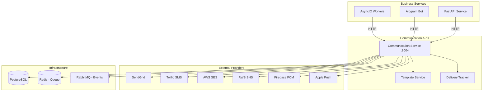

# Communication APIs

Comprehensive guide for integrating communication services (Email, SMS, Push Notifications) in microservices architecture following the Improved Hybrid Approach.

## Overview

Communication services integration enables applications to send notifications, alerts, and messages to users through various channels. This guide covers integration patterns for email (SendGrid, AWS SES), SMS (Twilio, AWS SNS), and push notifications while maintaining service separation and reliability.

## Architecture Pattern

Communication services follow the dedicated service pattern with centralized message routing and template management.



## Email Integration

### 1. SendGrid Integration

```python
# src/services/communication/email/sendgrid_service.py
import sendgrid
from sendgrid.helpers.mail import Mail, Email, To, Content, Attachment
from typing import List, Dict, Any, Optional
import base64
from datetime import datetime
from src.core.config import settings
from src.core.logging import get_logger
from src.core.exceptions import CommunicationError

logger = get_logger(__name__)

class SendGridService:
    """SendGrid email service implementation."""

    def __init__(self):
        self.api_key = settings.sendgrid_api_key
        self.client = sendgrid.SendGridAPIClient(api_key=self.api_key)
        self.default_from_email = settings.default_from_email
        self.default_from_name = settings.default_from_name or settings.app_name

    async def send_email(
        self,
        to_emails: List[str],
        subject: str,
        html_content: str,
        text_content: Optional[str] = None,
        from_email: Optional[str] = None,
        from_name: Optional[str] = None,
        cc_emails: List[str] = None,
        bcc_emails: List[str] = None,
        attachments: List[Dict[str, Any]] = None,
        template_id: Optional[str] = None,
        template_data: Dict[str, Any] = None,
        custom_args: Dict[str, str] = None,
        categories: List[str] = None
    ) -> Dict[str, Any]:
        """Send email via SendGrid."""
        try:
            # Setup sender
            from_email_obj = Email(
                email=from_email or self.default_from_email,
                name=from_name or self.default_from_name
            )

            # Setup recipients
            to_list = [To(email=email) for email in to_emails]

            # Create mail object
            if template_id:
                # Use template
                mail = Mail(
                    from_email=from_email_obj,
                    to_emails=to_list,
                    subject=subject
                )
                mail.template_id = template_id
                if template_data:
                    mail.dynamic_template_data = template_data
            else:
                # Use content
                html_content_obj = Content("text/html", html_content)
                text_content_obj = Content("text/plain", text_content) if text_content else None

                mail = Mail(
                    from_email=from_email_obj,
                    to_emails=to_list,
                    subject=subject,
                    html_content=html_content_obj,
                    plain_text_content=text_content_obj
                )

            # Add CC recipients
            if cc_emails:
                for email in cc_emails:
                    mail.add_cc(Email(email))

            # Add BCC recipients
            if bcc_emails:
                for email in bcc_emails:
                    mail.add_bcc(Email(email))

            # Add attachments
            if attachments:
                for attachment_data in attachments:
                    attachment = Attachment()
                    attachment.file_content = attachment_data.get("content")
                    attachment.file_type = attachment_data.get("type")
                    attachment.file_name = attachment_data.get("filename")
                    attachment.disposition = attachment_data.get("disposition", "attachment")
                    mail.add_attachment(attachment)

            # Add custom arguments
            if custom_args:
                for key, value in custom_args.items():
                    mail.add_custom_arg(key, value)

            # Add categories
            if categories:
                for category in categories:
                    mail.add_category(category)

            # Send email
            response = self.client.send(mail)

            logger.info(f"Email sent via SendGrid to {len(to_emails)} recipients")

            return {
                "message_id": response.headers.get("X-Message-Id"),
                "status_code": response.status_code,
                "recipients": to_emails,
                "timestamp": datetime.utcnow().isoformat()
            }

        except Exception as e:
            logger.error(f"SendGrid email sending failed: {e}")
            raise CommunicationError(f"Email sending failed: {str(e)}")

    async def send_template_email(
        self,
        to_emails: List[str],
        template_id: str,
        template_data: Dict[str, Any],
        from_email: Optional[str] = None,
        from_name: Optional[str] = None,
        custom_args: Dict[str, str] = None
    ) -> Dict[str, Any]:
        """Send email using SendGrid template."""
        return await self.send_email(
            to_emails=to_emails,
            subject="",  # Template defines subject
            html_content="",  # Template defines content
            from_email=from_email,
            from_name=from_name,
            template_id=template_id,
            template_data=template_data,
            custom_args=custom_args
        )

    async def create_contact(
        self,
        email: str,
        first_name: Optional[str] = None,
        last_name: Optional[str] = None,
        custom_fields: Dict[str, Any] = None
    ) -> Dict[str, Any]:
        """Create contact in SendGrid."""
        try:
            contact_data = {
                "email": email
            }

            if first_name:
                contact_data["first_name"] = first_name
            if last_name:
                contact_data["last_name"] = last_name
            if custom_fields:
                contact_data.update(custom_fields)

            response = self.client.client.marketing.contacts.put(
                request_body={"contacts": [contact_data]}
            )

            logger.info(f"Contact created in SendGrid: {email}")

            return {
                "email": email,
                "status_code": response.status_code,
                "timestamp": datetime.utcnow().isoformat()
            }

        except Exception as e:
            logger.error(f"SendGrid contact creation failed: {e}")
            raise CommunicationError(f"Contact creation failed: {str(e)}")

    async def add_to_list(
        self,
        list_id: str,
        contacts: List[Dict[str, Any]]
    ) -> Dict[str, Any]:
        """Add contacts to SendGrid list."""
        try:
            response = self.client.client.marketing.contacts.put(
                request_body={
                    "list_ids": [list_id],
                    "contacts": contacts
                }
            )

            logger.info(f"Added {len(contacts)} contacts to SendGrid list {list_id}")

            return {
                "list_id": list_id,
                "contacts_added": len(contacts),
                "status_code": response.status_code,
                "timestamp": datetime.utcnow().isoformat()
            }

        except Exception as e:
            logger.error(f"SendGrid list addition failed: {e}")
            raise CommunicationError(f"List addition failed: {str(e)}")

# Dependency injection
def get_sendgrid_service() -> SendGridService:
    return SendGridService()
```

### 2. AWS SES Integration

```python
# src/services/communication/email/aws_ses_service.py
import boto3
from typing import List, Dict, Any, Optional
from datetime import datetime
from botocore.exceptions import ClientError
from src.core.config import settings
from src.core.logging import get_logger
from src.core.exceptions import CommunicationError

logger = get_logger(__name__)

class AWSSESService:
    """AWS SES email service implementation."""

    def __init__(self):
        self.client = boto3.client(
            'ses',
            region_name=settings.aws_region,
            aws_access_key_id=settings.aws_access_key_id,
            aws_secret_access_key=settings.aws_secret_access_key
        )
        self.default_from_email = settings.default_from_email
        self.configuration_set = settings.aws_ses_configuration_set

    async def send_email(
        self,
        to_emails: List[str],
        subject: str,
        html_content: str,
        text_content: Optional[str] = None,
        from_email: Optional[str] = None,
        cc_emails: List[str] = None,
        bcc_emails: List[str] = None,
        reply_to_emails: List[str] = None,
        tags: List[Dict[str, str]] = None
    ) -> Dict[str, Any]:
        """Send email via AWS SES."""
        try:
            # Build destination
            destination = {
                'ToAddresses': to_emails
            }

            if cc_emails:
                destination['CcAddresses'] = cc_emails
            if bcc_emails:
                destination['BccAddresses'] = bcc_emails

            # Build message
            message = {
                'Subject': {
                    'Data': subject,
                    'Charset': 'UTF-8'
                },
                'Body': {
                    'Html': {
                        'Data': html_content,
                        'Charset': 'UTF-8'
                    }
                }
            }

            if text_content:
                message['Body']['Text'] = {
                    'Data': text_content,
                    'Charset': 'UTF-8'
                }

            # Send email
            send_params = {
                'Source': from_email or self.default_from_email,
                'Destination': destination,
                'Message': message
            }

            if reply_to_emails:
                send_params['ReplyToAddresses'] = reply_to_emails

            if self.configuration_set:
                send_params['ConfigurationSetName'] = self.configuration_set

            if tags:
                send_params['Tags'] = tags

            response = self.client.send_email(**send_params)

            logger.info(f"Email sent via AWS SES to {len(to_emails)} recipients")

            return {
                "message_id": response['MessageId'],
                "recipients": to_emails,
                "timestamp": datetime.utcnow().isoformat()
            }

        except ClientError as e:
            logger.error(f"AWS SES email sending failed: {e}")
            raise CommunicationError(f"Email sending failed: {e.response['Error']['Message']}")

    async def send_template_email(
        self,
        to_emails: List[str],
        template_name: str,
        template_data: Dict[str, Any],
        from_email: Optional[str] = None,
        tags: List[Dict[str, str]] = None
    ) -> Dict[str, Any]:
        """Send email using AWS SES template."""
        try:
            destinations = [
                {
                    'Destination': {
                        'ToAddresses': [email]
                    },
                    'ReplacementTemplateData': str(template_data)
                }
                for email in to_emails
            ]

            send_params = {
                'Source': from_email or self.default_from_email,
                'Template': template_name,
                'DefaultTemplateData': str(template_data),
                'Destinations': destinations
            }

            if self.configuration_set:
                send_params['ConfigurationSetName'] = self.configuration_set

            if tags:
                send_params['Tags'] = tags

            response = self.client.send_bulk_templated_email(**send_params)

            logger.info(f"Template email sent via AWS SES to {len(to_emails)} recipients")

            return {
                "message_id": response['MessageId'],
                "recipients": to_emails,
                "template": template_name,
                "timestamp": datetime.utcnow().isoformat()
            }

        except ClientError as e:
            logger.error(f"AWS SES template email sending failed: {e}")
            raise CommunicationError(f"Template email sending failed: {e.response['Error']['Message']}")

    async def verify_email_identity(self, email: str) -> Dict[str, Any]:
        """Verify email identity in AWS SES."""
        try:
            response = self.client.verify_email_identity(EmailAddress=email)

            logger.info(f"Email identity verification initiated for: {email}")

            return {
                "email": email,
                "verification_initiated": True,
                "timestamp": datetime.utcnow().isoformat()
            }

        except ClientError as e:
            logger.error(f"AWS SES email verification failed: {e}")
            raise CommunicationError(f"Email verification failed: {e.response['Error']['Message']}")

# Dependency injection
def get_aws_ses_service() -> AWSSESService:
    return AWSSESService()
```

## SMS Integration

### 1. Twilio SMS Service

```python
# src/services/communication/sms/twilio_service.py
from twilio.rest import Client
from typing import Dict, Any, Optional, List
from datetime import datetime
from twilio.base.exceptions import TwilioRestException
from src.core.config import settings
from src.core.logging import get_logger
from src.core.exceptions import CommunicationError

logger = get_logger(__name__)

class TwilioService:
    """Twilio SMS service implementation."""

    def __init__(self):
        self.account_sid = settings.twilio_account_sid
        self.auth_token = settings.twilio_auth_token
        self.client = Client(self.account_sid, self.auth_token)
        self.default_from_number = settings.twilio_from_number
        self.messaging_service_sid = settings.twilio_messaging_service_sid

    async def send_sms(
        self,
        to_number: str,
        message: str,
        from_number: Optional[str] = None,
        media_urls: List[str] = None,
        status_callback: Optional[str] = None
    ) -> Dict[str, Any]:
        """Send SMS via Twilio."""
        try:
            message_params = {
                "body": message,
                "to": to_number
            }

            # Use messaging service or from number
            if self.messaging_service_sid:
                message_params["messaging_service_sid"] = self.messaging_service_sid
            else:
                message_params["from_"] = from_number or self.default_from_number

            if media_urls:
                message_params["media_url"] = media_urls

            if status_callback:
                message_params["status_callback"] = status_callback

            message_obj = self.client.messages.create(**message_params)

            logger.info(f"SMS sent via Twilio to {to_number}")

            return {
                "message_sid": message_obj.sid,
                "to_number": to_number,
                "from_number": message_obj.from_,
                "status": message_obj.status,
                "price": message_obj.price,
                "price_unit": message_obj.price_unit,
                "timestamp": datetime.utcnow().isoformat()
            }

        except TwilioRestException as e:
            logger.error(f"Twilio SMS sending failed: {e}")
            raise CommunicationError(f"SMS sending failed: {e.msg}")

    async def send_bulk_sms(
        self,
        messages: List[Dict[str, str]],
        from_number: Optional[str] = None
    ) -> List[Dict[str, Any]]:
        """Send bulk SMS messages."""
        results = []

        for message_data in messages:
            try:
                result = await self.send_sms(
                    to_number=message_data["to_number"],
                    message=message_data["message"],
                    from_number=from_number,
                    media_urls=message_data.get("media_urls")
                )
                results.append(result)

            except Exception as e:
                logger.error(f"Bulk SMS failed for {message_data['to_number']}: {e}")
                results.append({
                    "to_number": message_data["to_number"],
                    "error": str(e),
                    "timestamp": datetime.utcnow().isoformat()
                })

        return results

    async def get_message_status(self, message_sid: str) -> Dict[str, Any]:
        """Get SMS message status."""
        try:
            message = self.client.messages(message_sid).fetch()

            return {
                "message_sid": message.sid,
                "status": message.status,
                "error_code": message.error_code,
                "error_message": message.error_message,
                "price": message.price,
                "price_unit": message.price_unit,
                "date_sent": message.date_sent.isoformat() if message.date_sent else None,
                "date_updated": message.date_updated.isoformat() if message.date_updated else None
            }

        except TwilioRestException as e:
            logger.error(f"Twilio message status check failed: {e}")
            raise CommunicationError(f"Message status check failed: {e.msg}")

    async def send_whatsapp_message(
        self,
        to_number: str,
        message: str,
        media_urls: List[str] = None
    ) -> Dict[str, Any]:
        """Send WhatsApp message via Twilio."""
        try:
            message_params = {
                "body": message,
                "from_": f"whatsapp:{self.default_from_number}",
                "to": f"whatsapp:{to_number}"
            }

            if media_urls:
                message_params["media_url"] = media_urls

            message_obj = self.client.messages.create(**message_params)

            logger.info(f"WhatsApp message sent via Twilio to {to_number}")

            return {
                "message_sid": message_obj.sid,
                "to_number": to_number,
                "status": message_obj.status,
                "timestamp": datetime.utcnow().isoformat()
            }

        except TwilioRestException as e:
            logger.error(f"Twilio WhatsApp sending failed: {e}")
            raise CommunicationError(f"WhatsApp sending failed: {e.msg}")

    async def create_verify_service(
        self,
        friendly_name: str,
        code_length: int = 6
    ) -> Dict[str, Any]:
        """Create Twilio Verify service for OTP."""
        try:
            service = self.client.verify.services.create(
                friendly_name=friendly_name,
                code_length=code_length
            )

            logger.info(f"Twilio Verify service created: {service.sid}")

            return {
                "service_sid": service.sid,
                "friendly_name": service.friendly_name,
                "code_length": service.code_length
            }

        except TwilioRestException as e:
            logger.error(f"Twilio Verify service creation failed: {e}")
            raise CommunicationError(f"Verify service creation failed: {e.msg}")

    async def send_verification_code(
        self,
        service_sid: str,
        to_number: str,
        channel: str = "sms"
    ) -> Dict[str, Any]:
        """Send verification code via Twilio Verify."""
        try:
            verification = self.client.verify.services(service_sid).verifications.create(
                to=to_number,
                channel=channel
            )

            logger.info(f"Verification code sent to {to_number}")

            return {
                "verification_sid": verification.sid,
                "to_number": to_number,
                "channel": verification.channel,
                "status": verification.status,
                "timestamp": datetime.utcnow().isoformat()
            }

        except TwilioRestException as e:
            logger.error(f"Twilio verification sending failed: {e}")
            raise CommunicationError(f"Verification sending failed: {e.msg}")

    async def check_verification_code(
        self,
        service_sid: str,
        to_number: str,
        code: str
    ) -> Dict[str, Any]:
        """Check verification code via Twilio Verify."""
        try:
            verification_check = self.client.verify.services(service_sid).verification_checks.create(
                to=to_number,
                code=code
            )

            logger.info(f"Verification code checked for {to_number}")

            return {
                "to_number": to_number,
                "status": verification_check.status,
                "valid": verification_check.status == "approved",
                "timestamp": datetime.utcnow().isoformat()
            }

        except TwilioRestException as e:
            logger.error(f"Twilio verification check failed: {e}")
            raise CommunicationError(f"Verification check failed: {e.msg}")

# Dependency injection
def get_twilio_service() -> TwilioService:
    return TwilioService()
```

### 2. AWS SNS SMS Service

```python
# src/services/communication/sms/aws_sns_service.py
import boto3
from typing import Dict, Any, Optional
from datetime import datetime
from botocore.exceptions import ClientError
from src.core.config import settings
from src.core.logging import get_logger
from src.core.exceptions import CommunicationError

logger = get_logger(__name__)

class AWSSNSService:
    """AWS SNS SMS service implementation."""

    def __init__(self):
        self.client = boto3.client(
            'sns',
            region_name=settings.aws_region,
            aws_access_key_id=settings.aws_access_key_id,
            aws_secret_access_key=settings.aws_secret_access_key
        )

    async def send_sms(
        self,
        to_number: str,
        message: str,
        sender_id: Optional[str] = None,
        sms_type: str = "Transactional"
    ) -> Dict[str, Any]:
        """Send SMS via AWS SNS."""
        try:
            message_attributes = {
                'AWS.SNS.SMS.SMSType': {
                    'DataType': 'String',
                    'StringValue': sms_type
                }
            }

            if sender_id:
                message_attributes['AWS.SNS.SMS.SenderID'] = {
                    'DataType': 'String',
                    'StringValue': sender_id
                }

            response = self.client.publish(
                PhoneNumber=to_number,
                Message=message,
                MessageAttributes=message_attributes
            )

            logger.info(f"SMS sent via AWS SNS to {to_number}")

            return {
                "message_id": response['MessageId'],
                "to_number": to_number,
                "timestamp": datetime.utcnow().isoformat()
            }

        except ClientError as e:
            logger.error(f"AWS SNS SMS sending failed: {e}")
            raise CommunicationError(f"SMS sending failed: {e.response['Error']['Message']}")

    async def create_topic(
        self,
        topic_name: str,
        display_name: Optional[str] = None
    ) -> Dict[str, Any]:
        """Create SNS topic."""
        try:
            response = self.client.create_topic(Name=topic_name)

            if display_name:
                self.client.set_topic_attributes(
                    TopicArn=response['TopicArn'],
                    AttributeName='DisplayName',
                    AttributeValue=display_name
                )

            logger.info(f"SNS topic created: {topic_name}")

            return {
                "topic_arn": response['TopicArn'],
                "topic_name": topic_name,
                "display_name": display_name,
                "timestamp": datetime.utcnow().isoformat()
            }

        except ClientError as e:
            logger.error(f"AWS SNS topic creation failed: {e}")
            raise CommunicationError(f"Topic creation failed: {e.response['Error']['Message']}")

    async def subscribe_to_topic(
        self,
        topic_arn: str,
        protocol: str,
        endpoint: str
    ) -> Dict[str, Any]:
        """Subscribe to SNS topic."""
        try:
            response = self.client.subscribe(
                TopicArn=topic_arn,
                Protocol=protocol,
                Endpoint=endpoint
            )

            logger.info(f"Subscribed {endpoint} to topic {topic_arn}")

            return {
                "subscription_arn": response['SubscriptionArn'],
                "topic_arn": topic_arn,
                "protocol": protocol,
                "endpoint": endpoint,
                "timestamp": datetime.utcnow().isoformat()
            }

        except ClientError as e:
            logger.error(f"AWS SNS subscription failed: {e}")
            raise CommunicationError(f"Subscription failed: {e.response['Error']['Message']}")

# Dependency injection
def get_aws_sns_service() -> AWSSNSService:
    return AWSSNSService()
```

## Push Notifications Integration

### 1. Firebase Cloud Messaging (FCM)

```python
# src/services/communication/push/fcm_service.py
from firebase_admin import messaging, credentials, initialize_app
from typing import List, Dict, Any, Optional
from datetime import datetime
import json
from src.core.config import settings
from src.core.logging import get_logger
from src.core.exceptions import CommunicationError

logger = get_logger(__name__)

class FCMService:
    """Firebase Cloud Messaging service implementation."""

    def __init__(self):
        # Initialize Firebase Admin SDK
        if not settings.firebase_initialized:
            cred = credentials.Certificate(settings.firebase_service_account_path)
            initialize_app(cred)
            settings.firebase_initialized = True

    async def send_to_token(
        self,
        token: str,
        title: str,
        body: str,
        data: Optional[Dict[str, str]] = None,
        android_config: Optional[Dict] = None,
        apns_config: Optional[Dict] = None,
        image_url: Optional[str] = None
    ) -> Dict[str, Any]:
        """Send push notification to specific device token."""
        try:
            # Build notification
            notification = messaging.Notification(
                title=title,
                body=body,
                image=image_url
            )

            # Build message
            message = messaging.Message(
                notification=notification,
                data=data,
                token=token,
                android=messaging.AndroidConfig(**android_config) if android_config else None,
                apns=messaging.APNSConfig(**apns_config) if apns_config else None
            )

            # Send message
            response = messaging.send(message)

            logger.info(f"Push notification sent to token: {token[:10]}...")

            return {
                "message_id": response,
                "token": token[:10] + "...",  # Partial token for logging
                "title": title,
                "timestamp": datetime.utcnow().isoformat()
            }

        except Exception as e:
            logger.error(f"FCM push notification failed: {e}")
            raise CommunicationError(f"Push notification failed: {str(e)}")

    async def send_to_tokens(
        self,
        tokens: List[str],
        title: str,
        body: str,
        data: Optional[Dict[str, str]] = None,
        android_config: Optional[Dict] = None,
        apns_config: Optional[Dict] = None
    ) -> Dict[str, Any]:
        """Send push notification to multiple device tokens."""
        try:
            # Build notification
            notification = messaging.Notification(
                title=title,
                body=body
            )

            # Build multicast message
            message = messaging.MulticastMessage(
                notification=notification,
                data=data,
                tokens=tokens,
                android=messaging.AndroidConfig(**android_config) if android_config else None,
                apns=messaging.APNSConfig(**apns_config) if apns_config else None
            )

            # Send message
            response = messaging.send_multicast(message)

            logger.info(f"Push notifications sent to {len(tokens)} tokens")

            return {
                "success_count": response.success_count,
                "failure_count": response.failure_count,
                "tokens_count": len(tokens),
                "title": title,
                "timestamp": datetime.utcnow().isoformat(),
                "responses": [
                    {
                        "success": resp.success,
                        "message_id": resp.message_id if resp.success else None,
                        "error": str(resp.exception) if not resp.success else None
                    }
                    for resp in response.responses
                ]
            }

        except Exception as e:
            logger.error(f"FCM multicast push notification failed: {e}")
            raise CommunicationError(f"Multicast push notification failed: {str(e)}")

    async def send_to_topic(
        self,
        topic: str,
        title: str,
        body: str,
        data: Optional[Dict[str, str]] = None,
        condition: Optional[str] = None
    ) -> Dict[str, Any]:
        """Send push notification to topic subscribers."""
        try:
            # Build notification
            notification = messaging.Notification(
                title=title,
                body=body
            )

            # Build message
            if condition:
                message = messaging.Message(
                    notification=notification,
                    data=data,
                    condition=condition
                )
            else:
                message = messaging.Message(
                    notification=notification,
                    data=data,
                    topic=topic
                )

            # Send message
            response = messaging.send(message)

            logger.info(f"Push notification sent to topic: {topic}")

            return {
                "message_id": response,
                "topic": topic,
                "title": title,
                "timestamp": datetime.utcnow().isoformat()
            }

        except Exception as e:
            logger.error(f"FCM topic push notification failed: {e}")
            raise CommunicationError(f"Topic push notification failed: {str(e)}")

    async def subscribe_to_topic(
        self,
        tokens: List[str],
        topic: str
    ) -> Dict[str, Any]:
        """Subscribe device tokens to topic."""
        try:
            response = messaging.subscribe_to_topic(tokens, topic)

            logger.info(f"Subscribed {len(tokens)} tokens to topic: {topic}")

            return {
                "success_count": response.success_count,
                "failure_count": response.failure_count,
                "topic": topic,
                "tokens_count": len(tokens),
                "timestamp": datetime.utcnow().isoformat()
            }

        except Exception as e:
            logger.error(f"FCM topic subscription failed: {e}")
            raise CommunicationError(f"Topic subscription failed: {str(e)}")

    async def unsubscribe_from_topic(
        self,
        tokens: List[str],
        topic: str
    ) -> Dict[str, Any]:
        """Unsubscribe device tokens from topic."""
        try:
            response = messaging.unsubscribe_from_topic(tokens, topic)

            logger.info(f"Unsubscribed {len(tokens)} tokens from topic: {topic}")

            return {
                "success_count": response.success_count,
                "failure_count": response.failure_count,
                "topic": topic,
                "tokens_count": len(tokens),
                "timestamp": datetime.utcnow().isoformat()
            }

        except Exception as e:
            logger.error(f"FCM topic unsubscription failed: {e}")
            raise CommunicationError(f"Topic unsubscription failed: {str(e)}")

# Dependency injection
def get_fcm_service() -> FCMService:
    return FCMService()
```

## Communication Service Orchestration

### 1. Communication Manager

```python
# src/services/communication/communication_manager.py
from typing import Dict, Any, Optional, List, Literal
from enum import Enum
from datetime import datetime
from src.services.communication.email.sendgrid_service import SendGridService
from src.services.communication.email.aws_ses_service import AWSSESService
from src.services.communication.sms.twilio_service import TwilioService
from src.services.communication.sms.aws_sns_service import AWSSNSService
from src.services.communication.push.fcm_service import FCMService
from src.core.config import settings
from src.core.logging import get_logger
from src.core.exceptions import CommunicationError

logger = get_logger(__name__)

class CommunicationChannel(str, Enum):
    EMAIL = "email"
    SMS = "sms"
    PUSH = "push"
    WHATSAPP = "whatsapp"

class CommunicationProvider(str, Enum):
    SENDGRID = "sendgrid"
    AWS_SES = "aws_ses"
    TWILIO = "twilio"
    AWS_SNS = "aws_sns"
    FCM = "fcm"

class CommunicationManager:
    """Centralized communication management across multiple channels and providers."""

    def __init__(self):
        # Initialize services based on configuration
        self.email_services = {}
        self.sms_services = {}
        self.push_services = {}

        # Email services
        if settings.sendgrid_api_key:
            self.email_services[CommunicationProvider.SENDGRID] = SendGridService()
        if settings.aws_ses_enabled:
            self.email_services[CommunicationProvider.AWS_SES] = AWSSESService()

        # SMS services
        if settings.twilio_account_sid:
            self.sms_services[CommunicationProvider.TWILIO] = TwilioService()
        if settings.aws_sns_enabled:
            self.sms_services[CommunicationProvider.AWS_SNS] = AWSSNSService()

        # Push services
        if settings.firebase_service_account_path:
            self.push_services[CommunicationProvider.FCM] = FCMService()

        # Default providers
        self.default_email_provider = settings.default_email_provider or CommunicationProvider.SENDGRID
        self.default_sms_provider = settings.default_sms_provider or CommunicationProvider.TWILIO
        self.default_push_provider = settings.default_push_provider or CommunicationProvider.FCM

    async def send_email(
        self,
        to_emails: List[str],
        subject: str,
        html_content: str,
        text_content: Optional[str] = None,
        provider: Optional[CommunicationProvider] = None,
        template_id: Optional[str] = None,
        template_data: Optional[Dict[str, Any]] = None,
        attachments: Optional[List[Dict]] = None,
        **kwargs
    ) -> Dict[str, Any]:
        """Send email using specified or default provider."""
        provider = provider or self.default_email_provider

        if provider not in self.email_services:
            raise CommunicationError(f"Email provider {provider} not configured")

        service = self.email_services[provider]

        try:
            if template_id:
                if hasattr(service, 'send_template_email'):
                    result = await service.send_template_email(
                        to_emails=to_emails,
                        template_id=template_id,
                        template_data=template_data or {},
                        **kwargs
                    )
                else:
                    raise CommunicationError(f"Template emails not supported by {provider}")
            else:
                result = await service.send_email(
                    to_emails=to_emails,
                    subject=subject,
                    html_content=html_content,
                    text_content=text_content,
                    attachments=attachments,
                    **kwargs
                )

            result["provider"] = provider.value
            result["channel"] = CommunicationChannel.EMAIL.value

            logger.info(f"Email sent via {provider} to {len(to_emails)} recipients")
            return result

        except Exception as e:
            logger.error(f"Email sending failed with {provider}: {e}")
            raise

    async def send_sms(
        self,
        to_number: str,
        message: str,
        provider: Optional[CommunicationProvider] = None,
        **kwargs
    ) -> Dict[str, Any]:
        """Send SMS using specified or default provider."""
        provider = provider or self.default_sms_provider

        if provider not in self.sms_services:
            raise CommunicationError(f"SMS provider {provider} not configured")

        service = self.sms_services[provider]

        try:
            result = await service.send_sms(
                to_number=to_number,
                message=message,
                **kwargs
            )

            result["provider"] = provider.value
            result["channel"] = CommunicationChannel.SMS.value

            logger.info(f"SMS sent via {provider} to {to_number}")
            return result

        except Exception as e:
            logger.error(f"SMS sending failed with {provider}: {e}")
            raise

    async def send_push_notification(
        self,
        tokens: List[str],
        title: str,
        body: str,
        data: Optional[Dict[str, str]] = None,
        provider: Optional[CommunicationProvider] = None,
        **kwargs
    ) -> Dict[str, Any]:
        """Send push notification using specified or default provider."""
        provider = provider or self.default_push_provider

        if provider not in self.push_services:
            raise CommunicationError(f"Push provider {provider} not configured")

        service = self.push_services[provider]

        try:
            if len(tokens) == 1:
                result = await service.send_to_token(
                    token=tokens[0],
                    title=title,
                    body=body,
                    data=data,
                    **kwargs
                )
            else:
                result = await service.send_to_tokens(
                    tokens=tokens,
                    title=title,
                    body=body,
                    data=data,
                    **kwargs
                )

            result["provider"] = provider.value
            result["channel"] = CommunicationChannel.PUSH.value

            logger.info(f"Push notification sent via {provider} to {len(tokens)} tokens")
            return result

        except Exception as e:
            logger.error(f"Push notification sending failed with {provider}: {e}")
            raise

    async def send_multi_channel_notification(
        self,
        user_id: str,
        message_data: Dict[str, Any],
        channels: List[CommunicationChannel],
        user_preferences: Optional[Dict[str, Any]] = None
    ) -> Dict[str, Any]:
        """Send notification across multiple channels."""
        results = []

        for channel in channels:
            try:
                # Check user preferences
                if user_preferences and not user_preferences.get(f"{channel}_enabled", True):
                    logger.info(f"Skipping {channel} for user {user_id} - disabled in preferences")
                    continue

                channel_data = message_data.get(channel.value, {})
                if not channel_data:
                    logger.warning(f"No data provided for channel {channel}")
                    continue

                if channel == CommunicationChannel.EMAIL:
                    result = await self.send_email(**channel_data)
                elif channel == CommunicationChannel.SMS:
                    result = await self.send_sms(**channel_data)
                elif channel == CommunicationChannel.PUSH:
                    result = await self.send_push_notification(**channel_data)

                results.append({
                    "channel": channel.value,
                    "success": True,
                    "result": result
                })

            except Exception as e:
                logger.error(f"Multi-channel notification failed for {channel}: {e}")
                results.append({
                    "channel": channel.value,
                    "success": False,
                    "error": str(e)
                })

        return {
            "user_id": user_id,
            "channels": [channel.value for channel in channels],
            "results": results,
            "timestamp": datetime.utcnow().isoformat()
        }

# Dependency injection
def get_communication_manager() -> CommunicationManager:
    return CommunicationManager()
```

### 2. Communication API Endpoints

```python
# src/api/communications.py
from fastapi import APIRouter, Depends, HTTPException, status
from typing import List, Dict, Any, Optional
from src.services.communication.communication_manager import (
    CommunicationManager,
    CommunicationChannel,
    CommunicationProvider,
    get_communication_manager
)
from src.core.auth import get_current_active_user
from src.core.models import CurrentUser
from src.core.schemas import (
    EmailMessage,
    SMSMessage,
    PushNotification,
    MultiChannelMessage,
    CommunicationResponse
)
from src.core.logging import get_logger

logger = get_logger(__name__)
router = APIRouter(prefix="/communications", tags=["communications"])

@router.post("/email", response_model=CommunicationResponse)
async def send_email(
    email_data: EmailMessage,
    current_user: CurrentUser = Depends(get_current_active_user),
    comm_manager: CommunicationManager = Depends(get_communication_manager)
):
    """Send email notification."""
    try:
        result = await comm_manager.send_email(
            to_emails=email_data.to_emails,
            subject=email_data.subject,
            html_content=email_data.html_content,
            text_content=email_data.text_content,
            provider=email_data.provider,
            template_id=email_data.template_id,
            template_data=email_data.template_data,
            attachments=email_data.attachments
        )

        logger.info(f"Email sent by user {current_user.id} to {len(email_data.to_emails)} recipients")

        return CommunicationResponse(**result)

    except Exception as e:
        logger.error(f"Email sending failed for user {current_user.id}: {e}")
        raise HTTPException(
            status_code=status.HTTP_400_BAD_REQUEST,
            detail=str(e)
        )

@router.post("/sms", response_model=CommunicationResponse)
async def send_sms(
    sms_data: SMSMessage,
    current_user: CurrentUser = Depends(get_current_active_user),
    comm_manager: CommunicationManager = Depends(get_communication_manager)
):
    """Send SMS notification."""
    try:
        result = await comm_manager.send_sms(
            to_number=sms_data.to_number,
            message=sms_data.message,
            provider=sms_data.provider,
            from_number=sms_data.from_number
        )

        logger.info(f"SMS sent by user {current_user.id} to {sms_data.to_number}")

        return CommunicationResponse(**result)

    except Exception as e:
        logger.error(f"SMS sending failed for user {current_user.id}: {e}")
        raise HTTPException(
            status_code=status.HTTP_400_BAD_REQUEST,
            detail=str(e)
        )

@router.post("/push", response_model=CommunicationResponse)
async def send_push_notification(
    push_data: PushNotification,
    current_user: CurrentUser = Depends(get_current_active_user),
    comm_manager: CommunicationManager = Depends(get_communication_manager)
):
    """Send push notification."""
    try:
        result = await comm_manager.send_push_notification(
            tokens=push_data.tokens,
            title=push_data.title,
            body=push_data.body,
            data=push_data.data,
            provider=push_data.provider
        )

        logger.info(f"Push notification sent by user {current_user.id} to {len(push_data.tokens)} devices")

        return CommunicationResponse(**result)

    except Exception as e:
        logger.error(f"Push notification sending failed for user {current_user.id}: {e}")
        raise HTTPException(
            status_code=status.HTTP_400_BAD_REQUEST,
            detail=str(e)
        )

@router.post("/multi-channel", response_model=Dict[str, Any])
async def send_multi_channel_notification(
    message_data: MultiChannelMessage,
    current_user: CurrentUser = Depends(get_current_active_user),
    comm_manager: CommunicationManager = Depends(get_communication_manager)
):
    """Send notification across multiple channels."""
    try:
        result = await comm_manager.send_multi_channel_notification(
            user_id=message_data.user_id,
            message_data=message_data.messages,
            channels=message_data.channels,
            user_preferences=message_data.user_preferences
        )

        logger.info(f"Multi-channel notification sent by user {current_user.id} for user {message_data.user_id}")

        return result

    except Exception as e:
        logger.error(f"Multi-channel notification failed for user {current_user.id}: {e}")
        raise HTTPException(
            status_code=status.HTTP_400_BAD_REQUEST,
            detail=str(e)
        )

@router.get("/providers")
async def get_available_providers(
    current_user: CurrentUser = Depends(get_current_active_user),
    comm_manager: CommunicationManager = Depends(get_communication_manager)
):
    """Get available communication providers."""
    return {
        "email_providers": list(comm_manager.email_services.keys()),
        "sms_providers": list(comm_manager.sms_services.keys()),
        "push_providers": list(comm_manager.push_services.keys()),
        "default_providers": {
            "email": comm_manager.default_email_provider,
            "sms": comm_manager.default_sms_provider,
            "push": comm_manager.default_push_provider
        }
    }
```

## Testing Communication APIs

### 1. Communication Service Tests

```python
# tests/test_communication_services.py
import pytest
from unittest.mock import Mock, patch, AsyncMock
from src.services.communication.email.sendgrid_service import SendGridService
from src.services.communication.sms.twilio_service import TwilioService
from src.services.communication.push.fcm_service import FCMService
from src.services.communication.communication_manager import CommunicationManager, CommunicationChannel
from src.core.exceptions import CommunicationError

class TestSendGridService:
    """Test SendGrid email service."""

    @pytest.fixture
    def sendgrid_service(self):
        return SendGridService()

    @pytest.mark.asyncio
    async def test_send_email_success(self, sendgrid_service):
        """Test successful email sending."""
        with patch.object(sendgrid_service.client, 'send') as mock_send:
            mock_response = Mock()
            mock_response.status_code = 202
            mock_response.headers = {"X-Message-Id": "test_message_id"}
            mock_send.return_value = mock_response

            result = await sendgrid_service.send_email(
                to_emails=["test@example.com"],
                subject="Test Subject",
                html_content="<h1>Test</h1>"
            )

            assert result["message_id"] == "test_message_id"
            assert result["recipients"] == ["test@example.com"]

    @pytest.mark.asyncio
    async def test_send_template_email(self, sendgrid_service):
        """Test template email sending."""
        with patch.object(sendgrid_service.client, 'send') as mock_send:
            mock_response = Mock()
            mock_response.status_code = 202
            mock_response.headers = {"X-Message-Id": "template_message_id"}
            mock_send.return_value = mock_response

            result = await sendgrid_service.send_template_email(
                to_emails=["test@example.com"],
                template_id="d-template123",
                template_data={"name": "John"}
            )

            assert result["message_id"] == "template_message_id"

class TestTwilioService:
    """Test Twilio SMS service."""

    @pytest.fixture
    def twilio_service(self):
        return TwilioService()

    @pytest.mark.asyncio
    async def test_send_sms_success(self, twilio_service):
        """Test successful SMS sending."""
        with patch.object(twilio_service.client.messages, 'create') as mock_create:
            mock_message = Mock()
            mock_message.sid = "SM123456789"
            mock_message.from_ = "+1234567890"
            mock_message.status = "sent"
            mock_message.price = "-0.0075"
            mock_message.price_unit = "USD"
            mock_create.return_value = mock_message

            result = await twilio_service.send_sms(
                to_number="+1987654321",
                message="Test SMS message"
            )

            assert result["message_sid"] == "SM123456789"
            assert result["to_number"] == "+1987654321"
            assert result["status"] == "sent"

    @pytest.mark.asyncio
    async def test_send_verification_code(self, twilio_service):
        """Test verification code sending."""
        with patch.object(twilio_service.client.verify.services, '__call__') as mock_service:
            mock_verification = Mock()
            mock_verification.sid = "VE123456789"
            mock_verification.channel = "sms"
            mock_verification.status = "pending"

            mock_service.return_value.verifications.create.return_value = mock_verification

            result = await twilio_service.send_verification_code(
                service_sid="VA123456789",
                to_number="+1987654321"
            )

            assert result["verification_sid"] == "VE123456789"
            assert result["status"] == "pending"

class TestFCMService:
    """Test Firebase Cloud Messaging service."""

    @pytest.fixture
    def fcm_service(self):
        with patch('firebase_admin.initialize_app'):
            return FCMService()

    @pytest.mark.asyncio
    async def test_send_to_token_success(self, fcm_service):
        """Test successful push notification to token."""
        with patch('firebase_admin.messaging.send') as mock_send:
            mock_send.return_value = "projects/test/messages/123456789"

            result = await fcm_service.send_to_token(
                token="device_token_123",
                title="Test Notification",
                body="This is a test notification"
            )

            assert result["message_id"] == "projects/test/messages/123456789"
            assert result["title"] == "Test Notification"

    @pytest.mark.asyncio
    async def test_send_to_tokens_multicast(self, fcm_service):
        """Test multicast push notification."""
        with patch('firebase_admin.messaging.send_multicast') as mock_send:
            mock_response = Mock()
            mock_response.success_count = 2
            mock_response.failure_count = 0
            mock_response.responses = [
                Mock(success=True, message_id="msg1", exception=None),
                Mock(success=True, message_id="msg2", exception=None)
            ]
            mock_send.return_value = mock_response

            result = await fcm_service.send_to_tokens(
                tokens=["token1", "token2"],
                title="Test Notification",
                body="Multicast test"
            )

            assert result["success_count"] == 2
            assert result["failure_count"] == 0
            assert len(result["responses"]) == 2

class TestCommunicationManager:
    """Test communication manager orchestration."""

    @pytest.fixture
    def communication_manager(self):
        with patch.multiple(
            'src.services.communication.communication_manager',
            SendGridService=Mock,
            TwilioService=Mock,
            FCMService=Mock
        ):
            return CommunicationManager()

    @pytest.mark.asyncio
    async def test_send_email_with_provider(self, communication_manager):
        """Test email sending with specific provider."""
        mock_service = Mock()
        mock_service.send_email = AsyncMock(return_value={
            "message_id": "test_id",
            "recipients": ["test@example.com"]
        })
        communication_manager.email_services["sendgrid"] = mock_service

        result = await communication_manager.send_email(
            to_emails=["test@example.com"],
            subject="Test",
            html_content="<h1>Test</h1>",
            provider="sendgrid"
        )

        assert result["provider"] == "sendgrid"
        assert result["channel"] == "email"

    @pytest.mark.asyncio
    async def test_multi_channel_notification(self, communication_manager):
        """Test multi-channel notification sending."""
        # Mock all services
        email_service = Mock()
        email_service.send_email = AsyncMock(return_value={"message_id": "email_123"})
        communication_manager.email_services["sendgrid"] = email_service

        sms_service = Mock()
        sms_service.send_sms = AsyncMock(return_value={"message_sid": "sms_123"})
        communication_manager.sms_services["twilio"] = sms_service

        message_data = {
            "email": {
                "to_emails": ["user@example.com"],
                "subject": "Test",
                "html_content": "<h1>Test</h1>"
            },
            "sms": {
                "to_number": "+1234567890",
                "message": "Test SMS"
            }
        }

        result = await communication_manager.send_multi_channel_notification(
            user_id="user123",
            message_data=message_data,
            channels=[CommunicationChannel.EMAIL, CommunicationChannel.SMS]
        )

        assert len(result["results"]) == 2
        assert all(r["success"] for r in result["results"])

    @pytest.mark.asyncio
    async def test_unsupported_provider_error(self, communication_manager):
        """Test error handling for unsupported provider."""
        with pytest.raises(CommunicationError) as exc_info:
            await communication_manager.send_email(
                to_emails=["test@example.com"],
                subject="Test",
                html_content="<h1>Test</h1>",
                provider="unsupported_provider"
            )

        assert "not configured" in str(exc_info.value)
```

## Related Documents

- `docs/atomic/external-integrations/webhook-handling.md` - Webhook processing patterns
- `docs/atomic/external-integrations/api-rate-limiting.md` - Rate limiting patterns
- `docs/atomic/services/fastapi/error-handling.md` - Error handling patterns
- `docs/atomic/testing/integration-testing/http-integration-testing.md` - HTTP testing
- `docs/atomic/security/authentication-guide.md` - Secure API integration

## Implementation Checklist

### Email Integration
- [ ] SendGrid API key configuration
- [ ] AWS SES credentials setup
- [ ] Template management system
- [ ] Attachment handling
- [ ] Email validation and verification
- [ ] Bounce and complaint handling
- [ ] Delivery tracking
- [ ] Rate limiting compliance

### SMS Integration
- [ ] Twilio account setup
- [ ] AWS SNS configuration
- [ ] Phone number validation
- [ ] International SMS support
- [ ] Delivery receipts handling
- [ ] Opt-out management
- [ ] Cost optimization
- [ ] Verification codes (OTP)

### Push Notifications
- [ ] Firebase project setup
- [ ] Apple Push Notification certificates
- [ ] Device token management
- [ ] Topic subscription management
- [ ] Rich media notifications
- [ ] Badge management
- [ ] Analytics integration
- [ ] A/B testing support

### General Integration
- [ ] Provider failover mechanisms
- [ ] Message templates system
- [ ] User preference management
- [ ] Delivery analytics
- [ ] Cost tracking
- [ ] Compliance with regulations
- [ ] Testing with test APIs
- [ ] Production deployment