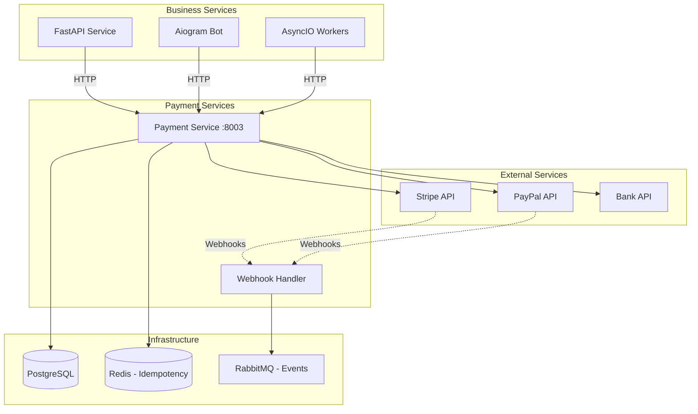

# Payment Gateway Integration

Comprehensive guide for integrating payment gateways (Stripe, PayPal, and others) in microservices architecture following the Improved Hybrid Approach.

## Overview

Payment integration requires secure handling of sensitive financial data, compliance with PCI standards, and reliable transaction processing. This guide covers integration patterns that maintain service separation while ensuring security and reliability.

## Architecture Pattern

Payment processing follows the data service pattern where payment operations are centralized in dedicated services while business services handle the orchestration.



## Stripe Integration

### 1. Stripe Service Implementation

```python
# src/services/payment/stripe_service.py
import stripe
from typing import Dict, Any, Optional, List
from decimal import Decimal
from datetime import datetime
import httpx
from src.core.config import settings
from src.core.logging import get_logger
from src.core.exceptions import PaymentError, PaymentValidationError

logger = get_logger(__name__)

class StripeService:
    """Stripe payment service implementation."""

    def __init__(self):
        stripe.api_key = settings.stripe_secret_key
        self.webhook_secret = settings.stripe_webhook_secret
        self.currency = settings.default_currency or "usd"

    async def create_payment_intent(
        self,
        amount: Decimal,
        currency: str = None,
        customer_id: Optional[str] = None,
        metadata: Dict[str, Any] = None,
        payment_method_types: List[str] = None
    ) -> Dict[str, Any]:
        """Create Stripe Payment Intent."""
        try:
            # Convert amount to cents (Stripe expects smallest currency unit)
            amount_cents = int(amount * 100)

            payment_intent_data = {
                "amount": amount_cents,
                "currency": currency or self.currency,
                "payment_method_types": payment_method_types or ["card"],
                "metadata": metadata or {}
            }

            if customer_id:
                payment_intent_data["customer"] = customer_id

            payment_intent = stripe.PaymentIntent.create(**payment_intent_data)

            logger.info(f"Created Stripe Payment Intent: {payment_intent.id}")

            return {
                "payment_intent_id": payment_intent.id,
                "client_secret": payment_intent.client_secret,
                "amount": amount,
                "currency": payment_intent.currency,
                "status": payment_intent.status,
                "payment_methods": payment_intent.payment_method_types
            }

        except stripe.error.CardError as e:
            logger.error(f"Stripe card error: {e}")
            raise PaymentError(f"Card error: {e.user_message}")
        except stripe.error.RateLimitError as e:
            logger.error(f"Stripe rate limit error: {e}")
            raise PaymentError("Payment service temporarily unavailable")
        except stripe.error.InvalidRequestError as e:
            logger.error(f"Stripe invalid request: {e}")
            raise PaymentValidationError(f"Invalid payment request: {e.user_message}")
        except stripe.error.AuthenticationError as e:
            logger.error(f"Stripe authentication error: {e}")
            raise PaymentError("Payment service configuration error")
        except stripe.error.StripeError as e:
            logger.error(f"Stripe error: {e}")
            raise PaymentError("Payment processing error")

    async def confirm_payment_intent(
        self,
        payment_intent_id: str,
        payment_method_id: str
    ) -> Dict[str, Any]:
        """Confirm Stripe Payment Intent."""
        try:
            payment_intent = stripe.PaymentIntent.confirm(
                payment_intent_id,
                payment_method=payment_method_id
            )

            logger.info(f"Confirmed Stripe Payment Intent: {payment_intent_id}")

            return {
                "payment_intent_id": payment_intent.id,
                "status": payment_intent.status,
                "amount": Decimal(payment_intent.amount) / 100,
                "currency": payment_intent.currency,
                "charges": [self._format_charge(charge) for charge in payment_intent.charges.data]
            }

        except stripe.error.StripeError as e:
            logger.error(f"Stripe confirmation error: {e}")
            raise PaymentError(f"Payment confirmation failed: {e.user_message}")

    async def create_customer(
        self,
        email: str,
        name: Optional[str] = None,
        metadata: Dict[str, Any] = None
    ) -> Dict[str, Any]:
        """Create Stripe customer."""
        try:
            customer_data = {
                "email": email,
                "metadata": metadata or {}
            }

            if name:
                customer_data["name"] = name

            customer = stripe.Customer.create(**customer_data)

            logger.info(f"Created Stripe customer: {customer.id}")

            return {
                "customer_id": customer.id,
                "email": customer.email,
                "name": customer.name,
                "created": datetime.fromtimestamp(customer.created)
            }

        except stripe.error.StripeError as e:
            logger.error(f"Stripe customer creation error: {e}")
            raise PaymentError(f"Customer creation failed: {e.user_message}")

    async def create_subscription(
        self,
        customer_id: str,
        price_id: str,
        metadata: Dict[str, Any] = None,
        trial_period_days: Optional[int] = None
    ) -> Dict[str, Any]:
        """Create Stripe subscription."""
        try:
            subscription_data = {
                "customer": customer_id,
                "items": [{"price": price_id}],
                "metadata": metadata or {}
            }

            if trial_period_days:
                subscription_data["trial_period_days"] = trial_period_days

            subscription = stripe.Subscription.create(**subscription_data)

            logger.info(f"Created Stripe subscription: {subscription.id}")

            return {
                "subscription_id": subscription.id,
                "customer_id": subscription.customer,
                "status": subscription.status,
                "current_period_start": datetime.fromtimestamp(subscription.current_period_start),
                "current_period_end": datetime.fromtimestamp(subscription.current_period_end),
                "trial_end": datetime.fromtimestamp(subscription.trial_end) if subscription.trial_end else None
            }

        except stripe.error.StripeError as e:
            logger.error(f"Stripe subscription creation error: {e}")
            raise PaymentError(f"Subscription creation failed: {e.user_message}")

    async def cancel_subscription(
        self,
        subscription_id: str,
        at_period_end: bool = True
    ) -> Dict[str, Any]:
        """Cancel Stripe subscription."""
        try:
            if at_period_end:
                subscription = stripe.Subscription.modify(
                    subscription_id,
                    cancel_at_period_end=True
                )
            else:
                subscription = stripe.Subscription.delete(subscription_id)

            logger.info(f"Cancelled Stripe subscription: {subscription_id}")

            return {
                "subscription_id": subscription.id,
                "status": subscription.status,
                "canceled_at": datetime.fromtimestamp(subscription.canceled_at) if subscription.canceled_at else None,
                "cancel_at_period_end": subscription.cancel_at_period_end
            }

        except stripe.error.StripeError as e:
            logger.error(f"Stripe subscription cancellation error: {e}")
            raise PaymentError(f"Subscription cancellation failed: {e.user_message}")

    async def refund_payment(
        self,
        payment_intent_id: str,
        amount: Optional[Decimal] = None,
        reason: str = "requested_by_customer"
    ) -> Dict[str, Any]:
        """Refund Stripe payment."""
        try:
            refund_data = {
                "payment_intent": payment_intent_id,
                "reason": reason
            }

            if amount:
                refund_data["amount"] = int(amount * 100)

            refund = stripe.Refund.create(**refund_data)

            logger.info(f"Created Stripe refund: {refund.id}")

            return {
                "refund_id": refund.id,
                "payment_intent_id": refund.payment_intent,
                "amount": Decimal(refund.amount) / 100,
                "currency": refund.currency,
                "status": refund.status,
                "reason": refund.reason
            }

        except stripe.error.StripeError as e:
            logger.error(f"Stripe refund error: {e}")
            raise PaymentError(f"Refund failed: {e.user_message}")

    def verify_webhook_signature(
        self,
        payload: bytes,
        signature: str
    ) -> Dict[str, Any]:
        """Verify Stripe webhook signature."""
        try:
            event = stripe.Webhook.construct_event(
                payload, signature, self.webhook_secret
            )
            return event
        except ValueError as e:
            logger.error(f"Invalid Stripe webhook payload: {e}")
            raise PaymentError("Invalid webhook payload")
        except stripe.error.SignatureVerificationError as e:
            logger.error(f"Invalid Stripe webhook signature: {e}")
            raise PaymentError("Invalid webhook signature")

    def _format_charge(self, charge) -> Dict[str, Any]:
        """Format Stripe charge data."""
        return {
            "charge_id": charge.id,
            "amount": Decimal(charge.amount) / 100,
            "currency": charge.currency,
            "status": charge.status,
            "payment_method": charge.payment_method,
            "receipt_url": charge.receipt_url,
            "created": datetime.fromtimestamp(charge.created)
        }

# Dependency injection
def get_stripe_service() -> StripeService:
    return StripeService()
```

### 2. Payment API Endpoints

```python
# src/api/payments.py
from fastapi import APIRouter, Depends, HTTPException, status, Request
from decimal import Decimal
from typing import Dict, Any, Optional
from src.services.payment.stripe_service import StripeService, get_stripe_service
from src.core.auth import get_current_active_user
from src.core.models import CurrentUser
from src.core.schemas import (
    PaymentIntentCreate,
    PaymentIntentResponse,
    CustomerCreate,
    CustomerResponse,
    SubscriptionCreate,
    SubscriptionResponse,
    RefundCreate,
    RefundResponse
)
from src.core.logging import get_logger

logger = get_logger(__name__)
router = APIRouter(prefix="/payments", tags=["payments"])

@router.post("/intents", response_model=PaymentIntentResponse)
async def create_payment_intent(
    payment_data: PaymentIntentCreate,
    current_user: CurrentUser = Depends(get_current_active_user),
    stripe_service: StripeService = Depends(get_stripe_service)
):
    """Create a payment intent."""
    try:
        # Add user ID to metadata for tracking
        metadata = payment_data.metadata or {}
        metadata["user_id"] = current_user.id

        result = await stripe_service.create_payment_intent(
            amount=payment_data.amount,
            currency=payment_data.currency,
            customer_id=payment_data.customer_id,
            metadata=metadata,
            payment_method_types=payment_data.payment_method_types
        )

        logger.info(f"Created payment intent for user {current_user.id}: {result['payment_intent_id']}")

        return PaymentIntentResponse(**result)

    except Exception as e:
        logger.error(f"Payment intent creation failed for user {current_user.id}: {e}")
        raise HTTPException(
            status_code=status.HTTP_400_BAD_REQUEST,
            detail=str(e)
        )

@router.post("/intents/{payment_intent_id}/confirm", response_model=PaymentIntentResponse)
async def confirm_payment_intent(
    payment_intent_id: str,
    payment_method_id: str,
    current_user: CurrentUser = Depends(get_current_active_user),
    stripe_service: StripeService = Depends(get_stripe_service)
):
    """Confirm a payment intent."""
    try:
        result = await stripe_service.confirm_payment_intent(
            payment_intent_id=payment_intent_id,
            payment_method_id=payment_method_id
        )

        logger.info(f"Confirmed payment intent for user {current_user.id}: {payment_intent_id}")

        return PaymentIntentResponse(**result)

    except Exception as e:
        logger.error(f"Payment confirmation failed for user {current_user.id}: {e}")
        raise HTTPException(
            status_code=status.HTTP_400_BAD_REQUEST,
            detail=str(e)
        )

@router.post("/customers", response_model=CustomerResponse)
async def create_customer(
    customer_data: CustomerCreate,
    current_user: CurrentUser = Depends(get_current_active_user),
    stripe_service: StripeService = Depends(get_stripe_service)
):
    """Create a Stripe customer."""
    try:
        metadata = customer_data.metadata or {}
        metadata["user_id"] = current_user.id

        result = await stripe_service.create_customer(
            email=customer_data.email,
            name=customer_data.name,
            metadata=metadata
        )

        logger.info(f"Created Stripe customer for user {current_user.id}: {result['customer_id']}")

        return CustomerResponse(**result)

    except Exception as e:
        logger.error(f"Customer creation failed for user {current_user.id}: {e}")
        raise HTTPException(
            status_code=status.HTTP_400_BAD_REQUEST,
            detail=str(e)
        )

@router.post("/subscriptions", response_model=SubscriptionResponse)
async def create_subscription(
    subscription_data: SubscriptionCreate,
    current_user: CurrentUser = Depends(get_current_active_user),
    stripe_service: StripeService = Depends(get_stripe_service)
):
    """Create a subscription."""
    try:
        metadata = subscription_data.metadata or {}
        metadata["user_id"] = current_user.id

        result = await stripe_service.create_subscription(
            customer_id=subscription_data.customer_id,
            price_id=subscription_data.price_id,
            metadata=metadata,
            trial_period_days=subscription_data.trial_period_days
        )

        logger.info(f"Created subscription for user {current_user.id}: {result['subscription_id']}")

        return SubscriptionResponse(**result)

    except Exception as e:
        logger.error(f"Subscription creation failed for user {current_user.id}: {e}")
        raise HTTPException(
            status_code=status.HTTP_400_BAD_REQUEST,
            detail=str(e)
        )

@router.delete("/subscriptions/{subscription_id}")
async def cancel_subscription(
    subscription_id: str,
    at_period_end: bool = True,
    current_user: CurrentUser = Depends(get_current_active_user),
    stripe_service: StripeService = Depends(get_stripe_service)
):
    """Cancel a subscription."""
    try:
        result = await stripe_service.cancel_subscription(
            subscription_id=subscription_id,
            at_period_end=at_period_end
        )

        logger.info(f"Cancelled subscription for user {current_user.id}: {subscription_id}")

        return result

    except Exception as e:
        logger.error(f"Subscription cancellation failed for user {current_user.id}: {e}")
        raise HTTPException(
            status_code=status.HTTP_400_BAD_REQUEST,
            detail=str(e)
        )

@router.post("/refunds", response_model=RefundResponse)
async def create_refund(
    refund_data: RefundCreate,
    current_user: CurrentUser = Depends(get_current_active_user),
    stripe_service: StripeService = Depends(get_stripe_service)
):
    """Create a refund."""
    try:
        result = await stripe_service.refund_payment(
            payment_intent_id=refund_data.payment_intent_id,
            amount=refund_data.amount,
            reason=refund_data.reason
        )

        logger.info(f"Created refund for user {current_user.id}: {result['refund_id']}")

        return RefundResponse(**result)

    except Exception as e:
        logger.error(f"Refund creation failed for user {current_user.id}: {e}")
        raise HTTPException(
            status_code=status.HTTP_400_BAD_REQUEST,
            detail=str(e)
        )
```

### 3. Stripe Webhook Handler

```python
# src/api/webhooks/stripe.py
from fastapi import APIRouter, Request, HTTPException, status, Depends
from fastapi.responses import Response
import json
from src.services.payment.stripe_service import StripeService, get_stripe_service
from src.core.events import EventPublisher, get_event_publisher
from src.core.logging import get_logger

logger = get_logger(__name__)
router = APIRouter(prefix="/webhooks/stripe", tags=["stripe-webhooks"])

@router.post("/")
async def stripe_webhook(
    request: Request,
    stripe_service: StripeService = Depends(get_stripe_service),
    event_publisher: EventPublisher = Depends(get_event_publisher)
):
    """Handle Stripe webhooks."""
    payload = await request.body()
    signature = request.headers.get("stripe-signature")

    if not signature:
        logger.error("Missing Stripe webhook signature")
        raise HTTPException(
            status_code=status.HTTP_400_BAD_REQUEST,
            detail="Missing webhook signature"
        )

    try:
        # Verify webhook signature
        event = stripe_service.verify_webhook_signature(payload, signature)

        logger.info(f"Received Stripe webhook: {event['type']} - {event['id']}")

        # Handle different event types
        await handle_stripe_event(event, event_publisher)

        return Response(status_code=200, content="OK")

    except Exception as e:
        logger.error(f"Stripe webhook processing failed: {e}")
        raise HTTPException(
            status_code=status.HTTP_400_BAD_REQUEST,
            detail="Webhook processing failed"
        )

async def handle_stripe_event(event: dict, event_publisher: EventPublisher):
    """Handle specific Stripe event types."""
    event_type = event["type"]
    event_data = event["data"]["object"]

    handlers = {
        "payment_intent.succeeded": handle_payment_succeeded,
        "payment_intent.payment_failed": handle_payment_failed,
        "customer.subscription.created": handle_subscription_created,
        "customer.subscription.updated": handle_subscription_updated,
        "customer.subscription.deleted": handle_subscription_deleted,
        "invoice.payment_succeeded": handle_invoice_paid,
        "invoice.payment_failed": handle_invoice_failed
    }

    handler = handlers.get(event_type)
    if handler:
        await handler(event_data, event_publisher)
    else:
        logger.warning(f"Unhandled Stripe event type: {event_type}")

async def handle_payment_succeeded(payment_data: dict, event_publisher: EventPublisher):
    """Handle successful payment."""
    payment_event = {
        "event_type": "payment.succeeded",
        "payment_intent_id": payment_data["id"],
        "amount": payment_data["amount"] / 100,
        "currency": payment_data["currency"],
        "customer_id": payment_data.get("customer"),
        "metadata": payment_data.get("metadata", {}),
        "timestamp": datetime.utcnow().isoformat()
    }

    await event_publisher.publish("payment.succeeded", payment_event)
    logger.info(f"Published payment succeeded event: {payment_data['id']}")

async def handle_payment_failed(payment_data: dict, event_publisher: EventPublisher):
    """Handle failed payment."""
    payment_event = {
        "event_type": "payment.failed",
        "payment_intent_id": payment_data["id"],
        "amount": payment_data["amount"] / 100,
        "currency": payment_data["currency"],
        "customer_id": payment_data.get("customer"),
        "last_payment_error": payment_data.get("last_payment_error"),
        "metadata": payment_data.get("metadata", {}),
        "timestamp": datetime.utcnow().isoformat()
    }

    await event_publisher.publish("payment.failed", payment_event)
    logger.info(f"Published payment failed event: {payment_data['id']}")

async def handle_subscription_created(subscription_data: dict, event_publisher: EventPublisher):
    """Handle subscription creation."""
    subscription_event = {
        "event_type": "subscription.created",
        "subscription_id": subscription_data["id"],
        "customer_id": subscription_data["customer"],
        "status": subscription_data["status"],
        "current_period_start": subscription_data["current_period_start"],
        "current_period_end": subscription_data["current_period_end"],
        "metadata": subscription_data.get("metadata", {}),
        "timestamp": datetime.utcnow().isoformat()
    }

    await event_publisher.publish("subscription.created", subscription_event)
    logger.info(f"Published subscription created event: {subscription_data['id']}")
```

## PayPal Integration

### 1. PayPal Service Implementation

```python
# src/services/payment/paypal_service.py
import httpx
from typing import Dict, Any, Optional
from decimal import Decimal
from datetime import datetime, timedelta
from src.core.config import settings
from src.core.logging import get_logger
from src.core.exceptions import PaymentError, PaymentValidationError

logger = get_logger(__name__)

class PayPalService:
    """PayPal payment service implementation."""

    def __init__(self):
        self.client_id = settings.paypal_client_id
        self.client_secret = settings.paypal_client_secret
        self.base_url = settings.paypal_base_url  # sandbox or live
        self.access_token = None
        self.token_expires_at = None

    async def _get_access_token(self) -> str:
        """Get PayPal access token."""
        if self.access_token and self.token_expires_at > datetime.utcnow():
            return self.access_token

        auth = httpx.BasicAuth(self.client_id, self.client_secret)
        headers = {
            "Accept": "application/json",
            "Accept-Language": "en_US",
        }
        data = {"grant_type": "client_credentials"}

        async with httpx.AsyncClient() as client:
            try:
                response = await client.post(
                    f"{self.base_url}/v1/oauth2/token",
                    auth=auth,
                    headers=headers,
                    data=data
                )
                response.raise_for_status()

                token_data = response.json()
                self.access_token = token_data["access_token"]
                expires_in = token_data["expires_in"]
                self.token_expires_at = datetime.utcnow() + timedelta(seconds=expires_in - 60)

                logger.info("Retrieved PayPal access token")
                return self.access_token

            except httpx.HTTPStatusError as e:
                logger.error(f"PayPal authentication failed: {e}")
                raise PaymentError("PayPal authentication failed")

    async def _make_request(
        self,
        method: str,
        endpoint: str,
        data: Optional[Dict] = None,
        headers: Optional[Dict] = None
    ) -> Dict[str, Any]:
        """Make authenticated request to PayPal API."""
        access_token = await self._get_access_token()

        request_headers = {
            "Content-Type": "application/json",
            "Authorization": f"Bearer {access_token}",
        }
        if headers:
            request_headers.update(headers)

        async with httpx.AsyncClient() as client:
            try:
                response = await client.request(
                    method=method,
                    url=f"{self.base_url}{endpoint}",
                    json=data,
                    headers=request_headers
                )
                response.raise_for_status()
                return response.json()

            except httpx.HTTPStatusError as e:
                logger.error(f"PayPal API error: {e.response.text}")
                raise PaymentError(f"PayPal API error: {e.response.status_code}")

    async def create_order(
        self,
        amount: Decimal,
        currency: str = "USD",
        description: str = "Payment",
        return_url: str = None,
        cancel_url: str = None
    ) -> Dict[str, Any]:
        """Create PayPal order."""
        order_data = {
            "intent": "CAPTURE",
            "purchase_units": [
                {
                    "amount": {
                        "currency_code": currency,
                        "value": str(amount)
                    },
                    "description": description
                }
            ],
            "payment_source": {
                "paypal": {
                    "experience_context": {
                        "payment_method_preference": "IMMEDIATE_PAYMENT_REQUIRED",
                        "brand_name": settings.app_name,
                        "locale": "en-US",
                        "landing_page": "LOGIN",
                        "shipping_preference": "NO_SHIPPING",
                        "user_action": "PAY_NOW"
                    }
                }
            }
        }

        if return_url and cancel_url:
            order_data["payment_source"]["paypal"]["experience_context"].update({
                "return_url": return_url,
                "cancel_url": cancel_url
            })

        try:
            response = await self._make_request("POST", "/v2/checkout/orders", order_data)

            logger.info(f"Created PayPal order: {response['id']}")

            return {
                "order_id": response["id"],
                "status": response["status"],
                "amount": amount,
                "currency": currency,
                "approval_url": self._get_approval_url(response["links"]),
                "capture_url": self._get_capture_url(response["links"])
            }

        except Exception as e:
            logger.error(f"PayPal order creation failed: {e}")
            raise PaymentError(f"PayPal order creation failed: {str(e)}")

    async def capture_order(self, order_id: str) -> Dict[str, Any]:
        """Capture PayPal order."""
        try:
            response = await self._make_request(
                "POST",
                f"/v2/checkout/orders/{order_id}/capture"
            )

            logger.info(f"Captured PayPal order: {order_id}")

            capture_data = response["purchase_units"][0]["payments"]["captures"][0]

            return {
                "order_id": response["id"],
                "capture_id": capture_data["id"],
                "status": capture_data["status"],
                "amount": Decimal(capture_data["amount"]["value"]),
                "currency": capture_data["amount"]["currency_code"],
                "create_time": capture_data["create_time"],
                "update_time": capture_data["update_time"]
            }

        except Exception as e:
            logger.error(f"PayPal order capture failed: {e}")
            raise PaymentError(f"PayPal order capture failed: {str(e)}")

    async def refund_capture(
        self,
        capture_id: str,
        amount: Optional[Decimal] = None,
        currency: str = "USD",
        note: str = "Refund"
    ) -> Dict[str, Any]:
        """Refund PayPal capture."""
        refund_data = {
            "note_to_payer": note
        }

        if amount:
            refund_data["amount"] = {
                "value": str(amount),
                "currency_code": currency
            }

        try:
            response = await self._make_request(
                "POST",
                f"/v2/payments/captures/{capture_id}/refund",
                refund_data
            )

            logger.info(f"Created PayPal refund: {response['id']}")

            return {
                "refund_id": response["id"],
                "capture_id": capture_id,
                "status": response["status"],
                "amount": Decimal(response["amount"]["value"]),
                "currency": response["amount"]["currency_code"],
                "create_time": response["create_time"],
                "update_time": response["update_time"]
            }

        except Exception as e:
            logger.error(f"PayPal refund failed: {e}")
            raise PaymentError(f"PayPal refund failed: {str(e)}")

    def _get_approval_url(self, links: list) -> Optional[str]:
        """Extract approval URL from PayPal response links."""
        for link in links:
            if link["rel"] == "approve":
                return link["href"]
        return None

    def _get_capture_url(self, links: list) -> Optional[str]:
        """Extract capture URL from PayPal response links."""
        for link in links:
            if link["rel"] == "capture":
                return link["href"]
        return None

# Dependency injection
def get_paypal_service() -> PayPalService:
    return PayPalService()
```

## Payment Service Orchestration

### 1. Payment Manager

```python
# src/services/payment/payment_manager.py
from typing import Dict, Any, Optional, Literal
from decimal import Decimal
from src.services.payment.stripe_service import StripeService
from src.services.payment.paypal_service import PayPalService
from src.core.config import settings
from src.core.logging import get_logger
from src.core.exceptions import PaymentError

logger = get_logger(__name__)

PaymentProvider = Literal["stripe", "paypal"]

class PaymentManager:
    """Centralized payment management across multiple providers."""

    def __init__(self):
        self.stripe = StripeService()
        self.paypal = PayPalService()
        self.default_provider = settings.default_payment_provider or "stripe"

    async def create_payment(
        self,
        amount: Decimal,
        currency: str = "USD",
        provider: PaymentProvider = None,
        customer_id: Optional[str] = None,
        description: str = "Payment",
        metadata: Dict[str, Any] = None
    ) -> Dict[str, Any]:
        """Create payment with specified or default provider."""
        provider = provider or self.default_provider

        try:
            if provider == "stripe":
                result = await self.stripe.create_payment_intent(
                    amount=amount,
                    currency=currency.lower(),
                    customer_id=customer_id,
                    metadata=metadata
                )
                result["provider"] = "stripe"
                return result

            elif provider == "paypal":
                result = await self.paypal.create_order(
                    amount=amount,
                    currency=currency.upper(),
                    description=description
                )
                result["provider"] = "paypal"
                return result

            else:
                raise PaymentError(f"Unsupported payment provider: {provider}")

        except Exception as e:
            logger.error(f"Payment creation failed with {provider}: {e}")
            raise

    async def capture_payment(
        self,
        payment_id: str,
        provider: PaymentProvider,
        payment_method_id: Optional[str] = None
    ) -> Dict[str, Any]:
        """Capture payment with specified provider."""
        try:
            if provider == "stripe":
                if not payment_method_id:
                    raise PaymentError("Payment method ID required for Stripe")

                result = await self.stripe.confirm_payment_intent(
                    payment_intent_id=payment_id,
                    payment_method_id=payment_method_id
                )
                result["provider"] = "stripe"
                return result

            elif provider == "paypal":
                result = await self.paypal.capture_order(order_id=payment_id)
                result["provider"] = "paypal"
                return result

            else:
                raise PaymentError(f"Unsupported payment provider: {provider}")

        except Exception as e:
            logger.error(f"Payment capture failed with {provider}: {e}")
            raise

    async def refund_payment(
        self,
        payment_id: str,
        provider: PaymentProvider,
        amount: Optional[Decimal] = None,
        reason: str = "requested_by_customer"
    ) -> Dict[str, Any]:
        """Refund payment with specified provider."""
        try:
            if provider == "stripe":
                result = await self.stripe.refund_payment(
                    payment_intent_id=payment_id,
                    amount=amount,
                    reason=reason
                )
                result["provider"] = "stripe"
                return result

            elif provider == "paypal":
                result = await self.paypal.refund_capture(
                    capture_id=payment_id,
                    amount=amount,
                    note=reason
                )
                result["provider"] = "paypal"
                return result

            else:
                raise PaymentError(f"Unsupported payment provider: {provider}")

        except Exception as e:
            logger.error(f"Payment refund failed with {provider}: {e}")
            raise

# Dependency injection
def get_payment_manager() -> PaymentManager:
    return PaymentManager()
```

## Security and Compliance

### 1. PCI Compliance Patterns

```python
# src/core/pci_compliance.py
from typing import Any, Dict
import re
from src.core.logging import get_logger

logger = get_logger(__name__)

class PCIComplianceHelper:
    """Helper for PCI DSS compliance."""

    @staticmethod
    def mask_card_number(card_number: str) -> str:
        """Mask credit card number for logging/display."""
        # Remove non-digits
        digits_only = re.sub(r'\D', '', card_number)

        if len(digits_only) < 6:
            return "*" * len(digits_only)

        # Show first 4 and last 4 digits
        return f"{digits_only[:4]}{'*' * (len(digits_only) - 8)}{digits_only[-4:]}"

    @staticmethod
    def sanitize_payment_data(data: Dict[str, Any]) -> Dict[str, Any]:
        """Remove sensitive payment data from logs/responses."""
        sensitive_fields = {
            "card_number", "cvv", "cvc", "card_code", "security_code",
            "expiry_month", "expiry_year", "exp_month", "exp_year",
            "account_number", "routing_number", "ssn", "tax_id"
        }

        sanitized = data.copy()

        for key, value in data.items():
            if key.lower() in sensitive_fields:
                if key.lower() == "card_number" and isinstance(value, str):
                    sanitized[key] = PCIComplianceHelper.mask_card_number(value)
                else:
                    sanitized[key] = "***REDACTED***"

        return sanitized

    @staticmethod
    def validate_card_number(card_number: str) -> bool:
        """Validate credit card number using Luhn algorithm."""
        # Remove non-digits
        digits = re.sub(r'\D', '', card_number)

        if not digits or len(digits) < 13 or len(digits) > 19:
            return False

        # Luhn algorithm
        checksum = 0
        even_position = False

        for digit in reversed(digits):
            n = int(digit)
            if even_position:
                n *= 2
                if n > 9:
                    n = n // 10 + n % 10
            checksum += n
            even_position = not even_position

        return checksum % 10 == 0

    @staticmethod
    def log_payment_event(event_type: str, data: Dict[str, Any]):
        """Log payment event with PCI compliance."""
        sanitized_data = PCIComplianceHelper.sanitize_payment_data(data)
        logger.info(f"Payment event: {event_type}", extra={"data": sanitized_data})
```

## Testing Payment Integration

### 1. Payment Service Tests

```python
# tests/test_payment_integration.py
import pytest
from decimal import Decimal
from unittest.mock import Mock, patch, AsyncMock
from src.services.payment.stripe_service import StripeService
from src.services.payment.paypal_service import PayPalService
from src.services.payment.payment_manager import PaymentManager
from src.core.exceptions import PaymentError

class TestStripeIntegration:
    """Test Stripe payment integration."""

    @pytest.fixture
    def stripe_service(self):
        return StripeService()

    @pytest.mark.asyncio
    async def test_create_payment_intent_success(self, stripe_service):
        """Test successful payment intent creation."""
        with patch('stripe.PaymentIntent.create') as mock_create:
            mock_create.return_value = Mock(
                id="pi_test_123",
                client_secret="pi_test_123_secret_test",
                amount=2000,
                currency="usd",
                status="requires_payment_method",
                payment_method_types=["card"]
            )

            result = await stripe_service.create_payment_intent(
                amount=Decimal("20.00"),
                currency="usd"
            )

            assert result["payment_intent_id"] == "pi_test_123"
            assert result["amount"] == Decimal("20.00")
            assert result["currency"] == "usd"

    @pytest.mark.asyncio
    async def test_create_payment_intent_card_error(self, stripe_service):
        """Test payment intent creation with card error."""
        import stripe

        with patch('stripe.PaymentIntent.create') as mock_create:
            mock_create.side_effect = stripe.error.CardError(
                message="Your card was declined.",
                param="card",
                code="card_declined"
            )

            with pytest.raises(PaymentError) as exc_info:
                await stripe_service.create_payment_intent(
                    amount=Decimal("20.00"),
                    currency="usd"
                )

            assert "Card error" in str(exc_info.value)

    @pytest.mark.asyncio
    async def test_webhook_signature_verification(self, stripe_service):
        """Test webhook signature verification."""
        payload = b'{"test": "data"}'
        signature = "test_signature"

        with patch('stripe.Webhook.construct_event') as mock_construct:
            mock_construct.return_value = {"type": "payment_intent.succeeded"}

            result = stripe_service.verify_webhook_signature(payload, signature)

            assert result["type"] == "payment_intent.succeeded"
            mock_construct.assert_called_once_with(
                payload, signature, stripe_service.webhook_secret
            )

class TestPayPalIntegration:
    """Test PayPal payment integration."""

    @pytest.fixture
    def paypal_service(self):
        return PayPalService()

    @pytest.mark.asyncio
    async def test_get_access_token(self, paypal_service):
        """Test PayPal access token retrieval."""
        with patch('httpx.AsyncClient') as mock_client:
            mock_response = Mock()
            mock_response.json.return_value = {
                "access_token": "test_token",
                "expires_in": 3600
            }
            mock_response.raise_for_status.return_value = None

            mock_client.return_value.__aenter__.return_value.post = AsyncMock(
                return_value=mock_response
            )

            token = await paypal_service._get_access_token()

            assert token == "test_token"
            assert paypal_service.access_token == "test_token"

    @pytest.mark.asyncio
    async def test_create_order_success(self, paypal_service):
        """Test successful PayPal order creation."""
        with patch.object(paypal_service, '_make_request') as mock_request:
            mock_request.return_value = {
                "id": "order_123",
                "status": "CREATED",
                "links": [
                    {"rel": "approve", "href": "https://paypal.com/approve"},
                    {"rel": "capture", "href": "https://api.paypal.com/capture"}
                ]
            }

            result = await paypal_service.create_order(
                amount=Decimal("25.00"),
                currency="USD"
            )

            assert result["order_id"] == "order_123"
            assert result["amount"] == Decimal("25.00")
            assert "paypal.com/approve" in result["approval_url"]

class TestPaymentManager:
    """Test payment manager orchestration."""

    @pytest.fixture
    def payment_manager(self):
        return PaymentManager()

    @pytest.mark.asyncio
    async def test_create_payment_stripe(self, payment_manager):
        """Test payment creation with Stripe."""
        with patch.object(payment_manager.stripe, 'create_payment_intent') as mock_create:
            mock_create.return_value = {
                "payment_intent_id": "pi_test_123",
                "amount": Decimal("30.00"),
                "currency": "usd"
            }

            result = await payment_manager.create_payment(
                amount=Decimal("30.00"),
                provider="stripe"
            )

            assert result["provider"] == "stripe"
            assert result["payment_intent_id"] == "pi_test_123"

    @pytest.mark.asyncio
    async def test_create_payment_paypal(self, payment_manager):
        """Test payment creation with PayPal."""
        with patch.object(payment_manager.paypal, 'create_order') as mock_create:
            mock_create.return_value = {
                "order_id": "order_123",
                "amount": Decimal("30.00"),
                "currency": "USD"
            }

            result = await payment_manager.create_payment(
                amount=Decimal("30.00"),
                provider="paypal"
            )

            assert result["provider"] == "paypal"
            assert result["order_id"] == "order_123"

    @pytest.mark.asyncio
    async def test_unsupported_provider(self, payment_manager):
        """Test error handling for unsupported provider."""
        with pytest.raises(PaymentError) as exc_info:
            await payment_manager.create_payment(
                amount=Decimal("30.00"),
                provider="unsupported"
            )

        assert "Unsupported payment provider" in str(exc_info.value)

class TestPCICompliance:
    """Test PCI compliance helpers."""

    def test_mask_card_number(self):
        """Test credit card number masking."""
        from src.core.pci_compliance import PCIComplianceHelper

        # Test full card number
        masked = PCIComplianceHelper.mask_card_number("4111111111111111")
        assert masked == "4111********1111"

        # Test short number
        masked = PCIComplianceHelper.mask_card_number("4111")
        assert masked == "****"

    def test_sanitize_payment_data(self):
        """Test payment data sanitization."""
        from src.core.pci_compliance import PCIComplianceHelper

        data = {
            "amount": "100.00",
            "card_number": "4111111111111111",
            "cvv": "123",
            "user_id": "user-123"
        }

        sanitized = PCIComplianceHelper.sanitize_payment_data(data)

        assert sanitized["amount"] == "100.00"
        assert sanitized["card_number"] == "4111********1111"
        assert sanitized["cvv"] == "***REDACTED***"
        assert sanitized["user_id"] == "user-123"

    def test_validate_card_number(self):
        """Test credit card number validation."""
        from src.core.pci_compliance import PCIComplianceHelper

        # Valid Visa test number
        assert PCIComplianceHelper.validate_card_number("4111111111111111") is True

        # Invalid number
        assert PCIComplianceHelper.validate_card_number("4111111111111112") is False

        # Too short
        assert PCIComplianceHelper.validate_card_number("411111") is False
```

## Related Documents

- `docs/atomic/external-integrations/webhook-handling.md` - Webhook processing
- `docs/atomic/external-integrations/api-rate-limiting.md` - Rate limiting patterns
- `docs/atomic/security/authentication-guide.md` - Authentication for payments
- `docs/atomic/services/fastapi/error-handling.md` - Error handling patterns
- `docs/atomic/testing/integration-testing/http-integration-testing.md` - HTTP testing

## Implementation Checklist

### Stripe Integration
- [ ] API key configuration and security
- [ ] Payment Intent creation and confirmation
- [ ] Customer management
- [ ] Subscription handling
- [ ] Webhook signature verification
- [ ] Refund processing
- [ ] Error handling and logging
- [ ] Test mode configuration

### PayPal Integration
- [ ] OAuth2 authentication
- [ ] Order creation and capture
- [ ] Refund processing
- [ ] Webhook handling
- [ ] Error handling and logging
- [ ] Sandbox/production configuration

### Security & Compliance
- [ ] PCI DSS compliance measures
- [ ] Sensitive data sanitization
- [ ] Secure credential storage
- [ ] Card number validation
- [ ] Payment data encryption
- [ ] Audit logging

### Testing
- [ ] Unit tests for payment services
- [ ] Integration tests with test APIs
- [ ] Webhook testing
- [ ] Error scenario testing
- [ ] Security testing
- [ ] PCI compliance validation