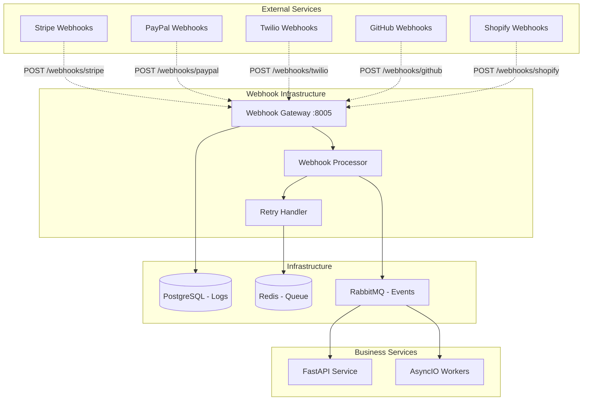

# Webhook Handling

Comprehensive guide for handling webhooks from external services in microservices architecture following the Improved Hybrid Approach.

## Overview

Webhooks enable external services to notify your application about events in real-time. This guide covers secure webhook handling patterns, verification, processing, and error handling while maintaining service reliability and security.

## Architecture Pattern

Webhook handling follows a dedicated service pattern with centralized processing, verification, and event distribution.



## Core Webhook Infrastructure

### 1. Webhook Gateway Service

```python
# src/services/webhooks/webhook_gateway.py
from fastapi import FastAPI, Request, HTTPException, status, BackgroundTasks
from fastapi.responses import Response
from typing import Dict, Any, Optional
import hmac
import hashlib
import json
from datetime import datetime
import uuid6
from src.core.config import settings
from src.core.logging import get_logger
from src.services.webhooks.webhook_processor import WebhookProcessor
from src.services.webhooks.webhook_storage import WebhookStorage
from src.core.exceptions import WebhookError

logger = get_logger(__name__)

class WebhookGateway:
    """Centralized webhook gateway for handling all external webhooks."""

    def __init__(self):
        self.processor = WebhookProcessor()
        self.storage = WebhookStorage()
        self.app = FastAPI(title="Webhook Gateway")
        self.setup_routes()

    def setup_routes(self):
        """Setup webhook routes for different providers."""

        @self.app.post("/webhooks/stripe")
        async def stripe_webhook(request: Request, background_tasks: BackgroundTasks):
            return await self.handle_webhook(
                request=request,
                provider="stripe",
                background_tasks=background_tasks,
                verification_method=self._verify_stripe_signature
            )

        @self.app.post("/webhooks/paypal")
        async def paypal_webhook(request: Request, background_tasks: BackgroundTasks):
            return await self.handle_webhook(
                request=request,
                provider="paypal",
                background_tasks=background_tasks,
                verification_method=self._verify_paypal_signature
            )

        @self.app.post("/webhooks/twilio")
        async def twilio_webhook(request: Request, background_tasks: BackgroundTasks):
            return await self.handle_webhook(
                request=request,
                provider="twilio",
                background_tasks=background_tasks,
                verification_method=self._verify_twilio_signature
            )

        @self.app.post("/webhooks/github")
        async def github_webhook(request: Request, background_tasks: BackgroundTasks):
            return await self.handle_webhook(
                request=request,
                provider="github",
                background_tasks=background_tasks,
                verification_method=self._verify_github_signature
            )

        @self.app.post("/webhooks/shopify")
        async def shopify_webhook(request: Request, background_tasks: BackgroundTasks):
            return await self.handle_webhook(
                request=request,
                provider="shopify",
                background_tasks=background_tasks,
                verification_method=self._verify_shopify_signature
            )

        @self.app.get("/health")
        async def health_check():
            return {"status": "healthy", "service": "webhook-gateway"}

    async def handle_webhook(
        self,
        request: Request,
        provider: str,
        background_tasks: BackgroundTasks,
        verification_method: callable
    ) -> Response:
        """Generic webhook handler with verification and processing."""
        webhook_id = str(uuid6.uuid6())
        start_time = datetime.utcnow()

        try:
            # Get request data
            body = await request.body()
            headers = dict(request.headers)

            # Store raw webhook for audit
            webhook_record = {
                "id": webhook_id,
                "provider": provider,
                "headers": headers,
                "body": body.decode('utf-8'),
                "received_at": start_time.isoformat(),
                "client_ip": request.client.host,
                "status": "received"
            }

            # Verify webhook signature
            if not verification_method(body, headers):
                webhook_record["status"] = "verification_failed"
                await self.storage.store_webhook(webhook_record)

                logger.warning(f"Webhook verification failed for {provider} - {webhook_id}")
                raise HTTPException(
                    status_code=status.HTTP_401_UNAUTHORIZED,
                    detail="Webhook verification failed"
                )

            # Parse JSON payload
            try:
                payload = json.loads(body.decode('utf-8'))
            except json.JSONDecodeError as e:
                webhook_record["status"] = "invalid_json"
                webhook_record["error"] = str(e)
                await self.storage.store_webhook(webhook_record)

                logger.error(f"Invalid JSON in webhook from {provider} - {webhook_id}: {e}")
                raise HTTPException(
                    status_code=status.HTTP_400_BAD_REQUEST,
                    detail="Invalid JSON payload"
                )

            # Update webhook record with parsed data
            webhook_record.update({
                "payload": payload,
                "event_type": self._extract_event_type(provider, payload),
                "status": "verified"
            })

            # Store verified webhook
            await self.storage.store_webhook(webhook_record)

            # Process webhook in background
            background_tasks.add_task(
                self.processor.process_webhook,
                webhook_id=webhook_id,
                provider=provider,
                payload=payload,
                headers=headers
            )

            # Log successful receipt
            processing_time = (datetime.utcnow() - start_time).total_seconds()
            logger.info(
                f"Webhook received from {provider} - {webhook_id} "
                f"({processing_time:.3f}s)"
            )

            return Response(status_code=200, content="OK")

        except HTTPException:
            raise
        except Exception as e:
            webhook_record["status"] = "error"
            webhook_record["error"] = str(e)
            await self.storage.store_webhook(webhook_record)

            logger.error(f"Webhook handling error for {provider} - {webhook_id}: {e}")
            raise HTTPException(
                status_code=status.HTTP_500_INTERNAL_SERVER_ERROR,
                detail="Internal server error"
            )

    def _verify_stripe_signature(self, body: bytes, headers: Dict[str, str]) -> bool:
        """Verify Stripe webhook signature."""
        signature = headers.get("stripe-signature")
        if not signature:
            return False

        try:
            import stripe
            stripe.Webhook.construct_event(
                body, signature, settings.stripe_webhook_secret
            )
            return True
        except Exception as e:
            logger.error(f"Stripe signature verification failed: {e}")
            return False

    def _verify_paypal_signature(self, body: bytes, headers: Dict[str, str]) -> bool:
        """Verify PayPal webhook signature."""
        # PayPal webhook verification implementation
        auth_algo = headers.get("paypal-auth-algo")
        transmission_id = headers.get("paypal-transmission-id")
        cert_id = headers.get("paypal-cert-id")
        transmission_sig = headers.get("paypal-transmission-sig")
        transmission_time = headers.get("paypal-transmission-time")

        # Implement PayPal webhook verification logic
        # This is a simplified version - implement actual verification
        return all([auth_algo, transmission_id, cert_id, transmission_sig, transmission_time])

    def _verify_twilio_signature(self, body: bytes, headers: Dict[str, str]) -> bool:
        """Verify Twilio webhook signature."""
        signature = headers.get("x-twilio-signature")
        if not signature:
            return False

        try:
            from twilio.request_validator import RequestValidator
            validator = RequestValidator(settings.twilio_auth_token)

            # Get full URL (implement based on your setup)
            url = f"{settings.webhook_base_url}/webhooks/twilio"

            return validator.validate(url, body.decode('utf-8'), signature)
        except Exception as e:
            logger.error(f"Twilio signature verification failed: {e}")
            return False

    def _verify_github_signature(self, body: bytes, headers: Dict[str, str]) -> bool:
        """Verify GitHub webhook signature."""
        signature = headers.get("x-hub-signature-256")
        if not signature:
            return False

        try:
            expected_signature = "sha256=" + hmac.new(
                settings.github_webhook_secret.encode(),
                body,
                hashlib.sha256
            ).hexdigest()

            return hmac.compare_digest(signature, expected_signature)
        except Exception as e:
            logger.error(f"GitHub signature verification failed: {e}")
            return False

    def _verify_shopify_signature(self, body: bytes, headers: Dict[str, str]) -> bool:
        """Verify Shopify webhook signature."""
        signature = headers.get("x-shopify-hmac-sha256")
        if not signature:
            return False

        try:
            expected_signature = hmac.new(
                settings.shopify_webhook_secret.encode(),
                body,
                hashlib.sha256
            ).digest()

            import base64
            return hmac.compare_digest(
                signature.encode(),
                base64.b64encode(expected_signature)
            )
        except Exception as e:
            logger.error(f"Shopify signature verification failed: {e}")
            return False

    def _extract_event_type(self, provider: str, payload: Dict[str, Any]) -> Optional[str]:
        """Extract event type from webhook payload."""
        event_type_mappings = {
            "stripe": lambda p: p.get("type"),
            "paypal": lambda p: p.get("event_type"),
            "twilio": lambda p: p.get("StatusCallbackEvent") or p.get("EventType"),
            "github": lambda p: p.get("action"),
            "shopify": lambda p: headers.get("x-shopify-topic")  # From headers
        }

        extractor = event_type_mappings.get(provider)
        return extractor(payload) if extractor else None

# Initialize webhook gateway
webhook_gateway = WebhookGateway()
app = webhook_gateway.app
```

### 2. Webhook Processor

```python
# src/services/webhooks/webhook_processor.py
import asyncio
from typing import Dict, Any, Optional, List
from datetime import datetime, timedelta
import json
from src.core.logging import get_logger
from src.core.events import EventPublisher
from src.services.webhooks.webhook_storage import WebhookStorage
from src.services.webhooks.webhook_handlers import WebhookHandlerRegistry
from src.core.exceptions import WebhookError

logger = get_logger(__name__)

class WebhookProcessor:
    """Process verified webhooks and distribute events."""

    def __init__(self):
        self.storage = WebhookStorage()
        self.event_publisher = EventPublisher()
        self.handler_registry = WebhookHandlerRegistry()
        self.max_retries = 3
        self.retry_delays = [5, 30, 300]  # seconds

    async def process_webhook(
        self,
        webhook_id: str,
        provider: str,
        payload: Dict[str, Any],
        headers: Dict[str, str]
    ) -> None:
        """Process a verified webhook."""
        processing_start = datetime.utcnow()

        try:
            # Update webhook status to processing
            await self.storage.update_webhook_status(
                webhook_id, "processing", processing_start
            )

            # Extract event information
            event_type = self._extract_event_type(provider, payload, headers)
            if not event_type:
                raise WebhookError(f"Cannot determine event type for {provider} webhook")

            # Check for duplicate processing (idempotency)
            if await self._is_duplicate_event(provider, payload):
                logger.info(f"Duplicate webhook detected: {webhook_id} - skipping")
                await self.storage.update_webhook_status(webhook_id, "duplicate")
                return

            # Get appropriate handler
            handler = self.handler_registry.get_handler(provider, event_type)
            if not handler:
                logger.warning(f"No handler found for {provider}.{event_type}")
                await self.storage.update_webhook_status(webhook_id, "no_handler")
                return

            # Process with handler
            result = await handler.handle(payload, headers)

            # Publish internal events if handler returns them
            if result and result.get("events"):
                for event in result["events"]:
                    await self.event_publisher.publish(
                        event["type"],
                        event["data"],
                        correlation_id=webhook_id
                    )

            # Update webhook status to completed
            processing_end = datetime.utcnow()
            processing_time = (processing_end - processing_start).total_seconds()

            await self.storage.update_webhook_status(
                webhook_id,
                "completed",
                processing_end,
                {"processing_time": processing_time, "result": result}
            )

            logger.info(
                f"Webhook processed successfully: {webhook_id} "
                f"({processing_time:.3f}s)"
            )

        except Exception as e:
            # Handle processing error
            await self._handle_processing_error(webhook_id, e)

    async def _is_duplicate_event(
        self,
        provider: str,
        payload: Dict[str, Any]
    ) -> bool:
        """Check if this event has already been processed."""
        # Extract unique event identifier based on provider
        event_id = self._extract_event_id(provider, payload)
        if not event_id:
            return False

        # Check if we've seen this event before
        return await self.storage.check_event_processed(provider, event_id)

    def _extract_event_id(self, provider: str, payload: Dict[str, Any]) -> Optional[str]:
        """Extract unique event ID from payload."""
        id_mappings = {
            "stripe": lambda p: p.get("id"),
            "paypal": lambda p: p.get("id"),
            "twilio": lambda p: p.get("MessageSid") or p.get("CallSid"),
            "github": lambda p: p.get("delivery"),
            "shopify": lambda p: p.get("id")
        }

        extractor = id_mappings.get(provider)
        return str(extractor(payload)) if extractor and extractor(payload) else None

    def _extract_event_type(
        self,
        provider: str,
        payload: Dict[str, Any],
        headers: Dict[str, str]
    ) -> Optional[str]:
        """Extract event type from webhook."""
        type_mappings = {
            "stripe": lambda p, h: p.get("type"),
            "paypal": lambda p, h: p.get("event_type"),
            "twilio": lambda p, h: p.get("StatusCallbackEvent") or p.get("EventType"),
            "github": lambda p, h: h.get("x-github-event"),
            "shopify": lambda p, h: h.get("x-shopify-topic")
        }

        extractor = type_mappings.get(provider)
        return extractor(payload, headers) if extractor else None

    async def _handle_processing_error(self, webhook_id: str, error: Exception) -> None:
        """Handle webhook processing error with retry logic."""
        logger.error(f"Webhook processing failed: {webhook_id} - {error}")

        # Get current retry count
        webhook_data = await self.storage.get_webhook(webhook_id)
        retry_count = webhook_data.get("retry_count", 0)

        if retry_count < self.max_retries:
            # Schedule retry
            retry_delay = self.retry_delays[min(retry_count, len(self.retry_delays) - 1)]
            retry_at = datetime.utcnow() + timedelta(seconds=retry_delay)

            await self.storage.update_webhook_status(
                webhook_id,
                "retry_scheduled",
                metadata={
                    "retry_count": retry_count + 1,
                    "retry_at": retry_at.isoformat(),
                    "error": str(error)
                }
            )

            # Schedule retry (implement based on your task queue)
            await self._schedule_retry(webhook_id, retry_delay)

        else:
            # Max retries exceeded
            await self.storage.update_webhook_status(
                webhook_id,
                "failed",
                metadata={
                    "retry_count": retry_count,
                    "final_error": str(error)
                }
            )

    async def _schedule_retry(self, webhook_id: str, delay_seconds: int) -> None:
        """Schedule webhook retry."""
        # Implement based on your task queue system (Celery, RQ, etc.)
        # For simple cases, you can use asyncio.sleep in a background task
        asyncio.create_task(self._retry_webhook_after_delay(webhook_id, delay_seconds))

    async def _retry_webhook_after_delay(self, webhook_id: str, delay_seconds: int) -> None:
        """Retry webhook processing after delay."""
        await asyncio.sleep(delay_seconds)

        # Get webhook data
        webhook_data = await self.storage.get_webhook(webhook_id)
        if not webhook_data:
            logger.error(f"Webhook not found for retry: {webhook_id}")
            return

        # Retry processing
        await self.process_webhook(
            webhook_id=webhook_id,
            provider=webhook_data["provider"],
            payload=webhook_data["payload"],
            headers=webhook_data["headers"]
        )
```

### 3. Webhook Handlers

```python
# src/services/webhooks/webhook_handlers.py
from abc import ABC, abstractmethod
from typing import Dict, Any, Optional, List
from datetime import datetime
from src.core.logging import get_logger

logger = get_logger(__name__)

class WebhookHandler(ABC):
    """Abstract base class for webhook handlers."""

    @abstractmethod
    async def handle(
        self,
        payload: Dict[str, Any],
        headers: Dict[str, str]
    ) -> Optional[Dict[str, Any]]:
        """Handle webhook payload and return events to publish."""
        pass

class StripeWebhookHandler(WebhookHandler):
    """Handle Stripe webhooks."""

    async def handle(
        self,
        payload: Dict[str, Any],
        headers: Dict[str, str]
    ) -> Optional[Dict[str, Any]]:
        """Handle Stripe webhook events."""
        event_type = payload.get("type")
        event_data = payload.get("data", {}).get("object", {})

        logger.info(f"Processing Stripe event: {event_type}")

        events_to_publish = []

        if event_type == "payment_intent.succeeded":
            events_to_publish.append({
                "type": "payment.completed",
                "data": {
                    "payment_intent_id": event_data.get("id"),
                    "amount": event_data.get("amount", 0) / 100,
                    "currency": event_data.get("currency"),
                    "customer_id": event_data.get("customer"),
                    "metadata": event_data.get("metadata", {}),
                    "provider": "stripe",
                    "timestamp": datetime.utcnow().isoformat()
                }
            })

        elif event_type == "payment_intent.payment_failed":
            events_to_publish.append({
                "type": "payment.failed",
                "data": {
                    "payment_intent_id": event_data.get("id"),
                    "amount": event_data.get("amount", 0) / 100,
                    "currency": event_data.get("currency"),
                    "customer_id": event_data.get("customer"),
                    "failure_reason": event_data.get("last_payment_error", {}).get("message"),
                    "provider": "stripe",
                    "timestamp": datetime.utcnow().isoformat()
                }
            })

        elif event_type == "customer.subscription.created":
            events_to_publish.append({
                "type": "subscription.created",
                "data": {
                    "subscription_id": event_data.get("id"),
                    "customer_id": event_data.get("customer"),
                    "status": event_data.get("status"),
                    "plan_id": event_data.get("items", {}).get("data", [{}])[0].get("price", {}).get("id"),
                    "current_period_start": event_data.get("current_period_start"),
                    "current_period_end": event_data.get("current_period_end"),
                    "provider": "stripe",
                    "timestamp": datetime.utcnow().isoformat()
                }
            })

        elif event_type == "invoice.payment_succeeded":
            events_to_publish.append({
                "type": "invoice.paid",
                "data": {
                    "invoice_id": event_data.get("id"),
                    "subscription_id": event_data.get("subscription"),
                    "customer_id": event_data.get("customer"),
                    "amount_paid": event_data.get("amount_paid", 0) / 100,
                    "currency": event_data.get("currency"),
                    "provider": "stripe",
                    "timestamp": datetime.utcnow().isoformat()
                }
            })

        return {"events": events_to_publish} if events_to_publish else None

class TwilioWebhookHandler(WebhookHandler):
    """Handle Twilio webhooks."""

    async def handle(
        self,
        payload: Dict[str, Any],
        headers: Dict[str, str]
    ) -> Optional[Dict[str, Any]]:
        """Handle Twilio webhook events."""
        logger.info(f"Processing Twilio webhook: {payload}")

        events_to_publish = []

        # SMS Status callbacks
        if "MessageSid" in payload and "MessageStatus" in payload:
            events_to_publish.append({
                "type": "sms.status_update",
                "data": {
                    "message_sid": payload.get("MessageSid"),
                    "status": payload.get("MessageStatus"),
                    "to": payload.get("To"),
                    "from": payload.get("From"),
                    "error_code": payload.get("ErrorCode"),
                    "error_message": payload.get("ErrorMessage"),
                    "provider": "twilio",
                    "timestamp": datetime.utcnow().isoformat()
                }
            })

        # Call status callbacks
        elif "CallSid" in payload and "CallStatus" in payload:
            events_to_publish.append({
                "type": "call.status_update",
                "data": {
                    "call_sid": payload.get("CallSid"),
                    "status": payload.get("CallStatus"),
                    "to": payload.get("To"),
                    "from": payload.get("From"),
                    "duration": payload.get("CallDuration"),
                    "provider": "twilio",
                    "timestamp": datetime.utcnow().isoformat()
                }
            })

        return {"events": events_to_publish} if events_to_publish else None

class GitHubWebhookHandler(WebhookHandler):
    """Handle GitHub webhooks."""

    async def handle(
        self,
        payload: Dict[str, Any],
        headers: Dict[str, str]
    ) -> Optional[Dict[str, Any]]:
        """Handle GitHub webhook events."""
        event_type = headers.get("x-github-event")
        action = payload.get("action")

        logger.info(f"Processing GitHub event: {event_type}.{action}")

        events_to_publish = []

        if event_type == "push":
            events_to_publish.append({
                "type": "git.push",
                "data": {
                    "repository": payload.get("repository", {}).get("full_name"),
                    "ref": payload.get("ref"),
                    "commits": len(payload.get("commits", [])),
                    "pusher": payload.get("pusher", {}).get("name"),
                    "head_commit": payload.get("head_commit", {}).get("id"),
                    "timestamp": datetime.utcnow().isoformat()
                }
            })

        elif event_type == "pull_request":
            events_to_publish.append({
                "type": f"pull_request.{action}",
                "data": {
                    "repository": payload.get("repository", {}).get("full_name"),
                    "pr_number": payload.get("pull_request", {}).get("number"),
                    "title": payload.get("pull_request", {}).get("title"),
                    "author": payload.get("pull_request", {}).get("user", {}).get("login"),
                    "base_branch": payload.get("pull_request", {}).get("base", {}).get("ref"),
                    "head_branch": payload.get("pull_request", {}).get("head", {}).get("ref"),
                    "timestamp": datetime.utcnow().isoformat()
                }
            })

        elif event_type == "issues" and action in ["opened", "closed"]:
            events_to_publish.append({
                "type": f"issue.{action}",
                "data": {
                    "repository": payload.get("repository", {}).get("full_name"),
                    "issue_number": payload.get("issue", {}).get("number"),
                    "title": payload.get("issue", {}).get("title"),
                    "author": payload.get("issue", {}).get("user", {}).get("login"),
                    "labels": [label.get("name") for label in payload.get("issue", {}).get("labels", [])],
                    "timestamp": datetime.utcnow().isoformat()
                }
            })

        return {"events": events_to_publish} if events_to_publish else None

class ShopifyWebhookHandler(WebhookHandler):
    """Handle Shopify webhooks."""

    async def handle(
        self,
        payload: Dict[str, Any],
        headers: Dict[str, str]
    ) -> Optional[Dict[str, Any]]:
        """Handle Shopify webhook events."""
        topic = headers.get("x-shopify-topic")
        shop_domain = headers.get("x-shopify-shop-domain")

        logger.info(f"Processing Shopify event: {topic} from {shop_domain}")

        events_to_publish = []

        if topic == "orders/create":
            events_to_publish.append({
                "type": "order.created",
                "data": {
                    "order_id": payload.get("id"),
                    "order_number": payload.get("order_number"),
                    "customer_id": payload.get("customer", {}).get("id"),
                    "total_price": float(payload.get("total_price", 0)),
                    "currency": payload.get("currency"),
                    "line_items_count": len(payload.get("line_items", [])),
                    "shop_domain": shop_domain,
                    "timestamp": datetime.utcnow().isoformat()
                }
            })

        elif topic == "orders/paid":
            events_to_publish.append({
                "type": "order.paid",
                "data": {
                    "order_id": payload.get("id"),
                    "order_number": payload.get("order_number"),
                    "total_price": float(payload.get("total_price", 0)),
                    "currency": payload.get("currency"),
                    "financial_status": payload.get("financial_status"),
                    "shop_domain": shop_domain,
                    "timestamp": datetime.utcnow().isoformat()
                }
            })

        elif topic == "customers/create":
            events_to_publish.append({
                "type": "customer.created",
                "data": {
                    "customer_id": payload.get("id"),
                    "email": payload.get("email"),
                    "first_name": payload.get("first_name"),
                    "last_name": payload.get("last_name"),
                    "orders_count": payload.get("orders_count", 0),
                    "shop_domain": shop_domain,
                    "timestamp": datetime.utcnow().isoformat()
                }
            })

        return {"events": events_to_publish} if events_to_publish else None

class WebhookHandlerRegistry:
    """Registry for webhook handlers."""

    def __init__(self):
        self.handlers = {
            "stripe": StripeWebhookHandler(),
            "twilio": TwilioWebhookHandler(),
            "github": GitHubWebhookHandler(),
            "shopify": ShopifyWebhookHandler(),
        }

    def get_handler(self, provider: str, event_type: str) -> Optional[WebhookHandler]:
        """Get appropriate handler for provider and event type."""
        return self.handlers.get(provider)

    def register_handler(self, provider: str, handler: WebhookHandler) -> None:
        """Register custom webhook handler."""
        self.handlers[provider] = handler
```

### 4. Webhook Storage

```python
# src/services/webhooks/webhook_storage.py
from typing import Dict, Any, Optional, List
from datetime import datetime, timedelta
import asyncpg
import redis.asyncio as redis
import json
from src.core.config import settings
from src.core.logging import get_logger

logger = get_logger(__name__)

class WebhookStorage:
    """Storage layer for webhook data and processing state."""

    def __init__(self):
        self.redis_client = redis.from_url(settings.redis_url)

    async def store_webhook(self, webhook_data: Dict[str, Any]) -> None:
        """Store webhook data."""
        webhook_id = webhook_data["id"]

        # Store in Redis for fast access (with TTL)
        redis_key = f"webhook:{webhook_id}"
        await self.redis_client.setex(
            redis_key,
            timedelta(days=7),  # Keep for 7 days
            json.dumps(webhook_data, default=str)
        )

        # Store in PostgreSQL for permanent audit log
        await self._store_webhook_in_postgres(webhook_data)

        logger.debug(f"Stored webhook: {webhook_id}")

    async def get_webhook(self, webhook_id: str) -> Optional[Dict[str, Any]]:
        """Get webhook data by ID."""
        # Try Redis first
        redis_key = f"webhook:{webhook_id}"
        redis_data = await self.redis_client.get(redis_key)

        if redis_data:
            return json.loads(redis_data)

        # Fallback to PostgreSQL
        return await self._get_webhook_from_postgres(webhook_id)

    async def update_webhook_status(
        self,
        webhook_id: str,
        status: str,
        updated_at: Optional[datetime] = None,
        metadata: Optional[Dict[str, Any]] = None
    ) -> None:
        """Update webhook processing status."""
        if updated_at is None:
            updated_at = datetime.utcnow()

        # Update Redis
        redis_key = f"webhook:{webhook_id}"
        webhook_data = await self.get_webhook(webhook_id)

        if webhook_data:
            webhook_data.update({
                "status": status,
                "updated_at": updated_at.isoformat()
            })

            if metadata:
                webhook_data.setdefault("metadata", {}).update(metadata)

            await self.redis_client.setex(
                redis_key,
                timedelta(days=7),
                json.dumps(webhook_data, default=str)
            )

        # Update PostgreSQL
        await self._update_webhook_in_postgres(webhook_id, status, updated_at, metadata)

        logger.debug(f"Updated webhook status: {webhook_id} -> {status}")

    async def check_event_processed(self, provider: str, event_id: str) -> bool:
        """Check if event has already been processed (idempotency)."""
        redis_key = f"processed_event:{provider}:{event_id}"
        exists = await self.redis_client.exists(redis_key)

        if not exists:
            # Mark as seen for 24 hours
            await self.redis_client.setex(redis_key, timedelta(hours=24), "1")
            return False

        return True

    async def get_webhook_statistics(
        self,
        provider: Optional[str] = None,
        start_date: Optional[datetime] = None,
        end_date: Optional[datetime] = None
    ) -> Dict[str, Any]:
        """Get webhook processing statistics."""
        # This would query PostgreSQL for statistics
        # Implementation depends on your specific needs
        return await self._get_webhook_stats_from_postgres(provider, start_date, end_date)

    async def _store_webhook_in_postgres(self, webhook_data: Dict[str, Any]) -> None:
        """Store webhook in PostgreSQL."""
        query = """
        INSERT INTO webhooks (
            id, provider, event_type, status, headers, payload,
            received_at, client_ip, created_at
        ) VALUES ($1, $2, $3, $4, $5, $6, $7, $8, $9)
        """

        async with asyncpg.create_pool(settings.postgres_url) as pool:
            async with pool.acquire() as conn:
                await conn.execute(
                    query,
                    webhook_data["id"],
                    webhook_data["provider"],
                    webhook_data.get("event_type"),
                    webhook_data["status"],
                    json.dumps(webhook_data["headers"]),
                    json.dumps(webhook_data.get("payload")),
                    webhook_data["received_at"],
                    webhook_data.get("client_ip"),
                    datetime.utcnow()
                )

    async def _get_webhook_from_postgres(self, webhook_id: str) -> Optional[Dict[str, Any]]:
        """Get webhook from PostgreSQL."""
        query = """
        SELECT id, provider, event_type, status, headers, payload,
               received_at, client_ip, created_at, updated_at, metadata
        FROM webhooks WHERE id = $1
        """

        async with asyncpg.create_pool(settings.postgres_url) as pool:
            async with pool.acquire() as conn:
                row = await conn.fetchrow(query, webhook_id)

                if row:
                    return {
                        "id": row["id"],
                        "provider": row["provider"],
                        "event_type": row["event_type"],
                        "status": row["status"],
                        "headers": json.loads(row["headers"]) if row["headers"] else {},
                        "payload": json.loads(row["payload"]) if row["payload"] else {},
                        "received_at": row["received_at"].isoformat() if row["received_at"] else None,
                        "client_ip": row["client_ip"],
                        "created_at": row["created_at"].isoformat() if row["created_at"] else None,
                        "updated_at": row["updated_at"].isoformat() if row["updated_at"] else None,
                        "metadata": json.loads(row["metadata"]) if row["metadata"] else {}
                    }

        return None

    async def _update_webhook_in_postgres(
        self,
        webhook_id: str,
        status: str,
        updated_at: datetime,
        metadata: Optional[Dict[str, Any]]
    ) -> None:
        """Update webhook in PostgreSQL."""
        query = """
        UPDATE webhooks
        SET status = $2, updated_at = $3, metadata = $4
        WHERE id = $1
        """

        async with asyncpg.create_pool(settings.postgres_url) as pool:
            async with pool.acquire() as conn:
                await conn.execute(
                    query,
                    webhook_id,
                    status,
                    updated_at,
                    json.dumps(metadata) if metadata else None
                )

    async def _get_webhook_stats_from_postgres(
        self,
        provider: Optional[str],
        start_date: Optional[datetime],
        end_date: Optional[datetime]
    ) -> Dict[str, Any]:
        """Get webhook statistics from PostgreSQL."""
        conditions = []
        params = []

        if provider:
            conditions.append(f"provider = ${len(params) + 1}")
            params.append(provider)

        if start_date:
            conditions.append(f"received_at >= ${len(params) + 1}")
            params.append(start_date)

        if end_date:
            conditions.append(f"received_at <= ${len(params) + 1}")
            params.append(end_date)

        where_clause = "WHERE " + " AND ".join(conditions) if conditions else ""

        query = f"""
        SELECT
            provider,
            status,
            COUNT(*) as count,
            AVG(EXTRACT(EPOCH FROM (updated_at - received_at))) as avg_processing_time
        FROM webhooks
        {where_clause}
        GROUP BY provider, status
        ORDER BY provider, status
        """

        async with asyncpg.create_pool(settings.postgres_url) as pool:
            async with pool.acquire() as conn:
                rows = await conn.fetch(query, *params)

                stats = {}
                for row in rows:
                    provider_name = row["provider"]
                    if provider_name not in stats:
                        stats[provider_name] = {}

                    stats[provider_name][row["status"]] = {
                        "count": row["count"],
                        "avg_processing_time": float(row["avg_processing_time"]) if row["avg_processing_time"] else None
                    }

                return stats
```

## Webhook Security Patterns

### 1. Rate Limiting and DDoS Protection

```python
# src/middleware/webhook_security.py
from fastapi import Request, HTTPException, status
from fastapi.responses import Response
import time
from typing import Dict, Any
import redis.asyncio as redis
from src.core.config import settings
from src.core.logging import get_logger

logger = get_logger(__name__)

class WebhookSecurityMiddleware:
    """Security middleware for webhook endpoints."""

    def __init__(self):
        self.redis = redis.from_url(settings.redis_url)
        self.rate_limit_window = 60  # seconds
        self.rate_limit_max_requests = 100  # per window
        self.ddos_threshold = 500  # requests per minute

    async def __call__(self, request: Request, call_next):
        """Apply security checks to webhook requests."""

        # Skip security checks for non-webhook endpoints
        if not request.url.path.startswith("/webhooks/"):
            return await call_next(request)

        client_ip = request.client.host
        current_time = int(time.time())

        try:
            # DDoS protection
            if await self._check_ddos_protection(client_ip, current_time):
                logger.warning(f"DDoS protection triggered for IP: {client_ip}")
                raise HTTPException(
                    status_code=status.HTTP_429_TOO_MANY_REQUESTS,
                    detail="Rate limit exceeded"
                )

            # Rate limiting per IP
            if await self._check_rate_limit(client_ip, current_time):
                logger.warning(f"Rate limit exceeded for IP: {client_ip}")
                raise HTTPException(
                    status_code=status.HTTP_429_TOO_MANY_REQUESTS,
                    detail="Rate limit exceeded"
                )

            # Request size validation
            content_length = request.headers.get("content-length")
            if content_length and int(content_length) > settings.webhook_max_body_size:
                logger.warning(f"Webhook body too large from IP: {client_ip}")
                raise HTTPException(
                    status_code=status.HTTP_413_REQUEST_ENTITY_TOO_LARGE,
                    detail="Request body too large"
                )

            # Process request
            response = await call_next(request)

            # Log successful webhook
            await self._log_webhook_request(client_ip, request.url.path, response.status_code)

            return response

        except HTTPException:
            raise
        except Exception as e:
            logger.error(f"Webhook security middleware error: {e}")
            raise HTTPException(
                status_code=status.HTTP_500_INTERNAL_SERVER_ERROR,
                detail="Internal server error"
            )

    async def _check_rate_limit(self, client_ip: str, current_time: int) -> bool:
        """Check rate limiting for client IP."""
        window_start = current_time - (current_time % self.rate_limit_window)
        redis_key = f"webhook_rate_limit:{client_ip}:{window_start}"

        # Get current request count
        request_count = await self.redis.get(redis_key)
        if request_count is None:
            request_count = 0
        else:
            request_count = int(request_count)

        # Check if limit exceeded
        if request_count >= self.rate_limit_max_requests:
            return True

        # Increment counter
        pipe = self.redis.pipeline()
        pipe.incr(redis_key)
        pipe.expire(redis_key, self.rate_limit_window)
        await pipe.execute()

        return False

    async def _check_ddos_protection(self, client_ip: str, current_time: int) -> bool:
        """Check DDoS protection."""
        minute = current_time - (current_time % 60)
        redis_key = f"webhook_ddos:{client_ip}:{minute}"

        request_count = await self.redis.get(redis_key)
        if request_count is None:
            request_count = 0
        else:
            request_count = int(request_count)

        if request_count >= self.ddos_threshold:
            return True

        # Track request
        pipe = self.redis.pipeline()
        pipe.incr(redis_key)
        pipe.expire(redis_key, 60)
        await pipe.execute()

        return False

    async def _log_webhook_request(self, client_ip: str, path: str, status_code: int) -> None:
        """Log webhook request for monitoring."""
        log_data = {
            "client_ip": client_ip,
            "path": path,
            "status_code": status_code,
            "timestamp": time.time()
        }

        # Store in Redis for recent activity monitoring
        redis_key = f"webhook_log:{int(time.time())}"
        await self.redis.setex(redis_key, 3600, str(log_data))  # Keep for 1 hour
```

### 2. Webhook Monitoring and Alerting

```python
# src/services/webhooks/webhook_monitor.py
from typing import Dict, Any, List
from datetime import datetime, timedelta
import asyncio
from src.services.webhooks.webhook_storage import WebhookStorage
from src.core.alerts import AlertManager
from src.core.logging import get_logger

logger = get_logger(__name__)

class WebhookMonitor:
    """Monitor webhook health and performance."""

    def __init__(self):
        self.storage = WebhookStorage()
        self.alert_manager = AlertManager()
        self.monitoring_interval = 300  # 5 minutes

    async def start_monitoring(self) -> None:
        """Start webhook monitoring loop."""
        logger.info("Starting webhook monitoring")

        while True:
            try:
                await self._check_webhook_health()
                await asyncio.sleep(self.monitoring_interval)
            except Exception as e:
                logger.error(f"Webhook monitoring error: {e}")
                await asyncio.sleep(60)  # Wait before retrying

    async def _check_webhook_health(self) -> None:
        """Check webhook processing health."""
        end_time = datetime.utcnow()
        start_time = end_time - timedelta(minutes=15)

        # Get recent webhook statistics
        stats = await self.storage.get_webhook_statistics(
            start_date=start_time,
            end_date=end_time
        )

        # Check for issues
        await self._check_error_rates(stats)
        await self._check_processing_delays(stats)
        await self._check_missing_webhooks()

    async def _check_error_rates(self, stats: Dict[str, Any]) -> None:
        """Check for high error rates."""
        for provider, provider_stats in stats.items():
            total_webhooks = sum(status_data["count"] for status_data in provider_stats.values())
            failed_webhooks = provider_stats.get("failed", {}).get("count", 0)

            if total_webhooks > 0:
                error_rate = failed_webhooks / total_webhooks

                if error_rate > 0.1:  # 10% error rate threshold
                    await self.alert_manager.send_alert(
                        title=f"High webhook error rate for {provider}",
                        message=f"Error rate: {error_rate:.2%} ({failed_webhooks}/{total_webhooks})",
                        severity="warning"
                    )

                if error_rate > 0.3:  # 30% error rate threshold
                    await self.alert_manager.send_alert(
                        title=f"Critical webhook error rate for {provider}",
                        message=f"Error rate: {error_rate:.2%} ({failed_webhooks}/{total_webhooks})",
                        severity="critical"
                    )

    async def _check_processing_delays(self, stats: Dict[str, Any]) -> None:
        """Check for processing delays."""
        for provider, provider_stats in stats.items():
            completed_stats = provider_stats.get("completed", {})
            avg_processing_time = completed_stats.get("avg_processing_time")

            if avg_processing_time and avg_processing_time > 30:  # 30 seconds threshold
                await self.alert_manager.send_alert(
                    title=f"Slow webhook processing for {provider}",
                    message=f"Average processing time: {avg_processing_time:.2f} seconds",
                    severity="warning"
                )

    async def _check_missing_webhooks(self) -> None:
        """Check for missing expected webhooks."""
        # This would implement provider-specific checks
        # For example, checking if we haven't received any Stripe webhooks in the last hour
        # when we expect regular activity
        pass
```

## Testing Webhook Handling

### 1. Webhook Handler Tests

```python
# tests/test_webhook_handling.py
import pytest
import json
import hmac
import hashlib
from unittest.mock import Mock, patch, AsyncMock
from fastapi.testclient import TestClient
from src.services.webhooks.webhook_gateway import webhook_gateway
from src.services.webhooks.webhook_handlers import StripeWebhookHandler, TwilioWebhookHandler

class TestWebhookGateway:
    """Test webhook gateway functionality."""

    @pytest.fixture
    def client(self):
        return TestClient(webhook_gateway.app)

    def test_stripe_webhook_success(self, client):
        """Test successful Stripe webhook processing."""
        payload = {
            "id": "evt_test_webhook",
            "type": "payment_intent.succeeded",
            "data": {
                "object": {
                    "id": "pi_test_123",
                    "amount": 2000,
                    "currency": "usd",
                    "customer": "cus_test_123"
                }
            }
        }

        # Create valid Stripe signature
        payload_json = json.dumps(payload)
        timestamp = "1234567890"
        signed_payload = f"{timestamp}.{payload_json}"
        signature = hmac.new(
            "test_webhook_secret".encode(),
            signed_payload.encode(),
            hashlib.sha256
        ).hexdigest()

        stripe_signature = f"t={timestamp},v1={signature}"

        with patch("src.services.webhooks.webhook_gateway.WebhookProcessor.process_webhook") as mock_process:
            response = client.post(
                "/webhooks/stripe",
                json=payload,
                headers={"stripe-signature": stripe_signature}
            )

            assert response.status_code == 200
            mock_process.assert_called_once()

    def test_webhook_invalid_signature(self, client):
        """Test webhook with invalid signature."""
        payload = {"test": "data"}

        response = client.post(
            "/webhooks/stripe",
            json=payload,
            headers={"stripe-signature": "invalid_signature"}
        )

        assert response.status_code == 401

    def test_webhook_missing_signature(self, client):
        """Test webhook without signature header."""
        payload = {"test": "data"}

        response = client.post("/webhooks/stripe", json=payload)

        assert response.status_code == 401

    def test_webhook_invalid_json(self, client):
        """Test webhook with invalid JSON."""
        with patch("src.services.webhooks.webhook_gateway.WebhookGateway._verify_stripe_signature", return_value=True):
            response = client.post(
                "/webhooks/stripe",
                data="invalid json",
                headers={
                    "stripe-signature": "valid_signature",
                    "content-type": "application/json"
                }
            )

            assert response.status_code == 400

class TestWebhookHandlers:
    """Test webhook handlers."""

    @pytest.mark.asyncio
    async def test_stripe_payment_succeeded_handler(self):
        """Test Stripe payment succeeded handler."""
        handler = StripeWebhookHandler()

        payload = {
            "type": "payment_intent.succeeded",
            "data": {
                "object": {
                    "id": "pi_test_123",
                    "amount": 2000,
                    "currency": "usd",
                    "customer": "cus_test_123",
                    "metadata": {"order_id": "order_123"}
                }
            }
        }

        result = await handler.handle(payload, {})

        assert result is not None
        assert len(result["events"]) == 1

        event = result["events"][0]
        assert event["type"] == "payment.completed"
        assert event["data"]["payment_intent_id"] == "pi_test_123"
        assert event["data"]["amount"] == 20.0  # Converted from cents
        assert event["data"]["currency"] == "usd"

    @pytest.mark.asyncio
    async def test_twilio_sms_status_handler(self):
        """Test Twilio SMS status handler."""
        handler = TwilioWebhookHandler()

        payload = {
            "MessageSid": "SM123456789",
            "MessageStatus": "delivered",
            "To": "+1234567890",
            "From": "+0987654321"
        }

        result = await handler.handle(payload, {})

        assert result is not None
        assert len(result["events"]) == 1

        event = result["events"][0]
        assert event["type"] == "sms.status_update"
        assert event["data"]["message_sid"] == "SM123456789"
        assert event["data"]["status"] == "delivered"

    @pytest.mark.asyncio
    async def test_handler_no_events(self):
        """Test handler that produces no events."""
        handler = StripeWebhookHandler()

        payload = {
            "type": "unknown_event_type",
            "data": {"object": {}}
        }

        result = await handler.handle(payload, {})

        assert result is None

class TestWebhookSecurity:
    """Test webhook security features."""

    def test_rate_limiting(self, client):
        """Test webhook rate limiting."""
        # This would test the rate limiting middleware
        # Implementation depends on your specific rate limiting logic
        pass

    def test_request_size_validation(self, client):
        """Test webhook request size validation."""
        # Test with very large payload
        large_payload = {"data": "x" * 1000000}  # 1MB payload

        with patch("src.services.webhooks.webhook_gateway.WebhookGateway._verify_stripe_signature", return_value=True):
            response = client.post(
                "/webhooks/stripe",
                json=large_payload,
                headers={"stripe-signature": "valid_signature"}
            )

            # Should be rejected if payload is too large
            assert response.status_code in [413, 400]

class TestWebhookStorage:
    """Test webhook storage functionality."""

    @pytest.mark.asyncio
    async def test_webhook_storage_and_retrieval(self):
        """Test storing and retrieving webhook data."""
        from src.services.webhooks.webhook_storage import WebhookStorage

        storage = WebhookStorage()

        webhook_data = {
            "id": "test_webhook_123",
            "provider": "stripe",
            "status": "received",
            "headers": {"content-type": "application/json"},
            "payload": {"test": "data"},
            "received_at": "2023-01-01T00:00:00Z"
        }

        # Store webhook
        await storage.store_webhook(webhook_data)

        # Retrieve webhook
        retrieved = await storage.get_webhook("test_webhook_123")

        assert retrieved is not None
        assert retrieved["id"] == "test_webhook_123"
        assert retrieved["provider"] == "stripe"

    @pytest.mark.asyncio
    async def test_webhook_status_update(self):
        """Test webhook status updates."""
        from src.services.webhooks.webhook_storage import WebhookStorage

        storage = WebhookStorage()

        # First store a webhook
        webhook_data = {
            "id": "test_webhook_456",
            "provider": "stripe",
            "status": "received",
            "received_at": "2023-01-01T00:00:00Z"
        }

        await storage.store_webhook(webhook_data)

        # Update status
        await storage.update_webhook_status(
            "test_webhook_456",
            "completed",
            metadata={"processing_time": 1.5}
        )

        # Verify update
        updated = await storage.get_webhook("test_webhook_456")
        assert updated["status"] == "completed"
        assert updated["metadata"]["processing_time"] == 1.5

    @pytest.mark.asyncio
    async def test_duplicate_event_detection(self):
        """Test duplicate event detection."""
        from src.services.webhooks.webhook_storage import WebhookStorage

        storage = WebhookStorage()

        # First check should return False (not duplicate)
        is_duplicate_1 = await storage.check_event_processed("stripe", "evt_123")
        assert is_duplicate_1 is False

        # Second check should return True (duplicate)
        is_duplicate_2 = await storage.check_event_processed("stripe", "evt_123")
        assert is_duplicate_2 is True
```

## Related Documents

- `docs/atomic/external-integrations/payment-gateways.md` - Payment webhooks
- `docs/atomic/external-integrations/communication-apis.md` - Communication webhooks
- `docs/atomic/external-integrations/api-rate-limiting.md` - Rate limiting patterns
- `docs/atomic/security/authentication-guide.md` - Webhook authentication
- `docs/atomic/testing/integration-testing/http-integration-testing.md` - HTTP testing

## Implementation Checklist

### Webhook Gateway
- [ ] Centralized webhook endpoint setup
- [ ] Provider-specific routing
- [ ] Request size validation
- [ ] Health check endpoint
- [ ] Error handling and logging
- [ ] Background task processing
- [ ] Audit trail storage

### Security & Verification
- [ ] Signature verification for each provider
- [ ] Rate limiting per IP
- [ ] DDoS protection
- [ ] Request size limits
- [ ] HTTPS enforcement
- [ ] Security headers
- [ ] IP whitelisting (optional)

### Processing & Reliability
- [ ] Idempotency handling
- [ ] Retry mechanisms with exponential backoff
- [ ] Dead letter queue for failed webhooks
- [ ] Event publishing to internal services
- [ ] Processing status tracking
- [ ] Webhook replay capability

### Monitoring & Alerting
- [ ] Processing success/failure rates
- [ ] Processing time monitoring
- [ ] Error rate alerting
- [ ] Missing webhook detection
- [ ] Performance metrics
- [ ] Dashboard integration

### Testing
- [ ] Unit tests for all handlers
- [ ] Integration tests with test webhooks
- [ ] Security testing
- [ ] Load testing
- [ ] Signature verification testing
- [ ] Error scenario testing