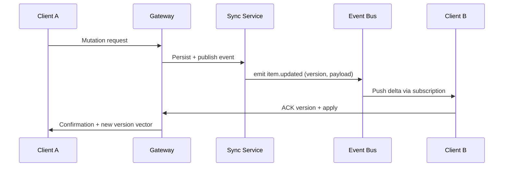

# Real-Time Synchronization Patterns

Comprehensive patterns for maintaining data consistency across clients and services in real-time environments, including conflict resolution, offline support, and monitoring strategies.

## Synchronization Architecture

### Core Components

1. **Change Event Producer** — emits domain events for each mutation (CRUD, state transitions).
2. **Event Bus** — Kafka, NATS, or Redis Streams delivering events with ordering guarantees.
3. **Presence & State Service** — tracks active sessions, device metadata, and version vectors.
4. **Sync Gateways** — WebSocket/SSE workers delivering delta updates to clients.
5. **Conflict Resolver** — service responsible for deterministic merge policies.

### Data Flow Overview



## Versioning Strategies

### Vector Clocks

- Maintain per-entity vector clock with `{device_id: counter}` pairs.
- Detect concurrent updates when vectors are incomparable.
- Resolve via server-side merge or client prompt.

### Lamport Timestamps

- Suitable for single-writer flows (e.g., collaborative cursors).
- Increment global counter per mutation; break ties with writer ID.

### CRDT Structures

Use Conflict-free Replicated Data Types for collaborative data models:

- **GCounter / PN-Counter** — aggregated counters.
- **LWW-Element-Set** — presence/absence with last-write-wins timestamps.
- **RGA / LSEQ** — ordered collaborative text editing.

```python
from dataclasses import dataclass, field
from typing import Dict, Tuple
from enum import Enum
import time

class Operation(Enum):
    ADD = "add"
    REMOVE = "remove"

@dataclass
class LWWElementSet:
    add_set: Dict[str, Tuple[float, dict]] = field(default_factory=dict)
    remove_set: Dict[str, float] = field(default_factory=dict)

    def add(self, element_id: str, payload: dict) -> None:
        self.add_set[element_id] = (time.time(), payload)

    def remove(self, element_id: str) -> None:
        self.remove_set[element_id] = time.time()

    def lookup(self, element_id: str) -> bool:
        add_ts, _ = self.add_set.get(element_id, (0, {}))
        remove_ts = self.remove_set.get(element_id, 0)
        return add_ts > remove_ts

    def values(self) -> dict:
        return {
            element_id: payload
            for element_id, (timestamp, payload) in self.add_set.items()
            if timestamp > self.remove_set.get(element_id, 0)
        }
```

## Offline-First Synchronization

### Client-Side Strategies

- Persist pending mutations in local queue (IndexedDB, SQLite).
- Assign temporary IDs and map to server IDs post-sync.
- Implement exponential backoff with jitter for retries.
- Display optimistic UI state with reconciliation indicators.

### Server Reconciliation Endpoint

```python
from fastapi import APIRouter, Depends
from pydantic import BaseModel
from datetime import datetime
from typing import List

router = APIRouter(prefix="/sync", tags=["sync"])

class Mutation(BaseModel):
    temp_id: str
    entity_id: str | None
    operation: str
    payload: dict
    version: str
    occurred_at: datetime

class SyncRequest(BaseModel):
    device_id: str
    last_ack_version: str | None
    mutations: List[Mutation]

@router.post("/reconcile")
async def reconcile_changes(request: SyncRequest):
    # 1. Validate device + auth context
    # 2. Apply mutations sequentially, capturing conflicts
    # 3. Generate authoritative versions
    # 4. Return resolved state + new checkpoints
    return {
        "applied": [],
        "conflicts": [],
        "checkpoint": "2024-03-01T12:00:00Z"
    }
```

## Conflict Resolution Policies

- **Last write wins** — default for idempotent fields (timestamps, statuses).
- **Merge by intent** — combine list modifications, dedupe unique IDs.
- **Domain-specific resolution** — use business rules (e.g., higher priority role assignments win).
- **Human-in-the-loop** — queue unresolved conflicts for manual review.

## Observability & Monitoring

- Emit `sync.latency` and `sync.backlog` metrics per tenant/device.
- Track reconciliation failure rate; alert when >2%.
- Log version vectors and conflict reasons for root-cause analysis.
- Use synthetic clients to test end-to-end sync under packet loss.

## Testing Strategy

- Unit test CRDT operations with randomized property-based tests.
- Replay production traffic in staging to validate determinism.
- Chaos testing: introduce artificial latency, dropped packets, and partitioned networks.
- Contract tests for client SDK (Android/iOS/Web) to ensure protocol compatibility.

## Runbook Checklist

- [ ] Document sync protocol versioning and backward compatibility.
- [ ] Automate client upgrade prompts when protocol changes.
- [ ] Maintain idempotent mutation handlers with dedupe keys.
- [ ] Backup event logs for rehydration and auditing.
- [ ] Synthetic monitoring covering cold start and reconnect scenarios.
