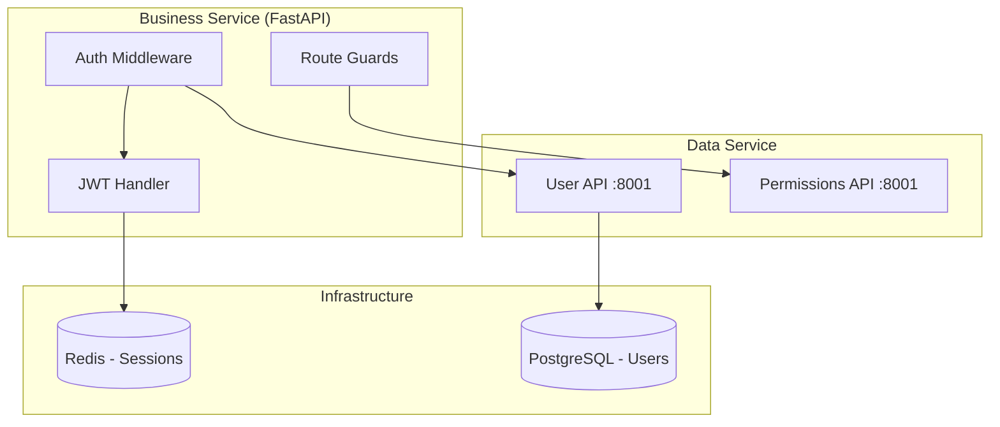

# Authentication & Authorization Guide

Complete authentication and authorization implementation guide for FastAPI services in the Improved Hybrid Approach.

## Architecture Overview

Authentication and authorization follow the service separation principles where business services handle auth logic while data services manage user credentials and permissions.



## JWT Implementation with FastAPI

### 1. Dependencies Setup

```python
# src/core/dependencies.py
from fastapi import Depends, HTTPException, status
from fastapi.security import HTTPBearer, HTTPAuthorizationCredentials
from jose import JWTError, jwt
from datetime import datetime, timedelta
import redis.asyncio as redis
from src.core.config import settings
from src.core.models import CurrentUser

security = HTTPBearer()

async def get_redis() -> redis.Redis:
    """Get Redis connection for token management."""
    return redis.from_url(settings.redis_url)

class AuthService:
    def __init__(self, redis_client: redis.Redis):
        self.redis = redis_client
        self.algorithm = "HS256"
        self.secret_key = settings.secret_key
        self.access_token_expire = timedelta(minutes=settings.access_token_expire_minutes)
        self.refresh_token_expire = timedelta(days=7)

    async def create_access_token(self, user_id: str, scopes: list[str] = None) -> str:
        """Create JWT access token with user scopes."""
        to_encode = {
            "sub": user_id,
            "scopes": scopes or [],
            "exp": datetime.utcnow() + self.access_token_expire,
            "iat": datetime.utcnow(),
            "type": "access"
        }
        return jwt.encode(to_encode, self.secret_key, algorithm=self.algorithm)

    async def create_refresh_token(self, user_id: str) -> str:
        """Create refresh token and store in Redis."""
        token_data = {
            "sub": user_id,
            "exp": datetime.utcnow() + self.refresh_token_expire,
            "iat": datetime.utcnow(),
            "type": "refresh"
        }
        token = jwt.encode(token_data, self.secret_key, algorithm=self.algorithm)

        # Store refresh token in Redis
        await self.redis.setex(
            f"refresh_token:{user_id}",
            self.refresh_token_expire,
            token
        )
        return token

    async def verify_token(self, token: str) -> dict:
        """Verify and decode JWT token."""
        try:
            payload = jwt.decode(token, self.secret_key, algorithms=[self.algorithm])
            user_id = payload.get("sub")
            if user_id is None:
                raise HTTPException(
                    status_code=status.HTTP_401_UNAUTHORIZED,
                    detail="Invalid token"
                )
            return payload
        except JWTError:
            raise HTTPException(
                status_code=status.HTTP_401_UNAUTHORIZED,
                detail="Invalid token"
            )

    async def revoke_token(self, user_id: str) -> None:
        """Revoke refresh token by removing from Redis."""
        await self.redis.delete(f"refresh_token:{user_id}")

async def get_auth_service(redis_client: redis.Redis = Depends(get_redis)) -> AuthService:
    """Dependency to get AuthService instance."""
    return AuthService(redis_client)
```

### 2. User Authentication

```python
# src/core/auth.py
from fastapi import Depends, HTTPException, status
from src.core.dependencies import get_auth_service, security, AuthService
from src.clients.data_service import UserDataClient
from src.core.models import CurrentUser
import httpx

async def get_current_user(
    credentials: HTTPAuthorizationCredentials = Depends(security),
    auth_service: AuthService = Depends(get_auth_service),
    user_client: UserDataClient = Depends()
) -> CurrentUser:
    """Get current authenticated user."""

    # Verify JWT token
    payload = await auth_service.verify_token(credentials.credentials)
    user_id = payload["sub"]
    scopes = payload.get("scopes", [])

    # Get user data from data service
    try:
        user_data = await user_client.get_user_by_id(user_id)
        if not user_data:
            raise HTTPException(
                status_code=status.HTTP_401_UNAUTHORIZED,
                detail="User not found"
            )

        return CurrentUser(
            id=user_id,
            email=user_data["email"],
            username=user_data["username"],
            is_active=user_data["is_active"],
            scopes=scopes,
            roles=user_data.get("roles", [])
        )
    except httpx.RequestError:
        raise HTTPException(
            status_code=status.HTTP_503_SERVICE_UNAVAILABLE,
            detail="User service unavailable"
        )

async def get_current_active_user(
    current_user: CurrentUser = Depends(get_current_user)
) -> CurrentUser:
    """Get current active user."""
    if not current_user.is_active:
        raise HTTPException(
            status_code=status.HTTP_400_BAD_REQUEST,
            detail="Inactive user"
        )
    return current_user
```

### 3. Login and Registration

```python
# src/api/auth.py
from fastapi import APIRouter, Depends, HTTPException, status
from fastapi.security import OAuth2PasswordRequestForm
from src.core.dependencies import get_auth_service, AuthService
from src.clients.data_service import UserDataClient
from src.core.schemas import TokenResponse, UserCreate, UserResponse
from src.core.auth import get_current_user
from passlib.context import CryptContext
import uuid6

router = APIRouter(prefix="/auth", tags=["authentication"])
pwd_context = CryptContext(schemes=["bcrypt"], deprecated="auto")

@router.post("/register", response_model=UserResponse)
async def register(
    user_data: UserCreate,
    user_client: UserDataClient = Depends(),
    auth_service: AuthService = Depends(get_auth_service)
):
    """Register new user."""

    # Hash password
    hashed_password = pwd_context.hash(user_data.password)

    # Create user via data service
    user_dict = {
        "id": str(uuid6.uuid6()),
        "email": user_data.email,
        "username": user_data.username,
        "hashed_password": hashed_password,
        "is_active": True,
        "roles": ["user"]
    }

    try:
        created_user = await user_client.create_user(user_dict)
        return UserResponse(**created_user)
    except httpx.HTTPStatusError as e:
        if e.response.status_code == 409:
            raise HTTPException(
                status_code=status.HTTP_409_CONFLICT,
                detail="User already exists"
            )
        raise HTTPException(
            status_code=status.HTTP_500_INTERNAL_SERVER_ERROR,
            detail="Failed to create user"
        )

@router.post("/login", response_model=TokenResponse)
async def login(
    form_data: OAuth2PasswordRequestForm = Depends(),
    user_client: UserDataClient = Depends(),
    auth_service: AuthService = Depends(get_auth_service)
):
    """Authenticate user and return tokens."""

    # Get user by email/username
    user_data = await user_client.get_user_by_email(form_data.username)
    if not user_data or not pwd_context.verify(form_data.password, user_data["hashed_password"]):
        raise HTTPException(
            status_code=status.HTTP_401_UNAUTHORIZED,
            detail="Incorrect email or password"
        )

    if not user_data["is_active"]:
        raise HTTPException(
            status_code=status.HTTP_400_BAD_REQUEST,
            detail="Inactive user"
        )

    # Create tokens
    scopes = user_data.get("roles", [])
    access_token = await auth_service.create_access_token(user_data["id"], scopes)
    refresh_token = await auth_service.create_refresh_token(user_data["id"])

    return TokenResponse(
        access_token=access_token,
        refresh_token=refresh_token,
        token_type="bearer"
    )

@router.post("/refresh", response_model=TokenResponse)
async def refresh_token(
    refresh_token: str,
    auth_service: AuthService = Depends(get_auth_service),
    user_client: UserDataClient = Depends()
):
    """Refresh access token using refresh token."""

    # Verify refresh token
    payload = await auth_service.verify_token(refresh_token)
    if payload.get("type") != "refresh":
        raise HTTPException(
            status_code=status.HTTP_401_UNAUTHORIZED,
            detail="Invalid refresh token"
        )

    user_id = payload["sub"]

    # Check if refresh token exists in Redis
    stored_token = await auth_service.redis.get(f"refresh_token:{user_id}")
    if not stored_token or stored_token.decode() != refresh_token:
        raise HTTPException(
            status_code=status.HTTP_401_UNAUTHORIZED,
            detail="Invalid refresh token"
        )

    # Get current user data
    user_data = await user_client.get_user_by_id(user_id)
    if not user_data or not user_data["is_active"]:
        raise HTTPException(
            status_code=status.HTTP_401_UNAUTHORIZED,
            detail="User not found or inactive"
        )

    # Create new tokens
    scopes = user_data.get("roles", [])
    new_access_token = await auth_service.create_access_token(user_id, scopes)
    new_refresh_token = await auth_service.create_refresh_token(user_id)

    return TokenResponse(
        access_token=new_access_token,
        refresh_token=new_refresh_token,
        token_type="bearer"
    )

@router.post("/logout")
async def logout(
    current_user: CurrentUser = Depends(get_current_user),
    auth_service: AuthService = Depends(get_auth_service)
):
    """Logout user by revoking refresh token."""
    await auth_service.revoke_token(current_user.id)
    return {"message": "Successfully logged out"}
```

## Role-Based Access Control (RBAC)

### 1. Permission System

```python
# src/core/permissions.py
from enum import Enum
from functools import wraps
from fastapi import Depends, HTTPException, status
from src.core.auth import get_current_active_user
from src.core.models import CurrentUser

class Permission(str, Enum):
    """System permissions."""
    USER_READ = "user:read"
    USER_WRITE = "user:write"
    USER_DELETE = "user:delete"
    ADMIN_ACCESS = "admin:access"
    CONTENT_MANAGE = "content:manage"
    REPORTS_VIEW = "reports:view"

class Role(str, Enum):
    """System roles with associated permissions."""
    USER = "user"
    MODERATOR = "moderator"
    ADMIN = "admin"
    SUPER_ADMIN = "super_admin"

ROLE_PERMISSIONS = {
    Role.USER: [Permission.USER_READ],
    Role.MODERATOR: [
        Permission.USER_READ,
        Permission.CONTENT_MANAGE
    ],
    Role.ADMIN: [
        Permission.USER_READ,
        Permission.USER_WRITE,
        Permission.CONTENT_MANAGE,
        Permission.REPORTS_VIEW
    ],
    Role.SUPER_ADMIN: [
        Permission.USER_READ,
        Permission.USER_WRITE,
        Permission.USER_DELETE,
        Permission.ADMIN_ACCESS,
        Permission.CONTENT_MANAGE,
        Permission.REPORTS_VIEW
    ]
}

def get_user_permissions(roles: list[str]) -> set[str]:
    """Get all permissions for user roles."""
    permissions = set()
    for role in roles:
        if role in ROLE_PERMISSIONS:
            permissions.update(ROLE_PERMISSIONS[role])
    return permissions

def require_permission(permission: Permission):
    """Decorator to require specific permission."""
    def decorator(func):
        @wraps(func)
        async def wrapper(*args, **kwargs):
            # Extract current_user from kwargs
            current_user = None
            for key, value in kwargs.items():
                if isinstance(value, CurrentUser):
                    current_user = value
                    break

            if not current_user:
                raise HTTPException(
                    status_code=status.HTTP_401_UNAUTHORIZED,
                    detail="Authentication required"
                )

            user_permissions = get_user_permissions(current_user.roles)
            if permission not in user_permissions:
                raise HTTPException(
                    status_code=status.HTTP_403_FORBIDDEN,
                    detail=f"Permission {permission} required"
                )

            return await func(*args, **kwargs)
        return wrapper
    return decorator

def require_role(role: Role):
    """Decorator to require specific role."""
    def decorator(func):
        @wraps(func)
        async def wrapper(*args, **kwargs):
            current_user = None
            for key, value in kwargs.items():
                if isinstance(value, CurrentUser):
                    current_user = value
                    break

            if not current_user:
                raise HTTPException(
                    status_code=status.HTTP_401_UNAUTHORIZED,
                    detail="Authentication required"
                )

            if role not in current_user.roles:
                raise HTTPException(
                    status_code=status.HTTP_403_FORBIDDEN,
                    detail=f"Role {role} required"
                )

            return await func(*args, **kwargs)
        return wrapper
    return decorator
```

### 2. Route Protection Examples

```python
# src/api/users.py
from fastapi import APIRouter, Depends
from src.core.auth import get_current_active_user
from src.core.permissions import require_permission, require_role, Permission, Role
from src.core.models import CurrentUser

router = APIRouter(prefix="/users", tags=["users"])

@router.get("/profile")
async def get_profile(
    current_user: CurrentUser = Depends(get_current_active_user)
):
    """Get current user profile - no special permissions required."""
    return {"user": current_user}

@router.get("/")
@require_permission(Permission.USER_READ)
async def list_users(
    current_user: CurrentUser = Depends(get_current_active_user)
):
    """List users - requires user:read permission."""
    # Implementation
    pass

@router.post("/")
@require_permission(Permission.USER_WRITE)
async def create_user(
    current_user: CurrentUser = Depends(get_current_active_user)
):
    """Create user - requires user:write permission."""
    # Implementation
    pass

@router.delete("/{user_id}")
@require_role(Role.ADMIN)
async def delete_user(
    user_id: str,
    current_user: CurrentUser = Depends(get_current_active_user)
):
    """Delete user - requires admin role."""
    # Implementation
    pass

@router.get("/admin/dashboard")
@require_permission(Permission.ADMIN_ACCESS)
async def admin_dashboard(
    current_user: CurrentUser = Depends(get_current_active_user)
):
    """Admin dashboard - requires admin:access permission."""
    # Implementation
    pass
```

## Session Management with Redis

### 1. Session Store

```python
# src/core/sessions.py
import json
from datetime import timedelta
from typing import Any, Optional
import redis.asyncio as redis
from src.core.config import settings

class SessionManager:
    def __init__(self, redis_client: redis.Redis):
        self.redis = redis_client
        self.session_expire = timedelta(hours=24)
        self.prefix = "session:"

    async def create_session(self, user_id: str, data: dict = None) -> str:
        """Create new session and return session ID."""
        session_id = f"{self.prefix}{user_id}:{uuid6.uuid6()}"
        session_data = {
            "user_id": user_id,
            "created_at": datetime.utcnow().isoformat(),
            "data": data or {}
        }

        await self.redis.setex(
            session_id,
            self.session_expire,
            json.dumps(session_data, default=str)
        )
        return session_id

    async def get_session(self, session_id: str) -> Optional[dict]:
        """Get session data."""
        data = await self.redis.get(session_id)
        if data:
            return json.loads(data)
        return None

    async def update_session(self, session_id: str, data: dict) -> bool:
        """Update session data."""
        session_data = await self.get_session(session_id)
        if not session_data:
            return False

        session_data["data"].update(data)
        session_data["updated_at"] = datetime.utcnow().isoformat()

        await self.redis.setex(
            session_id,
            self.session_expire,
            json.dumps(session_data, default=str)
        )
        return True

    async def delete_session(self, session_id: str) -> bool:
        """Delete session."""
        result = await self.redis.delete(session_id)
        return result > 0

    async def delete_user_sessions(self, user_id: str) -> int:
        """Delete all sessions for user."""
        pattern = f"{self.prefix}{user_id}:*"
        sessions = await self.redis.keys(pattern)
        if sessions:
            return await self.redis.delete(*sessions)
        return 0
```

## Multi-Factor Authentication (MFA)

### 1. TOTP Implementation

```python
# src/core/mfa.py
import pyotp
import qrcode
from io import BytesIO
import base64
from fastapi import HTTPException, status
from src.clients.data_service import UserDataClient

class MFAManager:
    def __init__(self, user_client: UserDataClient):
        self.user_client = user_client
        self.issuer_name = settings.app_name

    async def generate_secret(self, user_id: str) -> str:
        """Generate new TOTP secret for user."""
        secret = pyotp.random_base32()

        # Store secret in user data
        await self.user_client.update_user(user_id, {"mfa_secret": secret})

        return secret

    async def generate_qr_code(self, user_id: str, user_email: str) -> str:
        """Generate QR code for TOTP setup."""
        user_data = await self.user_client.get_user_by_id(user_id)
        secret = user_data.get("mfa_secret")

        if not secret:
            secret = await self.generate_secret(user_id)

        # Generate TOTP URI
        totp = pyotp.TOTP(secret)
        uri = totp.provisioning_uri(
            name=user_email,
            issuer_name=self.issuer_name
        )

        # Generate QR code
        qr = qrcode.QRCode(version=1, box_size=10, border=5)
        qr.add_data(uri)
        qr.make(fit=True)

        img = qr.make_image(fill_color="black", back_color="white")
        buffer = BytesIO()
        img.save(buffer, format='PNG')
        buffer.seek(0)

        # Return base64 encoded image
        return base64.b64encode(buffer.getvalue()).decode()

    async def verify_totp(self, user_id: str, token: str) -> bool:
        """Verify TOTP token."""
        user_data = await self.user_client.get_user_by_id(user_id)
        secret = user_data.get("mfa_secret")

        if not secret:
            return False

        totp = pyotp.TOTP(secret)
        return totp.verify(token, valid_window=1)

    async def enable_mfa(self, user_id: str, token: str) -> bool:
        """Enable MFA for user after token verification."""
        if await self.verify_totp(user_id, token):
            await self.user_client.update_user(user_id, {"mfa_enabled": True})
            return True
        return False

    async def disable_mfa(self, user_id: str) -> None:
        """Disable MFA for user."""
        await self.user_client.update_user(user_id, {
            "mfa_enabled": False,
            "mfa_secret": None
        })
```

### 2. MFA Routes

```python
# src/api/mfa.py
from fastapi import APIRouter, Depends, HTTPException, status
from src.core.auth import get_current_active_user
from src.core.mfa import MFAManager
from src.core.models import CurrentUser
from src.core.schemas import MFASetupResponse, MFAVerifyRequest

router = APIRouter(prefix="/mfa", tags=["multi-factor-auth"])

@router.post("/setup", response_model=MFASetupResponse)
async def setup_mfa(
    current_user: CurrentUser = Depends(get_current_active_user),
    mfa_manager: MFAManager = Depends()
):
    """Setup MFA for current user."""
    qr_code = await mfa_manager.generate_qr_code(current_user.id, current_user.email)

    return MFASetupResponse(
        qr_code=qr_code,
        message="Scan QR code with your authenticator app"
    )

@router.post("/enable")
async def enable_mfa(
    request: MFAVerifyRequest,
    current_user: CurrentUser = Depends(get_current_active_user),
    mfa_manager: MFAManager = Depends()
):
    """Enable MFA after token verification."""
    if await mfa_manager.enable_mfa(current_user.id, request.token):
        return {"message": "MFA enabled successfully"}

    raise HTTPException(
        status_code=status.HTTP_400_BAD_REQUEST,
        detail="Invalid TOTP token"
    )

@router.post("/disable")
async def disable_mfa(
    current_user: CurrentUser = Depends(get_current_active_user),
    mfa_manager: MFAManager = Depends()
):
    """Disable MFA for current user."""
    await mfa_manager.disable_mfa(current_user.id)
    return {"message": "MFA disabled successfully"}

@router.post("/verify")
async def verify_mfa(
    request: MFAVerifyRequest,
    current_user: CurrentUser = Depends(get_current_active_user),
    mfa_manager: MFAManager = Depends()
):
    """Verify MFA token."""
    if await mfa_manager.verify_totp(current_user.id, request.token):
        return {"message": "Token verified successfully"}

    raise HTTPException(
        status_code=status.HTTP_400_BAD_REQUEST,
        detail="Invalid TOTP token"
    )
```

## Integration with Data Services

### 1. User Data Client

```python
# src/clients/data_service.py
import httpx
from typing import Optional, Dict, Any
from src.core.config import settings
from src.core.logging import get_logger

logger = get_logger(__name__)

class UserDataClient:
    def __init__(self):
        self.base_url = f"{settings.postgres_service_url}/api/v1/users"
        self.timeout = httpx.Timeout(30.0)

    async def get_user_by_id(self, user_id: str) -> Optional[Dict[str, Any]]:
        """Get user by ID from data service."""
        async with httpx.AsyncClient(timeout=self.timeout) as client:
            try:
                response = await client.get(
                    f"{self.base_url}/{user_id}",
                    headers={"X-Request-ID": "auth-service"}
                )
                response.raise_for_status()
                return response.json()
            except httpx.HTTPStatusError as e:
                if e.response.status_code == 404:
                    return None
                logger.error(f"Failed to get user {user_id}: {e}")
                raise
            except httpx.RequestError as e:
                logger.error(f"Request failed for user {user_id}: {e}")
                raise

    async def get_user_by_email(self, email: str) -> Optional[Dict[str, Any]]:
        """Get user by email from data service."""
        async with httpx.AsyncClient(timeout=self.timeout) as client:
            try:
                response = await client.get(
                    f"{self.base_url}/by-email/{email}",
                    headers={"X-Request-ID": "auth-service"}
                )
                response.raise_for_status()
                return response.json()
            except httpx.HTTPStatusError as e:
                if e.response.status_code == 404:
                    return None
                logger.error(f"Failed to get user by email {email}: {e}")
                raise
            except httpx.RequestError as e:
                logger.error(f"Request failed for user email {email}: {e}")
                raise

    async def create_user(self, user_data: Dict[str, Any]) -> Dict[str, Any]:
        """Create user via data service."""
        async with httpx.AsyncClient(timeout=self.timeout) as client:
            try:
                response = await client.post(
                    self.base_url,
                    json=user_data,
                    headers={"X-Request-ID": "auth-service"}
                )
                response.raise_for_status()
                return response.json()
            except httpx.HTTPStatusError as e:
                logger.error(f"Failed to create user: {e}")
                raise
            except httpx.RequestError as e:
                logger.error(f"Request failed for user creation: {e}")
                raise

    async def update_user(self, user_id: str, update_data: Dict[str, Any]) -> Dict[str, Any]:
        """Update user via data service."""
        async with httpx.AsyncClient(timeout=self.timeout) as client:
            try:
                response = await client.patch(
                    f"{self.base_url}/{user_id}",
                    json=update_data,
                    headers={"X-Request-ID": "auth-service"}
                )
                response.raise_for_status()
                return response.json()
            except httpx.HTTPStatusError as e:
                logger.error(f"Failed to update user {user_id}: {e}")
                raise
            except httpx.RequestError as e:
                logger.error(f"Request failed for user update {user_id}: {e}")
                raise
```

## Security Testing

### 1. Authentication Tests

```python
# tests/test_auth.py
import pytest
from fastapi.testclient import TestClient
from unittest.mock import AsyncMock, patch
from src.main import app

client = TestClient(app)

@pytest.fixture
def mock_user_data():
    return {
        "id": "user-123",
        "email": "test@example.com",
        "username": "testuser",
        "hashed_password": "$2b$12$...",  # bcrypt hash
        "is_active": True,
        "roles": ["user"]
    }

class TestAuthentication:
    def test_register_success(self, mock_user_data):
        """Test successful user registration."""
        with patch("src.clients.data_service.UserDataClient.create_user") as mock_create:
            mock_create.return_value = mock_user_data

            response = client.post("/auth/register", json={
                "email": "test@example.com",
                "username": "testuser",
                "password": "secure_password"
            })

            assert response.status_code == 200
            assert response.json()["email"] == "test@example.com"

    def test_register_duplicate_email(self):
        """Test registration with duplicate email."""
        with patch("src.clients.data_service.UserDataClient.create_user") as mock_create:
            mock_create.side_effect = httpx.HTTPStatusError(
                message="Conflict",
                request=None,
                response=httpx.Response(409)
            )

            response = client.post("/auth/register", json={
                "email": "test@example.com",
                "username": "testuser",
                "password": "secure_password"
            })

            assert response.status_code == 409
            assert "already exists" in response.json()["detail"]

    def test_login_success(self, mock_user_data):
        """Test successful login."""
        with patch("src.clients.data_service.UserDataClient.get_user_by_email") as mock_get:
            mock_get.return_value = mock_user_data

            response = client.post("/auth/login", data={
                "username": "test@example.com",
                "password": "secure_password"
            })

            assert response.status_code == 200
            assert "access_token" in response.json()
            assert "refresh_token" in response.json()
            assert response.json()["token_type"] == "bearer"

    def test_login_invalid_credentials(self):
        """Test login with invalid credentials."""
        with patch("src.clients.data_service.UserDataClient.get_user_by_email") as mock_get:
            mock_get.return_value = None

            response = client.post("/auth/login", data={
                "username": "invalid@example.com",
                "password": "wrong_password"
            })

            assert response.status_code == 401
            assert "Incorrect email or password" in response.json()["detail"]

    def test_protected_route_without_token(self):
        """Test accessing protected route without token."""
        response = client.get("/users/profile")
        assert response.status_code == 401

    def test_protected_route_with_invalid_token(self):
        """Test accessing protected route with invalid token."""
        response = client.get(
            "/users/profile",
            headers={"Authorization": "Bearer invalid_token"}
        )
        assert response.status_code == 401

    def test_protected_route_with_valid_token(self, mock_user_data):
        """Test accessing protected route with valid token."""
        # Create valid token
        with patch("src.core.auth.get_current_user") as mock_get_user:
            mock_get_user.return_value = CurrentUser(**mock_user_data)

            response = client.get(
                "/users/profile",
                headers={"Authorization": "Bearer valid_token"}
            )

            assert response.status_code == 200

class TestAuthorization:
    def test_permission_required_success(self, mock_user_data):
        """Test route with required permission - success."""
        admin_user = {**mock_user_data, "roles": ["admin"]}

        with patch("src.core.auth.get_current_user") as mock_get_user:
            mock_get_user.return_value = CurrentUser(**admin_user)

            response = client.get(
                "/users/",
                headers={"Authorization": "Bearer admin_token"}
            )

            assert response.status_code == 200

    def test_permission_required_forbidden(self, mock_user_data):
        """Test route with required permission - forbidden."""
        with patch("src.core.auth.get_current_user") as mock_get_user:
            mock_get_user.return_value = CurrentUser(**mock_user_data)

            response = client.delete(
                "/users/some-user-id",
                headers={"Authorization": "Bearer user_token"}
            )

            assert response.status_code == 403
            assert "required" in response.json()["detail"]

class TestMFA:
    def test_setup_mfa(self, mock_user_data):
        """Test MFA setup."""
        with patch("src.core.auth.get_current_user") as mock_get_user:
            mock_get_user.return_value = CurrentUser(**mock_user_data)

            with patch("src.core.mfa.MFAManager.generate_qr_code") as mock_qr:
                mock_qr.return_value = "base64_qr_code"

                response = client.post(
                    "/mfa/setup",
                    headers={"Authorization": "Bearer valid_token"}
                )

                assert response.status_code == 200
                assert "qr_code" in response.json()

    def test_enable_mfa_success(self, mock_user_data):
        """Test enabling MFA with valid token."""
        with patch("src.core.auth.get_current_user") as mock_get_user:
            mock_get_user.return_value = CurrentUser(**mock_user_data)

            with patch("src.core.mfa.MFAManager.enable_mfa") as mock_enable:
                mock_enable.return_value = True

                response = client.post(
                    "/mfa/enable",
                    json={"token": "123456"},
                    headers={"Authorization": "Bearer valid_token"}
                )

                assert response.status_code == 200
                assert "enabled successfully" in response.json()["message"]

    def test_enable_mfa_invalid_token(self, mock_user_data):
        """Test enabling MFA with invalid token."""
        with patch("src.core.auth.get_current_user") as mock_get_user:
            mock_get_user.return_value = CurrentUser(**mock_user_data)

            with patch("src.core.mfa.MFAManager.enable_mfa") as mock_enable:
                mock_enable.return_value = False

                response = client.post(
                    "/mfa/enable",
                    json={"token": "invalid"},
                    headers={"Authorization": "Bearer valid_token"}
                )

                assert response.status_code == 400
                assert "Invalid TOTP token" in response.json()["detail"]
```

## Configuration

### 1. Settings

```python
# src/core/config.py
from pydantic_settings import BaseSettings
from typing import List

class Settings(BaseSettings):
    # JWT Configuration
    secret_key: str
    access_token_expire_minutes: int = 30
    refresh_token_expire_days: int = 7
    algorithm: str = "HS256"

    # Redis Configuration
    redis_url: str = "redis://localhost:6379"

    # Data Service URLs
    postgres_service_url: str = "http://localhost:8001"

    # MFA Configuration
    app_name: str = "MyApp"

    # CORS Configuration
    allowed_origins: List[str] = ["http://localhost:3000"]

    class Config:
        env_file = ".env"

settings = Settings()
```

### 2. Security Headers Middleware

```python
# src/core/middleware.py
from fastapi import Request, Response
from starlette.middleware.base import BaseHTTPMiddleware

class SecurityHeadersMiddleware(BaseHTTPMiddleware):
    async def dispatch(self, request: Request, call_next):
        response = await call_next(request)

        # Security headers
        response.headers["X-Content-Type-Options"] = "nosniff"
        response.headers["X-Frame-Options"] = "DENY"
        response.headers["X-XSS-Protection"] = "1; mode=block"
        response.headers["Strict-Transport-Security"] = "max-age=31536000; includeSubDomains"
        response.headers["Content-Security-Policy"] = "default-src 'self'"

        return response
```

## Related Documents

- `docs/atomic/services/fastapi/security-patterns.md` - Basic security patterns
- `docs/atomic/services/fastapi/dependency-injection.md` - FastAPI dependency patterns
- `docs/atomic/integrations/redis/fastapi-integration.md` - Redis integration
- `docs/atomic/architecture/data-access-architecture.md` - Data service communication
- `docs/atomic/testing/service-testing/fastapi-testing-patterns.md` - Testing strategies

## Security Checklist

### Implementation Checklist
- [ ] JWT tokens with proper expiration
- [ ] Refresh token rotation
- [ ] Password hashing with bcrypt
- [ ] Role-based access control
- [ ] Session management with Redis
- [ ] MFA support with TOTP
- [ ] Rate limiting implementation
- [ ] Security headers middleware
- [ ] Input validation with Pydantic
- [ ] Secure configuration management

### Security Testing Checklist
- [ ] Authentication bypass attempts
- [ ] Authorization boundary testing
- [ ] Token manipulation testing
- [ ] Session fixation testing
- [ ] Brute force protection
- [ ] MFA bypass attempts
- [ ] CORS configuration testing
- [ ] Security headers verification
- [ ] Input validation testing
- [ ] Dependency vulnerability scanning