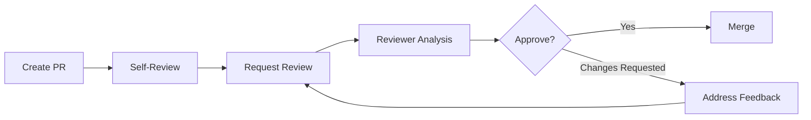

# Code Review Checklist

Conduct systematic code reviews to ensure code quality, catch bugs early, share knowledge across team, and maintain consistent architecture and style standards. Code reviews improve code quality through peer feedback before merging changes into the main branch.

This document covers code review processes, comprehensive checklists for architecture, code quality, testing, security, performance, documentation review, automated CI/CD checks, and best practices for giving and receiving feedback. Code reviews are mandatory quality gates before merging any code.

Code review validates that changes align with architecture principles, follow coding standards, include comprehensive tests, handle errors gracefully, maintain security best practices, and include clear documentation. Reviews catch issues that automated tools miss and facilitate knowledge transfer across the team.

## Code Review Process

### When to Require Review

**Mandatory review for:**
- All pull requests to main/master branch
- Changes to core business logic or data models
- New service implementations or major refactors
- Security-sensitive code (authentication, authorization, payments)
- Infrastructure and deployment configuration changes
- Database schema migrations
- API contract changes (breaking or non-breaking)

**Optional review (team discretion):**
- Documentation-only changes
- Minor typo fixes in comments
- Test data or fixture updates

### Review Workflow



**Step 1: Author Self-Review**
- Review own changes before requesting review
- Run all tests locally
- Verify linting and type checking pass
- Add descriptive PR description
- Link related issues/tickets

**Step 2: Reviewer Analysis**
- Read PR description and context
- Review code changes line-by-line
- Run code locally if needed
- Check test coverage and quality
- Verify CI/CD checks pass

**Step 3: Feedback Loop**
- Provide constructive, actionable feedback
- Author addresses comments
- Re-review after changes
- Approve when all concerns resolved

## Architecture & Design Review

### Checklist

- [ ] **Service Boundaries**: Changes respect microservice boundaries and separation of concerns
- [ ] **Data Access**: Uses HTTP-only data access (no direct database connections from business services)
- [ ] **Communication Patterns**: Follows synchronous (HTTP) or asynchronous (RabbitMQ) patterns correctly
- [ ] **Error Handling**: Implements proper error handling with meaningful messages
- [ ] **Design Patterns**: Uses appropriate design patterns (repository, factory, strategy, etc.)
- [ ] **SOLID Principles**: Follows Single Responsibility, Open/Closed, Liskov Substitution, Interface Segregation, Dependency Inversion
- [ ] **Dependency Injection**: Uses dependency injection for testability
- [ ] **Configuration**: Externalizes configuration via environment variables
- [ ] **Naming Conventions**: Follows `{context}_{domain}_{type}` naming pattern

### Example Review

```python
# CORRECT: Proper service separation and HTTP-only data access
class UserService:
    """User business logic service."""

    def __init__(self, data_client: DataServiceClient):
        """Inject data service client."""
        self.data_client = data_client

    async def create_user(self, email: str, name: str) -> User:
        """Create user via data service HTTP API."""
        try:
            response = await self.data_client.post("/api/users", json={
                "email": email,
                "name": name
            })
            return User.parse_obj(response.json())
        except HTTPException as e:
            raise UserCreationError(f"Failed to create user: {e}")


# INCORRECT: Direct database access from business service
class UserService:
    """WRONG: Business service accessing database directly."""

    def __init__(self, db_session: AsyncSession):  # ❌ Direct DB dependency
        self.db = db_session

    async def create_user(self, email: str, name: str) -> User:
        """WRONG: Direct database query."""
        user = User(email=email, name=name)
        self.db.add(user)  # ❌ Violates HTTP-only constraint
        await self.db.commit()
        return user
```

## Code Quality Review

### Checklist

- [ ] **Readability**: Code is clear, well-structured, and easy to understand
- [ ] **Complexity**: Functions are focused and not overly complex (McCabe < 10)
- [ ] **DRY Principle**: No unnecessary code duplication
- [ ] **Variable Names**: Descriptive, meaningful variable and function names
- [ ] **Magic Numbers**: No hardcoded values; use named constants
- [ ] **Comments**: Code explains "why", not "what"; complex logic is documented
- [ ] **Type Hints**: All functions have complete type annotations
- [ ] **Error Messages**: Clear, actionable error messages for debugging
- [ ] **Resource Cleanup**: Proper use of context managers for file/connection handling
- [ ] **Async/Await**: Correct async/await usage (no blocking calls in async functions)

### Example Review

```python
# CORRECT: Clear, well-structured code
from typing import Optional
from dataclasses import dataclass

# Named constant instead of magic number
MIN_CREDIT_SCORE = 650


@dataclass
class LoanDecision:
    """Loan approval decision."""
    approved: bool
    reason: str
    credit_score: int


async def evaluate_loan_application(
    user_id: str,
    loan_amount: int,
    credit_service: CreditCheckService
) -> LoanDecision:
    """
    Evaluate loan application based on credit score.

    Args:
        user_id: User identifier
        loan_amount: Requested loan amount in cents
        credit_service: Credit check service client

    Returns:
        LoanDecision with approval status and reason
    """
    credit_score = await credit_service.get_credit_score(user_id)

    if credit_score < MIN_CREDIT_SCORE:
        return LoanDecision(
            approved=False,
            reason=f"Credit score {credit_score} below minimum {MIN_CREDIT_SCORE}",
            credit_score=credit_score
        )

    return LoanDecision(
        approved=True,
        reason="Credit score meets requirements",
        credit_score=credit_score
    )


# INCORRECT: Poor code quality
async def check(uid, amt, svc):  # ❌ Unclear parameter names, no type hints
    """Check stuff."""  # ❌ Vague docstring
    s = await svc.get(uid)  # ❌ Single-letter variable
    if s < 650:  # ❌ Magic number
        return False, "bad"  # ❌ Unclear return value
    return True, "good"
```

## Testing Review

### Checklist

- [ ] **Test Coverage**: New code has 80%+ test coverage
- [ ] **Test Types**: Appropriate mix of unit, integration, and E2E tests
- [ ] **Test Quality**: Tests are clear, focused, and test one thing
- [ ] **Test Names**: Descriptive test names explain what is being tested
- [ ] **Assertions**: Clear assertions with meaningful error messages
- [ ] **Edge Cases**: Tests cover edge cases and error conditions
- [ ] **Mocking**: Appropriate use of mocks for external dependencies
- [ ] **Test Data**: Realistic test data that represents production scenarios
- [ ] **Test Independence**: Tests don't depend on execution order
- [ ] **Async Testing**: Proper use of pytest-asyncio for async code

### Example Review

```python
# CORRECT: Comprehensive test with clear structure
import pytest
from unittest.mock import AsyncMock

@pytest.mark.asyncio
async def test_loan_approval_rejects_low_credit_score():
    """Test loan application rejected when credit score below minimum."""
    # Arrange
    mock_credit_service = AsyncMock(spec=CreditCheckService)
    mock_credit_service.get_credit_score.return_value = 600

    # Act
    decision = await evaluate_loan_application(
        user_id="user-123",
        loan_amount=10000,
        credit_service=mock_credit_service
    )

    # Assert
    assert decision.approved is False
    assert "below minimum" in decision.reason
    assert decision.credit_score == 600
    mock_credit_service.get_credit_score.assert_called_once_with("user-123")


# INCORRECT: Poor test quality
def test_loan():  # ❌ No async, unclear name
    """Test loan."""  # ❌ Vague docstring
    result = check("123", 10000, None)  # ❌ No mocking, hardcoded values
    assert result  # ❌ Unclear assertion
```

## Security Review

### Checklist

- [ ] **Authentication**: Proper authentication for all protected endpoints
- [ ] **Authorization**: Correct authorization checks (user permissions)
- [ ] **Input Validation**: All user input validated and sanitized
- [ ] **SQL Injection**: No raw SQL queries; use parameterized queries or ORM
- [ ] **XSS Prevention**: Output encoding for user-generated content
- [ ] **Secrets Management**: No hardcoded secrets; use environment variables
- [ ] **Encryption**: Sensitive data encrypted in transit (HTTPS) and at rest
- [ ] **Rate Limiting**: API endpoints protected against abuse
- [ ] **CORS Configuration**: Proper CORS settings for frontend-backend communication
- [ ] **Dependency Vulnerabilities**: No known vulnerabilities in dependencies

### Example Review

```python
# CORRECT: Secure implementation
from fastapi import Depends, HTTPException, status
from fastapi.security import HTTPBearer

security = HTTPBearer()


async def get_current_user(token: str = Depends(security)) -> User:
    """Validate JWT token and return current user."""
    try:
        payload = jwt.decode(token.credentials, settings.SECRET_KEY, algorithms=["HS256"])
        user_id = payload.get("sub")
        if user_id is None:
            raise HTTPException(status_code=401, detail="Invalid token")
        return await user_service.get_user(user_id)
    except jwt.JWTError:
        raise HTTPException(status_code=401, detail="Invalid token")


@router.get("/api/users/{user_id}")
async def get_user(
    user_id: str,
    current_user: User = Depends(get_current_user)
) -> UserResponse:
    """Get user by ID (requires authentication)."""
    # Authorization check
    if current_user.id != user_id and not current_user.is_admin:
        raise HTTPException(status_code=403, detail="Access denied")

    return await user_service.get_user(user_id)


# INCORRECT: Security vulnerabilities
@router.get("/api/users/{user_id}")
async def get_user(user_id: str) -> UserResponse:  # ❌ No authentication
    """WRONG: Public endpoint exposing user data."""
    # ❌ No authorization check
    query = f"SELECT * FROM users WHERE id = '{user_id}'"  # ❌ SQL injection
    result = await db.execute(query)
    return result
```

## Performance Review

### Checklist

- [ ] **Database Queries**: Efficient queries with proper indexes
- [ ] **N+1 Queries**: No N+1 query problems; use eager loading
- [ ] **Caching**: Appropriate caching for frequently accessed data
- [ ] **Pagination**: Large result sets paginated
- [ ] **Async Operations**: Blocking operations don't block event loop
- [ ] **Connection Pooling**: Proper connection pool configuration
- [ ] **Memory Usage**: No memory leaks or excessive memory consumption
- [ ] **Algorithm Complexity**: Efficient algorithms (avoid O(n²) when possible)
- [ ] **Background Tasks**: Long-running tasks delegated to background workers
- [ ] **Resource Limits**: Proper timeouts and rate limiting

### Example Review

```python
# CORRECT: Efficient implementation with caching and pagination
from functools import lru_cache

@lru_cache(maxsize=128)
async def get_user_permissions(user_id: str) -> list[str]:
    """Get user permissions with caching."""
    response = await data_client.get(f"/api/users/{user_id}/permissions")
    return response.json()["permissions"]


async def get_users_paginated(
    page: int = 1,
    page_size: int = 50
) -> list[User]:
    """Get users with pagination."""
    offset = (page - 1) * page_size
    response = await data_client.get(
        "/api/users",
        params={"offset": offset, "limit": page_size}
    )
    return [User.parse_obj(u) for u in response.json()["users"]]


# INCORRECT: Performance issues
async def get_loan_applications() -> list[LoanWithUser]:
    """WRONG: N+1 query problem."""
    loans = await get_all_loans()  # 1 query
    result = []
    for loan in loans:
        user = await get_user(loan.user_id)  # N queries ❌
        result.append(LoanWithUser(loan=loan, user=user))
    return result  # Total: 1 + N queries
```

## Documentation Review

### Checklist

- [ ] **PR Description**: Clear description of changes and motivation
- [ ] **Docstrings**: All public functions have docstrings with Args, Returns, Raises
- [ ] **README Updates**: README updated if functionality or setup changes
- [ ] **API Documentation**: API endpoints documented (OpenAPI/Swagger)
- [ ] **Architecture Decisions**: ADRs created for significant architectural changes
- [ ] **Migration Guides**: Breaking changes include migration instructions
- [ ] **Changelog**: CHANGELOG.md updated with notable changes
- [ ] **Comments**: Complex logic explained with comments
- [ ] **Type Hints**: Type hints serve as inline documentation

### Example Review

```python
# CORRECT: Well-documented function
async def process_loan_application(
    loan_id: str,
    approval_status: Literal["approved", "rejected"],
    reviewer_id: str,
    notes: Optional[str] = None
) -> LoanDecision:
    """
    Process loan application and update status.

    Validates loan exists, checks reviewer permissions, updates loan status,
    publishes event to RabbitMQ for notification service, and returns decision.

    Args:
        loan_id: Unique loan application identifier
        approval_status: Either "approved" or "rejected"
        reviewer_id: ID of reviewer making decision
        notes: Optional reviewer notes explaining decision

    Returns:
        LoanDecision object with updated status and timestamp

    Raises:
        LoanNotFoundError: If loan_id does not exist
        UnauthorizedError: If reviewer lacks approval permissions
        InvalidStatusError: If approval_status is invalid
    """
    # Validate loan exists
    loan = await loan_service.get_loan(loan_id)
    if not loan:
        raise LoanNotFoundError(f"Loan {loan_id} not found")

    # Check reviewer permissions
    reviewer = await user_service.get_user(reviewer_id)
    if not reviewer.can_approve_loans:
        raise UnauthorizedError(f"User {reviewer_id} cannot approve loans")

    # Update loan status
    loan.status = approval_status
    loan.reviewer_id = reviewer_id
    loan.notes = notes
    loan.reviewed_at = datetime.utcnow()

    await loan_service.update_loan(loan)

    # Publish event for notification
    await event_publisher.publish("loan.processed", {
        "loan_id": loan_id,
        "status": approval_status,
        "user_id": loan.user_id
    })

    return LoanDecision.from_loan(loan)


# INCORRECT: Poorly documented
async def process(lid, status, rid, n=None):  # ❌ No docstring, unclear params
    """Process loan."""  # ❌ Too vague
    l = await get_loan(lid)  # ❌ No comments explaining logic
    if not l:
        raise Exception("Not found")  # ❌ Generic exception
    # ... rest of code without documentation
```

## Style & Readability Review

### Checklist

- [ ] **Linting**: Code passes Ruff/Black formatting
- [ ] **Line Length**: Lines under 100 characters
- [ ] **Import Organization**: Imports organized (stdlib, third-party, local)
- [ ] **Naming Conventions**: PEP 8 naming (snake_case functions, PascalCase classes)
- [ ] **Consistency**: Code style consistent with existing codebase
- [ ] **Dead Code**: No commented-out code or unused imports
- [ ] **Print Statements**: No debug print() statements
- [ ] **TODO Comments**: No untracked TODO comments (create issues instead)

## Automated Checks

### CI/CD Pipeline

```yaml
# .github/workflows/pr-checks.yml
name: PR Checks

on: [pull_request]

jobs:
  code-quality:
    runs-on: ubuntu-latest
    steps:
      - uses: actions/checkout@v4

      - name: Set up Python
        uses: actions/setup-python@v5
        with:
          python-version: '3.12'

      - name: Install dependencies
        run: |
          pip install ruff black mypy pytest pytest-cov

      - name: Run Ruff linting
        run: ruff check src/ tests/

      - name: Run Black formatting check
        run: black --check src/ tests/

      - name: Run mypy type checking
        run: mypy src/ --strict

      - name: Run tests with coverage
        run: pytest tests/ --cov=src --cov-report=xml --cov-fail-under=80

      - name: Upload coverage
        uses: codecov/codecov-action@v4
        with:
          file: ./coverage.xml
```

## Giving Feedback

### Best Practices

**DO:**
- Be respectful, constructive, and empathetic
- Explain "why" behind suggestions
- Provide specific examples or code snippets
- Ask questions instead of making demands
- Acknowledge good practices and improvements
- Focus on code, not the person
- Prioritize feedback (critical vs. nice-to-have)

**DON'T:**
- Use aggressive or condescending language
- Make vague comments without context
- Nitpick minor style issues (let linters handle this)
- Block PRs for subjective preferences
- Demand changes without explanation

### Example Feedback

```markdown
# CORRECT: Constructive feedback

**High Priority:**
🚨 **Security concern**: This endpoint lacks authentication. Consider adding `Depends(get_current_user)` to protect user data.

```python
@router.get("/api/users/{user_id}", dependencies=[Depends(get_current_user)])
async def get_user(user_id: str):
    ...
```

**Medium Priority:**
💡 **Suggestion**: Consider extracting this validation logic into a separate function for reusability:

```python
def validate_email(email: str) -> bool:
    """Validate email format."""
    return re.match(r'^[\w\.-]+@[\w\.-]+\.\w+$', email) is not None
```

**Nice to have:**
✨ **Nit**: Could we add a docstring here explaining the business logic?

---

# INCORRECT: Poor feedback

❌ "This is wrong."  # No context or explanation

❌ "Why didn't you use X pattern?"  # Sounds accusatory

❌ "I would never write code like this."  # Personal attack

❌ "This whole file needs to be rewritten."  # Too vague, not actionable
```

## Receiving Feedback

### Best Practices

**DO:**
- Assume positive intent from reviewers
- Ask clarifying questions if feedback is unclear
- Thank reviewers for their time and insights
- Address all feedback (implement, explain, or discuss)
- Mark conversations as resolved after addressing
- Learn from feedback patterns to improve future code

**DON'T:**
- Take feedback personally
- Argue defensively or dismiss concerns
- Ignore feedback without discussion
- Leave feedback unresolved without explanation
- Rush to implement changes without understanding

### Responding to Feedback

```markdown
# CORRECT: Professional responses

"Great catch! I missed that authentication check. Fixed in [commit abc123]."

"Good point about performance. I've added pagination in [commit def456]."

"I'm not sure I understand this suggestion. Could you elaborate on why approach X is preferable to Y?"

"I disagree with this approach because [technical reason]. Would [alternative] work better?"

---

# INCORRECT: Unprofessional responses

❌ "This works fine, no need to change it."  # Dismissive

❌ "You're wrong."  # Confrontational

❌ "Whatever, I'll change it."  # Passive-aggressive

❌ [No response, ignores feedback]  # Disrespectful
```

## Pull Request Template

```markdown
## Description
[Brief description of changes]

## Motivation and Context
[Why are these changes necessary? What problem do they solve?]

## Type of Change
- [ ] Bug fix (non-breaking change fixing an issue)
- [ ] New feature (non-breaking change adding functionality)
- [ ] Breaking change (fix or feature causing existing functionality to change)
- [ ] Documentation update

## How Has This Been Tested?
[Describe tests that verify changes work correctly]

## Screenshots (if applicable)
[Add screenshots for UI changes]

## Checklist
- [ ] My code follows the style guidelines
- [ ] I have performed a self-review
- [ ] I have commented complex code
- [ ] I have updated documentation
- [ ] My changes generate no new warnings
- [ ] I have added tests that prove my fix is effective or feature works
- [ ] New and existing tests pass locally
- [ ] Any dependent changes have been merged and published

## Related Issues
Closes #[issue number]
```

## Best Practices

### DO: Review Promptly

```markdown
# CORRECT: Timely review process
- Review PRs within 24 hours of request
- Set aside dedicated time for reviews daily
- Prioritize urgent/blocking PRs
- Notify author if review will be delayed
```

### DO: Focus on High-Impact Issues

```python
# CORRECT: Prioritize important feedback

# High Priority: Security vulnerability
# 🚨 This allows unauthorized access
if user_id == request.user_id:  # Missing admin check
    return user_data

# Medium Priority: Performance issue
# 💡 This creates N+1 queries
for loan in loans:
    user = await get_user(loan.user_id)

# Low Priority: Style preference
# ✨ Consider using f-string instead of format()
message = "Hello, {}".format(name)  # Personal preference
```

### DON'T: Block on Nitpicks

```markdown
# INCORRECT: Blocking PR for minor style issues
❌ "Requested changes: Add space after comma in line 42"

# CORRECT: Approve with non-blocking suggestions
✅ "Approved! Minor suggestion: could add space after comma (line 42) for consistency. Feel free to merge as-is or update."
```

## Checklist

### Architecture & Design
- [ ] Service boundaries respected
- [ ] HTTP-only data access followed
- [ ] Proper error handling implemented
- [ ] Design patterns used appropriately
- [ ] SOLID principles followed
- [ ] Configuration externalized

### Code Quality
- [ ] Code is readable and well-structured
- [ ] Functions focused (low complexity)
- [ ] No code duplication
- [ ] Descriptive naming
- [ ] Type hints complete
- [ ] Clear error messages

### Testing
- [ ] 80%+ test coverage
- [ ] Unit, integration, E2E tests appropriate
- [ ] Edge cases covered
- [ ] Mocks used properly
- [ ] Tests are independent

### Security
- [ ] Authentication required
- [ ] Authorization checks present
- [ ] Input validation complete
- [ ] No SQL injection vulnerabilities
- [ ] Secrets not hardcoded
- [ ] Dependencies up-to-date

### Performance
- [ ] Efficient database queries
- [ ] No N+1 query problems
- [ ] Caching used appropriately
- [ ] Pagination for large datasets
- [ ] Async operations non-blocking

### Documentation
- [ ] PR description clear
- [ ] Docstrings complete
- [ ] README updated if needed
- [ ] API documentation updated
- [ ] ADRs created for major changes

### Style & CI/CD
- [ ] Linting passes
- [ ] Type checking passes
- [ ] All tests pass
- [ ] No commented-out code
- [ ] CI/CD pipeline green

## Related Documents

- `docs/atomic/testing/quality-assurance/linting-standards.md` — Code linting standards with Ruff
- `docs/atomic/testing/quality-assurance/type-checking.md` — Static type checking with mypy
- `docs/atomic/architecture/architecture-principles.md` — Core architecture guidelines
- `docs/atomic/architecture/naming/README.md` — Service and variable naming standards
