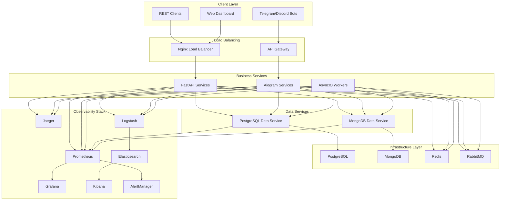

# Infrastructure Setup Example

> **🏗️ PURPOSE**: Complete guide for setting up the full observability and infrastructure stack for microservices

This example demonstrates how to set up the complete infrastructure stack including all observability tools, databases, messaging, and monitoring for the Improved Hybrid Approach architecture.

## 📋 Table of Contents

- [Complete Infrastructure Stack](#complete-infrastructure-stack)
- [Docker Compose Configuration](#docker-compose-configuration)
- [Observability Stack Setup](#observability-stack-setup)
- [Database Infrastructure](#database-infrastructure)
- [Messaging and Caching](#messaging-and-caching)
- [Networking and Security](#networking-and-security)
- [Environment Configuration](#environment-configuration)
- [Health Checks and Monitoring](#health-checks-and-monitoring)

## 🏗️ Complete Infrastructure Stack

### Architecture Overview



### Stack Components

| Component | Purpose | Port | Health Check |
|-----------|---------|------|--------------|
| **PostgreSQL** | Primary data storage | 5432 | `pg_isready` |
| **MongoDB** | Analytics and logs | 27017 | `mongosh ping` |
| **Redis** | Caching and sessions | 6379 | `redis-cli ping` |
| **RabbitMQ** | Message broker | 5672/15672 | `rabbitmq-diagnostics` |
| **Prometheus** | Metrics collection | 9090 | `/metrics` |
| **Grafana** | Metrics visualization | 3000 | `/api/health` |
| **Jaeger** | Distributed tracing | 16686/14268 | `/health` |
| **Elasticsearch** | Log storage | 9200 | `/_cluster/health` |
| **Logstash** | Log processing | 5044 | `/` |
| **Kibana** | Log visualization | 5601 | `/api/status` |
| **Nginx** | Load balancer | 80/443 | `/nginx_status` |

## 🐳 Docker Compose Configuration

### Main Infrastructure Stack

```yaml
# infrastructure/docker-compose.yml
version: '3.8'

services:
  # =============================================================================
  # Load Balancing and Gateway
  # =============================================================================

  nginx:
    image: nginx:1.25-alpine
    container_name: microservices_nginx
    volumes:
      - ./nginx/nginx.conf:/etc/nginx/nginx.conf:ro
      - ./nginx/conf.d:/etc/nginx/conf.d:ro
      - ./nginx/ssl:/etc/nginx/ssl:ro
      - ./nginx/logs:/var/log/nginx
    ports:
      - "80:80"
      - "443:443"
    networks:
      - microservices_network
      - monitoring_network
    depends_on:
      - prometheus
    healthcheck:
      test: ["CMD", "nginx", "-t"]
      interval: 30s
      timeout: 10s
      retries: 3
    restart: unless-stopped
    labels:
      - "monitoring.enabled=true"
      - "monitoring.path=/nginx_status"

  # =============================================================================
  # Database Infrastructure
  # =============================================================================

  postgres:
    image: postgres:16
    container_name: microservices_postgres
    environment:
      POSTGRES_DB: ${POSTGRES_DB:-microservices_db}
      POSTGRES_USER: ${POSTGRES_USER:-postgres}
      POSTGRES_PASSWORD: ${POSTGRES_PASSWORD:-postgres123}
      POSTGRES_INITDB_ARGS: "--encoding=UTF8 --locale=C"
      # Performance tuning
      POSTGRES_SHARED_PRELOAD_LIBRARIES: "pg_stat_statements"
    volumes:
      - postgres_data:/var/lib/postgresql/data
      - ./postgres/init:/docker-entrypoint-initdb.d
      - ./postgres/conf/postgresql.conf:/etc/postgresql/postgresql.conf
      - ./postgres/logs:/var/log/postgresql
    ports:
      - "${POSTGRES_PORT:-5432}:5432"
    networks:
      - microservices_network
      - monitoring_network
    healthcheck:
      test: ["CMD-SHELL", "pg_isready -U ${POSTGRES_USER:-postgres} -d ${POSTGRES_DB:-microservices_db}"]
      interval: 30s
      timeout: 10s
      retries: 5
      start_period: 60s
    restart: unless-stopped
    shm_size: 256m
    command: >
      postgres
      -c config_file=/etc/postgresql/postgresql.conf
      -c log_statement=all
      -c log_destination=stderr,csvlog
      -c logging_collector=on
      -c log_directory=/var/log/postgresql

  mongodb:
    image: mongo:7.0.9
    container_name: microservices_mongodb
    environment:
      MONGO_INITDB_ROOT_USERNAME: ${MONGO_USER:-mongo}
      MONGO_INITDB_ROOT_PASSWORD: ${MONGO_PASSWORD:-mongo123}
      MONGO_INITDB_DATABASE: ${MONGO_DB:-analytics_db}
    volumes:
      - mongodb_data:/data/db
      - mongodb_config:/data/configdb
      - ./mongodb/init:/docker-entrypoint-initdb.d
      - ./mongodb/conf/mongod.conf:/etc/mongod.conf
      - ./mongodb/logs:/var/log/mongodb
    ports:
      - "${MONGO_PORT:-27017}:27017"
    networks:
      - microservices_network
      - monitoring_network
    healthcheck:
      test: ["CMD", "mongosh", "--eval", "db.adminCommand('ping')"]
      interval: 30s
      timeout: 10s
      retries: 5
      start_period: 60s
    restart: unless-stopped
    command: ["mongod", "--config", "/etc/mongod.conf"]

  # =============================================================================
  # Caching and Messaging
  # =============================================================================

  redis:
    image: redis:7-alpine
    container_name: microservices_redis
    command: redis-server /etc/redis/redis.conf
    volumes:
      - redis_data:/data
      - ./redis/conf/redis.conf:/etc/redis/redis.conf:ro
      - ./redis/logs:/var/log/redis
    ports:
      - "${REDIS_PORT:-6379}:6379"
    networks:
      - microservices_network
      - monitoring_network
    healthcheck:
      test: ["CMD", "redis-cli", "-a", "${REDIS_PASSWORD:-redis123}", "ping"]
      interval: 30s
      timeout: 10s
      retries: 3
    restart: unless-stopped
    sysctls:
      - net.core.somaxconn=1024

  rabbitmq:
    image: rabbitmq:3.13-management
    container_name: microservices_rabbitmq
    environment:
      RABBITMQ_DEFAULT_USER: ${RABBITMQ_USER:-admin}
      RABBITMQ_DEFAULT_PASS: ${RABBITMQ_PASSWORD:-admin123}
      RABBITMQ_DEFAULT_VHOST: ${RABBITMQ_VHOST:-/}
      # Performance settings
      RABBITMQ_VM_MEMORY_HIGH_WATERMARK: 0.6
      RABBITMQ_DISK_FREE_LIMIT: 2GB
    volumes:
      - rabbitmq_data:/var/lib/rabbitmq
      - ./rabbitmq/conf/rabbitmq.conf:/etc/rabbitmq/rabbitmq.conf:ro
      - ./rabbitmq/conf/definitions.json:/etc/rabbitmq/definitions.json:ro
      - ./rabbitmq/logs:/var/log/rabbitmq
    ports:
      - "${RABBITMQ_PORT:-5672}:5672"
      - "${RABBITMQ_MANAGEMENT_PORT:-15672}:15672"
    networks:
      - microservices_network
      - monitoring_network
    healthcheck:
      test: ["CMD", "rabbitmq-diagnostics", "check_port_connectivity"]
      interval: 30s
      timeout: 15s
      retries: 5
      start_period: 120s
    restart: unless-stopped

  # =============================================================================
  # Metrics and Monitoring
  # =============================================================================

  prometheus:
    image: prom/prometheus:v2.47.0
    container_name: microservices_prometheus
    command:
      - '--config.file=/etc/prometheus/prometheus.yml'
      - '--storage.tsdb.path=/prometheus'
      - '--storage.tsdb.retention.time=30d'
      - '--storage.tsdb.retention.size=50GB'
      - '--web.console.libraries=/etc/prometheus/console_libraries'
      - '--web.console.templates=/etc/prometheus/consoles'
      - '--web.enable-lifecycle'
      - '--web.enable-admin-api'
      - '--web.route-prefix=/'
    volumes:
      - prometheus_data:/prometheus
      - ./prometheus/conf/prometheus.yml:/etc/prometheus/prometheus.yml:ro
      - ./prometheus/rules:/etc/prometheus/rules:ro
      - ./prometheus/conf/alert_rules.yml:/etc/prometheus/alert_rules.yml:ro
    ports:
      - "${PROMETHEUS_PORT:-9090}:9090"
    networks:
      - monitoring_network
      - microservices_network
    depends_on:
      - alertmanager
    healthcheck:
      test: ["CMD", "wget", "--quiet", "--tries=1", "--spider", "http://localhost:9090/-/healthy"]
      interval: 30s
      timeout: 10s
      retries: 3
    restart: unless-stopped
    user: "0:0"  # Run as root to avoid permission issues

  grafana:
    image: grafana/grafana:10.1.0
    container_name: microservices_grafana
    environment:
      GF_SECURITY_ADMIN_PASSWORD: ${GRAFANA_PASSWORD:-admin123}
      GF_SECURITY_ADMIN_USER: ${GRAFANA_USER:-admin}
      GF_INSTALL_PLUGINS: grafana-piechart-panel,grafana-worldmap-panel,flant-statusmap-panel
      GF_FEATURE_TOGGLES_ENABLE: tempoSearch,tempoBackendSearch
      # Performance settings
      GF_DATABASE_WAL: true
      GF_LOG_LEVEL: info
    volumes:
      - grafana_data:/var/lib/grafana
      - ./grafana/conf/grafana.ini:/etc/grafana/grafana.ini:ro
      - ./grafana/dashboards:/etc/grafana/provisioning/dashboards:ro
      - ./grafana/datasources:/etc/grafana/provisioning/datasources:ro
      - ./grafana/plugins:/var/lib/grafana/plugins
    ports:
      - "${GRAFANA_PORT:-3000}:3000"
    networks:
      - monitoring_network
    depends_on:
      - prometheus
    healthcheck:
      test: ["CMD", "curl", "-f", "http://localhost:3000/api/health"]
      interval: 30s
      timeout: 10s
      retries: 3
    restart: unless-stopped
    user: "472:472"

  alertmanager:
    image: prom/alertmanager:v0.26.0
    container_name: microservices_alertmanager
    command:
      - '--config.file=/etc/alertmanager/alertmanager.yml'
      - '--storage.path=/alertmanager'
      - '--web.external-url=http://localhost:9093'
      - '--web.route-prefix=/'
      - '--cluster.listen-address=0.0.0.0:9094'
    volumes:
      - alertmanager_data:/alertmanager
      - ./alertmanager/conf/alertmanager.yml:/etc/alertmanager/alertmanager.yml:ro
      - ./alertmanager/templates:/etc/alertmanager/templates:ro
    ports:
      - "${ALERTMANAGER_PORT:-9093}:9093"
    networks:
      - monitoring_network
    healthcheck:
      test: ["CMD", "wget", "--quiet", "--tries=1", "--spider", "http://localhost:9093/-/healthy"]
      interval: 30s
      timeout: 10s
      retries: 3
    restart: unless-stopped

  # =============================================================================
  # Distributed Tracing
  # =============================================================================

  jaeger:
    image: jaegertracing/all-in-one:1.49
    container_name: microservices_jaeger
    environment:
      COLLECTOR_OTLP_ENABLED: true
      COLLECTOR_ZIPKIN_HOST_PORT: 9411
      # Storage backend
      SPAN_STORAGE_TYPE: elasticsearch
      ES_SERVER_URLS: http://elasticsearch:9200
      ES_USERNAME: elastic
      ES_PASSWORD: ${ELASTIC_PASSWORD:-elastic123}
    volumes:
      - ./jaeger/conf:/etc/jaeger:ro
    ports:
      - "${JAEGER_UI_PORT:-16686}:16686"      # Jaeger UI
      - "${JAEGER_COLLECTOR_PORT:-14268}:14268"  # Jaeger collector HTTP
      - "${JAEGER_AGENT_PORT:-6831}:6831/udp"    # Jaeger agent UDP
      - "14250:14250"  # Jaeger collector gRPC
      - "9411:9411"    # Zipkin compatible endpoint
    networks:
      - monitoring_network
      - microservices_network
    depends_on:
      - elasticsearch
    healthcheck:
      test: ["CMD", "wget", "--quiet", "--tries=1", "--spider", "http://localhost:16686/"]
      interval: 30s
      timeout: 10s
      retries: 3
    restart: unless-stopped

  # =============================================================================
  # ELK Stack (Elasticsearch, Logstash, Kibana)
  # =============================================================================

  elasticsearch:
    image: docker.elastic.co/elasticsearch/elasticsearch:8.8.0
    container_name: microservices_elasticsearch
    environment:
      - discovery.type=single-node
      - "ES_JAVA_OPTS=-Xms2g -Xmx2g"
      - xpack.security.enabled=true
      - xpack.security.authc.api_key.enabled=true
      - ELASTIC_PASSWORD=${ELASTIC_PASSWORD:-elastic123}
      # Performance settings
      - bootstrap.memory_lock=true
      - cluster.routing.allocation.disk.threshold_enabled=true
      - cluster.routing.allocation.disk.watermark.low=85%
      - cluster.routing.allocation.disk.watermark.high=90%
    ulimits:
      memlock:
        soft: -1
        hard: -1
      nofile:
        soft: 65536
        hard: 65536
    volumes:
      - elasticsearch_data:/usr/share/elasticsearch/data
      - ./elasticsearch/conf/elasticsearch.yml:/usr/share/elasticsearch/config/elasticsearch.yml:ro
      - ./elasticsearch/logs:/usr/share/elasticsearch/logs
    ports:
      - "${ELASTICSEARCH_PORT:-9200}:9200"
    networks:
      - monitoring_network
    healthcheck:
      test: ["CMD", "curl", "-u", "elastic:${ELASTIC_PASSWORD:-elastic123}", "-f", "http://localhost:9200/_cluster/health"]
      interval: 30s
      timeout: 10s
      retries: 5
      start_period: 120s
    restart: unless-stopped

  logstash:
    image: docker.elastic.co/logstash/logstash:8.8.0
    container_name: microservices_logstash
    environment:
      - "LS_JAVA_OPTS=-Xms1g -Xmx1g"
      - ELASTICSEARCH_USERNAME=elastic
      - ELASTICSEARCH_PASSWORD=${ELASTIC_PASSWORD:-elastic123}
      - ELASTICSEARCH_URL=http://elasticsearch:9200
    volumes:
      - ./logstash/conf/logstash.yml:/usr/share/logstash/config/logstash.yml:ro
      - ./logstash/pipeline:/usr/share/logstash/pipeline:ro
      - ./logstash/patterns:/usr/share/logstash/patterns:ro
      - ./logstash/logs:/usr/share/logstash/logs
    ports:
      - "${LOGSTASH_PORT:-5044}:5044"  # Beats input
      - "9600:9600"                     # API endpoint
    networks:
      - monitoring_network
      - microservices_network
    depends_on:
      - elasticsearch
    healthcheck:
      test: ["CMD", "curl", "-f", "http://localhost:9600/"]
      interval: 30s
      timeout: 10s
      retries: 3
      start_period: 120s
    restart: unless-stopped

  kibana:
    image: docker.elastic.co/kibana/kibana:8.8.0
    container_name: microservices_kibana
    environment:
      ELASTICSEARCH_HOSTS: http://elasticsearch:9200
      ELASTICSEARCH_USERNAME: elastic
      ELASTICSEARCH_PASSWORD: ${ELASTIC_PASSWORD:-elastic123}
      SERVER_NAME: kibana
      SERVER_HOST: 0.0.0.0
    volumes:
      - kibana_data:/usr/share/kibana/data
      - ./kibana/conf/kibana.yml:/usr/share/kibana/config/kibana.yml:ro
      - ./kibana/dashboards:/usr/share/kibana/dashboards:ro
    ports:
      - "${KIBANA_PORT:-5601}:5601"
    networks:
      - monitoring_network
    depends_on:
      - elasticsearch
    healthcheck:
      test: ["CMD", "curl", "-f", "http://localhost:5601/api/status"]
      interval: 30s
      timeout: 10s
      retries: 5
      start_period: 120s
    restart: unless-stopped

  # =============================================================================
  # Data Services (Improved Hybrid Approach)
  # =============================================================================

  db_postgres_service:
    build:
      context: ../services/db_postgres_service
      dockerfile: Dockerfile
    container_name: microservices_db_postgres_service
    environment:
      DATABASE_URL: postgresql+asyncpg://postgres:${POSTGRES_PASSWORD:-postgres123}@postgres:5432/${POSTGRES_DB:-microservices_db}
      REDIS_URL: redis://:${REDIS_PASSWORD:-redis123}@redis:6379/0
      RABBITMQ_URL: amqp://${RABBITMQ_USER:-admin}:${RABBITMQ_PASSWORD:-admin123}@rabbitmq:5672/
      HOST: 0.0.0.0
      PORT: 8000
      DEBUG: ${DEBUG:-false}
      LOG_LEVEL: ${LOG_LEVEL:-INFO}
      # Monitoring
      JAEGER_ENDPOINT: http://jaeger:14268/api/traces
      PROMETHEUS_METRICS_PORT: 9090
    ports:
      - "8001:8000"
      - "9001:9090"  # Metrics endpoint
    networks:
      - microservices_network
      - monitoring_network
    depends_on:
      postgres:
        condition: service_healthy
      redis:
        condition: service_healthy
      rabbitmq:
        condition: service_healthy
      elasticsearch:
        condition: service_healthy
    volumes:
      - ./logs/db_postgres:/app/logs
    healthcheck:
      test: ["CMD", "curl", "-f", "http://localhost:8000/health"]
      interval: 30s
      timeout: 10s
      retries: 3
      start_period: 60s
    restart: unless-stopped

  db_mongo_service:
    build:
      context: ../services/db_mongo_service
      dockerfile: Dockerfile
    container_name: microservices_db_mongo_service
    environment:
      MONGODB_URL: mongodb://${MONGO_USER:-mongo}:${MONGO_PASSWORD:-mongo123}@mongodb:27017/${MONGO_DB:-analytics_db}?authSource=admin
      REDIS_URL: redis://:${REDIS_PASSWORD:-redis123}@redis:6379/0
      RABBITMQ_URL: amqp://${RABBITMQ_USER:-admin}:${RABBITMQ_PASSWORD:-admin123}@rabbitmq:5672/
      HOST: 0.0.0.0
      PORT: 8000
      DEBUG: ${DEBUG:-false}
      LOG_LEVEL: ${LOG_LEVEL:-INFO}
      # Monitoring
      JAEGER_ENDPOINT: http://jaeger:14268/api/traces
      PROMETHEUS_METRICS_PORT: 9090
    ports:
      - "8002:8000"
      - "9002:9090"  # Metrics endpoint
    networks:
      - microservices_network
      - monitoring_network
    depends_on:
      mongodb:
        condition: service_healthy
      redis:
        condition: service_healthy
      rabbitmq:
        condition: service_healthy
      elasticsearch:
        condition: service_healthy
    volumes:
      - ./logs/db_mongo:/app/logs
    healthcheck:
      test: ["CMD", "curl", "-f", "http://localhost:8000/health"]
      interval: 30s
      timeout: 10s
      retries: 3
      start_period: 60s
    restart: unless-stopped

# =============================================================================
# Networks
# =============================================================================

networks:
  microservices_network:
    name: microservices_network
    driver: bridge
    ipam:
      config:
        - subnet: 172.20.0.0/16

  monitoring_network:
    name: monitoring_network
    driver: bridge
    ipam:
      config:
        - subnet: 172.21.0.0/16

# =============================================================================
# Volumes
# =============================================================================

volumes:
  # Database volumes
  postgres_data:
    name: microservices_postgres_data
  mongodb_data:
    name: microservices_mongodb_data
  mongodb_config:
    name: microservices_mongodb_config
  redis_data:
    name: microservices_redis_data
  rabbitmq_data:
    name: microservices_rabbitmq_data

  # Monitoring volumes
  prometheus_data:
    name: microservices_prometheus_data
  grafana_data:
    name: microservices_grafana_data
  alertmanager_data:
    name: microservices_alertmanager_data

  # ELK volumes
  elasticsearch_data:
    name: microservices_elasticsearch_data
  kibana_data:
    name: microservices_kibana_data
```

## 📊 Observability Stack Setup

### Prometheus Configuration

```yaml
# prometheus/conf/prometheus.yml
global:
  scrape_interval: 15s
  evaluation_interval: 15s
  external_labels:
    cluster: 'microservices-local'
    environment: 'development'

rule_files:
  - "alert_rules.yml"

alerting:
  alertmanagers:
    - static_configs:
        - targets:
          - alertmanager:9093

scrape_configs:
  # Prometheus self-monitoring
  - job_name: 'prometheus'
    static_configs:
      - targets: ['localhost:9090']

  # Infrastructure services
  - job_name: 'postgres'
    static_configs:
      - targets: ['postgres:5432']
    metrics_path: /metrics
    scrape_interval: 30s

  - job_name: 'mongodb'
    static_configs:
      - targets: ['mongodb:27017']
    metrics_path: /metrics
    scrape_interval: 30s

  - job_name: 'redis'
    static_configs:
      - targets: ['redis:6379']
    metrics_path: /metrics
    scrape_interval: 30s

  - job_name: 'rabbitmq'
    static_configs:
      - targets: ['rabbitmq:15692']
    metrics_path: /metrics
    scrape_interval: 30s

  # Data services
  - job_name: 'db_postgres_service'
    static_configs:
      - targets: ['db_postgres_service:9090']
    metrics_path: /metrics
    scrape_interval: 15s
    scrape_timeout: 10s

  - job_name: 'db_mongo_service'
    static_configs:
      - targets: ['db_mongo_service:9090']
    metrics_path: /metrics
    scrape_interval: 15s
    scrape_timeout: 10s

  # Business services (auto-discovery)
  - job_name: 'business_services'
    docker_sd_configs:
      - host: unix:///var/run/docker.sock
        port: 9090
    relabel_configs:
      - source_labels: [__meta_docker_container_label_monitoring_enabled]
        regex: true
        action: keep
      - source_labels: [__meta_docker_container_name]
        target_label: instance
      - source_labels: [__meta_docker_container_label_service_type]
        target_label: service_type

  # Nginx monitoring
  - job_name: 'nginx'
    static_configs:
      - targets: ['nginx:80']
    metrics_path: /nginx_status
    scrape_interval: 30s

  # ELK stack monitoring
  - job_name: 'elasticsearch'
    static_configs:
      - targets: ['elasticsearch:9200']
    metrics_path: /_prometheus/metrics
    scrape_interval: 30s

  - job_name: 'logstash'
    static_configs:
      - targets: ['logstash:9600']
    metrics_path: /metrics
    scrape_interval: 30s

  - job_name: 'kibana'
    static_configs:
      - targets: ['kibana:5601']
    metrics_path: /api/stats
    scrape_interval: 30s
```

### Grafana Dashboards

```json
{
  "dashboard": {
    "id": null,
    "title": "Microservices Infrastructure Overview",
    "tags": ["microservices", "infrastructure"],
    "timezone": "browser",
    "panels": [
      {
        "id": 1,
        "title": "Service Health Status",
        "type": "stat",
        "targets": [
          {
            "expr": "up",
            "legendFormat": "{{job}} - {{instance}}"
          }
        ],
        "fieldConfig": {
          "defaults": {
            "color": {
              "mode": "thresholds"
            },
            "mappings": [
              {
                "options": {
                  "0": {
                    "text": "DOWN",
                    "color": "red"
                  },
                  "1": {
                    "text": "UP",
                    "color": "green"
                  }
                },
                "type": "value"
              }
            ],
            "thresholds": {
              "steps": [
                {
                  "color": "red",
                  "value": 0
                },
                {
                  "color": "green",
                  "value": 1
                }
              ]
            }
          }
        }
      },
      {
        "id": 2,
        "title": "Request Rate (req/sec)",
        "type": "graph",
        "targets": [
          {
            "expr": "rate(http_requests_total[5m])",
            "legendFormat": "{{service}} - {{method}} {{status}}"
          }
        ]
      },
      {
        "id": 3,
        "title": "Response Time (95th percentile)",
        "type": "graph",
        "targets": [
          {
            "expr": "histogram_quantile(0.95, rate(http_request_duration_seconds_bucket[5m]))",
            "legendFormat": "{{service}} - 95th percentile"
          }
        ]
      },
      {
        "id": 4,
        "title": "Database Connections",
        "type": "graph",
        "targets": [
          {
            "expr": "pg_stat_database_numbackends",
            "legendFormat": "PostgreSQL - {{datname}}"
          },
          {
            "expr": "mongodb_connections_current",
            "legendFormat": "MongoDB - Current"
          }
        ]
      },
      {
        "id": 5,
        "title": "Message Queue Depth",
        "type": "graph",
        "targets": [
          {
            "expr": "rabbitmq_queue_messages_ready",
            "legendFormat": "{{queue}} - Ready"
          },
          {
            "expr": "rabbitmq_queue_messages_unacknowledged",
            "legendFormat": "{{queue}} - Unacked"
          }
        ]
      },
      {
        "id": 6,
        "title": "Cache Hit Rate",
        "type": "stat",
        "targets": [
          {
            "expr": "rate(redis_keyspace_hits_total[5m]) / (rate(redis_keyspace_hits_total[5m]) + rate(redis_keyspace_misses_total[5m])) * 100",
            "legendFormat": "Redis Hit Rate %"
          }
        ]
      }
    ],
    "time": {
      "from": "now-1h",
      "to": "now"
    },
    "refresh": "30s"
  }
}
```

## 🗄️ Database Infrastructure

### PostgreSQL Configuration

```conf
# postgres/conf/postgresql.conf
# PostgreSQL configuration for microservices

# Connection settings
listen_addresses = '*'
port = 5432
max_connections = 200
superuser_reserved_connections = 3

# Memory settings
shared_buffers = 256MB
effective_cache_size = 1GB
work_mem = 4MB
maintenance_work_mem = 64MB

# Checkpoint settings
checkpoint_segments = 32
checkpoint_completion_target = 0.7
wal_buffers = 16MB

# Query planner
random_page_cost = 1.1
effective_io_concurrency = 200

# Logging
log_destination = 'stderr,csvlog'
logging_collector = on
log_directory = '/var/log/postgresql'
log_filename = 'postgresql-%Y-%m-%d_%H%M%S.log'
log_statement = 'all'
log_min_duration_statement = 1000
log_checkpoints = on
log_connections = on
log_disconnections = on
log_lock_waits = on

# Monitoring
shared_preload_libraries = 'pg_stat_statements'
track_activities = on
track_counts = on
track_io_timing = on
track_functions = all

# Replication (for future scaling)
wal_level = replica
max_wal_senders = 3
wal_keep_segments = 64
```

### MongoDB Configuration

```yaml
# mongodb/conf/mongod.conf
systemLog:
  destination: file
  path: /var/log/mongodb/mongod.log
  logAppend: true
  logRotate: reopen

storage:
  dbPath: /data/db
  journal:
    enabled: true
  wiredTiger:
    engineConfig:
      cacheSizeGB: 1
      journalCompressor: snappy
      directoryForIndexes: false
    collectionConfig:
      blockCompressor: snappy
    indexConfig:
      prefixCompression: true

processManagement:
  fork: false
  pidFilePath: /var/run/mongodb/mongod.pid

net:
  port: 27017
  bindIpAll: true
  maxIncomingConnections: 1000

replication:
  replSetName: "rs0"

security:
  authorization: enabled

operationProfiling:
  slowOpThresholdMs: 100
  mode: slowOp

setParameter:
  enableLocalhostAuthBypass: false
  authenticationMechanisms: SCRAM-SHA-1,SCRAM-SHA-256
```

## 🔄 Messaging and Caching

### Redis Configuration

```conf
# redis/conf/redis.conf
# Redis configuration for microservices

# Network
bind 0.0.0.0
port 6379
protected-mode yes
requirepass redis123

# General
daemonize no
pidfile /var/run/redis_6379.pid
loglevel notice
logfile /var/log/redis/redis-server.log

# Snapshotting
save 900 1
save 300 10
save 60 10000
stop-writes-on-bgsave-error yes
rdbcompression yes
rdbchecksum yes
dbfilename dump.rdb
dir /data

# Append only file
appendonly yes
appendfilename "appendonly.aof"
appendfsync everysec
no-appendfsync-on-rewrite no
auto-aof-rewrite-percentage 100
auto-aof-rewrite-min-size 64mb

# Memory management
maxmemory 512mb
maxmemory-policy allkeys-lru
maxmemory-samples 5

# Clients
maxclients 10000
timeout 300

# Security
rename-command FLUSHDB ""
rename-command FLUSHALL ""
rename-command KEYS ""
rename-command CONFIG "CONFIG_ADMIN_ONLY"
```

### RabbitMQ Configuration

```conf
# rabbitmq/conf/rabbitmq.conf
# RabbitMQ configuration for microservices

# Network
listeners.tcp.default = 5672
management.tcp.port = 15672

# Memory and disk
vm_memory_high_watermark.relative = 0.6
disk_free_limit.relative = 2.0

# Logging
log.file.level = info
log.dir = /var/log/rabbitmq
log.file = rabbit.log

# Queue settings
default_vhost = /
default_user = admin
default_pass = admin123
default_permissions.configure = .*
default_permissions.read = .*
default_permissions.write = .*

# Performance
channel_max = 2047
frame_max = 131072
heartbeat = 600

# Management plugin
management.rates_mode = basic
management.sample_retention_policies.global.minute = 5
management.sample_retention_policies.global.hour = 60
management.sample_retention_policies.global.day = 1440

# Federation (for future multi-region setup)
federation_upstream_max_hops = 1

# Clustering (for future scaling)
cluster_formation.peer_discovery_backend = rabbit_peer_discovery_classic_config
cluster_formation.classic_config.nodes.1 = rabbit@localhost
```

## 🔒 Networking and Security

### Nginx Load Balancer Configuration

```nginx
# nginx/nginx.conf
user nginx;
worker_processes auto;
error_log /var/log/nginx/error.log warn;
pid /var/run/nginx.pid;

events {
    worker_connections 1024;
    use epoll;
    multi_accept on;
}

http {
    include /etc/nginx/mime.types;
    default_type application/octet-stream;

    # Logging format
    log_format main '$remote_addr - $remote_user [$time_local] "$request" '
                    '$status $body_bytes_sent "$http_referer" '
                    '"$http_user_agent" "$http_x_forwarded_for" '
                    'rt=$request_time uct="$upstream_connect_time" '
                    'uht="$upstream_header_time" urt="$upstream_response_time"';

    access_log /var/log/nginx/access.log main;

    # Performance
    sendfile on;
    tcp_nopush on;
    tcp_nodelay on;
    keepalive_timeout 65;
    types_hash_max_size 2048;

    # Gzip compression
    gzip on;
    gzip_vary on;
    gzip_min_length 10240;
    gzip_proxied expired no-cache no-store private must-revalidate;
    gzip_types text/plain text/css text/xml text/javascript application/javascript application/xml+rss application/json;

    # Rate limiting
    limit_req_zone $binary_remote_addr zone=api:10m rate=10r/s;
    limit_req_zone $binary_remote_addr zone=auth:10m rate=5r/s;

    # Upstream definitions
    upstream api_services {
        least_conn;
        server db_postgres_service:8000 max_fails=3 fail_timeout=30s;
        server db_mongo_service:8000 max_fails=3 fail_timeout=30s;
        keepalive 32;
    }

    upstream business_services {
        least_conn;
        # Business services will be added dynamically
        keepalive 32;
    }

    # API Gateway
    server {
        listen 80;
        server_name api.localhost;

        # Security headers
        add_header X-Frame-Options DENY;
        add_header X-Content-Type-Options nosniff;
        add_header X-XSS-Protection "1; mode=block";
        add_header Referrer-Policy "strict-origin-when-cross-origin";

        # Health check endpoint
        location /nginx_status {
            stub_status on;
            access_log off;
            allow 172.20.0.0/16;
            allow 172.21.0.0/16;
            deny all;
        }

        # API routing
        location /api/v1/data/ {
            limit_req zone=api burst=20 nodelay;

            proxy_pass http://api_services/;
            proxy_set_header Host $host;
            proxy_set_header X-Real-IP $remote_addr;
            proxy_set_header X-Forwarded-For $proxy_add_x_forwarded_for;
            proxy_set_header X-Forwarded-Proto $scheme;

            # Timeouts
            proxy_connect_timeout 10s;
            proxy_send_timeout 10s;
            proxy_read_timeout 10s;
        }

        location /api/v1/ {
            limit_req zone=api burst=20 nodelay;

            proxy_pass http://business_services/;
            proxy_set_header Host $host;
            proxy_set_header X-Real-IP $remote_addr;
            proxy_set_header X-Forwarded-For $proxy_add_x_forwarded_for;
            proxy_set_header X-Forwarded-Proto $scheme;
        }

        # Authentication endpoints
        location /auth/ {
            limit_req zone=auth burst=10 nodelay;

            proxy_pass http://business_services/auth/;
            proxy_set_header Host $host;
            proxy_set_header X-Real-IP $remote_addr;
            proxy_set_header X-Forwarded-For $proxy_add_x_forwarded_for;
            proxy_set_header X-Forwarded-Proto $scheme;
        }
    }

    # Monitoring dashboard
    server {
        listen 80;
        server_name monitoring.localhost;

        location / {
            proxy_pass http://grafana:3000/;
            proxy_set_header Host $host;
            proxy_set_header X-Real-IP $remote_addr;
            proxy_set_header X-Forwarded-For $proxy_add_x_forwarded_for;
            proxy_set_header X-Forwarded-Proto $scheme;
        }

        location /prometheus/ {
            proxy_pass http://prometheus:9090/;
            proxy_set_header Host $host;
            proxy_set_header X-Real-IP $remote_addr;
            proxy_set_header X-Forwarded-For $proxy_add_x_forwarded_for;
            proxy_set_header X-Forwarded-Proto $scheme;
        }

        location /jaeger/ {
            proxy_pass http://jaeger:16686/;
            proxy_set_header Host $host;
            proxy_set_header X-Real-IP $remote_addr;
            proxy_set_header X-Forwarded-For $proxy_add_x_forwarded_for;
            proxy_set_header X-Forwarded-Proto $scheme;
        }

        location /kibana/ {
            proxy_pass http://kibana:5601/;
            proxy_set_header Host $host;
            proxy_set_header X-Real-IP $remote_addr;
            proxy_set_header X-Forwarded-For $proxy_add_x_forwarded_for;
            proxy_set_header X-Forwarded-Proto $scheme;
        }
    }
}
```

## ⚙️ Environment Configuration

### Main Environment File

```bash
# .env - Main infrastructure configuration

# =============================================================================
# General Settings
# =============================================================================
COMPOSE_PROJECT_NAME=microservices
COMPOSE_FILE=infrastructure/docker-compose.yml
DEBUG=false
LOG_LEVEL=INFO
ENVIRONMENT=development

# =============================================================================
# Database Configuration
# =============================================================================

# PostgreSQL
POSTGRES_DB=microservices_db
POSTGRES_USER=postgres
POSTGRES_PASSWORD=postgres123
POSTGRES_PORT=5432

# MongoDB
MONGO_DB=analytics_db
MONGO_USER=mongo
MONGO_PASSWORD=mongo123
MONGO_PORT=27017

# Redis
REDIS_PASSWORD=redis123
REDIS_PORT=6379

# RabbitMQ
RABBITMQ_USER=admin
RABBITMQ_PASSWORD=admin123
RABBITMQ_VHOST=/
RABBITMQ_PORT=5672
RABBITMQ_MANAGEMENT_PORT=15672

# =============================================================================
# Monitoring Configuration
# =============================================================================

# Prometheus
PROMETHEUS_PORT=9090

# Grafana
GRAFANA_PORT=3000
GRAFANA_USER=admin
GRAFANA_PASSWORD=admin123

# AlertManager
ALERTMANAGER_PORT=9093

# Jaeger
JAEGER_UI_PORT=16686
JAEGER_COLLECTOR_PORT=14268
JAEGER_AGENT_PORT=6831

# ELK Stack
ELASTICSEARCH_PORT=9200
LOGSTASH_PORT=5044
KIBANA_PORT=5601
ELASTIC_PASSWORD=elastic123

# =============================================================================
# Security Configuration
# =============================================================================

# JWT
JWT_SECRET_KEY=your-super-secret-jwt-key-here
JWT_ALGORITHM=HS256
JWT_EXPIRE_MINUTES=30

# API Keys
API_KEY_HEADER=X-API-Key
API_RATE_LIMIT=1000

# TLS/SSL
SSL_CERT_PATH=/etc/nginx/ssl/cert.pem
SSL_KEY_PATH=/etc/nginx/ssl/key.pem

# =============================================================================
# Performance Tuning
# =============================================================================

# Database connection pools
DB_POOL_SIZE=20
DB_MAX_OVERFLOW=30
DB_POOL_TIMEOUT=30

# Redis connection pool
REDIS_POOL_SIZE=50
REDIS_POOL_TIMEOUT=5

# HTTP client settings
HTTP_TIMEOUT=30
HTTP_RETRIES=3
HTTP_POOL_SIZE=100

# Worker settings
WORKER_CONCURRENCY=4
WORKER_BATCH_SIZE=100
WORKER_TIMEOUT=300

# Cache settings
CACHE_TTL=300
CACHE_MAX_SIZE=1000

# =============================================================================
# External Services
# =============================================================================

# Email (for alerts)
SMTP_HOST=smtp.gmail.com
SMTP_PORT=587
SMTP_USER=your-email@gmail.com
SMTP_PASSWORD=your-app-password

# Slack (for alerts)
SLACK_WEBHOOK_URL=https://hooks.slack.com/services/YOUR/SLACK/WEBHOOK

# Telegram (for alerts)
TELEGRAM_BOT_TOKEN=your-telegram-bot-token
TELEGRAM_CHAT_ID=your-telegram-chat-id
```

## ✅ Health Checks and Monitoring

### Comprehensive Health Check Script

```bash
#!/bin/bash
# scripts/health_check.sh - Comprehensive infrastructure health check

set -euo pipefail

# Colors for output
RED='\033[0;31m'
GREEN='\033[0;32m'
YELLOW='\033[1;33m'
NC='\033[0m' # No Color

# Configuration
TIMEOUT=10
RETRY_COUNT=3
COMPOSE_FILE="infrastructure/docker-compose.yml"

echo "🏗️ Infrastructure Health Check"
echo "================================"

# Check if Docker is running
check_docker() {
    echo -n "Docker daemon: "
    if docker info >/dev/null 2>&1; then
        echo -e "${GREEN}✅ Running${NC}"
    else
        echo -e "${RED}❌ Not running${NC}"
        exit 1
    fi
}

# Check service health
check_service_health() {
    local service=$1
    local url=$2
    local expected_status=${3:-200}

    echo -n "$service: "

    for i in $(seq 1 $RETRY_COUNT); do
        if curl -sf --max-time $TIMEOUT "$url" >/dev/null 2>&1; then
            echo -e "${GREEN}✅ Healthy${NC}"
            return 0
        fi

        if [ $i -lt $RETRY_COUNT ]; then
            sleep 2
        fi
    done

    echo -e "${RED}❌ Unhealthy${NC}"
    return 1
}

# Check database connectivity
check_database() {
    local db_type=$1
    local container=$2
    local command=$3

    echo -n "$db_type: "

    if docker exec "$container" $command >/dev/null 2>&1; then
        echo -e "${GREEN}✅ Connected${NC}"
    else
        echo -e "${RED}❌ Connection failed${NC}"
        return 1
    fi
}

# Main health checks
main() {
    local overall_status=0

    echo "Checking Docker..."
    check_docker

    echo -e "\nChecking infrastructure services..."

    # Database health checks
    check_database "PostgreSQL" "microservices_postgres" "pg_isready -U postgres -d microservices_db" || overall_status=1
    check_database "MongoDB" "microservices_mongodb" "mongosh --eval 'db.adminCommand(\"ping\")'" || overall_status=1
    check_database "Redis" "microservices_redis" "redis-cli -a redis123 ping" || overall_status=1

    # Message broker
    check_service_health "RabbitMQ Management" "http://localhost:15672" || overall_status=1

    echo -e "\nChecking data services..."
    check_service_health "PostgreSQL Data Service" "http://localhost:8001/health" || overall_status=1
    check_service_health "MongoDB Data Service" "http://localhost:8002/health" || overall_status=1

    echo -e "\nChecking monitoring stack..."
    check_service_health "Prometheus" "http://localhost:9090/-/healthy" || overall_status=1
    check_service_health "Grafana" "http://localhost:3000/api/health" || overall_status=1
    check_service_health "Jaeger" "http://localhost:16686/" || overall_status=1
    check_service_health "Elasticsearch" "http://localhost:9200/_cluster/health" || overall_status=1
    check_service_health "Kibana" "http://localhost:5601/api/status" || overall_status=1

    echo -e "\nChecking load balancer..."
    check_service_health "Nginx" "http://localhost/nginx_status" || overall_status=1

    echo -e "\n================================"
    if [ $overall_status -eq 0 ]; then
        echo -e "${GREEN}🎉 All services are healthy!${NC}"
    else
        echo -e "${RED}⚠️  Some services are unhealthy. Check logs for details.${NC}"
        echo "Run: docker-compose -f $COMPOSE_FILE logs [service-name]"
    fi

    return $overall_status
}

# Service-specific log checking
check_logs() {
    echo "Recent error logs:"
    echo "=================="

    # Check for errors in the last 100 lines of each service
    services=("postgres" "mongodb" "redis" "rabbitmq" "prometheus" "grafana" "jaeger" "elasticsearch" "logstash" "kibana")

    for service in "${services[@]}"; do
        echo -e "\n${YELLOW}$service errors:${NC}"
        docker-compose -f $COMPOSE_FILE logs --tail=100 "$service" 2>/dev/null | grep -i error | tail -5 || echo "No recent errors"
    done
}

# Performance metrics
check_performance() {
    echo -e "\n🏃 Performance Metrics"
    echo "====================="

    # Container resource usage
    echo "Container resource usage:"
    docker stats --no-stream --format "table {{.Container}}\t{{.CPUPerc}}\t{{.MemUsage}}\t{{.MemPerc}}" | head -20

    # Disk space
    echo -e "\nDisk space:"
    df -h | grep -E "(Filesystem|/dev/)"

    # Docker volume sizes
    echo -e "\nDocker volume sizes:"
    docker system df -v | grep -A 20 "Local Volumes:"
}

# Cleanup function
cleanup_resources() {
    echo -e "\n🧹 Resource Cleanup"
    echo "==================="

    echo "Pruning unused Docker resources..."
    docker system prune -f

    echo "Cleaning up old logs..."
    find ./logs -name "*.log" -mtime +7 -delete 2>/dev/null || true

    echo "Optimization completed!"
}

# Main execution
case "${1:-health}" in
    "health")
        main
        ;;
    "logs")
        check_logs
        ;;
    "performance")
        check_performance
        ;;
    "cleanup")
        cleanup_resources
        ;;
    "all")
        main
        check_performance
        check_logs
        ;;
    *)
        echo "Usage: $0 {health|logs|performance|cleanup|all}"
        echo ""
        echo "  health      - Check service health (default)"
        echo "  logs        - Check recent error logs"
        echo "  performance - Show performance metrics"
        echo "  cleanup     - Clean up unused resources"
        echo "  all         - Run all checks"
        exit 1
        ;;
esac
```

### Quick Start Commands

```bash
# Complete infrastructure setup
cd infrastructure
cp .env.example .env
# Edit .env with your settings

# Start infrastructure stack
docker-compose up -d

# Wait for services to be ready
./scripts/health_check.sh

# Access monitoring dashboards
open http://localhost:3000    # Grafana (admin/admin123)
open http://localhost:9090    # Prometheus
open http://localhost:16686   # Jaeger
open http://localhost:5601    # Kibana (elastic/elastic123)
open http://localhost:15672   # RabbitMQ (admin/admin123)

# Test data services
curl http://localhost:8001/health   # PostgreSQL service
curl http://localhost:8002/health   # MongoDB service

# Check overall system health
./scripts/health_check.sh all

# Monitor logs in real-time
docker-compose logs -f --tail=100

# Scale services
docker-compose up -d --scale db_postgres_service=2
docker-compose up -d --scale db_mongo_service=2

# Stop infrastructure
docker-compose down

# Stop and remove volumes (⚠️ destroys data)
docker-compose down -v
```

This infrastructure setup example provides a complete, production-ready observability and infrastructure stack for the Improved Hybrid Approach microservices architecture! 🏗️