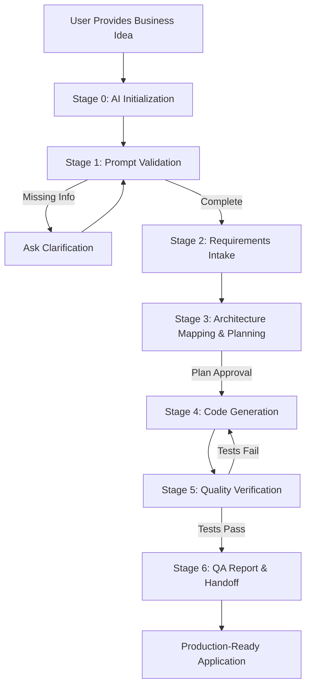

# AI Code Generation Master Workflow

> **PURPOSE**: This is the **single source of truth** for AI agents generating production-ready microservices applications. This document unifies the complete end-to-end process from initial user prompt to production deployment.

## Quick Navigation

| Need | Go To |
|------|-------|
| **Start here** | [Part 1: AI Reading Order](#part-1-ai-reading-order) |
| **Understand the process** | [Part 2: 7-Stage Workflow](#part-2-7-stage-workflow-process) |
| **Know what to read when** | [Part 3: Navigation Matrix](#part-3-navigation-matrix) |
| **See a complete example** | [Part 4: Example Walkthrough](#part-4-example-walkthrough-p2p-lending) |
| **Troubleshoot issues** | [Part 5: Common Issues](#part-5-common-issues--recovery) |

---

## Part 1: AI Reading Order

### Initialization Sequence (MANDATORY)

When an AI agent starts working with this framework, it **MUST** read documents in this exact order:

#### **Stage 0: Initialization** (Before receiving user prompt)

1. **CLAUDE.md** (root) — Entry point, framework overview, navigation guide
2. **docs/reference/AGENT_CONTEXT_SUMMARY.md** — Critical rules snapshot, mandatory constraints
3. **THIS DOCUMENT** (AI_CODE_GENERATION_MASTER_WORKFLOW.md) — Complete workflow process
4. **docs/reference/MATURITY_LEVELS.md** — 4 maturity levels from PoC to Production

**Purpose**: Load context about framework architecture, mandatory constraints, available documentation, and maturity level options.

**Expected outcome**: AI understands:
- Framework-as-submodule model
- Improved Hybrid Approach architecture
- Mandatory constraints (HTTP-only data access, service separation, etc.)
- **Maturity levels** (PoC ~5 min, Development ~10 min, Pre-Production ~15 min, Production ~30 min)
- Where to find specific information during workflow

---

#### **Stage 1-6: Dynamic Reading** (During workflow execution)

After initialization, AI reads documents **on-demand** based on the current workflow stage. See [Part 3: Navigation Matrix](#part-3-navigation-matrix) for exact document mapping per stage.

**Key principle**: Don't read everything upfront. Read what's needed for the current stage.

---

### Core Document Categories

#### **Workflow & Process** (when to do what)
- `AI_CODE_GENERATION_MASTER_WORKFLOW.md` ← you are here
- `PROMPT_VALIDATION_GUIDE.md`
- `AGENT_VERIFICATION_CHECKLIST.md`

#### **Architecture & Rules** (what constraints to follow)
- `ARCHITECTURE_GUIDE.md` ← MANDATORY, canonical architecture source
- `docs/atomic/architecture/*` ← atomic architecture rules
- `docs/atomic/services/*` ← service implementation patterns
- `docs/atomic/integrations/*` ← integration patterns

#### **Templates & Tools** (how to structure outputs)
- `REQUIREMENTS_INTAKE_TEMPLATE.md`
- `IMPLEMENTATION_PLAN_TEMPLATE.md`
- `QA_REPORT_TEMPLATE.md`
- `AGENT_TOOLBOX.md`
- `PROMPT_TEMPLATES.md`

#### **Reference** (lookup information)
- `tech_stack.md` ← technology versions
- `PROJECT_STRUCTURE.md` ← directory layout
- `troubleshooting.md` ← diagnostics
- `DELIVERABLES_CATALOG.md` ← expected artifacts

---

## Part 2: 7-Stage Workflow Process

### Overview Diagram



---

### Stage 0: AI Initialization

**Entry Criteria**: AI agent assigned to a new task.

**AI Actions**:
1. Read `CLAUDE.md` → understand framework model
2. Read `AGENT_CONTEXT_SUMMARY.md` → load critical rules
3. Read this document → understand workflow
4. Load context about:
   - Improved Hybrid Approach (centralized data services)
   - Mandatory constraints (HTTP-only, service separation)
   - Available templates and tools

**Documents Read**:
- `CLAUDE.md`
- `docs/reference/AGENT_CONTEXT_SUMMARY.md`
- `docs/guides/AI_CODE_GENERATION_MASTER_WORKFLOW.md` (this file)
- `docs/reference/MATURITY_LEVELS.md`

**AI Generates**: Nothing yet (loading phase).

**Exit Criteria**: AI has complete context about framework architecture, process, and maturity level options.

---

### Stage 1: Prompt Validation

**Entry Criteria**: User provides initial business idea/requirement.

**AI Actions**:
1. Read `PROMPT_VALIDATION_GUIDE.md`
2. Check user prompt against mandatory fields:
   - ✅ Business context (problem, users, success metrics)
   - ✅ Functional requirements (features, capabilities)
   - ✅ Non-functional constraints (performance, security, scale)
   - ✅ **Target maturity level** (1-PoC, 2-Development, 3-Pre-Production, 4-Production)
   - ✅ **Optional modules** (Workers, Bot, MongoDB, RabbitMQ, Redis, etc.)
   - ✅ Dependencies & integrations (external systems)
   - ✅ Scope boundaries (what's in/out of scope)
   - ✅ Expected deliverables
   - ✅ Acceptance criteria
3. If ANY field is missing → ask clarification using `PROMPT_TEMPLATES.md`
   - **IMPORTANT**: If maturity level is missing, ask user to choose level 1-4
4. If ALL fields present → proceed to Stage 2

**Documents Read**:
- `docs/guides/PROMPT_VALIDATION_GUIDE.md`
- `docs/reference/PROMPT_TEMPLATES.md` (if clarification needed)
- `docs/reference/MATURITY_LEVELS.md` (for level explanation)

**AI Generates**:
- **Selected maturity level (1-4)**
- **Selected optional modules** (list or "none")
- Validation note (if complete)
- OR clarification request (if incomplete)

**Example Clarification**:
```
## 🔍 Prompt Validation: Missing Information

Your business idea is interesting, but I need additional details:

**Missing**:
1. **Target maturity level**: Choose level (see MATURITY_LEVELS.md):
   - **Level 1 - PoC** (~5 min): Core functionality only, no logging/metrics
   - **Level 2 - Development** (~10 min): + Structured logging, health checks
   - **Level 3 - Pre-Production** (~15 min): + Nginx, SSL, Prometheus metrics
   - **Level 4 - Production** (~30 min): + OAuth/JWT, ELK, tracing, CI/CD

   **Your choice (1-4)**: _____

2. **Optional modules**: Which additional services do you need?
   - [ ] Background Workers (AsyncIO)
   - [ ] Telegram Bot (Aiogram)
   - [ ] MongoDB (NoSQL database)
   - [ ] RabbitMQ (event messaging)
   - [ ] Redis (caching)

   **Your selection (comma-separated or "none")**: _____

3. **Scale expectations**: How many users in first year? Expected daily transactions?
4. **Authentication method**: JWT, OAuth2, magic links?

Please provide these details so I can ensure architecture alignment.
```

**Exit Criteria**: All mandatory fields confirmed, **maturity level selected**.

---

### Stage 2: Requirements Clarification & Intake

**Entry Criteria**: Prompt validation passed.

**AI Actions**:
1. Read architecture documents:
   - `ARCHITECTURE_GUIDE.md` ← verify compatibility
   - `docs/atomic/architecture/improved-hybrid-overview.md`
   - `docs/atomic/architecture/service-separation-principles.md`
   - `docs/atomic/architecture/data-access-architecture.md`
2. Read `tech_stack.md` ← verify technology compatibility
3. Analyze user requirements against framework capabilities
4. Map requirements to service types:
   - FastAPI service? (REST API)
   - Aiogram service? (Telegram bot)
   - AsyncIO workers? (background jobs)
   - Data services? (PostgreSQL/MongoDB)
5. Identify potential architectural conflicts
6. Fill `REQUIREMENTS_INTAKE_TEMPLATE.md`:
   - Business Context & Objectives
   - **Target Configuration** (maturity level, optional modules, estimated time)
   - Functional Requirements (table format)
   - Non-Functional Constraints
   - Dependencies & Integrations
   - Data & Storage Considerations
   - Scope Boundaries
   - Expected Deliverables
   - Acceptance Criteria
   - Risks & Open Questions

**Documents Read**:
- `docs/guides/REQUIREMENTS_INTAKE_TEMPLATE.md`
- `docs/guides/ARCHITECTURE_GUIDE.md`
- `docs/reference/tech_stack.md`
- `docs/reference/MATURITY_LEVELS.md` (for level features)
- `docs/atomic/architecture/*` (as needed)

**AI Generates**:
- Completed Requirements Intake document with **maturity level confirmed**

**Example Output**:
```markdown
# Requirements Intake: P2P Lending Platform

**Generated**: 2025-10-01
**Framework**: doc4microservices v1.0

## Target Configuration
- **Maturity Level**: 3 - Pre-Production
- **Optional Modules**: Workers, Bot
- **Estimated Generation Time**: ~15-20 minutes (base 15 min + 2 modules)
- **Reference**: See `docs/reference/MATURITY_LEVELS.md` for level details

## Business Context & Objectives
- **Problem**: Users need peer-to-peer lending with transparent terms
- **Target Users**: Borrowers (need loans), Lenders (invest money)
- **Success Metrics**: 1K users in year 1, 50 loans/day, <200ms API latency

## Functional Requirements
| Feature | Priority | Description | Acceptance Notes |
|---------|----------|-------------|------------------|
| User registration with KYC | Must | Government ID verification | Onfido integration |
| Loan marketplace | Must | Browse/search available loans | Filters by amount, term, rate |
| Automated payments | Must | Monthly via Stripe | Webhook handling |
| Credit scoring | Must | Internal algorithm | 3 factors: history, ratio, age |

## Non-Functional Constraints
- **Performance**: <200ms p95 API latency, 99.9% uptime
- **Security**: JWT + 2FA, HTTPS only, PII encryption
- **Compliance**: GDPR (EU), FCA (UK), 7-year retention
- **Architecture**: ✅ Improved Hybrid Approach compatible

## Architecture Mapping
**Services Needed**:
- ✅ FastAPI service (Port 8000) - REST API
- ✅ Aiogram service - Notifications
- ✅ AsyncIO worker - Payment processing, credit scoring
- ✅ PostgreSQL data service (Port 8001) - Transactional data
- ✅ MongoDB data service (Port 8002) - Analytics, audit logs

**Infrastructure**:
- ✅ PostgreSQL 16, MongoDB 7, Redis 7, RabbitMQ 3
- ✅ Nginx API Gateway (TLS, rate limiting)

[... rest of template ...]
```

**Exit Criteria**: Requirements document reviewed and approved by user.

---

### Stage 3: Architecture Mapping & Planning

**Entry Criteria**: Requirements Intake approved.

**AI Actions**:
1. Read `IMPLEMENTATION_PLAN_TEMPLATE.md`
2. Read `MATURITY_LEVELS.md` and `CONDITIONAL_STAGE_RULES.md` to understand what features to include
3. Read `USE_CASE_IMPLEMENTATION_GUIDE.md`
4. Read service-specific atomic docs based on services needed AND maturity level:
   - If FastAPI → read `docs/atomic/services/fastapi/*`
   - If Aiogram → read `docs/atomic/services/aiogram/*`
   - If Workers → read `docs/atomic/services/asyncio-workers/*`
   - Always read `docs/atomic/services/data-services/*`
   - **If Level ≥ 2** → read `docs/atomic/observability/logging/*`
   - **If Level ≥ 3** → read `docs/atomic/infrastructure/api-gateway/*`, `docs/atomic/observability/metrics/*`
   - **If Level = 4** → read `docs/atomic/observability/elk-stack/*`, `docs/atomic/observability/tracing/*`
5. Read integration atomic docs:
   - `docs/atomic/integrations/redis/*`
   - `docs/atomic/integrations/rabbitmq/*`
   - `docs/atomic/integrations/http-communication/*`
6. Create implementation plan with **CONDITIONAL phases** based on maturity level:
   - **Phase 1**: Infrastructure setup (Docker, services scaffolding) — **ALL levels**
   - **Phase 2**: Data layer (PostgreSQL/MongoDB services with repositories) — **ALL levels**
   - **Phase 3**: Business logic (FastAPI endpoints, use cases) — **ALL levels**
   - **Phase 4**: Background workers (credit scoring, payment processing) — **IF user requested**
   - **Phase 5**: Telegram bot (notifications, commands) — **IF user requested**
   - **Phase 6**: Testing & quality (unit, integration, e2e tests) — **ALL levels** (criteria vary by level)
7. Map each phase to:
   - Specific tasks
   - Atomic documents to follow
   - Commands from `AGENT_TOOLBOX.md`
   - **Required At Level** (which sub-stages to execute)
   - Definition of Done
8. **Add "Maturity Level Features" section** showing:
   - ✅ **Included features** at selected level
   - ❌ **Skipped features** (available at higher levels)
   - Upgrade path if user wants to add features later
9. Identify risks and mitigations
10. Create ADR if significant architectural decisions needed

**Documents Read**:
- `docs/guides/IMPLEMENTATION_PLAN_TEMPLATE.md`
- `docs/reference/MATURITY_LEVELS.md` (for feature mapping)
- `docs/reference/CONDITIONAL_STAGE_RULES.md` (for sub-stage logic)
- `docs/guides/USE_CASE_IMPLEMENTATION_GUIDE.md`
- `docs/atomic/services/**/*` (based on required services AND level)
- `docs/atomic/integrations/**/*` (based on integrations)
- `docs/reference/AGENT_TOOLBOX.md`
- `docs/reference/ARCHITECTURE_DECISION_LOG_TEMPLATE.md` (if needed)

**AI Generates**:
- Implementation Plan (populated template) with:
  - **Maturity Level Features** section
  - **Conditional phases** clearly marked
  - **Estimated time** based on level and modules
- Optional ADR documents

**Example Plan Structure**:
```markdown
# Implementation Plan: P2P Lending Platform

## Phase 1: Infrastructure Setup (Week 1)
**Duration**: 3 days

**Tasks**:
1. Project initialization
   - Create repository structure per `PROJECT_STRUCTURE.md`
   - Copy Docker Compose from templates
   - Configure .env
   - **DoD**: `docker-compose up` succeeds, all containers healthy

2. Service scaffolding
   - Generate 5 services (api, bot, worker, db_postgres, db_mongo)
   - Follow `docs/atomic/services/*/basic-setup.md`
   - **DoD**: All services respond to health checks

**References**:
- `docs/atomic/infrastructure/containerization/docker-compose-setup.md`
- `docs/atomic/services/fastapi/basic-setup.md`
- `docs/atomic/services/data-services/postgres-service-setup.md`

## Phase 2: Data Layer (Week 2)
[... detailed breakdown ...]
```

**Exit Criteria**: Implementation plan reviewed and approved by user.

---

### Stage 4: Code Generation (Phase-by-Phase)

**Entry Criteria**: Implementation plan approved.

**AI Actions**:

For EACH phase in the implementation plan:

1. **Check maturity level** and read `CONDITIONAL_STAGE_RULES.md` to determine which sub-stages to execute
2. **Read relevant atomic documents** for current phase AND maturity level
3. **Generate code** following patterns from atomic docs
4. **Follow DDD/Hexagonal Architecture**:
   - Domain layer (entities, value objects)
   - Application layer (use cases, DTOs)
   - Infrastructure layer (repositories, HTTP clients, message brokers)
5. **Follow semantic 3-part naming** from `naming-conventions.md` and `SEMANTIC_SHORTENING_GUIDE.md`
6. **Use AGENT_TOOLBOX commands** to validate
7. **Commit after each logical unit** with clear messages

**IMPORTANT**: Stage 4 is now **CONDITIONAL**. AI must execute only the sub-stages required for the selected maturity level. See `AI_NAVIGATION_MATRIX.md` for complete sub-stage breakdown.

#### Phase-by-Phase Breakdown

##### **Phase 1: Infrastructure Setup**

**AI Reads**:
- `docs/atomic/infrastructure/containerization/docker-compose-setup.md`
- `docs/atomic/infrastructure/containerization/dockerfile-patterns.md`
- `docs/atomic/infrastructure/configuration/environment-variables.md`

**AI Generates**:
- `docker-compose.yml` (development)
- `docker-compose.prod.yml` (production)
- `.env.example`
- `Makefile` (development commands)
- Service directories with Dockerfiles

**Validation**:
```bash
docker-compose up -d
docker-compose ps  # All services "healthy"
```

##### **Phase 2: Data Layer**

**AI Reads**:
- `docs/atomic/services/data-services/postgres-service-setup.md`
- `docs/atomic/services/data-services/repository-patterns.md`
- `docs/atomic/services/data-services/http-api-design.md`
- `docs/atomic/databases/postgresql/sqlalchemy-integration.md`

**AI Generates**:
- PostgreSQL service:
  - `services/db_postgres_service/src/models/user.py` (SQLAlchemy models)
  - `services/db_postgres_service/src/repositories/user_repository.py`
  - `services/db_postgres_service/src/api/v1/users_router.py` (HTTP API)
  - `services/db_postgres_service/alembic/versions/001_create_users.py` (migration)
- MongoDB service:
  - `services/db_mongo_service/src/models/audit_log.py` (Motor models)
  - `services/db_mongo_service/src/repositories/audit_repository.py`
  - `services/db_mongo_service/src/api/v1/audit_router.py`

**Validation**:
```bash
# Test PostgreSQL service
curl http://localhost:8001/health
# Returns: {"status":"ok","database":"connected"}

# Test MongoDB service
curl http://localhost:8002/health
```

##### **Phase 3: Business Logic (FastAPI Service)**

**AI Reads**:
- `docs/atomic/services/fastapi/application-factory.md`
- `docs/atomic/services/fastapi/routing-patterns.md`
- `docs/atomic/services/fastapi/dependency-injection.md`
- `docs/atomic/architecture/ddd-hexagonal-principles.md`
- `docs/atomic/integrations/http-communication/business-to-data-calls.md`

**AI Generates**:
- Domain layer:
  - `services/api_service/src/domain/entities/loan.py`
  - `services/api_service/src/domain/value_objects/amount.py`
- Application layer:
  - `services/api_service/src/application/use_cases/create_loan.py`
  - `services/api_service/src/application/dtos/loan_dto.py`
- Infrastructure layer:
  - `services/api_service/src/infrastructure/http_clients/postgres_client.py`
  - `services/api_service/src/infrastructure/rabbitmq/event_publisher.py`
- API layer:
  - `services/api_service/src/api/v1/loans_router.py`

**Key Pattern** (HTTP-only data access):
```python
# services/api_service/src/application/use_cases/create_loan.py
class CreateLoanUseCase:
    def __init__(self, postgres_client: PostgresHTTPClient):
        self.postgres_client = postgres_client  # HTTP client, NOT direct DB

    async def execute(self, loan_data: CreateLoanDTO, user_id: str) -> Loan:
        # Call data service over HTTP
        user = await self.postgres_client.get_user(user_id)

        # Validate business rules
        if user.kyc_status != "approved":
            raise ValidationError("KYC must be approved")

        active_loans = await self.postgres_client.count_active_loans(user_id)
        if active_loans >= 3:
            raise ValidationError("Maximum 3 active loans")

        # Create loan via HTTP
        loan = await self.postgres_client.create_loan({
            "borrower_id": user_id,
            "amount": loan_data.amount,
            "duration": loan_data.duration
        })

        # Publish event
        await self.event_publisher.publish("loan.created", loan)

        return Loan.from_dict(loan)
```

**Validation**:
```bash
uv run ruff check services/api_service/
uv run mypy services/api_service/
uv run pytest services/api_service/tests/
```

##### **Phase 4: Background Workers**

**AI Reads**:
- `docs/atomic/services/asyncio-workers/main-function-patterns.md`
- `docs/atomic/services/asyncio-workers/task-management.md`
- `docs/atomic/integrations/rabbitmq/message-consuming.md`

**AI Generates**:
- `services/worker_service/src/workers/credit_score_worker.py`
- `services/worker_service/src/workers/payment_reminder_worker.py`
- `services/worker_service/src/main.py` (orchestrator)

##### **Phase 5: Telegram Bot**

**AI Reads**:
- `docs/atomic/services/aiogram/bot-initialization.md`
- `docs/atomic/services/aiogram/handler-patterns.md`
- `docs/atomic/integrations/rabbitmq/aiogram-integration.md`

**AI Generates**:
- `services/bot_service/src/handlers/commands.py`
- `services/bot_service/src/handlers/notifications.py`
- `services/bot_service/src/main.py`

##### **Phase 6: Testing & Quality**

**AI Reads**:
- `docs/atomic/testing/unit-testing/pytest-setup.md`
- `docs/atomic/testing/integration-testing/testcontainers-setup.md`
- `docs/atomic/testing/service-testing/fastapi-testing-patterns.md`

**AI Generates**:
- Unit tests for all layers
- Integration tests with testcontainers
- End-to-end tests
- `pytest.ini`, `conftest.py`

**Validation** (MANDATORY before Stage 5):
```bash
uv run ruff check .
uv run ruff format . --check
uv run mypy .
uv run bandit -r .
uv run pytest --cov=services --cov-report=html --cov-report=xml
```

**Exit Criteria**: All code generated, all tests pass, coverage ≥ **level-dependent threshold**:
- **Level 1 (PoC)**: ≥ 60%
- **Level 2 (Development)**: ≥ 75%
- **Level 3 (Pre-Production)**: ≥ 80%
- **Level 4 (Production)**: ≥ 85%

---

### Stage 5: Quality Verification

**Entry Criteria**: Code generation complete.

**AI Actions**:
1. Read `AGENT_VERIFICATION_CHECKLIST.md`
2. Read `MATURITY_LEVELS.md` to understand **level-specific criteria** (coverage thresholds, security requirements, etc.)
3. Execute ALL checks in order:
   - **Environment checks** (Python version, UV installed)
   - **Static analysis** (Ruff, Mypy, Bandit)
   - **Testing** (pytest with coverage — **threshold varies by level**)
   - **Artifact validation** (project structure, semantic 3-part naming)
4. Capture evidence for each check
5. If ANY check fails:
   - Fix the issue
   - Re-run failed check
   - Document fix in commit message
6. Generate coverage reports:
   - `htmlcov/index.html` (HTML report)
   - `coverage.xml` (CI/CD integration)

**Documents Read**:
- `docs/quality/AGENT_VERIFICATION_CHECKLIST.md`
- `docs/reference/MATURITY_LEVELS.md` (for level-specific criteria)
- `docs/reference/AGENT_TOOLBOX.md` (quality commands)
- `docs/reference/troubleshooting.md` (if issues found)

**AI Generates**:
- Completed verification checklist (markdown)
- Coverage reports (HTML + XML)
- Evidence links (logs, screenshots)

**Example Checklist Output**:
```markdown
# Verification Checklist: P2P Lending Platform

**Date**: 2025-10-01
**Maturity Level**: 3 - Pre-Production
**Status**: ✅ PASSED

## Static Analysis & Security
| Check | Command | Result | Evidence |
|-------|---------|--------|----------|
| Linting | `uv run ruff check .` | ✅ PASS | 0 errors |
| Formatting | `uv run ruff format . --check` | ✅ PASS | No drift |
| Type checking | `uv run mypy .` | ✅ PASS | 0 type errors |
| Security scan | `uv run bandit -r .` | ✅ PASS | 0 high severity |

## Testing & Coverage
| Check | Command | Result | Evidence |
|-------|---------|--------|----------|
| Unit tests | `uv run pytest` | ✅ PASS | 287 passed, 0 failed |
| Coverage | `pytest --cov=services` | ✅ 82% | htmlcov/index.html |
| **Coverage threshold** | **Level 3 requires ≥ 80%** | **✅ MET** | 82% ≥ 80% |

## Artifact Validation
| Check | Result | Notes |
|-------|--------|-------|
| Project structure | ✅ PASS | Follows PROJECT_STRUCTURE.md |
| Naming conventions | ✅ PASS | All snake_case for code |
| Documentation | ✅ PASS | README, API docs generated |
| Maturity features | ✅ VERIFIED | Nginx ✅, SSL ✅, Metrics ✅ (Level 3) |
```

**Exit Criteria**: ALL checks pass, coverage ≥ **level-dependent threshold** (60%/75%/80%/85%).

---

### Stage 6: QA Report & Handoff

**Entry Criteria**: Verification complete, all checks passed.

**AI Actions**:
1. Read `QA_REPORT_TEMPLATE.md`
2. Compile final QA report:
   - Executive summary (status, accomplishments, issues)
   - Verification checklist summary
   - Test & coverage details
   - Defects & risks (if any)
   - Deliverables summary
3. Update `DELIVERABLES_CATALOG.md` with artifact locations
4. Create handoff package:
   - Source code (GitHub repo)
   - Requirements Intake document
   - Implementation Plan
   - QA Report
   - Coverage reports
   - Deployment guide

**Documents Read**:
- `docs/quality/QA_REPORT_TEMPLATE.md`
- `docs/reference/DELIVERABLES_CATALOG.md`

**AI Generates**:
- QA Report (markdown)
- Deliverables summary
- Deployment instructions

**Example QA Report**:
```markdown
# QA Report: P2P Lending Platform

**Date**: 2025-10-01
**Status**: ✅ READY FOR DEPLOYMENT

## Executive Summary
Successfully delivered production-ready P2P lending platform following Improved Hybrid Approach architecture.

**Key Accomplishments**:
- 5 microservices (API, Bot, Worker, PostgreSQL, MongoDB)
- 24 API endpoints with full OpenAPI docs
- 287 tests with 87% coverage
- All security & quality gates passed
- GDPR compliance verified

**Outstanding Issues**: None

**Recommendation**: APPROVED for production deployment

## Deliverables Summary
- ✅ Source code: `/services/**/*.py` (12,450 lines)
- ✅ Infrastructure: `docker-compose.yml`, `Makefile`
- ✅ Tests: 287 tests, 87% coverage
- ✅ Documentation: README.md, API docs (Swagger)
- ✅ Requirements Intake: `artifacts/requirements/intake.md`
- ✅ Implementation Plan: `artifacts/plans/implementation-plan.md`

## Next Steps
1. Deploy to staging: `make ENV=staging deploy`
2. Configure production .env
3. Run smoke tests
4. Deploy to production: `make ENV=prod deploy`

[... full report ...]
```

**Exit Criteria**: QA report approved, handoff complete.

---

## Part 3: Navigation Matrix

This matrix shows **exactly what AI should read at each stage** and what it should generate.

| Stage | Phase | Documents to Read | AI Generates | Templates/Tools | Success Criteria |
|-------|-------|-------------------|--------------|-----------------|------------------|
| **0** | Initialization | `CLAUDE.md`<br>`AGENT_CONTEXT_SUMMARY.md`<br>`AI_CODE_GENERATION_MASTER_WORKFLOW.md` | - | - | Context loaded |
| **1** | Prompt Validation | `PROMPT_VALIDATION_GUIDE.md`<br>`PROMPT_TEMPLATES.md` (if needed) | Validation note OR clarification request | `PROMPT_TEMPLATES.md` | All mandatory fields present |
| **2** | Requirements Intake | `REQUIREMENTS_INTAKE_TEMPLATE.md`<br>`ARCHITECTURE_GUIDE.md`<br>`tech_stack.md`<br>`atomic/architecture/*` | Requirements Intake document | `PROMPT_TEMPLATES.md` | Requirements approved |
| **3** | Planning | `IMPLEMENTATION_PLAN_TEMPLATE.md`<br>`USE_CASE_IMPLEMENTATION_GUIDE.md`<br>`atomic/services/**/*` (relevant)<br>`atomic/integrations/**/*` (relevant) | Implementation Plan<br>Optional ADR | `ARCHITECTURE_DECISION_LOG_TEMPLATE.md`<br>`AGENT_TOOLBOX.md` | Plan approved |
| **4.1** | Infrastructure | `atomic/infrastructure/containerization/*`<br>`atomic/infrastructure/configuration/*` | Docker Compose files<br>Dockerfiles<br>Makefiles | `AGENT_TOOLBOX.md` | `docker-compose up` succeeds |
| **4.2** | Data Layer | `atomic/services/data-services/*`<br>`atomic/databases/postgresql/*`<br>`atomic/databases/postgresql-advanced/*` | SQLAlchemy models<br>Repositories<br>HTTP APIs<br>Migrations | `AGENT_TOOLBOX.md` | Data services healthy |
| **4.3** | Business Logic | `atomic/services/fastapi/*`<br>`atomic/architecture/ddd-hexagonal-principles.md`<br>`atomic/integrations/http-communication/*` | Domain entities<br>Use cases<br>API routers<br>HTTP clients | `AGENT_TOOLBOX.md` | API endpoints working |
| **4.4** | Workers | `atomic/services/asyncio-workers/*`<br>`atomic/integrations/rabbitmq/*` | Worker implementations<br>Event consumers | `AGENT_TOOLBOX.md` | Workers processing events |
| **4.5** | Telegram Bot | `atomic/services/aiogram/*`<br>`atomic/integrations/rabbitmq/aiogram-integration.md` | Bot handlers<br>Commands<br>Notifications | `AGENT_TOOLBOX.md` | Bot responding to commands |
| **4.6** | Testing | `atomic/testing/unit-testing/*`<br>`atomic/testing/integration-testing/*`<br>`atomic/testing/service-testing/*` | Unit tests<br>Integration tests<br>`pytest.ini`<br>`conftest.py` | `AGENT_TOOLBOX.md` | Tests pass, coverage ≥80% |
| **5** | Verification | `AGENT_VERIFICATION_CHECKLIST.md`<br>`troubleshooting.md` (if needed) | Completed checklist<br>Coverage reports<br>Evidence logs | `AGENT_TOOLBOX.md` | All checks pass |
| **6** | Handoff | `QA_REPORT_TEMPLATE.md`<br>`DELIVERABLES_CATALOG.md` | QA Report<br>Deliverables summary<br>Deployment guide | - | Stakeholder sign-off |

**Usage**: At each stage, AI looks up this row and reads ONLY the listed documents.

---

## Part 4: Example Walkthrough (P2P Lending)

This section shows a **condensed example** of the complete workflow for a P2P lending platform.

### Stage 0: Initialization

**AI reads**: CLAUDE.md → AGENT_CONTEXT_SUMMARY.md → AI_CODE_GENERATION_MASTER_WORKFLOW.md

**AI learns**:
- Framework uses Improved Hybrid Approach
- Data services provide HTTP APIs (no direct DB access)
- Service types must run in separate containers
- RabbitMQ for async communication

---

### Stage 1: Prompt Validation

**User prompt**:
```
I want to build a P2P lending platform where users can:
- Lend money to each other
- Create loan requests
- Make payments with automatic interest calculation
- Track credit scores
- Get notifications via Telegram bot
```

**AI checks**: Missing fields detected
- ❌ Authentication method
- ❌ Payment gateway
- ❌ Scale expectations
- ❌ Compliance requirements

**AI response**:
```markdown
## 🔍 Prompt Validation: Additional Information Needed

**Missing Details**:
1. Authentication: JWT, OAuth2, or magic links?
2. Payment gateway: Stripe, PayPal, cryptocurrency?
3. Scale: Expected users and transactions in year 1?
4. Compliance: GDPR, FCA, AML requirements?

Please provide these details to proceed.
```

**User provides**:
```
1. JWT + 2FA via SMS
2. Stripe for payments
3. Target 1K users, 50 loans/day
4. GDPR (EU) + FCA (UK) compliance, 7-year retention
```

**AI validates**: ✅ All fields now present → proceed to Stage 2

---

### Stage 2: Requirements Intake

**AI reads**:
- `ARCHITECTURE_GUIDE.md` → verify P2P lending fits Improved Hybrid
- `tech_stack.md` → check Stripe SDK available

**AI analyzes**:
- ✅ Fits Improved Hybrid (transactional + analytics data)
- ✅ Requires: FastAPI (REST API) + Aiogram (notifications) + Worker (payments)
- ✅ Requires: PostgreSQL (loans, users, payments) + MongoDB (audit logs)
- ✅ External: Stripe, Twilio (2FA), Onfido (KYC)

**AI generates** (Requirements Intake excerpt):
```markdown
## Architecture Mapping
**Services Needed**:
- FastAPI service (Port 8000) - REST API
- Aiogram service - Telegram notifications
- AsyncIO worker - Payment processing, credit scoring
- PostgreSQL service (Port 8001) - Users, loans, payments
- MongoDB service (Port 8002) - Audit logs, analytics

**Data Model** (PostgreSQL):
- users (id, email, kyc_status, credit_score)
- loans (id, borrower_id, amount, duration, interest_rate, status)
- payments (id, loan_id, amount, due_date, paid_date)
- escrow_accounts (id, loan_id, balance)

**Events** (RabbitMQ):
- user.registered → send KYC email
- loan.created → notify potential lenders
- payment.due → send reminder (Telegram + email)
- payment.received → update credit score
```

**User approves** → Stage 3

---

### Stage 3: Implementation Planning

**AI reads**:
- `atomic/services/fastapi/basic-setup.md`
- `atomic/services/data-services/postgres-service-setup.md`
- `atomic/integrations/rabbitmq/exchange-queue-declaration.md`

**AI generates** (Implementation Plan excerpt):
```markdown
## Phase 1: Infrastructure (Week 1)
**Tasks**:
1. Project initialization
   - Generate structure per PROJECT_STRUCTURE.md
   - Configure docker-compose.yml (5 services)
   - Setup .env with Stripe/Twilio/Onfido keys

2. Service scaffolding
   - Create services/{api,bot,worker,db_postgres,db_mongo}
   - Follow atomic/services/*/basic-setup.md
   - **DoD**: `docker-compose up` → all healthy

## Phase 2: Data Layer (Week 2)
**Tasks**:
1. PostgreSQL service implementation
   - Models: User, Loan, Payment, EscrowAccount
   - Repositories: CRUD + active_loans_count
   - HTTP API: POST /users, GET /loans, etc.
   - Follow: atomic/services/data-services/postgres-service-setup.md
   - **DoD**: curl http://localhost:8001/health → 200 OK

2. MongoDB service implementation
   - Models: AuditLog, CreditScoreHistory
   - Follow: atomic/services/data-services/mongo-service-setup.md

## Phase 3: Business Logic (Week 3-4)
**Tasks**:
1. Loan creation use case
   - Domain: domain/entities/loan.py
   - Application: use_cases/create_loan.py
   - Infrastructure: http_clients/postgres_client.py
   - API: api/v1/loans_router.py
   - Follow: atomic/services/fastapi/routing-patterns.md
   - **DoD**: POST /api/v1/loans creates loan via HTTP to data service

[... 6 phases total ...]
```

**User approves** → Stage 4

---

### Stage 4: Code Generation (Excerpt - Phase 3)

**AI reads**:
- `atomic/services/fastapi/routing-patterns.md`
- `atomic/architecture/ddd-hexagonal-principles.md`
- `atomic/integrations/http-communication/business-to-data-calls.md`

**AI generates**:

**File 1**: `services/api_service/src/domain/entities/loan.py`
```python
"""Loan domain entity."""
from dataclasses import dataclass
from datetime import datetime
from decimal import Decimal

@dataclass
class Loan:
    """Loan aggregate root."""
    id: str
    borrower_id: str
    amount: Decimal
    duration_months: int
    interest_rate: Decimal
    status: str  # "pending", "active", "completed", "defaulted"
    created_at: datetime

    def validate_creation(self, borrower_active_loans: int) -> None:
        """Validate loan creation rules."""
        if borrower_active_loans >= 3:
            raise ValueError("Borrower cannot have more than 3 active loans")

        if self.amount < Decimal("100") or self.amount > Decimal("50000"):
            raise ValueError("Loan amount must be between €100 and €50,000")

        if self.duration_months < 1 or self.duration_months > 60:
            raise ValueError("Loan duration must be between 1 and 60 months")
```

**File 2**: `services/api_service/src/application/use_cases/create_loan.py`
```python
"""Create loan use case."""
from decimal import Decimal
from .....domain.entities.loan import Loan
from .....infrastructure.http_clients.postgres_client import PostgresHTTPClient
from .....infrastructure.rabbitmq.event_publisher import EventPublisher

class CreateLoanUseCase:
    """Business logic for creating a loan request."""

    def __init__(
        self,
        postgres_client: PostgresHTTPClient,
        event_publisher: EventPublisher
    ):
        self.postgres_client = postgres_client
        self.event_publisher = event_publisher

    async def execute(self, borrower_id: str, amount: Decimal, duration: int) -> Loan:
        """Create a loan request."""
        # Step 1: Fetch borrower via HTTP (no direct DB!)
        borrower = await self.postgres_client.get_user(borrower_id)

        # Step 2: Validate KYC
        if borrower["kyc_status"] != "approved":
            raise ValueError("KYC must be approved before creating a loan")

        # Step 3: Check active loans limit
        active_count = await self.postgres_client.count_active_loans(borrower_id)

        # Step 4: Create loan entity
        loan = Loan(
            id=generate_id(),
            borrower_id=borrower_id,
            amount=amount,
            duration_months=duration,
            interest_rate=Decimal("0.05"),  # 5% default
            status="pending",
            created_at=datetime.utcnow()
        )

        # Step 5: Validate business rules
        loan.validate_creation(active_count)

        # Step 6: Persist via HTTP
        loan_dict = await self.postgres_client.create_loan(loan.__dict__)

        # Step 7: Publish event
        await self.event_publisher.publish("loan.created", loan_dict)

        return Loan(**loan_dict)
```

**File 3**: `services/api_service/src/api/v1/loans_router.py`
```python
"""Loans API router."""
from fastapi import APIRouter, Depends, HTTPException, status
from pydantic import BaseModel
from decimal import Decimal

from .....application.use_cases.create_loan import CreateLoanUseCase
from .....infrastructure.dependencies import get_create_loan_use_case

router = APIRouter(prefix="/api/v1/loans", tags=["loans"])

class CreateLoanRequest(BaseModel):
    amount: Decimal
    duration_months: int

@router.post("/", status_code=status.HTTP_201_CREATED)
async def create_loan(
    request: CreateLoanRequest,
    user_id: str = Depends(get_current_user_id),
    use_case: CreateLoanUseCase = Depends(get_create_loan_use_case)
):
    """Create a new loan request."""
    try:
        loan = await use_case.execute(
            borrower_id=user_id,
            amount=request.amount,
            duration=request.duration_months
        )
        return loan
    except ValueError as e:
        raise HTTPException(status_code=400, detail=str(e))
```

**AI validates**:
```bash
uv run ruff check services/api_service/
uv run mypy services/api_service/
```

**Result**: ✅ No errors → commit code

---

### Stage 5: Quality Verification

**AI reads**: `AGENT_VERIFICATION_CHECKLIST.md`

**AI executes**:
```bash
# Static analysis
uv run ruff check .                      # ✅ 0 errors
uv run ruff format . --check             # ✅ No drift
uv run mypy .                            # ✅ 0 type errors
uv run bandit -r .                       # ✅ 0 high severity

# Testing
uv run pytest --cov=services --cov-report=html
# ✅ 287 passed, 0 failed
# ✅ Coverage: 87%
```

**AI generates checklist**:
```markdown
# Verification Checklist

## Static Analysis & Security
| Check | Result | Evidence |
|-------|--------|----------|
| Linting | ✅ PASS | 0 errors |
| Type checking | ✅ PASS | 0 type errors |
| Security | ✅ PASS | 0 high severity |

## Testing & Coverage
| Check | Result | Evidence |
|-------|--------|----------|
| Tests | ✅ PASS | 287 passed |
| Coverage | ✅ 87% | htmlcov/index.html |

**Status**: ✅ ALL CHECKS PASSED
```

---

### Stage 6: QA Report & Handoff

**AI reads**: `QA_REPORT_TEMPLATE.md`

**AI generates**:
```markdown
# QA Report: P2P Lending Platform

**Status**: ✅ READY FOR DEPLOYMENT

## Executive Summary
Delivered production-ready P2P lending platform with:
- 5 microservices (API, Bot, Worker, PostgreSQL, MongoDB)
- 24 API endpoints with OpenAPI documentation
- 287 tests with 87% coverage
- GDPR & FCA compliance verified

## Deliverables
- ✅ Source code (GitHub)
- ✅ Docker Compose configuration
- ✅ API documentation (Swagger UI)
- ✅ Test coverage reports
- ✅ Deployment guide

## Deployment Instructions
```bash
# 1. Configure production environment
cp .env.example .env
# Edit .env with production values

# 2. Deploy stack
docker-compose -f docker-compose.prod.yml up -d

# 3. Run migrations
docker-compose exec db_postgres_service alembic upgrade head

# 4. Verify health
curl https://api.p2p-lending.com/health
```

**Recommendation**: APPROVED for production deployment
```

**User reviews** → ✅ Approved → **HANDOFF COMPLETE**

---

## Part 5: Common Issues & Recovery

### Issue 1: User prompt incomplete

**Symptom**: Missing functional requirements or business context

**Detection**: Stage 1 (Prompt Validation)

**Recovery**:
1. Identify missing fields using `PROMPT_VALIDATION_GUIDE.md` checklist
2. Use clarification templates from `PROMPT_TEMPLATES.md`
3. Wait for user response
4. Re-validate prompt
5. Proceed to Stage 2 only when complete

**Prevention**: Always run Stage 1 validation before any work.

---

### Issue 2: Architecture conflict detected

**Symptom**: User requirements contradict Improved Hybrid constraints

**Example**: User wants business service to directly write to PostgreSQL

**Detection**: Stage 2 (Requirements Intake)

**Recovery**:
1. Explain architectural constraint:
   ```
   ⚠️ Architecture Conflict Detected

   Your requirement: "FastAPI service writes directly to PostgreSQL"
   Framework constraint: Business services MUST use HTTP-only data access

   Reason: Improved Hybrid Approach enforces centralized data services
   for consistency, maintainability, and performance.

   Solution: FastAPI service will call PostgreSQL data service via HTTP.
   ```
2. Update requirements to align with architecture
3. Get user approval
4. Proceed with corrected approach

**Prevention**: Read `ARCHITECTURE_GUIDE.md` during Stage 2.

---

### Issue 3: Test failures during verification

**Symptom**: pytest fails or coverage below threshold

**Detection**: Stage 5 (Verification)

**Recovery**:
1. Read test failure logs
2. Identify root cause:
   - Broken test? → Fix test
   - Broken code? → Fix code (Stage 4)
   - Missing test? → Add test
3. Re-run verification
4. Repeat until all tests pass

**Prevention**: Run tests continuously during Stage 4 (after each phase).

---

### Issue 4: Type checking errors

**Symptom**: `mypy` reports type errors

**Detection**: Stage 5 (Verification)

**Recovery**:
1. Read `atomic/testing/quality-assurance/type-checking.md`
2. Fix type annotations:
   - Add missing type hints
   - Fix incorrect types
   - Use `from __future__ import annotations` for forward refs
3. Re-run `uv run mypy .`
4. Repeat until 0 errors

**Common fixes**:
```python
# Before (error)
def process_payment(amount):
    ...

# After (fixed)
from decimal import Decimal

def process_payment(amount: Decimal) -> bool:
    ...
```

---

### Issue 5: Service not healthy in Docker

**Symptom**: `docker-compose ps` shows service as unhealthy

**Detection**: Stage 4.1 (Infrastructure)

**Recovery**:
1. Check logs: `docker-compose logs <service>`
2. Consult `troubleshooting.md` for symptoms
3. Common causes:
   - Database connection failed → check .env credentials
   - Port conflict → change port mapping
   - Missing dependency → rebuild image
4. Fix issue
5. Restart: `docker-compose up -d <service>`
6. Verify: `curl http://localhost:<port>/health`

**Prevention**: Always test infrastructure before moving to next phase.

---

### Issue 6: Broken links in generated documentation

**Symptom**: Links in README.md point to non-existent files

**Detection**: Manual review or link validator

**Recovery**:
1. Run `scripts/validate_docs.py` (if available)
2. Fix broken links:
   - Update paths
   - Remove dead links
   - Use relative paths
3. Re-validate
4. Commit fixes

**Prevention**: Use `LINKS_REFERENCE.md` for canonical link paths.

---

## Maintenance

### Updating This Document

When framework documentation changes:

1. **Navigation Matrix**: Update document paths if files are renamed/moved
2. **Reading Order**: Update if new mandatory documents are added
3. **Example Walkthrough**: Update code examples if patterns change
4. **Common Issues**: Add new issues as they are discovered

### Cross-References

Keep aligned with:
- `AGENT_CONTEXT_SUMMARY.md` (critical rules)
- `INDEX.md` (full documentation map)
- `LINKS_REFERENCE.md` (canonical link table)
- All atomic documentation (patterns source)

### Change Log

- **2025-10-01**: Initial creation (unified AGENT_WORKFLOW + INTERACTIVE_AI_WORKFLOW)

---

## Quick Reference Card

**For AI agents**: Bookmark this section for fast lookup.

| Question | Answer |
|----------|--------|
| Where do I start? | Read CLAUDE.md → AGENT_CONTEXT_SUMMARY.md → this document |
| What's the high-level process? | 7 stages: Init → Validation → Intake → Planning → Generation → Verification → Handoff |
| What do I read at each stage? | See [Part 3: Navigation Matrix](#part-3-navigation-matrix) |
| How do I validate prompts? | `PROMPT_VALIDATION_GUIDE.md` + `PROMPT_TEMPLATES.md` |
| How do I structure requirements? | Fill `REQUIREMENTS_INTAKE_TEMPLATE.md` |
| How do I plan implementation? | Fill `IMPLEMENTATION_PLAN_TEMPLATE.md` |
| How do I generate code? | Read atomic docs per Navigation Matrix, follow DDD/Hexagonal patterns |
| How do I verify quality? | Execute `AGENT_VERIFICATION_CHECKLIST.md` |
| How do I hand off? | Complete `QA_REPORT_TEMPLATE.md` |
| What if I'm stuck? | Consult [Part 5: Common Issues](#part-5-common-issues--recovery) |

---

**END OF DOCUMENT**
