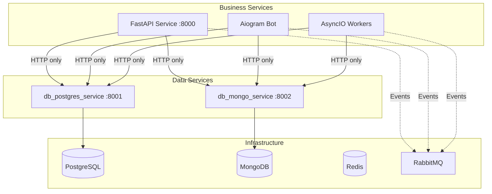

# Architecture Guide

> **🏗️ CANONICAL ARCHITECTURE REFERENCE**: This document is the single source of truth for all architectural decisions, patterns, and constraints. All implementation must follow these guidelines.

## Table of Contents
- [Improved Hybrid Approach Overview](#improved-hybrid-approach-overview)
- [Core Principles and Constraints](#core-principles-and-constraints)
- [Service Types and Separation](#service-types-and-separation)
- [Data Access Architecture](#data-access-architecture)
- [Inter-Service Communication](#inter-service-communication)
- [Event-Driven Architecture](#event-driven-architecture)
- [DDD/Hexagonal Architecture](#dddhexagonal-architecture)
- [Quality Standards](#quality-standards)
- [Implementation Guidelines](#implementation-guidelines)

---

## Improved Hybrid Approach Overview

The **Improved Hybrid Approach** is the foundational architecture pattern for this microservices platform. It combines the best aspects of microservices architecture with centralized data access to achieve optimal performance, maintainability, and scalability.

### Key Characteristics

- **Centralized Data Services**: Two dedicated services handle ALL database operations
- **Business Logic Separation**: Business services contain ONLY business logic
- **HTTP-Only Data Access**: No direct database connections in business services
- **Event-Driven Communication**: RabbitMQ for inter-service messaging
- **Service Type Isolation**: Each service type runs in separate processes

### Architecture Diagram



---

## Core Principles and Constraints

### MANDATORY Architectural Constraints

These constraints are **NON-NEGOTIABLE** and must be followed in all implementations:

#### 1. **Data Access Architecture** (Improved Hybrid Approach)
- **MANDATORY**: Centralized Data Services - Two dedicated data services handle ALL database operations:
  - `db_postgres_service` (Port: 8001) - PostgreSQL data access service
  - `db_mongo_service` (Port: 8002) - MongoDB data access service
- **MANDATORY**: Business Logic Separation - Business services (`api_service`, `bot_service`, `worker_service`) contain ONLY business logic
- **MANDATORY**: HTTP-Only Data Access - Business services access data EXCLUSIVELY via HTTP APIs to data services
- **❌ PROHIBITED**: Direct database connections in business services

#### 2. **Service Type Separation** (Critical for Event Loop Management)
- **MANDATORY**: Event Loop Isolation - Each service type MUST run in separate processes/containers
- **Service Types**:
  - **HTTP API Services**: FastAPI + Uvicorn (separate process)
  - **Telegram Bot Services**: Aiogram (separate process)
  - **Background Workers**: AsyncIO workers (separate process)
- **❌ PROHIBITED**: Running multiple event loop managers (FastAPI + Aiogram) in same process
- **MANDATORY**: Communication - Use RabbitMQ for inter-service communication

#### 3. **Technology Stack Requirements**
- **MANDATORY**: Python Version - 3.12+ MANDATORY for all services (unified runtime)
- **MANDATORY**: Base Image - `python:3.12-slim` for all Docker containers
- **MANDATORY**: Async Libraries - Use only async-compatible libraries (asyncpg, aio-pika, redis.asyncio)
- **MANDATORY**: Database Strategy - Dual database approach (PostgreSQL + MongoDB)

> **📋 COMPLETE TECHNOLOGY SPECIFICATIONS**: For detailed versions, configurations, and compatibility information, see the [Technical Specifications](../LINKS_REFERENCE.md#core-documentation).

#### 4. **Naming Conventions** (Enforced Project-Wide)
- **MANDATORY**: Underscore-Only Policy - Use snake_case for ALL identifiers
- **❌ PROHIBITED**: Hyphens in any user-controlled names (files, variables, functions, databases, APIs)
- **MANDATORY**: Consistent naming across all layers (code, database, API, Docker, etc.)

> **📏 COMPLETE NAMING RULES**: See the [Naming Conventions](../LINKS_REFERENCE.md#ide-rules-and-patterns) for comprehensive naming standards.

---

## Service Types and Separation

### Critical Event Loop Management

**Why Separation is Critical**: Different frameworks manage event loops differently. Running FastAPI and Aiogram in the same process creates conflicting event loop claims, leading to runtime errors and unstable behavior.

### Service Types and Technologies

#### HTTP API Services
- **Technology**: FastAPI + Uvicorn
- **Event Loop**: Managed by FastAPI/Uvicorn
- **Integration**: Redis and RabbitMQ via dependency injection
- **Process**: Separate container/process
- **Guide**: See [FastAPI Rules](../LINKS_REFERENCE.md#ide-rules-and-patterns)

#### Telegram Bot Services
- **Technology**: Aiogram
- **Event Loop**: Managed by Aiogram via `asyncio.run(dp.start_polling(bot))`
- **Integration**: Redis and RabbitMQ via dependency injection in Dispatcher
- **Process**: Separate container/process
- **Guide**: See [Aiogram Rules](../LINKS_REFERENCE.md#ide-rules-and-patterns)

#### Background Worker Services
- **Technology**: AsyncIO + aio-pika + redis.asyncio
- **Event Loop**: `asyncio.run(main())` in separate process
- **Integration**: Direct use of async libraries
- **Process**: Separate container/process
- **Guide**: See [AsyncIO Rules](../LINKS_REFERENCE.md#ide-rules-and-patterns)

### Inter-Service Communication Patterns
- **Synchronous**: HTTP API between services (FastAPI ↔ FastAPI)
- **Asynchronous**: RabbitMQ events between all service types
- **Caching**: Redis for all service types (idempotency, cache, sessions)
- **Tracing**: Request ID and OpenTelemetry trace propagation

---

## Data Access Architecture

### Centralized Data Services Pattern

The Improved Hybrid Approach uses dedicated data services to centralize all database operations while maintaining service autonomy for business logic.

#### Data Service Responsibilities
- **PostgreSQL Data Service** (`db_postgres_service`):
  - Handles all relational data operations
  - Users, products, orders, payments
  - ACID transactions and complex queries
  - Port: 8001 (external), Port: 8000 (internal)

- **MongoDB Data Service** (`db_mongo_service`):
  - Handles all document and analytics data
  - User behavior, application logs, analytics events
  - Aggregation pipelines and real-time analytics
  - Port: 8002 (external), Port: 8000 (internal)

#### Business Service Integration
- **HTTP-Only Access**: Business services communicate with data services via HTTP APIs
- **No Direct Database Connections**: Business services never connect directly to databases
- **Request Context**: All requests include request_id and user_id for tracing
- **Error Handling**: Proper HTTP status code handling and retry logic

### Data Access Patterns

```python
# ✅ CORRECT: HTTP-based data access in business service
async def get_user_profile(user_id: str, request_id: str) -> UserProfile:
    # Get user data via PostgreSQL service
    user_data = await postgres_client.get_user(user_id, request_id)

    # Get analytics data via MongoDB service
    analytics_data = await mongo_client.get_user_analytics(user_id, request_id)

    # Business logic: combine and transform data
    return UserProfile.combine(user_data, analytics_data)

# ❌ WRONG: Direct database access in business service
async def get_user_profile(user_id: str) -> UserProfile:
    # PROHIBITED: Direct database connection
    user = await db.execute(select(User).where(User.id == user_id))
    return UserProfile.from_orm(user)
```

> **📋 DETAILED DATA ACCESS RULES**: See the [Data Access Rules](../LINKS_REFERENCE.md#ide-rules-and-patterns) for comprehensive data access patterns.

---

## Inter-Service Communication

### Communication Types

#### 1. **Synchronous Communication** (HTTP)
- **Use Case**: Direct data access and immediate responses
- **Pattern**: Business services → Data services
- **Protocol**: HTTP/HTTPS with JSON payloads
- **Error Handling**: HTTP status codes, timeouts, retries

#### 2. **Asynchronous Communication** (Events)
- **Use Case**: Cross-service notifications and event-driven workflows
- **Pattern**: All services → RabbitMQ → All services
- **Protocol**: AMQP with JSON payloads
- **Reliability**: Persistent queues, acknowledgments, dead letter queues

### Communication Patterns

```python
# HTTP Communication Example
async def create_user(user_data: UserCreate, request_id: str) -> UserResponse:
    # Create user via HTTP call to PostgreSQL service
    user = await postgres_client.create_user(user_data.dict(), request_id)

    # Publish event for other services
    await publish_event("user.created", {
        "user_id": user["id"],
        "email": user["email"],
        "timestamp": datetime.utcnow().isoformat()
    })

    return UserResponse(**user)

# Event Handling Example
async def handle_user_created_event(event_data: dict) -> None:
    user_id = event_data["user_id"]

    # Business logic: initialize user analytics
    await analytics_service.initialize_user_metrics(user_id)

    # Business logic: send welcome email
    await notification_service.send_welcome_email(event_data["email"])
```

> **📋 DETAILED COMMUNICATION RULES**: See the [RabbitMQ Rules](../LINKS_REFERENCE.md#ide-rules-and-patterns) for comprehensive messaging patterns.

---

## Event-Driven Architecture

### Event Patterns

#### Event Types
- **Entity Events**: `user.created`, `order.completed`, `payment.processed`
- **Process Events**: `workflow.started`, `batch.completed`, `notification.sent`
- **System Events**: `service.started`, `health.degraded`, `metrics.collected`

#### Event Structure
```json
{
  "event_type": "user.created",
  "event_id": "uuid-v6",
  "timestamp": "2025-01-15T10:30:00Z",
  "service": "api_service",
  "request_id": "req-uuid",
  "user_id": "user-uuid",
  "data": {
    "user_id": "user-uuid",
    "email": "user@example.com",
    "registration_source": "web"
  }
}
```

#### Event Processing Patterns
- **Fire-and-Forget**: Non-critical notifications
- **At-Least-Once**: Critical business events with idempotency
- **Saga Pattern**: Complex workflows spanning multiple services
- **Event Sourcing**: Audit trails and state reconstruction

---

## DDD/Hexagonal Architecture

### Domain-Driven Design Layers

#### 1. **Domain Layer** (Core)
- **Business Entities**: User, Product, Order, Task
- **Value Objects**: Email, Money, Address
- **Domain Services**: Business rules and calculations
- **Domain Events**: Business-significant occurrences
- **No Dependencies**: Pure business logic, no infrastructure

#### 2. **Application Layer** (Use Cases)
- **Application Services**: Orchestrate business workflows
- **Use Cases**: Specific business scenarios
- **Command/Query Handlers**: CQRS patterns
- **Event Handlers**: React to domain events
- **Minimal Dependencies**: Only domain layer

#### 3. **Infrastructure Layer** (External Concerns)
- **Repositories**: Data access implementations
- **HTTP Clients**: External service communication
- **Message Publishers**: Event publishing
- **Configuration**: Settings and environment variables
- **Framework Integration**: FastAPI, Aiogram adapters

#### 4. **Interface Layer** (Presentation)
- **Controllers**: HTTP request handling
- **Routers**: API endpoint definitions
- **Bot Handlers**: Telegram command handling
- **Middleware**: Cross-cutting concerns
- **DTO Mappers**: Request/response transformation

### Hexagonal Architecture Benefits

- **Testability**: Easy to test business logic in isolation
- **Flexibility**: Easy to swap infrastructure components
- **Maintainability**: Clear separation of concerns
- **Scalability**: Independent scaling of different layers

---

## Quality Standards

### Code Quality Requirements

#### 1. **Type Annotations** (MANDATORY)
- **Full typing required**: All functions must have complete type hints
- **Enforcement**: mypy>=1.8.0 with strict settings
- **No `Any` types**: Use specific types or Union types
- **Return types**: All functions must specify return types

#### 2. **Test Coverage** (MANDATORY)
- **Critical Paths**: 100% coverage for business logic
- **Integration Tests**: Real database testing via testcontainers
- **Unit Tests**: Mock external dependencies
- **End-to-End Tests**: Complete user workflows

#### 3. **Code Quality Tools** (MANDATORY)
- **Linting**: Ruff (PEP8 compliance)
- **Type Checking**: Mypy (strict mode)
- **Security**: Bandit (static analysis)
- **Formatting**: Ruff format (consistent style)

#### 4. **Documentation** (REQUIRED)
- **Comprehensive docstrings**: All public methods
- **API documentation**: OpenAPI/Swagger
- **Architecture decisions**: Documented rationale
- **Examples**: Working code samples

### Performance Standards

- **Response Times**: < 200ms for simple operations, < 1s for complex
- **Database Queries**: Optimized with proper indexes
- **Connection Pooling**: Configured for all external services
- **Caching**: Redis for frequently accessed data
- **Resource Limits**: Memory and CPU constraints in production

---

## Implementation Guidelines

### Service Development Checklist

#### For FastAPI Services
- [ ] Implement health check endpoint (`/health`)
- [ ] Use dependency injection for data clients
- [ ] Implement proper error handling and HTTP status codes
- [ ] Add OpenAPI documentation with examples
- [ ] Configure CORS, rate limiting, and security middleware
- [ ] Implement request/response logging with correlation IDs

#### For Aiogram Services
- [ ] Implement graceful startup and shutdown
- [ ] Use dependency injection in dispatcher
- [ ] Handle all bot update types (messages, callbacks, etc.)
- [ ] Implement user session management
- [ ] Add comprehensive error handling
- [ ] Configure webhook mode for production

#### For AsyncIO Workers
- [ ] Implement proper signal handling for graceful shutdown
- [ ] Use connection pooling for external services
- [ ] Implement retry logic with exponential backoff
- [ ] Add comprehensive logging with context
- [ ] Monitor queue backlogs and processing times
- [ ] Implement health checks for worker processes

#### For Data Services
- [ ] Implement repository pattern for data access
- [ ] Use proper transaction management
- [ ] Add comprehensive validation with Pydantic
- [ ] Implement connection pooling and health checks
- [ ] Add database migration support (Alembic)
- [ ] Configure proper indexing for performance

### Security Requirements

- **Authentication**: OAuth2/JWT for API endpoints
- **Authorization**: Role-based access control
- **Input Validation**: Pydantic schemas for all inputs
- **SQL Injection Prevention**: Parameterized queries only
- **Rate Limiting**: Per-user and per-endpoint limits
- **HTTPS**: Required for all production communication
- **Secrets Management**: Environment variables only, no hardcoded secrets

---

## 🔗 Related Documentation

### Implementation Resources
- **Development Commands**: [Development Commands](../LINKS_REFERENCE.md#developer-guides)
- **Technology Specifications**: [Technical Specifications](../LINKS_REFERENCE.md#core-documentation)
- **Troubleshooting**: [Troubleshooting](../LINKS_REFERENCE.md#developer-guides)

### Implementation Rules
- **IDE Rules & Patterns**: [IDE Rules & Patterns](../LINKS_REFERENCE.md#ide-rules-and-patterns) (15 rule files for architecture, services, etc.)
- **FastAPI Rules**: [FastAPI Rules](../LINKS_REFERENCE.md#ide-rules-and-patterns)
- **Aiogram Rules**: [Aiogram Rules](../LINKS_REFERENCE.md#ide-rules-and-patterns)
- **AsyncIO Rules**: [AsyncIO Rules](../LINKS_REFERENCE.md#ide-rules-and-patterns)
- **Data Access Rules**: [Data Access Rules](../LINKS_REFERENCE.md#ide-rules-and-patterns)
- **Testing Standards**: [Testing Standards](../LINKS_REFERENCE.md#ide-rules-and-patterns)

### Project Organization
- **Main Guide**: [Main Entry Point](../LINKS_REFERENCE.md#core-documentation)
- **Use Case Implementation**: [Use Case Implementation](../LINKS_REFERENCE.md#developer-guides)

---

## Architectural Decision Records

### ADR-001: Improved Hybrid Approach
**Decision**: Adopt centralized data services with HTTP-only business service access
**Rationale**: Simplifies data access patterns while maintaining service autonomy
**Status**: Accepted

### ADR-002: Service Type Separation
**Decision**: Run each service type (FastAPI, Aiogram, AsyncIO) in separate processes
**Rationale**: Prevents event loop conflicts and improves system stability
**Status**: Accepted

### ADR-003: Dual Database Strategy
**Decision**: Use PostgreSQL for relational data and MongoDB for analytics
**Rationale**: Optimizes for different data patterns and query requirements
**Status**: Accepted

### ADR-004: HTTP-Only Data Access
**Decision**: Prohibit direct database connections in business services
**Rationale**: Centralizes data expertise and simplifies service development
**Status**: Accepted

---

> **⚠️ COMPLIANCE REQUIRED**: All implementations must comply with this architecture guide. Violations will result in system instability and maintainability issues. When in doubt, refer to the implementation rules in [Main Project Guide](../LINKS_REFERENCE.md#core-documentation).
