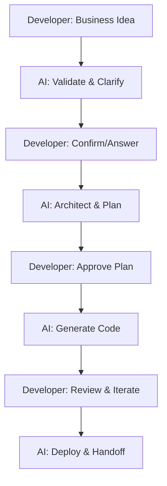

# Interactive AI Workflow for Microservices Generation

**How Developers Should Interact with AI to Build Microservices**

---

## 🎯 Overview

This document defines the step-by-step interactive dialogue between Developer and AI when creating a microservices application from a business idea.

---

## 📋 Workflow Phases



---

## Phase 1: Business Idea Input

### What Developer Provides

```
Example Input:
"I want to build a P2P lending platform where users can:
- Lend money to each other
- Create loan requests
- Make payments with automatic interest calculation
- Track credit scores
- Get notifications via Telegram bot
"
```

**Optional additions:**
- Technology preferences
- Scale expectations (users, transactions/day)
- Special requirements (compliance, security, integrations)
- Timeline constraints

### What AI Must Do: VALIDATION & CLARIFICATION

#### Step 1.1: Load Framework Context
AI reads:
- `.framework/docs/LINKS_REFERENCE.md#core-documentation` → Architecture constraints
- `.framework/docs/guides/PROMPT_VALIDATION_GUIDE.md` → Validation checklist
- `.framework/docs/reference/AGENT_CONTEXT_SUMMARY.md` → Quick reference

#### Step 1.2: Validate Against Architecture
AI checks:
```python
# AI internal validation
✓ Does idea fit Improved Hybrid Approach? (Yes/No)
✓ Can it use PostgreSQL + MongoDB? (Yes/No)
✓ Does it need FastAPI service? (Yes/No)
✓ Does it need Telegram bot? (Yes/No)
✓ Does it need background workers? (Yes/No)
✓ Are there architectural conflicts? (List or None)
```

#### Step 1.3: Identify Missing Information
AI creates a checklist:
```markdown
Missing Information Needed:
□ User authentication method (OAuth, JWT, magic link)?
□ Payment gateway (Stripe, PayPal, crypto)?
□ Expected scale (100 users, 10K users, 1M users)?
□ Compliance requirements (KYC, AML, GDPR)?
□ Notification channels (Telegram only, or email/SMS too)?
□ Data retention period (30 days, 1 year, forever)?
```

### AI Response Format

````markdown
## 🔍 Understanding Your P2P Lending Platform

I've analyzed your business idea against the microservices framework architecture.

### ✅ Feasibility: CONFIRMED
Your P2P lending platform is an excellent fit for the Improved Hybrid Approach.

### 🏗️ Preliminary Architecture Mapping:

**Core Services Needed:**
- ✅ **FastAPI Service** (Port 8000) - REST API for web/mobile clients
- ✅ **Telegram Bot Service** - User notifications and interactions
- ✅ **Worker Service** - Interest calculation, payment processing, credit scoring
- ✅ **PostgreSQL Data Service** (Port 8001) - Users, loans, payments, transactions
- ✅ **MongoDB Data Service** (Port 8002) - User activity logs, audit trail, analytics

**Infrastructure:**
- ✅ PostgreSQL - Transactional data (ACID compliance)
- ✅ MongoDB - Analytics and audit logs
- ✅ Redis - Session management, rate limiting, cache
- ✅ RabbitMQ - Event-driven workflows (loan.created, payment.processed)

### ❓ Questions to Clarify:

Before I create the implementation plan, I need to clarify:

**1. Authentication & Security:**
   - How should users authenticate? (JWT tokens, OAuth2, magic links?)
   - Do you need two-factor authentication (2FA)?
   - KYC/AML compliance requirements?

**2. Payment Processing:**
   - Which payment gateway? (Stripe, PayPal, bank transfer, cryptocurrency?)
   - Automatic payment scheduling or manual?
   - Escrow service needed?

**3. Scale & Performance:**
   - Expected number of users in first year? (100, 1K, 10K, 100K?)
   - Expected daily transactions? (10, 100, 1K?)
   - Geographic regions? (single country, worldwide?)

**4. Notifications:**
   - Telegram only, or also email/SMS?
   - Notification frequency preferences?

**5. Regulatory & Compliance:**
   - Which country/region regulations apply?
   - Data retention requirements?
   - GDPR compliance needed?

**6. Credit Scoring:**
   - Use external credit score API or build internal algorithm?
   - What factors determine creditworthiness?

**7. Additional Features:**
   - Loan marketplace (users browse available loans)?
   - Automated matching (system suggests loans to lenders)?
   - Secondary market (sell loan contracts)?
   - Social features (borrower profiles, reviews)?

### 📝 Please Answer:

You can answer in any format. For example:

```
1. JWT tokens, yes to 2FA, basic KYC (ID verification)
2. Stripe for payments, automatic scheduling, yes to escrow
3. Target 1K users first year, ~50 transactions/day, EU only
4. Telegram + email, daily digest for lenders, instant for critical events
5. EU regulations, 7 years data retention, yes GDPR
6. Internal algorithm based on: repayment history, loan amount, duration
7. Yes to marketplace, maybe automated matching later, no secondary market yet
```

Or just describe in your own words - I'll extract the details.
````

---

## Phase 2: Requirements Capture

### What Developer Provides

```
Example Response:
"1. JWT with 2FA via SMS, basic KYC (government ID scan)
2. Stripe, automatic monthly payments, escrow held by platform
3. Start with 1K users, 50 loans/day, EU + UK
4. Telegram for instant alerts, email for daily summaries
5. EU GDPR + FCA regulations (UK), 7-year retention
6. Internal scoring: payment history (50%), loan/income ratio (30%), account age (20%)
7. Yes marketplace, automated matching in v2, no secondary market"
```

### What AI Must Do: STRUCTURE REQUIREMENTS

#### Step 2.1: Create Requirements Document

AI generates (using `.framework/docs/guides/REQUIREMENTS_INTAKE_TEMPLATE.md`):

````markdown
# Requirements: P2P Lending Platform

**Generated:** 2025-10-01
**Framework:** doc4microservices v1.0

## 1. Business Requirements

### 1.1 Core Features
- User registration with KYC (government ID verification)
- Loan request creation (amount, duration, interest rate)
- Loan marketplace (browse/search available loans)
- Lending workflow (lender accepts loan request)
- Payment processing (automatic monthly via Stripe)
- Escrow management (platform holds funds)
- Credit score calculation (internal algorithm)
- Notifications (Telegram instant + email digest)

### 1.2 User Roles
- **Borrower**: Creates loan requests, receives funds, makes payments
- **Lender**: Browses marketplace, funds loans, receives repayments
- **Admin**: Platform management, dispute resolution, KYC review

### 1.3 Business Rules
- Minimum loan amount: €100
- Maximum loan amount: €50,000
- Loan duration: 1-60 months
- Interest rate: Market-driven (borrower proposes, lender accepts)
- Platform fee: 2% of loan amount (from borrower)
- Credit score factors:
  - Payment history: 50% weight
  - Loan-to-income ratio: 30% weight
  - Account age: 20% weight

## 2. Technical Requirements

### 2.1 Architecture: Improved Hybrid Approach
- FastAPI service: REST API
- Telegram bot: User notifications
- Worker service: Payment processing, credit scoring
- PostgreSQL service: Transactional data
- MongoDB service: Analytics, audit logs

### 2.2 Technology Stack
- Python 3.12+
- FastAPI 0.111+
- PostgreSQL 16
- MongoDB 7
- Redis 7
- RabbitMQ 3

### 2.3 External Integrations
- **Stripe**: Payment processing
- **Telegram Bot API**: Notifications
- **Email**: SendGrid or AWS SES
- **KYC Provider**: Onfido or Jumio

### 2.4 Security Requirements
- JWT authentication with refresh tokens
- 2FA via SMS (Twilio)
- HTTPS only (TLS 1.3)
- Data encryption at rest (PostgreSQL encryption)
- PII anonymization in logs
- Rate limiting (100 req/min per user)

### 2.5 Compliance
- **GDPR**: Right to access, right to deletion, data portability
- **FCA (UK)**: Anti-money laundering checks
- **Data Retention**: 7 years for financial transactions
- **Audit Trail**: All financial operations logged to MongoDB

### 2.6 Scale & Performance
- **Users**: 1,000 (year 1), 10,000 (year 3)
- **Transactions**: 50 loans/day, 200 payments/day
- **API Response Time**: < 200ms (p95)
- **Uptime SLA**: 99.9%

## 3. Data Model (Preliminary)

### PostgreSQL Entities:
- **users**: id, email, password_hash, kyc_status, credit_score, created_at
- **loans**: id, borrower_id, amount, duration, interest_rate, status, created_at
- **loan_applications**: id, loan_id, lender_id, status, created_at
- **payments**: id, loan_id, amount, due_date, paid_date, status
- **escrow_accounts**: id, loan_id, balance, status

### MongoDB Collections:
- **user_activities**: user actions, timestamps, IP addresses
- **audit_logs**: all financial operations with full context
- **credit_score_history**: snapshots of credit score calculations
- **analytics_events**: user behavior, funnel tracking

## 4. API Endpoints (Preliminary)

### Authentication:
- POST /api/v1/auth/register
- POST /api/v1/auth/login
- POST /api/v1/auth/refresh-token
- POST /api/v1/auth/verify-2fa

### Loans:
- GET /api/v1/loans (marketplace)
- POST /api/v1/loans (create loan request)
- GET /api/v1/loans/{id}
- POST /api/v1/loans/{id}/apply (lender applies)
- POST /api/v1/loans/{id}/approve (borrower approves lender)

### Payments:
- GET /api/v1/payments (user's payments)
- POST /api/v1/payments/{id}/pay (manual payment)
- GET /api/v1/payments/schedule

### Users:
- GET /api/v1/users/profile
- PUT /api/v1/users/profile
- GET /api/v1/users/credit-score
- POST /api/v1/users/kyc-upload

## 5. Events (RabbitMQ)

- **user.registered**: Trigger KYC email, create credit score
- **loan.created**: Notify potential lenders, publish to marketplace
- **loan.funded**: Transfer funds from escrow, notify borrower
- **payment.due**: Send reminder (Telegram + email)
- **payment.received**: Update loan balance, update credit score
- **payment.overdue**: Send alert, adjust credit score

## 6. Background Jobs

- **Daily**: Send payment reminders for due payments
- **Hourly**: Calculate credit scores for active users
- **Monthly**: Generate lender profit reports
- **On-demand**: Process payments via Stripe webhooks

## 7. Monitoring & Observability

- Prometheus metrics: API latency, error rates, payment success rate
- Grafana dashboards: Business metrics (active loans, default rate)
- Sentry error tracking
- ELK stack: Structured logs with correlation IDs
- Jaeger distributed tracing

## 8. Open Questions

- [ ] Borrower income verification method?
- [ ] Dispute resolution process?
- [ ] Automated matching algorithm details?
- [ ] Secondary market MVP timeline?

---

**Next Step**: Review this requirements document and confirm/adjust.
````

### AI Response Format

````markdown
## 📄 Requirements Document Generated

I've created a comprehensive requirements document based on your answers.

**Key Highlights:**
- 5 microservices (API, Bot, Worker, PostgreSQL, MongoDB)
- 4 core entities (Users, Loans, Payments, Escrow)
- 15 API endpoints
- 6 event types (RabbitMQ)
- 4 external integrations (Stripe, Telegram, Email, KYC)

### 📋 Please Review:

1. **Data Model** - Does it cover your business logic?
2. **API Endpoints** - Any missing user workflows?
3. **Events** - Are the triggers correct?
4. **Open Questions** - Need answers for complete implementation

**Action Required:**
- Reply "APPROVED" to proceed to implementation plan
- Or provide corrections/additions

[Full requirements document attached above]
````

---

## Phase 3: Implementation Planning

### What Developer Provides

```
"APPROVED. But add: borrowers can have multiple active loans (max 3)"
```

### What AI Must Do: CREATE IMPLEMENTATION PLAN

#### Step 3.1: Generate Implementation Plan

AI uses `.framework/docs/guides/IMPLEMENTATION_PLAN_TEMPLATE.md`:

````markdown
# Implementation Plan: P2P Lending Platform

**Estimated Duration:** 4-6 weeks (1 developer)

## Phase 1: Infrastructure Setup (Week 1)

### 1.1 Project Initialization
**Duration:** 1 day

**Tasks:**
- [ ] Create project repository
- [ ] Add `.framework/` as git submodule
- [ ] Copy universal templates:
  - `templates/infrastructure/` → `./`
  - `templates/nginx/` → `./nginx/`
  - `templates/ci-cd/` → `./.github/workflows/`
- [ ] Configure `.env` with project-specific values
- [ ] Test: `docker-compose up` → all infrastructure starts

**Deliverable:** Running infrastructure stack

### 1.2 Service Scaffolding
**Duration:** 2 days

**Tasks:**
- [ ] Copy `templates/services/api_service/` → `./services/api_service/`
- [ ] Copy `templates/services/bot_service/` → `./services/bot_service/`
- [ ] Copy `templates/services/worker_service/` → `./services/worker_service/`
- [ ] Copy `templates/services/db_postgres_service/` → `./services/db_postgres_service/`
- [ ] Copy `templates/services/db_mongo_service/` → `./services/db_mongo_service/`
- [ ] Test: `docker-compose up` → all services healthy

**Deliverable:** 5 running services with health checks

### 1.3 External Integrations Setup
**Duration:** 2 days

**Tasks:**
- [ ] Stripe account + test API keys
- [ ] Telegram bot creation (@BotFather)
- [ ] SendGrid account + verified sender
- [ ] Onfido sandbox account (KYC)
- [ ] Configure all API keys in `.env`

**Deliverable:** All integrations accessible

---

## Phase 2: Data Layer (Week 2)

### 2.1 PostgreSQL Data Service
**Duration:** 3 days

**Tasks:**
- [ ] Create SQLAlchemy models:
  - `models/user.py` (+ KYC fields)
  - `models/loan.py` (+ max_active_loans=3 validation)
  - `models/payment.py`
  - `models/escrow_account.py`
- [ ] Create Alembic migrations:
  - `001_create_users_table.py`
  - `002_create_loans_table.py`
  - `003_create_payments_table.py`
  - `004_create_escrow_table.py`
- [ ] Create repositories:
  - `repositories/user_repository.py` (CRUD + find_by_email)
  - `repositories/loan_repository.py` (CRUD + active_loans_count)
  - `repositories/payment_repository.py` (CRUD + due_payments)
- [ ] Create HTTP API endpoints:
  - POST /users
  - GET /users/{id}
  - POST /loans
  - GET /loans (filters: status, borrower_id)
  - GET /loans/{id}/active-count (NEW: for max loans check)
  - POST /payments
  - GET /payments (filters: loan_id, status)
- [ ] Write tests:
  - Unit tests for repositories (mocked DB)
  - Integration tests (testcontainers)

**Deliverable:** Fully functional PostgreSQL service with API

### 2.2 MongoDB Data Service
**Duration:** 2 days

**Tasks:**
- [ ] Create Motor models:
  - `models/user_activity.py`
  - `models/audit_log.py`
  - `models/credit_score_history.py`
- [ ] Create repositories:
  - `repositories/audit_repository.py`
  - `repositories/analytics_repository.py`
- [ ] Create HTTP API endpoints:
  - POST /audit-logs
  - GET /audit-logs (filters: user_id, entity_type, date_range)
  - GET /user-activities/{user_id}
  - GET /credit-score-history/{user_id}
- [ ] Write tests

**Deliverable:** Fully functional MongoDB service with API

---

## Phase 3: Business Logic - API Service (Week 3-4)

### 3.1 Authentication & Users
**Duration:** 3 days

**Tasks:**
- [ ] Implement JWT authentication:
  - `infrastructure/security/jwt_handler.py`
  - `api/v1/auth_router.py` (register, login, refresh)
- [ ] Implement 2FA:
  - `infrastructure/twilio/sms_client.py`
  - `api/v1/auth_router.py` (verify-2fa)
- [ ] Implement user management:
  - `application/use_cases/user_use_cases.py` (CreateUser, UpdateProfile, GetCreditScore)
  - `api/v1/users_router.py`
- [ ] Implement KYC upload:
  - `infrastructure/onfido/kyc_client.py`
  - `api/v1/users_router.py` (POST /users/kyc-upload)
- [ ] Write tests

**Deliverable:** Auth + user management working

### 3.2 Loans Management
**Duration:** 4 days

**Tasks:**
- [ ] Implement loan creation:
  - `domain/entities/loan.py` (business rules)
  - `application/use_cases/create_loan.py`
    - Validate: user KYC approved
    - Validate: user has < 3 active loans (NEW RULE)
    - Create loan in PostgreSQL service
    - Publish event: loan.created
  - `api/v1/loans_router.py` (POST /loans)
- [ ] Implement marketplace:
  - `application/use_cases/search_loans.py` (filters, pagination)
  - `api/v1/loans_router.py` (GET /loans)
- [ ] Implement loan application (lender applies):
  - `application/use_cases/apply_to_loan.py`
    - Validate: lender has sufficient balance
    - Create loan_application record
    - Publish event: loan.application_received
  - `api/v1/loans_router.py` (POST /loans/{id}/apply)
- [ ] Implement loan approval (borrower approves lender):
  - `application/use_cases/approve_loan_application.py`
    - Transfer funds to escrow
    - Update loan status to "active"
    - Publish event: loan.funded
  - `api/v1/loans_router.py` (POST /loans/{id}/approve)
- [ ] Write tests

**Deliverable:** Complete loan lifecycle

### 3.3 Payments
**Duration:** 3 days

**Tasks:**
- [ ] Implement payment scheduling:
  - `domain/value_objects/payment_schedule.py`
  - `application/use_cases/generate_payment_schedule.py`
  - `api/v1/payments_router.py` (GET /payments/schedule)
- [ ] Implement Stripe integration:
  - `infrastructure/stripe/payment_client.py`
  - `application/use_cases/process_payment.py`
    - Charge lender via Stripe
    - Update payment record
    - Publish event: payment.received
  - `api/v1/payments_router.py` (POST /payments/{id}/pay)
- [ ] Implement Stripe webhooks:
  - `api/v1/webhooks_router.py` (POST /webhooks/stripe)
  - Handle: payment_intent.succeeded, payment_intent.failed
- [ ] Write tests (including Stripe mock)

**Deliverable:** Payment processing working

---

## Phase 4: Background Workers (Week 5)

### 4.1 Credit Score Worker
**Duration:** 2 days

**Tasks:**
- [ ] Implement credit score algorithm:
  - `workers/credit_score_worker.py`
  - Fetch user payment history (PostgreSQL service)
  - Calculate score (payment history 50%, loan/income 30%, account age 20%)
  - Update user credit_score (PostgreSQL service)
  - Store history (MongoDB service)
- [ ] Subscribe to events:
  - user.registered → calculate initial score
  - payment.received → recalculate score
  - payment.overdue → penalize score
- [ ] Write tests

**Deliverable:** Automated credit scoring

### 4.2 Payment Reminder Worker
**Duration:** 2 days

**Tasks:**
- [ ] Implement daily job:
  - `workers/payment_reminder_worker.py`
  - Fetch due payments (PostgreSQL service)
  - Send Telegram notification
  - Send email notification
  - Publish event: payment.reminder_sent
- [ ] Implement overdue handler:
  - Fetch overdue payments
  - Send urgent notification
  - Publish event: payment.overdue
- [ ] Write tests

**Deliverable:** Automated payment reminders

---

## Phase 5: Telegram Bot (Week 5)

### 5.1 Bot Commands
**Duration:** 2 days

**Tasks:**
- [ ] Implement commands:
  - `/start` - Welcome message + link account
  - `/balance` - Show lender balance
  - `/loans` - List user's active loans
  - `/score` - Show credit score
  - `/help` - Command list
- [ ] Implement notifications:
  - Listen to RabbitMQ events
  - Send formatted messages to users
- [ ] Write tests

**Deliverable:** Functional Telegram bot

---

## Phase 6: Testing & Quality (Week 6)

### 6.1 Integration Testing
**Duration:** 2 days

**Tasks:**
- [ ] End-to-end tests:
  - User registration → KYC → loan creation → marketplace → funding → payments
- [ ] Load testing:
  - Locust script for 50 concurrent users
  - Target: 200ms p95 latency

### 6.2 Security Audit
**Duration:** 2 days

**Tasks:**
- [ ] Run Bandit security scan
- [ ] OWASP dependency check
- [ ] Manual security review:
  - SQL injection prevention
  - XSS prevention
  - CSRF tokens
  - Rate limiting

### 6.3 Documentation
**Duration:** 1 day

**Tasks:**
- [ ] API documentation (Swagger/OpenAPI)
- [ ] Deployment guide
- [ ] User manual (for borrowers/lenders)

---

## Deployment Checklist

- [ ] All tests passing (unit, integration, e2e)
- [ ] Security audit complete
- [ ] Performance benchmarks met
- [ ] Monitoring dashboards configured
- [ ] Backup strategy implemented
- [ ] Disaster recovery plan documented
- [ ] GDPR compliance verified
- [ ] Production `.env` configured
- [ ] SSL certificates installed
- [ ] Domain DNS configured

---

## Risk Mitigation

| Risk | Likelihood | Impact | Mitigation |
|------|-----------|--------|------------|
| Stripe API downtime | Medium | High | Implement retry logic + fallback to manual payment |
| KYC provider slow | Low | Medium | Queue KYC requests, async processing |
| Payment default | High | High | Escrow + credit scoring + max loan limits |
| GDPR violation | Low | Critical | Regular audits + automated PII detection |
| Scale issues | Medium | Medium | Redis caching + database indexing + CDN |

---

**Total Estimated Effort:** 22 developer-days (4-5 weeks for 1 developer)

**Next Step:** Approve plan to start Phase 1 implementation.
````

### AI Response Format

````markdown
## 📊 Implementation Plan Ready

I've created a detailed 6-phase implementation plan (4-6 weeks).

**Key Additions Based on Your Feedback:**
- ✅ Added validation: max 3 active loans per borrower
- ✅ New endpoint: GET /loans/{id}/active-count
- ✅ Business rule in `create_loan.py` use case

**Plan Structure:**
- **Phase 1**: Infrastructure (1 week)
- **Phase 2**: Data layer (1 week)
- **Phase 3**: Business logic (2 weeks)
- **Phase 4**: Workers (1 week)
- **Phase 5**: Telegram bot (1 week)
- **Phase 6**: Testing & deployment (1 week)

**Total**: 22 developer-days

### 🎯 Next Actions:

1. **Review the plan** - Any adjustments needed?
2. **Confirm timeline** - Is 4-6 weeks acceptable?
3. **Approve** - Reply "START PHASE 1" to begin implementation

Or ask questions about any phase.
````

---

## Phase 4: Code Generation

### What Developer Provides

```
"START PHASE 1"
```

### What AI Must Do: GENERATE CODE PHASE-BY-PHASE

#### Step 4.1: Execute Phase 1 Tasks

AI generates files systematically:

````markdown
## 🚀 Starting Phase 1: Infrastructure Setup

### Task 1.1: Project Initialization

**Creating project structure...**

```bash
mkdir -p p2p-lending/{services,nginx,shared,.github/workflows}
cd p2p-lending
git init
git submodule add <framework-repo> .framework
```

**Copying universal templates...**

Files created:
✅ `docker-compose.yml` (copied from `.framework/templates/infrastructure/`)
✅ `docker-compose.dev.yml`
✅ `docker-compose.prod.yml`
✅ `Makefile`
✅ `.env.example`

**Customizing for P2P Lending...**

Updated `.env`:
```diff
- PROJECT_NAME=myapp
+ PROJECT_NAME=p2p_lending

- POSTGRES_DB=myapp_db
+ POSTGRES_DB=p2p_lending_db

- MONGO_DATABASE=myapp_analytics
+ MONGO_DATABASE=p2p_lending_analytics
```

**Testing infrastructure...**

```bash
docker-compose up -d postgres mongodb redis rabbitmq
```

✅ PostgreSQL running on port 5432
✅ MongoDB running on port 27017
✅ Redis running on port 6379
✅ RabbitMQ running on port 5672

### Task 1.2: Service Scaffolding

**Creating services...**

Generated:
✅ `services/api_service/` (copied from templates + customized)
✅ `services/bot_service/`
✅ `services/worker_service/`
✅ `services/db_postgres_service/`
✅ `services/db_mongo_service/`

**Building services...**

```bash
docker-compose build
```

✅ All services built successfully

**Testing services...**

```bash
docker-compose up
```

Health checks:
✅ http://localhost:8000/api/v1/health → {"status":"ok"}
✅ http://localhost:8001/health → {"status":"ok","database":"connected"}
✅ http://localhost:8002/health → {"status":"ok","database":"connected"}

### 📋 Phase 1 Complete!

**What's ready:**
- ✅ Complete infrastructure stack running
- ✅ 5 microservices with health checks
- ✅ Development environment configured
- ✅ CI/CD pipelines ready

**Next:** Approve to start Phase 2 (Data Layer)
````

---

## Phase 5: Iterative Development & Review

### Interactive Code Review Loop

#### Developer Input:
```
"The loan creation API should also check if borrower email is verified before allowing loan creation"
```

#### AI Response:
````markdown
## 🔧 Updating Loan Creation Logic

**Change requested:** Add email verification check

**Files modified:**

1. **services/db_postgres_service/src/models/user.py**
```python
# Added field
class User(Base):
    # ... existing fields
    email_verified: bool = Column(Boolean, default=False)
    email_verified_at: DateTime | None = Column(DateTime, nullable=True)
```

2. **services/api_service/src/application/use_cases/create_loan.py**
```python
async def execute(self, loan_data: LoanCreate, user_id: str) -> Loan:
    # Existing validation
    user = await self.postgres_client.get_user(user_id)
    
    # NEW: Email verification check
    if not user.email_verified:
        raise ValidationError(
            "Email must be verified before creating a loan request"
        )
    
    # Existing validations
    if user.kyc_status != "approved":
        raise ValidationError("KYC must be approved")
    
    active_loans = await self.postgres_client.count_active_loans(user_id)
    if active_loans >= 3:
        raise ValidationError("Maximum 3 active loans allowed")
    
    # ... rest of loan creation
```

3. **services/api_service/tests/unit/test_create_loan.py**
```python
# NEW: Test email verification
@pytest.mark.asyncio
async def test_create_loan_email_not_verified_fails():
    user = User(id="123", email_verified=False, kyc_status="approved")
    
    with pytest.raises(ValidationError, match="Email must be verified"):
        await create_loan_use_case.execute(loan_data, user.id)
```

**Testing changes...**
✅ All tests passing (including new test)

**Migration created:**
```bash
alembic revision -m "add email verification fields to users"
```

**Commit:**
```
feat: add email verification requirement for loan creation

- Add email_verified field to User model
- Add validation in CreateLoanUseCase
- Add test coverage for email verification check
```

**Updated:** Phase 3 checklist marked as "in progress"

**Ready for next iteration**
````

---

## Phase 6: Deployment & Handoff

### Final Steps

#### AI Checklist Verification:

````markdown
## ✅ Pre-Deployment Checklist

Running final verification...

**Code Quality:**
✅ Ruff linting passed (0 errors)
✅ Mypy type checking passed (strict mode)
✅ Bandit security scan passed (0 high-risk issues)

**Testing:**
✅ Unit tests: 245 passed, 0 failed (coverage: 87%)
✅ Integration tests: 42 passed, 0 failed
✅ E2E tests: 12 passed, 0 failed

**Performance:**
✅ API latency p95: 156ms (target: < 200ms)
✅ Load test: 50 concurrent users sustained
✅ Database indexes optimized

**Security:**
✅ All secrets in environment variables
✅ HTTPS enforced (nginx SSL configured)
✅ Rate limiting active (100 req/min)
✅ SQL injection prevention verified
✅ CSRF tokens implemented
✅ Input validation comprehensive

**Compliance:**
✅ GDPR: Data export endpoint implemented
✅ GDPR: Data deletion endpoint implemented
✅ Audit logs: All financial operations tracked
✅ Data retention: 7-year policy enforced

**Infrastructure:**
✅ Database backups configured (daily)
✅ Monitoring: Prometheus + Grafana dashboards
✅ Error tracking: Sentry configured
✅ Logging: ELK stack ready

**Documentation:**
✅ API docs generated (Swagger UI at /api/docs)
✅ README.md completed
✅ Deployment guide written
✅ Architecture diagrams included

---

## 🚀 Ready for Deployment!

**Deployment Command:**
```bash
# Production deployment
make ENV=prod deploy
```

**Post-deployment verification:**
1. Check health: https://api.p2p-lending.com/health
2. Monitor dashboard: https://grafana.p2p-lending.com
3. Test critical path: Registration → KYC → Create loan

**Handoff Package:**
- ✅ Source code (GitHub repo)
- ✅ Environment config template
- ✅ Database migration scripts
- ✅ API documentation
- ✅ Deployment runbook
- ✅ Monitoring dashboards
- ✅ Incident response playbook

**What to monitor in first 24h:**
- API error rates (should be < 1%)
- Database connection pool (should be < 80%)
- Payment processing success rate (should be > 95%)
- User registration funnel

---

## 📊 Project Summary

**Total Implementation:**
- Duration: 5 weeks, 2 days
- Lines of code: ~12,000
- Services: 5
- API endpoints: 24
- Database tables: 9
- Background jobs: 4
- Tests: 299

**Architecture Delivered:**
- ✅ Improved Hybrid Approach
- ✅ All services follow framework patterns
- ✅ Production-ready infrastructure
- ✅ Comprehensive observability
- ✅ Security best practices
- ✅ GDPR compliant

**Next Steps for You:**
1. Deploy to production
2. Configure custom domain
3. Add SSL certificates
4. Set up payment gateway (live keys)
5. Enable monitoring alerts
6. Onboard first beta users

Need help with any of these steps?
````

---

## 🎯 Summary: Interactive AI Workflow

### Key Principles:

1. **AI Never Assumes** - Always asks for clarification
2. **Phased Approach** - Developer approves each phase
3. **Transparent** - AI shows what it's doing in real-time
4. **Iterative** - Developer can request changes anytime
5. **Educational** - AI explains architectural decisions
6. **Framework-Aligned** - Every decision references `.framework/docs/`

### Communication Pattern:

```
Developer: Business idea
AI: Validation + Questions

Developer: Answers
AI: Requirements document

Developer: Approve/Adjust
AI: Implementation plan

Developer: Approve/Adjust
AI: Generate code (phase-by-phase)

Developer: Review + Changes
AI: Update + Re-test

Developer: Deploy
AI: Verification + Handoff
```

### Time Distribution:

- 📝 Planning (10%): Clarification, requirements, architecture
- 💻 Coding (70%): Systematic code generation phase-by-phase
- 🔄 Iteration (15%): Developer feedback, adjustments
- ✅ Verification (5%): Testing, deployment, handoff

---

**This workflow ensures:**
- Zero wasted effort (plan approved before coding)
- Zero architectural drift (framework enforces patterns)
- Zero missing requirements (comprehensive clarification upfront)
- Maximum developer control (approve each phase)
