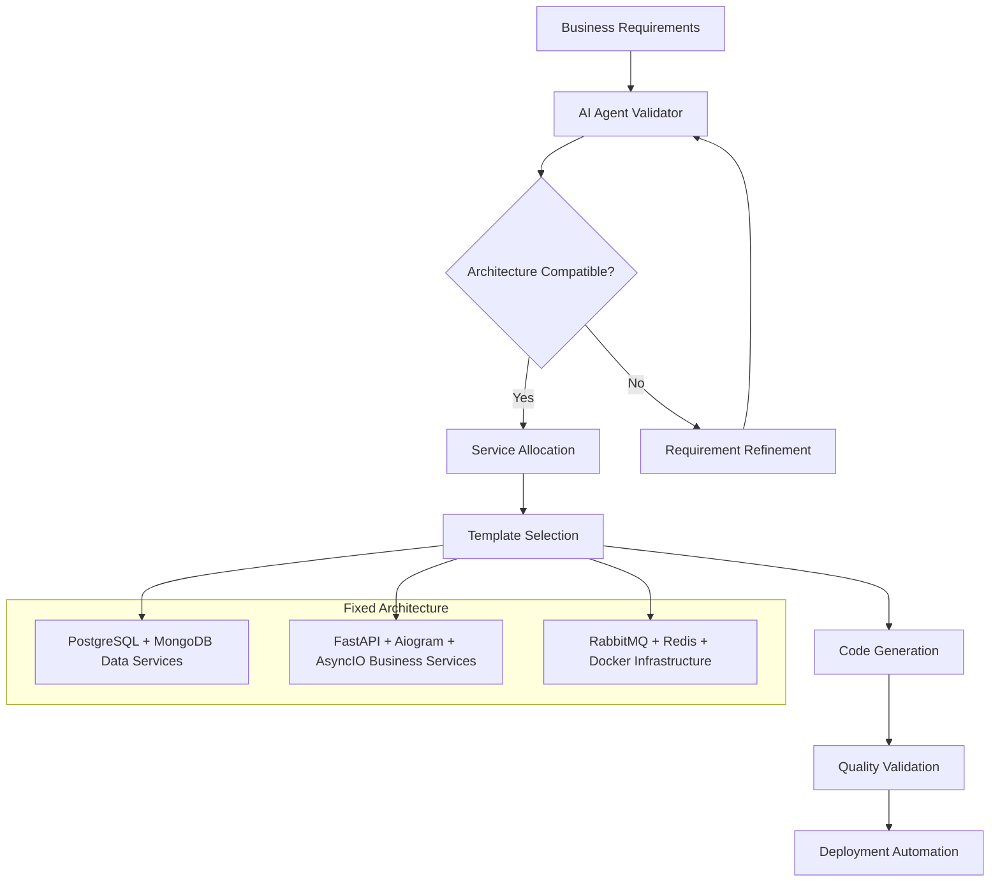

# AI Agents Usage Example

> **🤖 PURPOSE**: Complete guide for using AI agents to automatically generate microservices from business requirements

This example demonstrates how to use the AI agent framework to automatically generate production-ready microservices following the Improved Hybrid Approach architecture.

## 📋 Table of Contents

- [AI Agent Framework Overview](#ai-agent-framework-overview)
- [Service Template System](#service-template-system)
- [Business Requirement Processing](#business-requirement-processing)
- [Code Generation Workflow](#code-generation-workflow)
- [Template Customization](#template-customization)
- [Quality Validation](#quality-validation)
- [Complete Generation Example](#complete-generation-example)

## 🤖 AI Agent Framework Overview

### Architecture-First Approach

The AI agent framework uses a **fixed architecture** strategy:



### Key Principles

1. **Fixed Technology Stack**: No technology choices - all projects use the same proven stack
2. **Business Validation**: AI validates requirements against architectural capabilities
3. **Template-Based Generation**: Consistent, production-ready code patterns
4. **Automated Quality Assurance**: Built-in validation and testing
5. **Complete Deployment**: From business idea to running services

## 🔧 Service Template System

### Template Structure

```python
# ai_agents/generators/service_templates/fastapi_service_template.py
"""
{{service_name}} - FastAPI Business Logic Service

This service implements the {{business_domain}} business logic
following the Improved Hybrid Approach architecture pattern.

Generated from business requirements:
{{business_requirements}}
"""

class {{service_class_name}}:
    def __init__(self):
        # HTTP-only data access (no direct database connections)
        self.postgres_client = HttpClient("http://db_postgres_service:8001")
        self.mongo_client = HttpClient("http://db_mongo_service:8002")
        self.redis_client = RedisClient()
        self.rabbitmq_client = RabbitMQClient()

    # Generated business logic methods based on requirements
    {{business_methods}}

# Generated API endpoints
{{api_endpoints}}

# Generated event handlers
{{event_handlers}}

# Generated health checks and monitoring
{{monitoring_endpoints}}
```

### Template Variables

```yaml
# Template variable definitions
service_variables:
  service_name: "{{business_domain}}_api_service"
  service_class_name: "{{business_domain|title}}APIService"
  business_domain: "extracted from requirements"
  business_requirements: "original user input"

  # Database models
  model_imports: "generated based on data entities"
  entity_models: "Pydantic models for business entities"

  # Business methods
  business_methods: "generated CRUD and business logic methods"
  api_endpoints: "FastAPI route definitions"
  event_handlers: "RabbitMQ event processing"

  # Dependencies
  dependency_imports: "authentication, validation, logging"
  middleware_config: "CORS, rate limiting, monitoring"

  # Infrastructure
  data_service_urls: "hardcoded data service endpoints"
  message_queues: "RabbitMQ queue configurations"
  cache_patterns: "Redis caching strategies"
```

### Service Type Templates

#### 1. **FastAPI Service Template**

```python
# Generated FastAPI service example
from fastapi import FastAPI, HTTPException, Depends
from typing import List, Optional
import httpx

class ECommerceAPIService:
    """Generated e-commerce API service"""

    def __init__(self):
        self.postgres_client = HttpClient("http://db_postgres_service:8001")
        self.mongo_client = HttpClient("http://db_mongo_service:8002")

    async def create_product(self, product_data: ProductCreate) -> Product:
        """Business logic: Create new product with validation"""
        # Validate business rules
        if product_data.price <= 0:
            raise ValueError("Product price must be positive")

        # Store via data service (HTTP-only)
        response = await self.postgres_client.post("/products", product_data.dict())

        # Log activity for analytics
        await self.mongo_client.post("/activity_logs", {
            "action": "product_created",
            "product_id": response["id"],
            "timestamp": datetime.utcnow().isoformat()
        })

        # Publish event for other services
        await self.rabbitmq_client.publish("product_events", {
            "event_type": "product_created",
            "product": response
        })

        return Product(**response)

# Generated API endpoints
@app.post("/api/v1/products", response_model=Product)
async def create_product_endpoint(
    product_data: ProductCreate,
    service: ECommerceAPIService = Depends()
):
    """Generated API endpoint for product creation"""
    try:
        return await service.create_product(product_data)
    except ValueError as e:
        raise HTTPException(status_code=400, detail=str(e))
```

#### 2. **Aiogram Bot Service Template**

```python
# Generated Telegram bot service example
from aiogram import Bot, Dispatcher, types
from aiogram.filters import CommandStart, Command
import httpx

class ECommerceBotService:
    """Generated e-commerce Telegram bot"""

    def __init__(self):
        self.api_client = HttpClient("http://ecommerce_api_service:8000")
        self.bot = Bot(token=settings.BOT_TOKEN)
        self.dp = Dispatcher()

    async def handle_start(self, message: types.Message):
        """Generated start command handler"""
        await message.answer(
            "🛍️ Welcome to our E-commerce Store!\n\n"
            "Available commands:\n"
            "/products - Browse products\n"
            "/cart - View your cart\n"
            "/orders - Your order history"
        )

    async def handle_products(self, message: types.Message):
        """Generated product browsing handler"""
        # Get products via API service
        response = await self.api_client.get("/api/v1/products")
        products = response["data"]

        if not products:
            await message.answer("No products available right now.")
            return

        product_text = "🛍️ Available Products:\n\n"
        for product in products[:10]:  # Show first 10
            product_text += (
                f"🔸 {product['name']}\n"
                f"💰 ${product['price']}\n"
                f"📦 {product['description']}\n"
                f"/buy_{product['id']}\n\n"
            )

        await message.answer(product_text)

# Register generated handlers
dp.message.register(handle_start, CommandStart())
dp.message.register(handle_products, Command("products"))
```

#### 3. **AsyncIO Worker Template**

```python
# Generated worker service example
import asyncio
import json
from datetime import datetime, timedelta

class ECommerceOrderWorker:
    """Generated order processing worker"""

    def __init__(self):
        self.postgres_client = HttpClient("http://db_postgres_service:8001")
        self.mongo_client = HttpClient("http://db_mongo_service:8002")
        self.rabbitmq_client = RabbitMQClient()

    async def start(self):
        """Start worker with generated event handlers"""
        # Subscribe to order events
        await self.rabbitmq_client.consume(
            queue="order_processing",
            callback=self.process_order_event
        )

        # Subscribe to payment events
        await self.rabbitmq_client.consume(
            queue="payment_processing",
            callback=self.process_payment_event
        )

    async def process_order_event(self, event_data):
        """Generated order processing logic"""
        event_type = event_data["event_type"]
        order_data = event_data["data"]

        if event_type == "order_created":
            await self._validate_order(order_data)
            await self._check_inventory(order_data)
            await self._calculate_totals(order_data)

        elif event_type == "order_paid":
            await self._fulfill_order(order_data)
            await self._send_confirmation(order_data)

    async def _validate_order(self, order_data):
        """Generated order validation logic"""
        # Get order details via data service
        order = await self.postgres_client.get(f"/orders/{order_data['id']}")

        # Validate order items
        for item in order["items"]:
            product = await self.postgres_client.get(f"/products/{item['product_id']}")
            if not product["active"]:
                raise ValueError(f"Product {product['name']} is not available")

        # Log validation
        await self.mongo_client.post("/activity_logs", {
            "action": "order_validated",
            "order_id": order["id"],
            "timestamp": datetime.utcnow().isoformat()
        })
```

## 📋 Business Requirement Processing

### Input Format

```yaml
# Example business requirements input
business_requirements: |
  "I want to build an e-commerce platform where users can:
  1. Browse and search products
  2. Add items to shopping cart
  3. Place orders and make payments
  4. Track order status
  5. Receive notifications via Telegram bot
  6. Get product recommendations
  7. View order history and analytics"

domain_classification:
  primary_domain: "e-commerce"
  secondary_domains: ["inventory", "payments", "notifications", "analytics"]

technical_requirements:
  user_authentication: true
  file_uploads: true  # product images
  real_time_updates: true
  third_party_integrations: ["payment_gateway", "shipping_api"]
  high_availability: true
```

### AI Processing Pipeline

```python
# AI agent processing workflow
class BusinessRequirementProcessor:
    def __init__(self):
        self.feasibility_checker = FeasibilityChecker()
        self.domain_classifier = DomainClassifier()
        self.service_allocator = ServiceAllocator()
        self.template_generator = TemplateGenerator()

    async def process_requirements(self, business_input: str):
        """Complete AI processing pipeline"""

        # Phase 1: Validate feasibility
        feasibility = await self.feasibility_checker.validate(business_input)
        if not feasibility.is_feasible:
            return {"error": f"Requirements not feasible: {feasibility.reasons}"}

        # Phase 2: Classify business domain
        domain = await self.domain_classifier.classify(business_input)

        # Phase 3: Allocate functions to services
        service_allocation = await self.service_allocator.allocate(
            requirements=business_input,
            domain=domain
        )

        # Phase 4: Generate code from templates
        generated_code = await self.template_generator.generate(
            allocation=service_allocation,
            domain=domain
        )

        return {
            "domain": domain,
            "services": service_allocation,
            "generated_files": generated_code,
            "deployment_config": self._generate_deployment_config(service_allocation)
        }

# Example service allocation result
service_allocation = {
    "api_service": {
        "name": "ecommerce_api_service",
        "functions": [
            "user_authentication",
            "product_management",
            "cart_operations",
            "order_processing",
            "payment_integration"
        ],
        "endpoints": [
            "POST /api/v1/products",
            "GET /api/v1/products",
            "POST /api/v1/cart/items",
            "POST /api/v1/orders",
            "GET /api/v1/orders/{order_id}"
        ],
        "data_entities": ["User", "Product", "Cart", "Order", "Payment"]
    },

    "bot_service": {
        "name": "ecommerce_bot_service",
        "functions": [
            "product_browsing",
            "order_notifications",
            "customer_support",
            "quick_ordering"
        ],
        "commands": [
            "/start", "/products", "/cart", "/orders", "/help"
        ]
    },

    "worker_services": [
        {
            "name": "order_processing_worker",
            "functions": ["order_validation", "inventory_check", "fulfillment"],
            "queues": ["order_events", "payment_events"]
        },
        {
            "name": "recommendation_worker",
            "functions": ["generate_recommendations", "update_user_preferences"],
            "queues": ["user_activity", "product_views"]
        }
    ]
}
```

## 🔄 Code Generation Workflow

### Generation Process

```python
# Template generation engine
class TemplateGenerator:
    def __init__(self):
        self.template_loader = TemplateLoader()
        self.variable_resolver = VariableResolver()
        self.code_assembler = CodeAssembler()

    async def generate_service(self, service_config, domain_info):
        """Generate complete service from templates"""

        # Load appropriate template
        template = await self.template_loader.load(
            service_type=service_config["type"],
            domain=domain_info["primary_domain"]
        )

        # Resolve template variables
        variables = await self.variable_resolver.resolve(
            service_config=service_config,
            domain_info=domain_info,
            business_requirements=domain_info["requirements"]
        )

        # Generate code sections
        code_sections = {}

        # Generate models
        code_sections["models"] = await self._generate_models(
            entities=service_config["data_entities"],
            variables=variables
        )

        # Generate business logic
        code_sections["business_logic"] = await self._generate_business_logic(
            functions=service_config["functions"],
            variables=variables
        )

        # Generate API endpoints (if FastAPI service)
        if service_config["type"] == "fastapi":
            code_sections["api_endpoints"] = await self._generate_api_endpoints(
                endpoints=service_config["endpoints"],
                variables=variables
            )

        # Generate event handlers
        code_sections["event_handlers"] = await self._generate_event_handlers(
            queues=service_config.get("queues", []),
            variables=variables
        )

        # Assemble final code
        final_code = await self.code_assembler.assemble(
            template=template,
            sections=code_sections,
            variables=variables
        )

        return final_code

    async def _generate_models(self, entities, variables):
        """Generate Pydantic models for business entities"""
        model_code = []

        for entity in entities:
            # Generate model based on entity type and domain
            if entity == "Product":
                model_code.append("""
class Product(BaseModel):
    id: Optional[int] = None
    name: str = Field(..., min_length=1, max_length=200)
    description: Optional[str] = None
    price: Decimal = Field(..., gt=0)
    category_id: int
    sku: str = Field(..., min_length=1, max_length=50)
    stock_quantity: int = Field(..., ge=0)
    active: bool = True
    created_at: Optional[datetime] = None
    updated_at: Optional[datetime] = None

class ProductCreate(BaseModel):
    name: str = Field(..., min_length=1, max_length=200)
    description: Optional[str] = None
    price: Decimal = Field(..., gt=0)
    category_id: int
    sku: str = Field(..., min_length=1, max_length=50)
    stock_quantity: int = Field(..., ge=0)
                """)

            elif entity == "Order":
                model_code.append("""
class Order(BaseModel):
    id: Optional[int] = None
    user_id: int
    status: OrderStatus
    items: List[OrderItem]
    total_amount: Decimal = Field(..., ge=0)
    shipping_address: Address
    created_at: Optional[datetime] = None
    updated_at: Optional[datetime] = None

class OrderCreate(BaseModel):
    items: List[OrderItemCreate] = Field(..., min_items=1)
    shipping_address: AddressCreate
                """)

        return "\n".join(model_code)

    async def _generate_business_logic(self, functions, variables):
        """Generate business logic methods"""
        method_code = []

        for function in functions:
            if function == "product_management":
                method_code.append("""
    async def create_product(self, product_data: ProductCreate) -> Product:
        \"\"\"Create new product with business validation\"\"\"
        # Validate SKU uniqueness
        existing = await self.postgres_client.get(f"/products/by_sku/{product_data.sku}")
        if existing:
            raise ValueError(f"Product with SKU {product_data.sku} already exists")

        # Create product via data service
        response = await self.postgres_client.post("/products", product_data.dict())

        # Log activity
        await self.mongo_client.post("/activity_logs", {
            "action": "product_created",
            "product_id": response["id"],
            "user_id": self.current_user_id
        })

        # Publish event
        await self.rabbitmq_client.publish("product_events", {
            "event_type": "product_created",
            "product": response
        })

        return Product(**response)

    async def get_products(self, filters: ProductFilters) -> List[Product]:
        \"\"\"Get products with filtering and pagination\"\"\"
        response = await self.postgres_client.get("/products", params=filters.dict())
        return [Product(**item) for item in response["data"]]
                """)

            elif function == "order_processing":
                method_code.append("""
    async def create_order(self, order_data: OrderCreate) -> Order:
        \"\"\"Create new order with validation\"\"\"
        # Validate cart items
        total_amount = Decimal('0')
        validated_items = []

        for item in order_data.items:
            product = await self.postgres_client.get(f"/products/{item.product_id}")
            if not product["active"]:
                raise ValueError(f"Product {product['name']} is not available")

            if product["stock_quantity"] < item.quantity:
                raise ValueError(f"Insufficient stock for {product['name']}")

            item_total = Decimal(str(product["price"])) * item.quantity
            total_amount += item_total
            validated_items.append({
                **item.dict(),
                "unit_price": product["price"],
                "total_price": item_total
            })

        # Create order
        order_payload = {
            "user_id": self.current_user_id,
            "items": validated_items,
            "total_amount": str(total_amount),
            "shipping_address": order_data.shipping_address.dict(),
            "status": "pending"
        }

        response = await self.postgres_client.post("/orders", order_payload)

        # Publish order event for processing
        await self.rabbitmq_client.publish("order_events", {
            "event_type": "order_created",
            "order": response
        })

        return Order(**response)
                """)

        return "\n".join(method_code)
```

## ✅ Quality Validation

### Automated Validation Pipeline

```python
# Generated code validation framework
class CodeQualityValidator:
    def __init__(self):
        self.architecture_validator = ArchitectureValidator()
        self.code_quality_checker = CodeQualityChecker()
        self.integration_tester = IntegrationTester()

    async def validate_generated_code(self, generated_files):
        """Complete validation pipeline for generated code"""

        validation_results = {
            "architecture_compliance": True,
            "code_quality": True,
            "integration_tests": True,
            "issues": [],
            "warnings": []
        }

        # 1. Architecture compliance validation
        arch_issues = await self.architecture_validator.validate(generated_files)
        if arch_issues:
            validation_results["architecture_compliance"] = False
            validation_results["issues"].extend(arch_issues)

        # 2. Code quality validation
        quality_issues = await self.code_quality_checker.validate(generated_files)
        if quality_issues:
            validation_results["code_quality"] = False
            validation_results["issues"].extend(quality_issues)

        # 3. Integration testing
        test_results = await self.integration_tester.run_tests(generated_files)
        if not test_results.passed:
            validation_results["integration_tests"] = False
            validation_results["issues"].extend(test_results.failures)

        return validation_results

# Architecture validation rules
class ArchitectureValidator:
    async def validate(self, generated_files):
        """Validate architectural compliance"""
        issues = []

        for file_path, file_content in generated_files.items():
            # Check for direct database imports (prohibited)
            if self._has_direct_db_imports(file_content):
                issues.append({
                    "file": file_path,
                    "rule": "no_direct_database_access",
                    "message": "Business services must not import database libraries directly"
                })

            # Check for HTTP-only data access
            if not self._uses_http_data_access(file_content):
                issues.append({
                    "file": file_path,
                    "rule": "http_only_data_access",
                    "message": "Data access must be via HTTP clients to data services"
                })

            # Check for proper event publishing
            if self._missing_event_publishing(file_content):
                issues.append({
                    "file": file_path,
                    "rule": "event_driven_communication",
                    "message": "State changes must publish events for other services"
                })

        return issues

    def _has_direct_db_imports(self, content):
        """Check for prohibited direct database imports"""
        prohibited_imports = [
            "import psycopg2",
            "import pymongo",
            "from sqlalchemy",
            "import sqlalchemy",
            "from motor import motor_asyncio"
        ]
        return any(imp in content for imp in prohibited_imports)

    def _uses_http_data_access(self, content):
        """Check for proper HTTP data access patterns"""
        required_patterns = [
            "http://db_postgres_service",
            "http://db_mongo_service",
            "HttpClient",
            "httpx.AsyncClient"
        ]
        return any(pattern in content for pattern in required_patterns)
```

## 🚀 Complete Generation Example

### Input: Business Requirements

```yaml
business_input: |
  "I want to create a task management system where users can:
  1. Create and manage personal tasks
  2. Set due dates and priorities
  3. Get reminders via Telegram
  4. Track productivity analytics
  5. Collaborate on shared tasks
  6. Attach files to tasks"

expected_output:
  services:
    - task_api_service        # FastAPI REST API
    - task_bot_service        # Telegram bot
    - reminder_worker         # Due date notifications
    - analytics_worker        # Productivity tracking
  data_entities:
    - User, Task, Project, Attachment, Reminder
  integrations:
    - Telegram Bot API
    - File storage
    - Email notifications
```

### Generated Output Structure

```bash
# Generated project structure
generated_project/
├── services/
│   ├── task_api_service.py           # 450+ lines of FastAPI code
│   ├── task_bot_service.py           # 300+ lines of Aiogram code
│   ├── reminder_worker.py            # 200+ lines of AsyncIO code
│   ├── analytics_worker.py           # 250+ lines of AsyncIO code
│   └── shared_models.py              # 100+ lines of Pydantic models
├── docker-compose.yml                # Complete orchestration
├── docker-compose.override.yml       # Development overrides
├── .env.example                      # Environment template
├── Dockerfile.api                    # API service Docker config
├── Dockerfile.bot                    # Bot service Docker config
├── Dockerfile.worker                 # Worker services Docker config
├── tests/
│   ├── test_integration.py           # Cross-service tests
│   ├── test_api_service.py          # API unit tests
│   └── test_workers.py              # Worker tests
└── docs/
    ├── API_REFERENCE.md              # Generated API docs
    ├── BOT_COMMANDS.md               # Bot command reference
    └── DEPLOYMENT.md                 # Deployment guide
```

### Usage Workflow

```bash
# 1. Run AI agent generation
python ai_agents/generate_project.py --requirements "task management system..."

# 2. Review generated code
ls generated_project/
cat generated_project/services/task_api_service.py

# 3. Customize configuration
cp generated_project/.env.example generated_project/.env
# Edit .env with your specific settings

# 4. Deploy generated services
cd generated_project
docker-compose up -d

# 5. Test generated APIs
curl http://localhost:8000/health
curl http://localhost:8000/docs  # Generated OpenAPI docs

# 6. Test generated bot
# Chat with your Telegram bot using generated commands

# 7. Monitor generated services
docker-compose logs -f task_api_service
docker-compose logs -f reminder_worker
```

### Generated API Example

```python
# Excerpt from generated task_api_service.py
@app.post("/api/v1/tasks", response_model=Task)
async def create_task(
    task_data: TaskCreate,
    current_user: User = Depends(get_current_user),
    service: TaskAPIService = Depends()
):
    """Create new task - Generated by AI Agent"""
    try:
        # Business logic validation
        if task_data.due_date and task_data.due_date <= datetime.utcnow():
            raise HTTPException(400, "Due date must be in the future")

        # Create via data service
        task = await service.create_task(task_data, user_id=current_user.id)

        # Log successful creation
        logger.info(
            "Task created successfully",
            task_id=task.id,
            user_id=current_user.id,
            title=task.title
        )

        return task

    except ValueError as e:
        raise HTTPException(status_code=400, detail=str(e))
    except Exception as e:
        logger.error("Failed to create task", error=str(e), user_id=current_user.id)
        raise HTTPException(status_code=500, detail="Internal server error")

# Generated business logic
class TaskAPIService:
    async def create_task(self, task_data: TaskCreate, user_id: int) -> Task:
        """Generated task creation with full business logic"""

        # Validate task limits
        user_tasks = await self.postgres_client.get(f"/users/{user_id}/tasks/count")
        if user_tasks["count"] >= 1000:  # Business rule
            raise ValueError("User has reached maximum task limit")

        # Create task
        task_payload = {
            **task_data.dict(),
            "user_id": user_id,
            "status": "pending",
            "created_at": datetime.utcnow().isoformat()
        }

        response = await self.postgres_client.post("/tasks", task_payload)

        # Schedule reminder if due date set
        if response.get("due_date"):
            await self.rabbitmq_client.publish("reminder_events", {
                "event_type": "schedule_reminder",
                "task": response
            })

        # Update analytics
        await self.mongo_client.post("/task_analytics", {
            "action": "task_created",
            "user_id": user_id,
            "task_id": response["id"],
            "metadata": {
                "priority": response["priority"],
                "has_due_date": bool(response.get("due_date"))
            }
        })

        return Task(**response)
```

## 📚 Best Practices Summary

### ✅ AI Agent Usage Best Practices

1. **Clear Requirements**: Provide detailed, specific business requirements
2. **Domain Focus**: Stick to well-defined business domains
3. **Architecture Alignment**: Ensure requirements fit the fixed architecture
4. **Review Generated Code**: Always review and understand generated code
5. **Test Thoroughly**: Run generated integration tests before deployment
6. **Customize Gradually**: Start with generated code, then customize incrementally

### ✅ Template Development Best Practices

1. **Consistent Patterns**: Follow established architectural patterns
2. **Comprehensive Validation**: Include all necessary error handling
3. **Production Ready**: Generate code that's ready for production deployment
4. **Documentation**: Include comprehensive documentation in templates
5. **Testing**: Generate corresponding test files with good coverage

### ❌ Common Pitfalls to Avoid

1. **Architecture Violations**: Don't modify generated code to violate architectural constraints
2. **Template Deviation**: Don't create custom templates without architectural review
3. **Skip Validation**: Don't deploy generated code without running validation pipeline
4. **Incomplete Requirements**: Don't expect good results from vague requirements
5. **Manual Dependencies**: Don't add manual dependencies that break the fixed stack

This AI agents usage example provides a complete guide for leveraging automation to generate production-ready microservices! 🤖